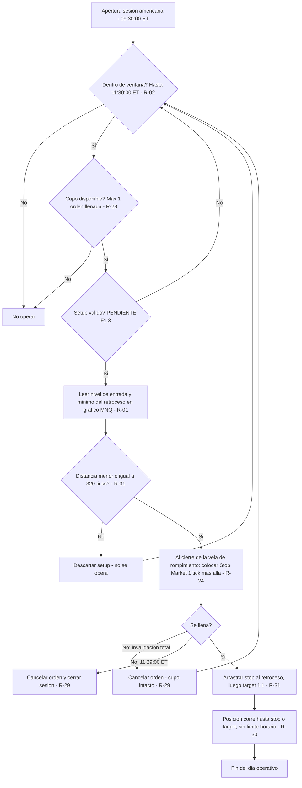
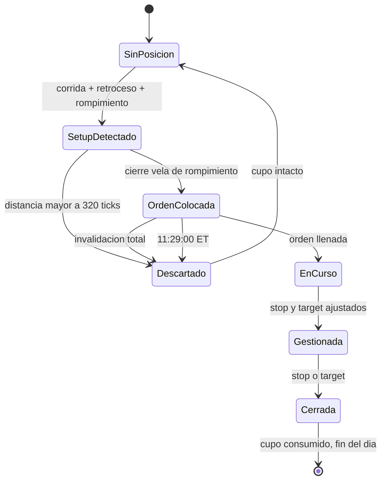

# HISTORIAL DEL PLAN

> Todo lo que es historia del plan: cómo se construyó, qué cambió y cuándo. **Nadie lo lee para operar**: ni el Coach
> ni el portal. Las reglas vigentes están en `reglas/`. Desde el 26/09/2026, cada cambio del plan es además un commit
> `plan: …` (D-028).

---

## La historia de cada regla

*Las marcas de fecha, los estados y las notas de construcción que las reglas llevaban dentro hasta la versión 3.14.*

### R-01

- 🔧 **Simplificada el 06/09/2026.** Antes el plan analizaba y leía volumen en **NQ** y ejecutaba en **MNQ**, con dos gráficos y un desfase de hasta 3 ticks entre ambos. El operador decidió operarlo todo en MNQ: **el NQ sale del plan y ese desfase deja de existir.** El backtesting histórico se hizo con datos de NQ y **no se rehace** — las reglas son las mismas.
- Nota de reglas.json: SIMPLIFICADO 06/09/2026 por decisión del operador: se elimina el NQ del plan. Antes se analizaba y se leia volumen en NQ y se ejecutaba en MNQ, con dos gráficos y un desfase de hasta 3 ticks entre ambos. Ahora todo ocurre en MNQ y ese desfase deja de existir.
- Estado en reglas.json: confirmada · simplificada a MNQ único el 06/09/2026

### R-03

- Estado en reglas.json: confirmada · lectura de volumen movida a MNQ el 06/09/2026

### R-04

- Estado: ✅ Confirmada 24/08/2026

### R-05

- Nota de reglas.json: corrida e impulso son sinonimos; el plan usa solo 'corrida'. NO existe tope de velas: el propio Chaumer (nota de voz 24/08/2026) confirma que la sobreextension no es un parámetro operativo sino un elemento de contextualizacion.

### R-06

- En reglas.json: «corregido 27/08/2026»
- Nota de reglas.json: CORREGIDO 04/09/2026: decia que el stop iba en el extremo del retroceso.
- Estado en reglas.json: confirmada · referencia al stop corregida 04/09/2026

### R-07

- reescrita 26/08/2026
- Subapartado «Vela base de la ventana operativa — **reescrita 26/08/2026**»
- Estado en reglas.json: Confirmada 26/08/2026
- Estado: ✅ Confirmada 2026-08-26 *(v1.13 la hacía depender de la 08:32; corregida por el operador el mismo día)*

### R-08

- Estado en reglas.json: Confirmada 26/08/2026
- Estado: ✅ Confirmada 2026-08-26

### R-09

- Nota de reglas.json: CORREGIDA 26/08/2026: la busqueda de la vela extrema INCLUYE la vela que dispara el retroceso. Una vela puede hacer máximo mayor y mínimo menor a la vez: dispara el retroceso y aun así puede ser la más alta del movimiento. Caso real 10/07/2026 vela 8:36.
- confirmado 01/09/2026
- confirmado 26/08/2026

### R-10

- reescrita 14/09/2026
- Subapartado «Estirar la zona · rompimiento con mecha sin consecución — **reescrita 14/09/2026**»
- Nota de reglas.json: 07/09/2026: el enunciado decia 'pasan 5 velas'. El operador confirmó que la resolucion anticipada de R-14 aplica IGUAL a este caso que al de la zona apéndice, así que el disparador es el plazo RESUELTO, no el plazo VENCIDO. Cierra P-30.
- Nota de reglas.json: Diagrama: 04_Web/public/conceptos/24-estructura-antes.png
- Nota de reglas.json: PRECISADA 14/09/2026: el enunciado no decia QUE BORDE se mueve, solo que 'el borde opuesto no se mueve', y el motor lo resolvia por el lado del rompimiento. Eso estiraba un SOPORTE hacia arriba en el cruce de vuelta. Caso de origen: 14/09/2026, soporte de la vela 9:10 (29062.00-29064.75) traspasado hacia abajo a las 9:18; a las 10:07 el precio vuelve y lo cruza hacia arriba sin consecución, y el motor lo estiraba hasta 29079.75 — metiendolo dentro de la resistencia viva de 9:09 (29071.00-29088.50) y dejando las dos zonas pisandose entre 29071.00 y 29079.75, contra la prohibicion de solapar zonas de tipo distinto (R-19 punto 5). Texto redactado por el operador. Regresión: no cambia julio (-77.75 en 5) ni las tres jornadas de septiembre. Gráficas del portal: 05-sin-confirmar.png (soporte creciendo hacia abajo) y 24-estructura-antes.png (resistencia creciendo hacia arriba) — las dos ya mostraban esto bien; lo que fallaba era la frase.
- Estado en reglas.json: confirmada · disparador precisado 07/09/2026 (cierre de P-30)

### R-11

- reescrita 15/09/2026
- Subapartado «Zona apéndice · rompimiento con cuerpo sin consecución — **reescrita 15/09/2026**»
- Nota de reglas.json: 07/09/2026: el disparador es el plazo RESUELTO, no el plazo VENCIDO — ver R-14.
- Nota de reglas.json: REESCRITA 15/09/2026: sale la frase 'el plazo se resuelve', que no decia que era el plazo, y entran los dos finales escritos completos, calcados de R-10 — son la misma regla y lo único que las separa es donde cierra la vela de rompimiento: con mecha se estira la zona (R-10), con cuerpo nace la apéndice (R-11). Peticion del operador: 'la zona apéndice es basicamente igual que lo que pasa con una zona que se estira... la diferencia es que el rompimiento no es con mecha, sino con cuerpo por fuera. Los casos son los mismos 2'. Sin cambio de mecánica: ni el motor ni ninguna jornada cambian. Diagramas: 02_Assets/diagramas/apendice_caso1_plazo.png y apendice_caso2_estructura.png
- Nota de reglas.json: El portal (04_Web, página de zonas, ancla #apéndice) escribe el disparador solo como '5 velas' y deja el segundo caso suelto al final — ver PROPUESTAS_AL_PLAN.md
- Estado en reglas.json: confirmada 24/08/2026 · disparador precisado 07/09/2026 (cierre de P-30) · reescrita 15/09/2026

### R-12

- Nota de reglas.json: Contraejemplo real anotado por el operador en 02_Assets/invalidos/R-12_invalido_01.png. Desviacion D-06: el curso cierra el marcado tras la primera zona; el operador no pone límite. SECUENCIA DE LA JORNADA (08/09/2026): la apertura deja dos zonas y esas dos son la banda; dentro de esa banda se marca UNA zona como máximo en toda la jornada (R-12/R-17); después no se dibuja nada más dentro; la única forma de que aparezca una zona nueva es superar un extremo con rompimiento y consecución (R-18), y ese traspaso abre banda nueva con turno propio para toda la jornada (R-17). Ver la seccion 'Como se marca una jornada' al principio del capitulo de zonas del plan. No es regla nueva: es R-16 + R-12 + R-17 + R-18 leidas en orden.

### R-13

- Estado en reglas.json: Ampliada 26/08/2026
- Estado: ✅ Ampliada 26/08/2026

### R-14

- ✅ **Confirmado el 07/09/2026: aplica igual a los dos caminos, sin excepción.** Hasta ese día la regla se había precisado solo sobre el caso de la **zona apéndice**, y que valiera también para el **estiramiento** estaba escrito **por simetría** — una extrapolación del auditor, anotada como `P-30` para no darla por buena sin preguntar. El operador lo confirmó con estas palabras: *"Si aplica igual"*. **`P-30` queda cerrado.**
  
  No es un detalle de forma: cambia **cuándo** nace el borde nuevo, y de ahí cuelga dónde va el stop.
- Nota de reglas.json: FUSIONADA 04/09/2026: la antigua R-39 decia exactamente lo mismo que esta regla y se elimino; su definición medible de las tres velas vive ahora aquí.
- Nota de reglas.json: Diagramas: 02_Assets/diagramas/apendice_caso1_plazo.png y apendice_caso2_estructura.png
- Nota de reglas.json: 07/09/2026 CIERRA P-30: quedaba sin confirmar si la resolucion anticipada aplicaba también al ESTIRAMIENTO (rompimiento con mecha) o solo a la zona apéndice (rompimiento con cuerpo). Estaba escrito por simetria, como extrapolacion del auditor. El operador confirmó: 'Si aplica igual'. Gobierna los dos caminos.
- Nota de reglas.json: Diagrama del caso con mecha: 04_Web/public/conceptos/24-estructura-antes.png
- Estado en reglas.json: Confirmada 24/08/2026 · definición medible anadida 01/09/2026 (absorbe la antigua R-39) · alcance confirmado a los dos caminos el 07/09/2026
- confirmado 01/09/2026

### R-15

- confirmado 01/09/2026
- Nota de reglas.json: Única forma de que nazca una zona sin corrida ni retroceso. A diferencia de R-09, aquí el COLOR de la vela decide si es soporte o resistencia. El corte en la apertura no es arbitrario: ese volumen en 1 minuto es raro en premercado y corriente en sesión. Desviacion D-09: Parámetros Chaumer dice 'solo marcamos los extremos'; el operador marca todas, y R-13 fusiona las que se tocan. Verificado con datos el 10/07/2026: escaneando desde 15:00 salen 3 velas sobre umbral; desde 19:00 sale 1, la que el operador marcó. Las 2 extra son la subasta de cierre del efectivo del día anterior.
- Nota de reglas.json: 06/09/2026: retirado el umbral de NQ; queda solo MNQ > 6000. La equivalencia entre ambos no esta verificada — ver P-32.
- Nota de reglas.json: 14/09/2026: el umbral deja de ser un número fijo y pasa a ser parámetro ajustable por decisión del operador — depende de la volatilidad del momento. Caso que lo motiva: el 10/09/2026 la vela más fuerte del premercado hizo 7799 contratos; con >6000 nacian cuatro soportes que desviaban todo el marcado de la manana, y con >8000 el premercado no deja ninguna zona.
- Estado en reglas.json: confirmada · umbral único MNQ desde el 06/09/2026
- Estado: ✅ confirmada · **umbral paramétrico desde el 14/09/2026**
- confirmado 01/09/2026

### R-16

- Nota de reglas.json: SECUENCIA DE LA JORNADA (08/09/2026): la apertura deja dos zonas y esas dos son la banda; dentro de esa banda se marca UNA zona como máximo en toda la jornada (R-12/R-17); después no se dibuja nada más dentro; la única forma de que aparezca una zona nueva es superar un extremo con rompimiento y consecución (R-18), y ese traspaso abre banda nueva con turno propio para toda la jornada (R-17). Ver la seccion 'Como se marca una jornada' al principio del capitulo de zonas del plan. No es regla nueva: es R-16 + R-12 + R-17 + R-18 leidas en orden.
- Estado en reglas.json: Confirmada 26/08/2026
- Estado: ✅ Confirmada 2026-08-26

### R-17

- Nota de reglas.json: Caso real 14/07/2026: banda entre el soporte de la vela 8:36 (29685.00-29693.00) y la resistencia de premercado de las 19:31 (29901.25-29908.25). Mitad en 29797.13. El primer retroceso, el de la vela 8:39, sube a 29798.00 y se pasa por 0.875 puntos (3.5 ticks): no se marca y la banda queda cerrada. De 8:41 a 9:10 no se marca ninguna zona. SECUENCIA DE LA JORNADA (08/09/2026): la apertura deja dos zonas y esas dos son la banda; dentro de esa banda se marca UNA zona como máximo en toda la jornada (R-12/R-17); después no se dibuja nada más dentro; la única forma de que aparezca una zona nueva es superar un extremo con rompimiento y consecución (R-18), y ese traspaso abre banda nueva con turno propio para toda la jornada (R-17). Ver la seccion 'Como se marca una jornada' al principio del capitulo de zonas del plan. No es regla nueva: es R-16 + R-12 + R-17 + R-18 leidas en orden.
- Nota de reglas.json: PRECISADO 18/09/2026 por el operador: 'una zona invalida ya no cuenta como zona, pero acuerdate de la regla de zonas entre zonas... igual cuando esas zonas ya son invalidas, no se marcan más zonas entre ese espacio así las zonas ya no sean validas'. El espacio que queda cerrado es la BANDA ENTERA entre la resistencia y el soporte, no solo el rectangulo de la zona muerta (confirmado sobre gráfico el 18/09/2026). Caso de origen: 18/09/2026, la resistencia 29804.75-29805.75 de la vela 8:54 se marcaba dentro de la banda que ya habia gastado la zona de premercado, invalida desde las 8:50. Efecto medido sobre las 18 sesiones marcadas: se caen 3 zonas (10/07 8:56, 10/09 9:07, 18/09 8:54) y NINGÚN resultado cambia.
- confirmado sobre grafico el 18/09/2026
- Estado en reglas.json: Confirmada 27/08/2026; borde de premercado confirmado 01/09/2026
- Estado: ✅ Confirmada 27/08/2026 · punto 7 (premercado como borde) confirmado 01/09/2026 · **punto 8 precisado 18/09/2026**
- confirmado 01/09/2026
- precisado 18/09/2026

### R-18

- Nota de reglas.json: SECUENCIA DE LA JORNADA (08/09/2026): la apertura deja dos zonas y esas dos son la banda; dentro de esa banda se marca UNA zona como máximo en toda la jornada (R-12/R-17); después no se dibuja nada más dentro; la única forma de que aparezca una zona nueva es superar un extremo con rompimiento y consecución (R-18), y ese traspaso abre banda nueva con turno propio para toda la jornada (R-17). Ver la seccion 'Como se marca una jornada' al principio del capitulo de zonas del plan. No es regla nueva: es R-16 + R-12 + R-17 + R-18 leidas en orden.
- Estado en reglas.json: Confirmada 27/08/2026
- Estado: ✅ Confirmada 27/08/2026

### R-19

- Estado en reglas.json: Confirmadas 26-27/08/2026
- Estado: ✅ Confirmadas 26–27/08/2026

### R-20

- Nota de reglas.json: CORREGIDO 04/09/2026: el enunciado decia "dentro de las 5 velas siguientes", contradiciendo la corrección del 27/08/2026.
- Estado en reglas.json: Ampliada 27/08/2026 · enunciado corregido 04/09/2026
- Estado: ✅ Ampliada 27/08/2026 · enunciado corregido 04/09/2026

### R-21

- Nota de reglas.json: PRECISADO 18/09/2026: la frase 'no cuenta para nada' era demasiado amplia y llevo al auditor a marcar una zona dentro de la franja de una zona ya invalida (18/09/2026, resistencia de la vela 8:54). Lo que pierde una zona invalida es su VALOR como zona; lo que conserva es el SITIO. Ver R-17.
- Estado en reglas.json: Precisada 27/08/2026
- Estado: ✅ Precisada 27/08/2026

### R-22

- Estado en reglas.json: Confirmada 27/08/2026
- Estado: ✅ Confirmada 27/08/2026

### R-25

- Nota de reglas.json: La Continuación es autocontenida: el setup crea la zona que después rompe. Se construye sobre un IRI (Impulso-Retroceso-Impulso): el segundo impulso rompe la zona y su consecución es la entrada. Hasta el 23/09/2026 el setup se llamaba IRI.
- Estado en reglas.json: confirmada · renombrada de IRI a Continuación el 23/09/2026 (solo el nombre, nada operativo)
- Estado: ✅ Confirmada 24/08/2026 · renombrada 23/09/2026

### R-26

- Estado en reglas.json: Confirmada 24/08/2026, plazo anadido 27/08/2026
- Estado: ✅ Confirmada 24/08/2026 · **plazo añadido 27/08/2026**
- añadido 27/08/2026

### R-27

- Estado en reglas.json: Confirmada 27/08/2026
- Estado: ✅ Confirmada 27/08/2026

### R-40

- Subapartado «🧭 Ampliada 21/09/2026 · el bloqueo es del SENTIDO, y el rompimiento directo»
- Nota de reglas.json: CUATRO CASOS QUE LA DEFINEN: 10/09/2026 la apertura sube 49.50 y el retroceso baja 65.75 (se pasa) -> caen la resistencia de 8:32 y el soporte de 8:34; después llega la secuencia completa (corrida 79.75, retroceso 32.25, rompimiento) y su resistencia, ENTERA por encima de la bloqueada, da la entrada del día. 14/09/2026 la apertura baja 43.50 y el retroceso sube 53.25 (se pasa) -> la resistencia de 8:34 no se opera: NO OPERA. 16/07/2026 la apertura sube 71.75 y el retroceso baja 132.25 (se pasa) -> el soporte de 8:36 no se opera; esa sesión estaba VALIDADA con ese corto y el operador la corrigió el 14/09/2026. 11/09/2026 sin zonas en toda la sesión, no llega a plantearse.
- Nota de reglas.json: NÚMERO: se usa R-40 y no R-39 a propósito; el 39 se gasto el 01/09 y se elimino el 04/09.
- Nota de reglas.json: REGRESIÓN: rehace julio — de -91.00 pts en 9 operaciones a -77.75 en 5. Ver GALERIA.md.
- Nota de reglas.json: AMPLIADA 21/09/2026 con el pasó a pasó del operador sobre la jornada del 18/09/2026: (1) la vela de apertura declara el sentido y se espera corrida, retroceso normal y corrida que rompe; (2) si el retroceso se pasa de la corrida se acaban las entradas EN ESE SENTIDO; (3) se espera a que la zona se rompa con consecución — rompimiento directo, no se opera; (4) se espera un IRI nuevo entero más alla y se entra en ese. Respuestas del 19/09: se puede volver a perder; solo afecta al sentido del día. Primera jornada que lo ejercita entero: 21/09/2026 — se pierde a las 8:34, rompimiento directo a las 8:37, se recupera con una orden a las 8:49 que se cancela antes de llenar, se vuelve a perder a las 8:51, segundo rompimiento directo a las 8:52, y se recupera con la entrada de las 8:59. MOTOR: para las zonas nacidas de corrida ya se comportaba así (la 'barrera' por sentido del mapa de fluidez). Para las zonas de premercado coincide porque el motor NUNCA las opera en continuación — que es el agujero todavía abierto de que no anota sus rompimientos; acierta por esa razón, no porque aplique la regla. Regresión: sin cambios en julio (-77,75 en 5) ni en septiembre.
- Estado en reglas.json: confirmada 14/09/2026 · reescrita 14/09/2026 · bloqueo de SENTIDO y rompimiento directo 21/09/2026

### R-41

- Subapartado «🔗 Unificación del 14/09/2026 — de dos conceptos a uno»
- Nota de reglas.json: Palabras del operador el 14/09/2026: 'un punto de control es un retroceso que dice que en ese punto se puede volver a presentar como una zona que el precio lo puedan defender para evitar que lo rompan'. CASO DE ORIGEN, 11/09/2026: Reingreso bajista a las 9:01 sobre la zona de premercado de 8:29, entrada 29440.25, stop 29475.00, objetivo 29405.50. El punto de control de la vela de 8:58, en 29423.00, queda en medio: descartado. El operador tampoco lo tomo. Sin esta regla el día habría dado +34.75 pts. REGRESIÓN: probada sobre las 11 sesiones de julio (umbral 2000 sobre NQ) y sobre el 10/09/2026 — NO cambia ninguna. Julio sigue en -91.00 pts en 9 operaciones, y DOS de esas nueve son reingresos (6 y 13 de julio), así que el filtro se probo donde muerde. Ver 05_Backtesting/test_ciego/DISCREPANCIAS.md del 11/09/2026.
- Nota de reglas.json: UNIFICADO 14/09/2026 por decisión del operador: 'punto de control y punto de referencia es lo mismo, dejemos uno solo: Punto de Referencia'. Se queda el NOMBRE viejo con la MECÁNICA nueva (cualquier retroceso vivo, muere por cierre).

### R-29

- 🔧 **Precisado 04/09/2026.** Las palabras del operador el 27/08 fueron *"llega al mismo punto del retroceso, que sería el mismo punto del stop"* — entonces coincidían. Desde que `R-32` se corrigió pueden **no** coincidir, y **manda el punto del stop**. Así lo aplicó el motor en las 11 sesiones validadas.
- En reglas.json: «corregido 27/08/2026»
- Nota de reglas.json: PRECISADO 04/09/2026: la cancelación se mide contra el stop de R-32, no contra el extremo del retroceso.
- Nota de reglas.json: 23/09/2026: el orden de la vela, confirmado para las zonas el 26/08, se aplicaba también a las ordenes desde el 14/09 como PROPUESTA del auditor sin confirmar. El operador lo confirma sobre la jornada del 23/09: vela azul de 8:36 que baja a 30922,00 (llena el corto en 30925,75) y después sube a 30957,00 (salta el stop en 30954,00). Palabras del operador: 'fue un stop valido, la vela primero bajo, hizo consecución y la misma vela después subio al stop'. Leida al reves, la orden se habría cancelado y el día habría sido otro: diferencia de 75,75 puntos.
- Estado en reglas.json: REESCRITA 27/08/2026 - la redaccion anterior decia lo contrario en los dos puntos · misma vela orden+stop confirmado 23/09/2026
- Estado: ✅ **REESCRITA 27/08/2026.** La redacción anterior decía exactamente lo contrario en los dos puntos (cancelaba por retroceso nuevo y **no** cancelaba por plazo). Corregida sobre caso real: **9 de julio de 2026**, orden puesta en la vela 8:43 que el motor cancelaba en la 8:45 por retroceso nuevo; con la regla correcta sigue viva y **se llena en la 8:46**, dentro del plazo. Cierra y sustituye lo acordado en `P-19`.
- confirmado 23/09/2026

### R-30

- Estado: ✅ Confirmada *(consecuencia en `P-07`)*

### R-31

- En reglas.json: «corregido 27/08/2026»
- Nota de reglas.json: CORREGIDA 24/08/2026. Antes fundia dos números distintos en uno solo: el defecto de la ATM (posterior al llenado) y el máximo de stop (filtro previo al envio). Son cosas distintas y ahora están separadas. Los valores viven en PARÁMETROS.md.
- Nota de reglas.json: CORREGIDO 04/09/2026: decia "distancia entrada <-> extremo del RETROCESO".
- Estado en reglas.json: confirmada · filtro alineado con R-32 el 04/09/2026
- Estado: ✅ Confirmada *(riesgo residual aceptado en `P-09`)*

### R-32

- corregido 27/08/2026
- Subapartado «Dónde va el stop — **corregido 27/08/2026**»
- unificado 14/09/2026
- Nota de reglas.json: CORREGIDO 04/09/2026: este archivo seguia diciendo "el extremo del retroceso", la definición anterior al 27/08/2026. El texto del plan ya tenia la buena; el json no. Caso real 7/07/2026: con la vieja el riesgo daba 71,50 pts y la entrada pasaba; con la correcta da 86,25 y queda DESCARTADA por STOP_MAX.
- Estado en reglas.json: Corregida 27/08/2026 · json alineado 04/09/2026

### R-33

- Nota de reglas.json: Palabras del operador, 24/08/2026: 'no se toca nada, jamas... Repito, jamas se gestiona.' Es la única regla del plan enunciada como prohibicion absoluta y sin excepciones. Convierte cada operación en un experimento limpio: el resultado mide el setup, no la gestión.

### R-34

- Nota de reglas.json: Palabras del operador 26/08/2026: 'ya no marcó más zonas, no hago más análisis, no hago nada más'. Va más alla de R-28 (no más ordenes) y R-33 (no tocar la posición): prohibe seguir ANALIZANDO. Sin esta regla, el operador podría seguir marcando zonas mientras ve acercarse su stop, que es el estado mental donde se rompen los planes.

### R-36

- Estado: ✅ Confirmada 24/08/2026

### R-37

- Estado: ✅ Confirmada 24/08/2026

### R-38

- Estado: ✅ Confirmada 24/08/2026

---

## Del documento maestro (`TRADING_PLAN_CHAUMER.md`, hasta la versión 3.14)

*Su cabecera, el estado de construcción, los anexos de la fase 1 y la tabla de versiones, tal cual.*

## TRADING PLAN — Estrategia Chaumer (MNQ · NinjaTrader 8)

**Versión:** 3.14 — 🏁 fase 1 cerrada · 🔴 **TEST CIEGO EN MARCHA** · 40 reglas
**Última actualización:** 2026-09-26
**Operador:** Christian
**Metodología base:** Alfredo Chaumer (*trader_sociologist*)
**Uso:** personal

---

### Estado de construcción

| Sub-fase | Contenido | Estado |
|---|---|---|
| **F1.0** | Perímetro y contexto operativo | ✅ **Cerrada** — `R-01` a `R-04` confirmadas |
| **F1.1** | Glosario y definiciones operativas | ✅ **CERRADA** — 24 términos definidos · 8 descartados · 4 movidos a contextualización |
| **F1.2** | Lectura de contexto y sesgo direccional | ✅ **CERRADA SIN REGLAS** — ver nota |
| **F1.3** | Identificación del setup | ✅ **CERRADA** — `R-25` Continuación *(antes IRI)* y `R-26` Reingreso confirmadas |
| **F1.4** | Gatillo de entrada | ✅ **CERRADA SIN REGLAS NUEVAS** — ya cubierta por `R-24`, `R-20`, `R-25`, `R-26`, `R-29` |
| **F1.5** | Stop loss y objetivos | ✅ **CERRADA** — `R-32` + `R-31` corregida + `PARAMETROS.md` |
| **F1.12** | Estructura y marcado | ✅ **CERRADA** — el bloque de zonas (`R-09` a `R-22`) · `R-29`, `R-20`, `R-21`, `R-12`, `R-13`, `R-26`, `R-32` corregidas |
| **F1.6** | Gestión de la posición | ✅ **CERRADA** — `R-33`: no se gestiona, nunca |
| **F1.7** | Riesgo y tamaño de posición | 🟠 **CERRADA CON HUECO DECLARADO** — `R-04` · sin regla de parada (`P-21`) |
| **F1.8** | Filtros y prohibiciones | ✅ **CERRADA** — `R-36` FOMC · `R-37` estado del operador |
| **F1.9** | Proceso operativo diario | ✅ **CERRADA** — `R-38` + `CHECKLIST_DIARIA.md` |
| **F1.10** | Galería de casos | ✅ **CERRADA** — 21 casos, incluidos descartes, días sin operar, órdenes canceladas y 11 sesiones completas al tick |
| **F1.11** | Test de operabilidad | 🚨 **NO EJECUTADA — HUECO DECLARADO.** La fase se cierra sin el test ciego, por decisión del operador. Ver `CIERRE_FASE_1.md` y `P-29` |

**Archivos del plan:**

- `CLAUDE.md` (raíz) — **instrucciones para Claude Code en la fase 2**
- `01_Plan\CIERRE_FASE_1.md` — **acta de cierre de la fase 1: qué está probado y qué no**
- `01_Plan\EQUIVALENCIA_NUMERACION.md` — **traducción entre la numeración vieja y la nueva**
- `04_Web\BRIEF_PORTAL.md` — qué tiene que resolver el portal y qué no puede hacer
- `01_Plan\ESTADO.md` — **índice compacto. Punto de arranque de cada sesión**
- `01_Plan\PARAMETROS.md` — **los números que pueden cambiar, en un solo sitio**
- `01_Plan\CHECKLIST_DIARIA.md` — **la secuencia del día, para ejecutar sin decidir**
- `01_Plan\GALERIA.md` — casos reales etiquetados · imágenes en `02_Assets\galeria\`
- `01_Plan\TRADING_PLAN_CHAUMER.md` — este documento
- `01_Plan\reglas.json` — espejo estructurado de las reglas
- `01_Plan\GLOSARIO.md` — términos con definición medible
- `01_Plan\PENDIENTES.md` — reglas sin cerrar y decisiones aplazadas
- `01_Plan\CONTEXTUALIZACION.md` — **elementos que NO son reglas** y no deben serlo
- `01_Plan\subfases\F1.0_Perimetro.md` — bloque completo de F1.0 con notas de auditoría
- `01_Plan\subfases\F1.1_Glosario.md` — bloque de F1.1
- `03_Materia_Prima\registro_sobreextension.csv` — trabajo de campo abierto para cerrar `P-11`

---

### 🔢 Índice de las 40 reglas, por categoría

*El documento va en este mismo orden: las siete categorías, y dentro de cada una las reglas por número.*

| # | Regla | Categoría |
|---|---|---|
| `R-01` | Analiza, marca zonas y ejecuta TODO sobre MNQ | Perímetro operativo |
| `R-02` | Opera unicamente durante los 120 minutos siguientes a la apertura de la sesion | Perímetro operativo |
| `R-03` | Opera con un grafico limpio: velas de 1 minuto y volumen, nada mas | Perímetro operativo |
| `R-04` | Opera siempre 1 contrato MNQ | Perímetro operativo |
| `R-05` | Una corrida (= impulso) es la secuencia de velas que arranca cuando una vela s | Estructura del precio |
| `R-06` | El retroceso es la secuencia de velas que arranca en la vela que mata la corri | Estructura del precio |
| `R-07` | La vela de las 08:31 declara la direccion inicial de la sesion con su propio c | Estructura del precio |
| `R-08` | Vela con maximo mayor y minimo menor sin corrida viva: pasa a ser la nueva vel | Estructura del precio |
| `R-09` | Marca la zona sobre la vela designada, desde el borde de su cuerpo hasta el ex | Zonas · marcado |
| `R-10` | Si el rompimiento fue con mecha y pasan 5 velas sin consecucion, extiende la z | Zonas · marcado |
| `R-11` | Si el rompimiento fue con cuerpo y pasan 5 velas sin consecucion, marca una zo | Zonas · marcado |
| `R-12` | Marca una zona entre dos zonas solo si el movimiento que la genera queda enter | Zonas · marcado |
| `R-13` | Si la zona que ibas a marcar toca una existente, no marques una nueva: estira  | Zonas · marcado |
| `R-14` | El plazo de 5 velas es un TOPE, no una espera obligatoria: si antes el mercado | Zonas · marcado |
| `R-15` | En la ventana de premercado (19:00 hora Colombia del dia anterior hasta la ape | Zonas · marcado |
| `R-16` | La zona de la corrida se marca al aparecer el retroceso; la del retroceso solo | Zonas · marcado |
| `R-17` | Dentro de una banda entre dos zonas se marca como maximo una zona en toda la j | Zonas · marcado |
| `R-18` | Salir de una zona o de una banda es rompimiento mas consecucion, no geometria | Zonas · marcado |
| `R-19` | Seis precisiones de dibujo de zonas | Zonas · marcado |
| `R-20` | Rompimiento es superar el borde de la zona por al menos un tick; consecucion e | Zonas · vigencia |
| `R-21` | Una zona deja de tener efecto cuando ha sido superada en las dos direcciones | Zonas · vigencia |
| `R-22` | La vela que confirma un traspaso no abre a la vez el rompimiento del lado cont | Zonas · vigencia |
| `R-23` | Toma el primer setup valido cuya orden se llene | Setup y entrada |
| `R-24` | Entra siempre con orden stop en reposo colocada al cierre de la vela de rompim | Setup y entrada |
| `R-25` | Setup Continuación: un IRI —corrida, retroceso, zona y rompimiento de esa zona— y su consecución | Setup y entrada |
| `R-26` | Setup Reingreso: tras un rompimiento con consecucion que falla, el precio recu | Setup y entrada |
| `R-27` | La direccion de la vela de las 08:31 marca por donde empieza el dia pero no ob | Setup y entrada |
| `R-40` | Corrida fluida: solo se entra en el rompimiento de la zona de una corrida FLUI | Setup y entrada |
| `R-41` | Punto de referencia: el objetivo de un REINGRESO no puede pasar del nivel de r | Setup y entrada |
| `R-28` | Ejecuta como maximo una operacion por sesion | Riesgo, orden y gestión |
| `R-29` | Manten la orden pendiente hasta que se llene, hasta que se agoten 5 velas sin  | Riesgo, orden y gestión |
| `R-30` | Una operacion abierta se gestiona hasta stop o target, aunque termine la venta | Riesgo, orden y gestión |
| `R-31` | Ejecuta con la ATM K1 al valor de ATM_DEFECTO y ajusta stop y target a mano tr | Riesgo, orden y gestión |
| `R-32` | Ancla la regla en el nivel de entrada, mide el stop hasta su referencia estruc | Riesgo, orden y gestión |
| `R-33` | Una vez ajustados stop y target, NO se gestiona la posicion | Riesgo, orden y gestión |
| `R-34` | Al llenarse la orden termina el ANALISIS del dia, no solo la operativa | Riesgo, orden y gestión |
| `R-35` | No operes en la ventana de +/-5 minutos alrededor de una noticia roja de Forex | Filtros de no-operar |
| `R-36` | En dia de FOMC no se opera Continuación | Filtros de no-operar |
| `R-37` | No se opera estando enfermo o sin encontrarse bien mentalmente | Filtros de no-operar |
| `R-38` | Ejecuta la sesion siguiendo la checklist diaria en orden, y registra TODAS las | Proceso diario |

*Numeración anterior al 06/09/2026: ver `EQUIVALENCIA_NUMERACION.md`.*

---

### 🚨 ADVERTENCIA DE USO — LEER ANTES DE CONSTRUIR NADA SOBRE ESTE PLAN

**Las 12 sub-fases están cerradas: 40 reglas** *(`R-40` y `R-41` salieron del test ciego, los días 10 y 11 de septiembre de 2026)*. El plan está **completo en reglas y contrastado contra 11 sesiones reales al tick**, corregido vela a vela por el operador.

**Pero NO está probado.** El test ciego de `F1.11` —el único que demuestra que un tercero con este documento en la mano llega a las mismas decisiones que el operador— **no se ha ejecutado**. La fase 1 se cierra sin él, por decisión explícita del operador el 01/09/2026.

Lo que eso significa, dicho sin adornos:

| | |
|---|---|
| ✅ **Sí está demostrado** | que las reglas escritas reproducen el marcado del operador en 11 sesiones, y que el motor de auditoría llega a sus mismas entradas, stops y objetivos |
| ❌ **NO está demostrado** | que otra persona, leyendo solo este documento, llegue a lo mismo. Eso es exactamente lo que mide el test ciego |
| ❌ **NO está escrito** | la regla de parada — cuándo se deja de operar en la semana o el mes (`P-21`) |
| ❌ **NO está en el plan** | la capa de contextualización, que es la que decide varios de los días de "hoy no opero" (ver `CONTEXTUALIZACION.md`) |

> 🔴 **Cualquier producto construido sobre este plan —portal web incluido— debe mostrar estos cuatro puntos, no esconderlos.** Un plan mecánico sin test ciego es un plan escrito, no un plan probado.

Detalle completo del cierre y de lo que quedó fuera: **`CIERRE_FASE_1.md`**.

---


---

## 📕 LAS 40 REGLAS, POR CATEGORÍA

*Reorganizado el 06/09/2026. Antes este documento seguía el orden en que se construyó el plan (las sub-fases `F1.x`); ahora sigue el orden de las siete categorías, que es el orden en que las reglas se usan durante el día. **Las notas de construcción, los diagramas y las correcciones del auditor no se perdieron: están íntegras en los anexos, al final.***

---

## 📎 ANEXOS Y NOTAS DE CONSTRUCCIÓN

*Todo lo que no es una regla: cómo se construyó el plan sub-fase por sub-fase, los diagramas, las desviaciones respecto al curso, las correcciones del auditor y los anexos de referencia. Se conserva en el orden original.*

> Los encabezados `F1.x` de aquí abajo **ya no contienen las reglas** — las reglas viven arriba, por categoría. Lo que queda es la narración de cómo se cerró cada sub-fase.

---
### ⬜ F1.2 · Cerrada sin reglas — por qué

**El operador no tiene ninguna regla que decida si opera o no antes de ver un setup** (24/08/2026).

Dos motivos, y los dos son estructurales:

1. **No hay sesgo direccional.** Por `R-23` se opera el **primer setup válido**, largo o corto. La dirección la da el rompimiento, no una lectura previa.
2. **Todo lo que F1.2 habría capturado ya está en `CONTEXTUALIZACION.md`.** Sobreextensión, lateralización, volumen en sesión, alejamiento de la zona, fluidez, longitud del recorrido y tamaño de estructura — los siete salieron a esa capa porque el propio operador dijo que no tienen número.

> ⚠️ **Lo que esto implica.** La decisión de *"hoy no opero"* existe y pesa —en las 4 sesiones grabadas Chaumer no operó 2 días por contexto— pero **queda fuera del plan mecánico, a propósito**. El test ciego de `F1.11` no podrá validarla.

---

## F1.3 · Identificación del setup ✅

### Taxonomía — cerrada 24/08/2026

**Fuente:** el selector de setups del propio NinjaTrader del operador (captura en `02_Assets\`).

| Setup | Dirección | Mecánica |
|---|---|---|
| **Continuación** | alcista / bajista | se construye sobre un IRI fluido |
| **Reingreso** | alcista / bajista | distinta: opera el rompimiento que falló |

**4 entradas en el menú → 2 mecánicas.** El espejo alcista/bajista no se documenta por separado: `R-05`, `R-06` y `R-09` ya establecen que todo se refleja exacto.

**Hasta el 23/09/2026 el menú tenía 6 entradas:** *IRI Apertura* e *IRI Continuación* eran la misma mecánica con dos etiquetas, solo para estadística. El operador quitó la etiqueta Apertura y renombró el setup: *"Vamos a dejar solamente 2 Setups: 1. Continuación (Antes IRI) 2. Reingreso, y las respectivas direcciones (Alcista y Bajista)."* Con eso se cierra `P-20`.

> *Historia:* *"Son la misma mecánica, solo que IRI Apertura se da cuando es la apertura, y el otro IRI ya se da durante la jornada operativa."* — Operador, 24/08/2026

---

## F1.5 · Stop y objetivos ✅

## F1.9 · Proceso operativo diario ✅

## F1.8 · Filtros y prohibiciones ✅

## F1.7 · Riesgo y tamaño de posición 🟠

### 🚨 El hueco declarado de esta sub-fase

**El plan no tiene ninguna regla de parada.** El operador lo confirma el 24/08/2026 y decide dejarlo abierto a propósito, para decidirlo con datos reales.

| Días malos seguidos | Capital restante | Caída | Para recuperar |
|---|---|---|---|
| 4 | $2.360 | −21 % | +27 % |
| 6 | $2.040 | −32 % | +47 % |
| 10 | $1.400 | **−53 %** | **+114 %** |
| 15 | $600 | −80 % | +400 % |

> ⚠️ **Ninguna regla del plan se rompe en esa tabla.** Cada uno de esos días fue un setup válido, con su stop correcto, ejecutado exactamente como está escrito. **El plan permite ese recorrido sin emitir una sola señal de alarma.**
>
> Y con `R-04` (tamaño fijo) más `STOP_MAX` fijo, **el riesgo porcentual crece solo cuando peor vas**: con $1.400 restantes, $160 ya no son el 5 % sino el 11 %.

**Detalle completo, frecuencia esperada y moldes posibles: `P-21` en `PENDIENTES.md`.**

---

## F1.6 · Gestión de la posición ✅

## F1.4 · Gatillo de entrada ✅ — cerrada sin reglas nuevas

El gatillo ya estaba escrito repartido entre reglas anteriores. El operador confirmó el 24/08/2026 que **no hay ningún paso adicional** entre ver el setup y enviar la orden.

| Qué pide F1.4 | Dónde está |
|---|---|
| Tipo de orden | `R-24` — Stop Market |
| Nivel exacto | `R-24` — 1 tick más allá de la vela de rompimiento o de reingreso |
| Momento de colocación | `R-24` — al cierre de esa vela |
| Qué dispara la entrada | `R-20`, `R-25`, `R-26` — la consecución |
| Verificación previa | `R-31`, `R-32` — los tres filtros |
| Cuándo se cancela | `R-29` |

---

### Los dos setups, uno al lado del otro

| | **Continuación** | **Reingreso** |
|---|---|---|
| **Qué opera** | el rompimiento que **funciona** | el rompimiento que **falló** |
| **Dirección** | a favor del rompimiento | **contraria** |
| **Plazo de consecución** | **5 velas** | **ninguno** |
| **Filtro de target** | zona vigente | zona vigente **+ punto de referencia** |
| **Origen de la zona** | la crea el propio setup | preexistente |

---

## F1.0 · Perímetro y contexto operativo ✅

*Bloque completo con notas de auditoría y reglas heredadas sin auditar: `subfases\F1.0_Perimetro.md`*

### Diagrama · Puerta de perímetro



### Diagrama · Ciclo de vida de la operación



---

## F1.1 · Glosario y definiciones operativas 🟡

*Documento vivo: `GLOSARIO.md` · Bloque completo: `subfases\F1.1_Glosario.md`*

### ⚠️ Corrección del auditor · 26/08/2026 — el retroceso de una sola vela

| | |
|---|---|
| **Qué hizo el auditor** | Al reconstruir el 6 de julio marcó el retroceso como **una sola vela** (la 8:36) y dio su mínimo, 29.882,75, como el mínimo del retroceso |
| **Qué decía el plan** | `R-06`, ya escrita y confirmada: *"el mínimo del retroceso es el mínimo MÁS BAJO de todas las velas del retroceso"*, y el retroceso *"termina cuando nace la siguiente corrida"* |
| **Quién lo detectó** | El **operador**, mirando la gráfica |
| **El daño potencial** | 29.882,75 en vez de 29.786,00 → **96,75 puntos de diferencia** en el nivel del stop y, con ratio 1:1, en el target. Y una zona de soporte marcada sobre la vela equivocada |
| **La causa** | El auditor leyó "retroceso" como evento puntual en vez de como **secuencia**. La regla estaba bien escrita; se aplicó mal |
| **Lección** | *Antes de dar un nivel por bueno, releer la regla que lo define. El error más caro no es la regla que falta, es la regla que existe y se aplica mal.* |


## F1.12 · Reglas de estructura y marcado — sesión del 27/08/2026 ✅

*Cinco reglas nuevas, todas confirmadas por el operador sobre casos reales del backtesting
día por día. Cada una nació de una corrección suya a una lectura equivocada del auditor.*

---

### ⚠️ Desviaciones conscientes respecto al curso

Este plan **no es "Chaumer como se enseña"**, es **"Chaumer como lo opera Christian"**. Detalle completo en `PENDIENTES.md`.

| # | El curso dice | Decisión del operador |
|---|---|---|
| **D-01** | Retroceso mínimo 23,60% Fib · máximo 76,40% Fib | **No usa Fibonacci** → descartado |
| **D-03** | El target no debe sobrepasar un punto de control (POC) | **No usa POC** → descartado |
| **D-04** | Zona crítica (1ª vela de la sesión, inicio del impulso, extremos de sesión europea) | **No usa ninguna** → descartada |
| **D-05** | El target no debe sobrepasar el alto o bajo de la sesión | **No lo usa** → descartado |
| **D-06** | Tras marcar una zona entre zonas, no se marcan más (Chaumer en vivo: en toda la sesión) | **Sin límite**, cada una contra su 50 % recalculado |
| **D-07** | Las zonas pierden importancia con el tiempo (escala gradual) | **No envejecen.** Activa o inactiva, binario ✅ *más mecánico que el original* |
| **D-08** | Al superponerse, la zona nueva se recorta y quedan dos zonas | **Se unen en una sola**, estirando la existente |
| **D-09** | Con más de dos velas de +2.000 en premercado, *"solo marcamos los extremos"* | **Se marcan todas.** `R-13` fusiona después las que se tocan |
| **D-10** | Zona de desequilibrio (término del curso) | **No usa el término** → descartado |
| **D-11** | Fractal y manipulación (términos del curso) | **No usa los términos** → descartados |
| **D-12** | Sesión europea (fuente de zonas críticas en el curso) | **No la mira** → descartada |
| **D-13** | **Giro** como tipo de entrada (*"4 velas entre el break a favor y el break en contra, el giro es la 5ª"*) | **No lo opera** → descartado. Solo hay Continuación y Reingreso |

#### 🔴 El bloque de volumen queda cerrado

**Hay una sola regla de volumen en todo el plan — `R-15` — y se apaga en la apertura americana.**

| | |
|---|---|
| Reglas de volumen en premercado | `R-15` |
| Reglas de volumen dentro de la ventana operativa | **ninguna** |
| Alcance real de `R-03` | el indicador está en pantalla toda la sesión, pero **alimenta una única regla, que termina antes de que abra el mercado** |
| Volumen dentro de sesión | **contextualización** → `C-08`, sin número y sin que deba tenerlo |

> **Consecuencia para `F1.3` y `F1.4`:** toda decisión de entrada dentro de la ventana operativa será **estructura de precio pura**. Si al llegar al gatillo aparece una condición que menciona volumen, contradice esto y habrá que resolverlo antes de escribirla.

#### 🚨 Consecuencia: un solo filtro de target

| Filtro de target | Estado |
|---|---|
| **Punto de referencia** — el extremo del retroceso que originó la zona | ✅ **Recuperado 24/08/2026** — solo en Reingreso · `R-26` |
| El target penetra o toca una **zona vigente** | ✅ **Único superviviente** — `R-21`. **Es el "punto de reacción" de Chaumer**, el filtro que él aplica a diario |
| Mín/máx del premercado | ❌ `P-01` |
| Punto de control (POC) | ❌ `D-03` |
| Zona crítica | ❌ `D-04` |
| Alto o bajo de la sesión | ❌ `D-05` |

Ninguna eliminación se apoya en datos. El target es **la mitad del R:R** en una estrategia 1:1. Si aparece el patrón *"llego cerca del target y el precio se da la vuelta"*, esta tabla es el primer sitio donde mirar.

---

### 🔵 Dos categorías, no una

Taxonomía del propio Chaumer (nota de voz, 24/08/2026), adoptada por el plan:

| | Dónde vive | Naturaleza |
|---|---|---|
| **Parámetro operativo** | este documento y `reglas.json` | Criterio fijo y medible. **Ejecutable sin criterio propio** |
| **Elemento de contextualización** | `CONTEXTUALIZACION.md` | Ayuda a decidir. **No tiene número y no debe tenerlo** |

> *"Existen parámetros operativos y existen elementos para contextualizar. […] Me ayudan a tomar decisiones, mas no es un parámetro operativo."*

En la capa de contextualización viven hoy: **sobreextensión** (`C-01`), volumen en movimiento extendido, lateralización, alejamiento de la zona, fluidez, longitud del recorrido y tamaño de la estructura.

**Consecuencia que conviene no olvidar:** el test ciego de `F1.11` **solo puede validar los parámetros**. Si la contextualización decide si se opera o no —y en Chaumer lo hace: no operó 2 de las 4 sesiones grabadas— las divergencias ahí no significarán que el plan esté mal escrito.

---

### 📹 Fuente nueva · vídeos de Chaumer en vivo

`00_Guias\videos chaumer guia\` — 4 historias de Instagram de *trader_sociologist*, 27 minutos narrando el mercado en directo (17–21 agosto 2026). Transcripciones y análisis: `03_Materia_Prima\transcripciones\`.

**Confirman** el umbral de ≥2.000 contratos, `R-21`, `R-10` y `R-11` con las palabras exactas del autor.

**Abren tres pendientes**, uno de ellos grave:

| ID | Qué |
|---|---|
| 🔴 **`P-13`** | **"Punto de reacción"** — término que Chaumer usa en las 4 sesiones y con el que descarta la mayoría de sus entradas. **No está en el plan.** Es el candidato natural a devolver un filtro de target |
| `P-14` | **"Estructura fallida"** — existe una extensión de zona **sin esperar las 5 velas** |
| `P-15` | **Vela sin cuerpo** — `R-09` cubre la vela sin mecha, no la inversa |

**Contexto de realidad:** en esas 4 sesiones Chaumer **no operó 2 días**, tuvo 1 stop y 1 take. Su agosto: 9 operaciones, 4 positivas, 5 negativas, ≈ −2 %. Ritmo real ≈ **2 operaciones por semana**. `R-28` fija un techo de 1 al día; es un techo, no un objetivo.

---

### Contexto de cuenta

| Concepto | Valor | Estado |
|---|---|---|
| Cuenta objetivo del plan | Cuenta propia · **$3.000 USD** | Aún no existe |
| Cuenta en uso a 21/08/2026 | Evaluación de fondeo **Apex $50.000** | Reglas externas sin documentar → `P-03` |
| Contratos | **1 MNQ** | Confirmado (R-31) |
| Riesgo máximo por operación | **`STOP_MAX` = 320 ticks = 80 pts = $160** = 5,3 % sobre $3.000 | Sin auditar → `P-08` |
| Operaciones por día | **1** | Confirmado (R-28) |
| Pérdida máxima diaria implícita | **$120** = 4,0 % | Derivada de R-28 + R-31 |
| Pérdida máxima semanal / regla de corte | — | Sin definir → F1.7 |
| R:R objetivo | **1:1** | A formalizar en F1.5 |

---

### Correcciones aplicadas a `Guia_Sesion_Chaumer_NQ_v4.pdf`

1. **Umbral de volumen.** La guía decía `≥2.000 en MNQ ó ≥6.000 en NQ`. Criterio adoptado: **≥2.000 contratos en el gráfico de NQ** (fuente: `Parámetros Chaumer.pdf`). El número de la guía queda anulado. → `P-06`
2. **Mín/máx de premercado.** Eliminado como filtro de target por decisión del operador. → `P-01`
3. **Stop por defecto de la ATM.** Estaba en **320 ticks = $160**, por encima del tope propio de $120. ****REVERTIDO 26/08/2026.** Se mantiene en **320 ticks = $160 = 80 pts**, que es el tope real del operador. Ver nota de corrección del auditor.**
4. **Tipo de orden.** Sospecha de Buy Limit descartada: el operador usa Stop Market, que es la orden correcta. → R-24

---

### ⚠️ Corrección del auditor · 24/08/2026 — el ATM de 320 ticks

**El 21/08 el auditor hizo cambiar un ajuste que estaba bien.**

| | |
|---|---|
| **Lo que vio** | la ATM del operador con **320 ticks** por defecto |
| **Lo que calculó** | 320 ticks = 80 pts = **$160**, por encima del tope de **$120** de la guía v4 |
| **Lo que recomendó** | bajarla a **240 ticks** — y el operador lo hizo el mismo día |
| **El fallo** | **el $120 no era del operador.** Salió de `Guia_Sesion_Chaumer_NQ_v4.pdf` y el auditor lo trató como si fuera su regla |
| **La realidad** | el tope real del operador es **80 puntos**, y 320 ticks son **exactamente** 80 puntos. El número estaba puesto a propósito |
| **El daño** | con la ATM a 240 (60 pts) y un stop estructural de 70, el mercado podía **sacarlo de una operación todavía viva** antes de mover el stop a mano. Empeoraba justo la ventana de `P-09` |
| **Corregido** | `ATM_DEFECTO` vuelve a **320 ticks** el 24/08/2026 |

**Lección de método, junto a la del 50 %:** antes de corregir un número del operador, comprobar **de dónde sale el número contra el que se compara**. El auditor comparó una cifra real contra una heredada de un documento que el propio operador ya había calificado de *"guía, no reglas fijas"*.

---

#### Nota de versión 1.14

| **1.14** | **2026-08-26** | 🏁 **Sesión del 06/07/2026 cerrada.** El auditor **se saltó un Reingreso válido** y lo detectó el operador: la 8:47 da la consecución del IRI y **en la misma vela** se da la vuelta y actúa como vela de reingreso. `R-26` **ampliada**: una misma vela puede cerrar el rompimiento fallido y abrir el reingreso; no se exige vela posterior. **`G-12`** añadido: primer caso con un **IRI rechazado por `STOP_MAX`** y un **Reingreso operado sobre la misma zona un minuto después** (−58,75 pts = −$117,50). **`R-12` validada por segunda vez** con datos exactos: 2 candidatas bloqueadas. Nuevo **`P-22`** (qué retroceso fija el stop del IRI cuando ha pasado más de uno). Nueva **nota de corrección del auditor**. **33 reglas** |

#### Nota de versión 1.13

| **1.13** | **2026-08-26** | 🏁 **Sesión del 06/07/2026 reconstruida al tick con el operador.** Tres reglas nuevas: **`R-07`** (la 08:31 es vela base — no se compara con la 08:30, pero sí abre la estructura y puede sostener zona), **`R-08`** (vela envolvente sin corrida viva: no declara dirección, la da la siguiente), **`R-16`** (línea provisional durante el retroceso → zona solo al confirmarse; la orden muere cuando el retroceso **aparece**, la zona nace cuando **termina**). **Limpieza de los 240 ticks**: el error revertido del ATM había dejado 17 apariciones de `240` contradiciendo `STOP_MAX = 320 ticks = 80 pts = $160` en 5 archivos y 2 diagramas. Corregidas todas. Nueva **nota de corrección del auditor** (retroceso de una sola vela). **33 reglas** |

### ⚠️ Corrección del auditor · 26/08/2026 — el Reingreso que no vio

| | |
|---|---|
| **Qué hizo el auditor** | Tras descartar la Continuación de la 8:47 por `STOP_MAX`, siguió analizando corridas, retrocesos y zonas hasta la 8:53, y planteó dos preguntas sobre `R-21` y `R-12` |
| **Qué se le pasó** | Que **esa misma vela 8:47** era una **vela de reingreso** perfecta: se dio la vuelta, atravesó la resistencia entera y salió por el borde inferior. `R-26` estaba escrita y confirmada desde el 24/08 |
| **Quién lo detectó** | El **operador**: *"yo creo que dejaste pasar un setup de Reingreso"* |
| **El daño** | El trade **válido y operado del día**. Y por `R-34`, todo el análisis posterior a la 8:48 que el auditor presentó **no existía**: el operador ya habría cerrado NT8 |
| **La causa** | El auditor trató el descarte de la Continuación como *"aquí no hay nada"* en vez de *"aquí no hay ESTE setup"*. Solo había buscado **un** setup por zona |
| **Lección** | *Un setup descartado no vacía la zona. Tras rechazar una Continuación hay que comprobar de inmediato si el rompimiento fallido abre un Reingreso — es la contraria exacta, y llega en las velas siguientes.* Recogido en la checklist |

### Anexo · Horarios de mercado en hora Colombia

Colombia es **UTC−5 fijo**: no aplica horario de verano. Todo lo demás se mueve alrededor.

| Época | Chicago (CT) | Nueva York (ET) |
|---|---|---|
| **Verano EEUU** *(mar–oct)* | = hora Colombia | Colombia **+1** |
| **Invierno EEUU** *(nov–mar)* | Colombia **−1** | = hora Colombia |

#### Futuros CME Globex — NQ / MNQ

| Evento | CT | Col — verano | Col — invierno |
|---|---|---|---|
| Apertura semanal (domingo) | 17:00 | 17:00 dom | 16:00 dom |
| Pausa diaria de mantenimiento | 16:00–17:00 | 16:00–17:00 | 15:00–16:00 |
| Cierre semanal (viernes) | 16:00 | 16:00 | 15:00 |

#### Sesiones de efectivo

| Mercado | Hora local | Col — verano | Col — invierno |
|---|---|---|---|
| Sídney (ASX) | 10:00–16:00 | 19:00–01:00 | 18:00–00:00 |
| **Tokio (TSE)** | 09:00–15:30 JST | **19:00–01:30** | **19:00–01:30** |
| Londres (LSE) | 08:00–16:30 | 02:00–10:30 | 03:00–11:30 |
| Fráncfort (Xetra) | 09:00–17:30 | 02:00–10:30 | 03:00–11:30 |
| NY — premercado acciones | 04:00 ET | 03:00 | 04:00 |
| **NY — apertura efectivo** | 09:30 ET | **08:30** | **09:30** |
| **Ventana operativa `R-02`** | 09:30–11:30 ET | **08:30–10:30** | **09:30–11:30** |
| NY — cierre efectivo | 16:00 ET | 15:00 | 16:00 |

> 📌 **Tokio no se mueve nunca.** Japón no tiene horario de verano y Colombia tampoco: **19:00 Col es fijo las 52 semanas**. Por eso el inicio de la ventana de `R-15` es el único ancla temporal del plan inmune al DST.

> ⚠️ **La semana de descuadre (`P-02`).** Europa cambia el **25 oct 2026**; EEUU el **1 nov 2026**. En esa semana Londres ya está en invierno y Nueva York todavía en verano: Londres abre a las 03:00 Col mientras NY sigue abriendo a las 08:30 Col. Es la única semana del año en que las dos columnas se mezclan.

**Fuentes:** [CME Group — Holiday and Trading Hours](https://www.cmegroup.com/trading-hours.html) · [CME Trading Hours 2026 (CrossTrade)](https://crosstrade.io/blog/cme-trading-hours-2026)

---

### Historial de versiones

| Versión | Fecha | Cambios |
|---|---|---|
| 0.1 | 2026-08-20 | Estructura de carpetas y archivos vacíos |
| 0.2 | 2026-08-21 | Lectura de `00_Guias\`. F1.0 en curso: R-01 a R-24 redactadas |
| 0.3 | 2026-08-21 | **F1.0 cerrada.** R-01 a R-03 confirmadas. ATM corregida de 320 a 240 ticks. Dos diagramas Mermaid. `P-02`, `P-04` y `P-05` cerrados; abiertos `P-01`, `P-03`, `P-06` a `P-10`. Glosario poblado como agenda de F1.1 |
| 0.4 | 2026-08-21 | **F1.1 abierta.** R-05 (corrida) confirmada — primer término del glosario con definición medible. Filtro de las 5 velas eliminado; `P-11` abierto con registro de campo en `03_Materia_Prima\registro_sobreextension.csv` |
| 0.5 | 2026-08-21 | R-06 (retroceso) confirmada. "El mínimo del retroceso" queda definido como el más bajo del conjunto — nivel del que dependen R-29 y R-31. Suelo de $40 de la guía v4 eliminado; `P-12` abierto con el coste cuantificado |
| 0.6 | 2026-08-24 | Leídas las 53 diapositivas de `Parámetros Chaumer.pdf` como imágenes. **Bloque de zonas cerrado**: R-09 a R-11. Hallazgo: existe una **regla única de marcado**. Registradas las desviaciones **D-01** (Fibonacci), **D-02** (5 velas) y **D-03** (POC) |
| 0.7 | 2026-08-24 | Descartadas la **zona crítica** (`D-04`) y el **alto/bajo de sesión** (`D-05`). El plan queda con **un solo filtro de target**: las zonas vigentes. Registrado de forma visible por su impacto sobre el R:R |
| 0.8 | 2026-08-24 | **R-12** (zonas entre zonas) confirmada + `D-06`. Analizados los **4 vídeos de Chaumer en vivo**: confirman 4 reglas y abren `P-13` (punto de reacción), `P-14` (estructura fallida) y `P-15` (vela sin cuerpo) |
| 0.9 | 2026-08-24 | **R-12 reescrita** tras un contraejemplo real del operador: el 50 % se mide sobre el **movimiento**, no sobre el rectángulo. Corregidas dos valoraciones erróneas del auditor. Captura anotada guardada en `02_Assets\invalidos\` |
| 0.10 | 2026-08-24 | Chaumer confirma por nota de voz que **la sobreextensión no es un parámetro operativo**. Sale el tope de velas de `R-05`; se cierran `P-11` y `D-02`; nace la capa **`CONTEXTUALIZACION.md`** con su taxonomía |
| 0.11 | 2026-08-24 | `P-13` cerrado: **"punto de reacción" = zona vigente**, no era un término nuevo. Abre `P-16` (¿las zonas envejecen?) |
| 0.12 | 2026-08-24 | `P-16` cerrado con `D-07`: **las zonas no envejecen**. `R-21` queda binaria — activa o inactiva. Es una desviación que **aumenta** la mecanicidad del plan |
| 0.13 | 2026-08-24 | **R-13** (superposición de zonas) confirmada + `D-08`. Al tocarse, las zonas se unen en vez de recortarse |
| 0.14 | 2026-08-24 | **R-14** confirmada: el plazo de 5 velas es un tope, no una espera. Cerrados `P-14` y `P-15`. **El bloque de zonas queda completo** — marcado, vigencia, extensión, apéndice, zonas entre zonas, superposición y anticipación |
| 0.15 | 2026-08-24 | **R-15** confirmada: la zona de premercado, única que nace del volumen. `P-06` cerrado — corregida la errata de la guía v4, que tenía los umbrales de NQ y MNQ invertidos |
| 0.16 | 2026-08-24 | **`R-15` completada.** Ventana de escaneo: **19:00 Col del día anterior** (apertura de Tokio) → apertura americana. **Se marcan todas** las velas sobre el umbral → `D-09`. Y un vacío no inventariado cerrado: **la regla del volumen se apaga en la apertura americana**. Añadida la tabla de horarios de mercado en hora Colombia. `P-06` totalmente cerrado |
| **0.17** | **2026-08-24** | **Bloque de volumen CERRADO.** Dentro de la ventana operativa el volumen es contextualización, no regla → `C-08`. Salen de la agenda *máximo volumen de sesión*, *volumen climático* y *volumen de parada*: no recibirán número. `R-03` queda con alcance real de premercado. **`D-10`**: "zona de desequilibrio" descartada. Consecuencia inventariada para `F1.3`/`F1.4`: el gatillo será **estructura de precio pura** |
| **0.18** | **2026-08-24** | **`R-35`** (noticia roja: Forex Factory, solo rojas, ±5 min) y término **ESTRUCTURA** definidos. Abiertos `P-17` (orden pendiente ante noticia) y `P-18` (¿todo retroceso genera zona?). Creado **`ESTADO.md`** como índice compacto de arranque |
| **0.19** | **2026-08-24** | **`P-17` y `P-18` cerrados.** Orden pendiente ante noticia roja → **se cancela** (`R-35`). **Estructura** queda inequívoca: retroceso nuevo que genera zona; el único que no la genera es el bloqueado por `R-12`. Documentada la consecuencia encadenada `R-12` → `R-14` → reloj de 5 velas |
| **0.20** | **2026-08-24** | `R-35` completa: tras T+5 se **vuelve a colocar** la orden si el setup vive. **`D-11`**: fractal y manipulación descartados. 🚨 Abierto **`P-19`** — contradicción entre el reloj de `R-29` (hasta 11:29) y el de `R-20` (5 velas) sobre la misma orden pendiente. **Bloquea el cierre de F1.1 y toda F1.4** |
| **0.21** | **2026-08-24** | ⛔ **SUPERADA POR v1.16 — la conclusión de esta entrada era la contraria de la correcta.** 🚨 **`P-19` CERRADO.** Los dos relojes no competían: `R-20` gobierna la **zona**, `R-29` la **orden**. `R-29` gana una tercera causa de cancelación: **retroceso nuevo**. Hallazgo estructural — el retroceso nuevo es el **mismo evento** que dispara `R-14`: marca zona nueva y mata la orden pendiente. Queda un residual para `F1.4` (llenado dentro de una zona extendida por `R-10`) |
| **1.0-F1.1** | **2026-08-24** | 🏁 **F1.1 CERRADA.** Rango y congestión → contextualización (`C-03`). Sesión europea descartada (`D-12`). **21 reglas · 18 términos definidos · 12 desviaciones · 8 elementos del curso fuera del plan.** El vocabulario del método queda traducido a criterios medibles. Siguiente: F1.2 |
| **1.1-F1.2** | **2026-08-24** | **F1.2 cerrada sin reglas.** El operador no tiene criterio previo de "hoy opero / hoy no": la dirección la da el rompimiento (`R-23`) y el resto ya vive en `CONTEXTUALIZACION.md`. Documentado por qué, para que no se reabra. Siguiente: **F1.3 · el setup — 4 tipos de entrada** |
| **1.2-F1.3** | **2026-08-24** | **F1.3 abierta. Taxonomía de setups cerrada** con el selector de NT8 del operador: **2 familias (IRI, Reingreso), 2 mecánicas**. `IRI Apertura` e `IRI Continuación` son la MISMA mecánica — la etiqueta es solo estadística. **`D-13`: el Giro queda fuera del plan.** Corregido el inventario del auditor, que preveía 4 tipos de entrada. Abierto `P-20` (menor, no bloqueante) |
| **1.3-F1.3** | **2026-08-24** | 🏁 **F1.3 CERRADA.** `R-25` (IRI) y `R-26` (Reingreso) confirmadas con diagrama. Nuevo término **PUNTO DE REFERENCIA**, que no es lo mismo que punto de reacción. **La alarma del filtro único de target se corrige: son dos** — el Reingreso añade el punto de referencia. Diferencias clave entre setups: plazo (5 velas vs ninguno) y filtro de target. `C-09` registrado. **23 reglas · 21 términos** |
| **1.4-F1.5** | **2026-08-24** | 🏁 **F1.4 y F1.5 CERRADAS.** Nueva `R-32` (stop y target). **`R-31` corregida**: fundía `ATM_DEFECTO` con `STOP_MAX`, que son cosas distintas. **ATM devuelta a 320 ticks.** Nuevo archivo **`PARAMETROS.md`**: los números que pueden cambiar viven en un solo sitio. `STOP_MAX` = **80 puntos**, confirmado por el operador con su consecuencia de riesgo delante (5,3 % de la cuenta objetivo). Documentado un error del auditor del 21/08. **24 reglas** |
| **1.5-F1.6** | **2026-08-24** | 🏁 **F1.6 CERRADA.** Nueva **`R-33`: no se gestiona, nunca.** Única regla del plan enunciada como prohibición absoluta y sin excepciones. Solo hay dos salidas: stop o target. **25 reglas** |
| **1.6-F1.7** | **2026-08-24** | 🟠 **F1.7 cerrada con hueco declarado.** Nueva `R-04` (1 contrato MNQ, fijo, revisión anual). **`P-21` abierto: el plan NO tiene regla de parada** — decisión consciente del operador de resolverlo con datos reales. Documentada la aritmética del drawdown y el hecho de que el riesgo porcentual crece cuando la cuenta cae. **26 reglas** |
| **1.7-F1.8** | **2026-08-24** | 🏁 **F1.8 CERRADA.** Nuevas `R-36` (día de FOMC: **IRI prohibido, solo Reingreso**, día entero, fuente Forex Factory) y `R-37` (estado del operador, **criterio libre**, la única regla sin condición medible y fuera del test ciego). **28 reglas** |
| **1.8-F1.9** | **2026-08-24** | 🏁 **F1.9 CERRADA.** Nueva `R-38` y nuevo documento **`CHECKLIST_DIARIA.md`**: las 29 reglas ordenadas en la secuencia real del día, en 4 bloques. Confirmado que el journal del operador registra **los días sin operar y su motivo** — el dato que permite cerrar `P-01`, `P-20`, `P-21` y `D-09`. Añadida la lista de campos que cierran cada pendiente. **29 reglas · quedan F1.10 y F1.11** |
| **1.9-F1.10** | **2026-08-24** | 🟡 **F1.10 abierta con 6 casos reales.** 4 IRI (2 alcistas, 2 bajistas) y 2 Reingresos. **Validan `R-20`, `R-25`, `R-26`, `R-32` y `R-21` sobre gráfico real.** `G-02` pasa `STOP_MAX` al **96 %** — el filtro no es teórico. Nuevo término **INVERSIÓN DE PAPEL** (la zona superada cambia de nombre), que es `R-21` dicha con las palabras del operador. Inventariado lo que falta: descartes, pérdidas, zona de premercado y días sin operar |
| **1.10-F1.10** | **2026-08-24** | **Galería a 10 casos.** Añadidos los dos que faltaban: **`G-07`** descarte por `STOP_MAX` (111,75 pts) y **`G-08`** descarte por punto de referencia con un stop de solo 30,50 pts — juntos prueban que **los tres filtros de `R-32` son independientes**. **`G-09`** día sin operar: el motivo mezclaba **lateralidad** (contextualización `C-03`) con **ausencia de setup** (parámetro) — se documenta la distinción y se propone separarlas en el journal. `G-10` era una operación de prueba: su P&L se ignora. **Sigue faltando un caso con pérdida real** |
| **1.11** | **2026-08-26** | 🔧 **`R-09` CORREGIDA con datos exactos.** La búsqueda de la vela extrema **incluye la vela que dispara el retroceso**. Antes decía *"la vela de la corrida"*, y dejaba fuera el caso —frecuente— de una vela con máximo mayor Y mínimo menor a la vez. Caso real 10/07/2026 vela 8:36: la redacción antigua daba una zona de 8,5 pts; la correcta, **29.903,50–29.926,00** (22,5 pts), que es la que marca el operador. También corregida `R-15`: el **sombreado gris** del indicador `Premercado.1` empieza a las **15:00 Col** y es solo visual; el **escaneo de zonas** empieza a las **19:00 Col** (Tokio). Verificado con datos: desde las 15:00 salen 3 velas sobre umbral, desde las 19:00 sale 1 — la del operador |
| **1.12** | **2026-08-26** | 🏁 **Sesión del 10/07/2026 reconstruida al tick, vela a vela, con el operador.** Nueva **`R-34`: al llenarse la orden termina el ANÁLISIS del día**, no solo la operativa — no se marcan más zonas ni se buscan setups; al cerrar, bitácora, pantallazo y cerrar NT8. `R-09` ampliada: **el retroceso también marca zona** (soporte tras corrida alcista, resistencia tras bajista), sujeto a `R-12`. **`R-12` validada con datos exactos**: el 50 % entre bordes internos daba 29.891,125, el retroceso bajó a 29.880,50 → cruza → no se marca, que es lo que hizo el operador. **`G-11`** añadido a la galería: **primer caso con pérdida real** (−53,50 pts = −$107 MNQ). **30 reglas** |
| **1.13** | **2026-08-26** | Correcciones de marcado sobre el 8 de julio, vela por vela: el rectángulo nace en la **vela origen**; se estira **solo hacia el nuevo extremo**; **no se solapan zonas de tipo distinto**; una zona superada **cambia de papel**; el orden intravela decide qué vela sostiene la zona. Recogidas en `R-19` |
| **1.16** | **2026-08-27** | 🏁 **Sesión larga de backtesting: 6, 7, 8, 9, 10 y 13 de julio cerrados con el operador.** Cinco reglas nuevas — **`R-27`** (la vela de apertura no sesga la jornada), **`R-17`** (una sola zona entre zonas por banda y jornada, la del primer retroceso — fuente Alfredo), **`R-18`** (salir de una zona es rompimiento + consecución), **`R-22`** (la vela que confirma no abre el rompimiento contrario) y **`R-19`** (seis precisiones de dibujo). Siete reglas corregidas: **`R-29` reescrita al revés de como estaba** (cancelaba por retroceso nuevo y no por plazo; es exactamente lo contrario, y la caducidad se mira **antes** del llenado); **`R-20`** — el traspaso de una zona **no tiene plazo**, el reloj de 5 velas solo gobierna geometría y orden; **`R-21`** — inválida es inválida, no cuenta para nada; **`R-12`** ampliada por `R-17`; **`R-13`** — estirar es hacia el extremo, no englobar; **`R-26`** — **el reingreso es inmediato o no es**; **`R-32`** — el stop es el extremo alcanzado **desde que nació la zona** hasta el rompimiento. **38 reglas** |
| **1.17** | **2026-09-01** | 🏁 **Sesión del 14/07/2026 cerrada: NO OPERA.** El operador confirma el marcado idéntico al suyo. **`R-17` ampliada con el punto 7: una zona de premercado hace de borde de banda** igual que cualquier otra — referencia cruzada añadida en la fila de `R-15`. Caso real documentado: la banda 8:36 ↔ premercado 19:31 se cierra porque el retroceso de la vela 8:39 se pasa del 50 % por **3½ ticks**, y eso deja **media hora de gráfico sin una sola zona** (8:41 → 9:10). Dos cortos descartados por `STOP_MAX` (157,75 y 84,00 pts). Nuevo **`G-17`** en la galería. **Siguen 38 reglas** |
| **1.18** | **2026-09-01** | 🟢 **Sesión del 15/07/2026 cerrada: primera operación GANADORA del backtesting.** IRI corto, entrada 29.910,25, stop 29.966,50, riesgo 56,25 pts → **TARGET en la vela siguiente al llenado: +56,25 pts = +112,50 USD**. **Sin reglas nuevas ni correcciones** — el día salió entero de las reglas ya escritas, que es la señal que buscábamos. Queda como caso testigo que **una misma vela puede marcar zona por un lado y romper otra por el otro en el mismo minuto** (la vela 8:36 deja la resistencia con su máximo y rompe el soporte con su mínimo), y que la zona se marca ahí, sin esperar a la siguiente. Nuevo **`G-18`**. Cambio de formato pedido por el operador: **la gráfica de backtesting pierde las líneas de entrada, stop y objetivo** — la franja roja/verde ya las dice. **Siguen 38 reglas** |
| **1.19** | **2026-09-01** | 🟢 **Sesión del 16/07/2026 cerrada: segunda ganadora seguida.** IRI corto, entrada 29.395,50, stop 29.471,00, riesgo 75,50 pts → **TARGET: +75,50 pts = +151,00 USD**. **Sin reglas nuevas.** Dos precisiones sobre reglas existentes, ambas confirmadas por el operador: **(1) `STOP_MAX` es una línea dura y no admite margen de seguridad** — 75,50 pts es el 94 % del tope y la operación se toma igual; escrito en `PARAMETROS.md`. **(2) Tras el llenado se aguanta** aunque la operación se ponga muy en contra — la vela 8:41 llegó a 39 pts en contra y no se hizo nada, que es `R-33` aplicada al pie de la letra. Nuevo **`G-19`**. **Siguen 38 reglas** |
| **1.20** | **2026-09-01** | 🔴 **Sesión del 17/07/2026 cerrada: se corta la racha.** IRI corto, entrada 28.434,75, stop 28.512,00, riesgo 77,25 pts (**97 % del tope**) → **STOP: −77,25 pts = −154,50 USD**. **Sin reglas nuevas.** 🔧 **Corrección de marcado confirmada por el operador: `R-34` también gobierna el dibujo — al llenarse la orden termina el análisis y no se marca ninguna zona más.** La gráfica estándar dibujaba zonas nacidas después del llenado (17/07 y 16/07); corregido en `dia.py`: zonas hasta la vela del llenado, velas hasta el resultado. Nuevo **`G-20`**. Registrada la nota de que tres operaciones seguidas llevan el stop pegado al tope (75,50 · 77,25) con 2 ganadas y 1 perdida. **Siguen 38 reglas** |
| **1.21** | **2026-09-01** | 🏁 **Sesión del 20/07/2026 cerrada: primer día que no cambia NI UNA regla.** IRI corto → **TARGET: +54,50 pts = +109,00 USD**. **Primera validación en datos de la cancelación reescrita de `R-29`:** el día generó **tres órdenes** y las dos primeras se cancelaron por la misma causa —el precio vuelve al punto del stop antes de llenar—, con solo cuatro minutos entre una orden larga y una corta. También queda documentado, a petición del operador, que **la zona apéndice no la marca la vela de rompimiento**: la vela la rompe, y lo que crea la zona es el plazo vencido sin consecución (`R-10`/`R-11`); el marcado directo estaba bloqueado por `R-18`. Nuevo **`G-21`**. **Siguen 38 reglas** |
| **2.0** | **2026-09-01** | 🏁 **FASE 1 CERRADA por decisión del operador.** 38 reglas · 12 sub-fases · 11 sesiones reales validadas al tick (6 → 20 de julio de 2026) · 21 casos en la galería. **`F1.10` cerrada.** 🚨 **`F1.11` (test ciego) NO se ejecuta: queda como hueco declarado, junto a la regla de parada (`P-21`) y a toda la capa de contextualización.** Nuevo `P-29` para no perderlo de vista. Nuevos documentos de cierre y traspaso: **`CIERRE_FASE_1.md`**, **`CLAUDE.md`** en la raíz del proyecto y **`04_Web/BRIEF_PORTAL.md`**. **Arranca la fase 2: construcción del portal web en Claude Code.** |
| **2.1** | **2026-09-01** | 🔵 **Regla nueva confirmada ya con la fase 1 cerrada: `R-39`.** El plazo de **5 velas es un TOPE, no una espera obligatoria**: si antes el mercado arma una **estructura completa en sentido contrario** —una vela que no da consecución y sube, una que hace retroceso, y una tercera que no sigue bajando— la geometría se resuelve ahí mismo, y se estira la zona o nace la apéndice sin esperar. La condición que la hace mecánica: **el mínimo de la vela del retroceso debe ser menor que el de la anterior pero NO pasar del extremo de la vela de rompimiento** — si lo pasa, eso es la consecución. Aplica en los dos sentidos. El **20/07 queda como contraejemplo**: subió cuatro velas seguidas sin retroceso, así que no armó estructura y la apéndice nació por plazo. Dos diagramas nuevos en `02_Assets\diagramas\`. **38 reglas** |
| **2.2** | **2026-09-04** | 🔧 **`R-39` ELIMINADA: era un duplicado de `R-14`.** El auditor escribió el 01/09 una regla nueva sin buscar antes, y `R-14` —confirmada el 24/08— ya decía lo mismo con esas palabras: *"el plazo de 5 velas es un tope, no una espera"*. Lo que sí aportaba `R-39` era la **definición medible de las tres velas de la estructura contraria**, que ahora vive dentro de `R-14`. De paso `R-14` gana por fin **sección propia** en este documento: hasta hoy existía solo como una fila de tabla, que es justamente por lo que se pudo duplicar. **Vuelven a ser 38 reglas.** |
| **2.3** | **2026-09-04** | 🔴 **Cinco definiciones superadas, corregidas por fin.** La corrección del stop del 27/08 —*el extremo alcanzado desde que nació la zona*, no solo el del retroceso— se había escrito en el texto de `R-32` pero **nunca se propagó**: seguía la versión vieja en `reglas.json` (`R-32`), en `R-06`, en `R-31` y en `R-29`. **La de `reglas.json` era la peligrosa: es el archivo contra el que se construye el portal.** También corregido el enunciado de `R-20`, que seguía diciendo que la consecución es *"dentro de las 5 velas siguientes"* cuando el 27/08 se confirmó que **la consecución que traspasa una zona no tiene plazo**. En `R-29` se precisa que la cancelación se mide contra **el punto del stop**, no contra el extremo del retroceso: eran el mismo punto cuando el operador lo dijo, ya no siempre lo son, y así lo aplicó el motor en las 11 sesiones. 🟢 **Y se adopta la nueva categorización**: siete grupos, con **Zonas** como una sola categoría de 14 reglas dividida en *marcado* (11) y *vigencia* (3). `reglas.json` gana los campos `categoria_nombre`, `categoria_descripcion`, `categoria_orden` y `subcategoria`, y queda **ordenado por grupo**. **38 reglas.** |
| **3.0** | **2026-09-06** | 🔵 **Dos cambios grandes, ninguna regla nueva.** **(1) Sale el NQ del plan.** Todo se analiza, se marca y se ejecuta en **MNQ**, con **un solo gráfico**: desaparecen el segundo gráfico y el desfase de hasta 3 ticks entre ambos. El umbral de volumen de premercado queda solo en **MNQ > 6.000** — y la equivalencia con el antiguo NQ > 2.000 **no está verificada**, ver `P-32`. El backtesting histórico se hizo con datos de NQ y **no se rehace**, por decisión del operador. **(2) Las 38 reglas se RENUMERAN** para correr seguidas dentro del orden de las siete categorías: antes *Estructura del precio* saltaba de la 11 a la 31. **1.127 referencias cruzadas remapeadas** en 18 archivos, incluidos el historial, el registro cronológico y los nombres de los diagramas. Nuevo **`EQUIVALENCIA_NUMERACION.md`** y nuevo **índice por categoría** en este documento. **No conviven dos numeraciones: toda la documentación usa la nueva.** |
| **3.1** | **2026-09-06** | 📕 **El documento se reorganiza por categorías.** Hasta hoy seguía el orden en que se construyó el plan —las sub-fases `F1.x`—, así que para leer las cuatro reglas de perímetro había que saltar entre cinco sitios. Ahora el cuerpo del documento son **las siete categorías en su orden de uso durante el día**, y dentro de cada una las reglas por número; **Zonas** va partida en *marcado* y *vigencia*. **Todo el material de construcción se conserva íntegro** —narrativa de cada sub-fase, diagramas, desviaciones y correcciones del auditor— movido a **`📎 ANEXOS Y NOTAS DE CONSTRUCCIÓN`**, al final. **Siete reglas que hasta hoy vivían solo como fila de tabla ganan sección propia** (`R-12`, `R-13`, `R-15`, `R-20`, `R-21`, `R-34`, `R-35`), generadas desde `reglas.json`: ese hueco fue exactamente el que permitió el duplicado de la v2.2. **Ninguna regla cambia. Siguen 38.** |
| **3.2** | **2026-09-07** | ✅ **`P-30` cerrado: la resolución anticipada del plazo aplica igual en los DOS caminos.** Quedaba sin confirmar si la regla del tope —una estructura completa al contrario resuelve la geometría antes de la quinta vela— valía también para el **rompimiento con mecha**, que estira la zona, o solo para el de **cuerpo**, que hace nacer la apéndice. Estaba escrito por simetría, como extrapolación del auditor. **El operador confirmó que aplica igual.** Corregidos los disparadores de `R-10` y `R-11` en `reglas.json` y en el documento: el gatillo es el plazo **resuelto**, no el plazo **vencido**. Nueva lámina del portal `24-estructura-antes.png` con el caso del estiramiento, y `P-31` —el motor no implementa la resolución anticipada— ampliado a los dos caminos. **Ninguna regla nueva. Siguen 38.** |
| **3.3** | **2026-09-08** | 🔑 **La secuencia del marcado, escrita por fin de principio a fin.** Al preparar el backtesting de un año el auditor dibujó mal un caso y el operador lo corrigió: en el sitio donde el auditor veía un *estiramiento*, **no se dibuja nada**. De ahí salió lo que faltaba, y no era una regla: era **el recorrido**. La jornada abre con dos zonas que forman **la banda del día**; dentro se marca **una sola zona en toda la jornada** —la del primer retroceso, y solo si respeta la mitad—; después **no se dibuja nada más ahí dentro**; y la **única** forma de abrir terreno nuevo es **traspasar un extremo con rompimiento y consecución**, lo que forma **una banda nueva con su propio turno**. Las cuatro reglas ya lo decían por separado (`R-16`, `R-12`, `R-17`, `R-18`); **en ningún sitio estaba el recorrido completo**, y ése era el hueco. Nueva sección al frente del bloque de zonas. ✅ Cierra `P-25`. 🔴 Nuevo `P-33`: **hay que comprobar que el motor implementa esta secuencia antes del backtesting de un año.** **Ninguna regla nueva ni modificada. Siguen 38.** |
| **3.4** | **2026-09-14** | 🔴 **Arranca el TEST CIEGO** — cierra el primer hueco declarado del cierre de fase 1. Primera jornada marcada a ciegas: **jueves 10/09/2026**, resultado acordado con el operador: largo, entrada 29.145,75 a las 8:40, stop 29.105,25, riesgo 40,50 → **TARGET en 8:41, +40,50 pts**. Dos cambios en el plan, los dos salidos del día: **(1) `UMBRAL_VOL` pasa a ser parámetro ajustable** y sube a **> 8.000 en MNQ** — abre **`P-37`**, que es el criterio medible de cuándo se cambia; **(2) regla nueva `R-40`** — no se entra en el rompimiento de una zona cuyo retroceso fue mayor que la corrida que la creó; traducción medible de *"no es fluida"* y *"está lateral"*. Queda pendiente repasar las 11 sesiones de julio con `R-40` puesta. **39 reglas** |
| **3.5** | **2026-09-14** | 🟡 **Segunda jornada del test ciego: viernes 11/09/2026 — NO OPERA, y coincide con el operador.** El día se resuelve entero en la primera vela: el mercado abre dentro del tramo que deja el premercado (suelo 29.317,00 · techo 29.443,00 · medio 29.380,00) y el primer movimiento lo cruza, con lo que ese tramo queda cerrado y **en toda la sesión no se marca ni una zona** — 26 candidatas, 26 descartadas. Regla nueva **`R-41`** salida de ahí: el **punto de control**, que es el nivel de referencia de un retroceso vivo y **tapa el objetivo de un reingreso**. Es la traducción de por qué el operador no tomó el reingreso de las 9:01 (objetivo 29.405,50 contra punto de control 29.423,00). Primera cosa del plan que **se rompe por cierre y no por mecha**. Regresión hecha: no cambia ninguna de las 11 sesiones de julio ni el 10/09. Quedan abiertos dos asuntos del reingreso sobre zona de premercado — ver `PENDIENTES.md`. **40 reglas** |
| **3.6** | **2026-09-14** | 🔗 **Punto de control y punto de referencia se unifican en uno solo: `PUNTO DE REFERENCIA`.** Decisión del operador — los dos eran el extremo de un retroceso y los dos tapaban el objetivo del reingreso. Se queda el nombre viejo con la mecánica nueva: vale **cualquier** retroceso vivo que quede entre la entrada y el objetivo, y **muere cuando una vela cierra más allá**. Cierra `P-36` y cierra también `P-35`, porque al no exigir que la zona venga de un retroceso, **una zona de premercado ya puede dar reingreso**. Probado: no cambia julio (−91,00 en 9), ni el 10/09, ni el 11/09. Actualizados además `GALERIA.md` (casos **G-22** y **G-23**) y `CHECKLIST_DIARIA.md`. **40 reglas** |
| **3.7** | **2026-09-14** | 🔴 **`R-40` reescrita entera: nace el término CORRIDA FLUIDA.** La primera redacción emparejaba cada corrida con el movimiento que venía *después*; la buena la empareja con **el retroceso que viene justo después de ella**, sin solapar parejas. Y se añaden las dos formas de fallar —el retroceso se pasa, o la corrida siguiente no es capaz de romper— con una sola recuperación: esperar otro IRI que deje una zona nueva **entera** más allá de la bloqueada. Tercera jornada del test ciego, **lunes 14/09/2026: NO OPERA**. 🔴 **Y obliga a corregir una sesión ya validada: el 16/07/2026 deja de tener operación.** Julio pasa de **−91,00 pts en 9** a **−77,75 en 5**. Nuevo caso **`G-24`** y resultados de julio actualizados en `GALERIA.md`. **40 reglas** |
| **3.8** | **2026-09-14** | ✅ **`P-37` cerrado: el umbral de volumen queda paramétrico y sin criterio medible, a propósito.** Palabras del operador: *"dejemos que quede paramétrico, hoy lo vamos a dejar de 8.000"*. Lo fija él, como `R-37`. Se escribe al lado la única condición que sí es medible y que lo hace seguro: **el umbral no se cambia con la sesión empezada**, y cada cambio se anota con su fecha. 🔢 Corregido de paso un choque de numeración: ese pendiente se había abierto como `P-33`, número ya ocupado desde el 08/09; **es `P-37`**. 📁 La carpeta `test_ciego\claude\` pasa a llamarse **`test_ciego\Back_claude\`** y se actualizan todas las referencias. **40 reglas** |
| **3.8** | **2026-09-14** | 📝 **`R-10` reescrita: ahora dice QUÉ BORDE se estira.** *"Si es una resistencia se estira solo por arriba; si es un soporte, solo por abajo"* — texto del operador. El enunciado viejo solo decía que el borde opuesto no se movía, y el motor lo resolvía por el lado del rompimiento: eso **estiraba un soporte hacia arriba** en el cruce de vuelta y dejaba dos zonas de tipo distinto pisándose, contra `R-19`. Detectado en la jornada del 14/09 (soporte de 9:10 metido dentro de la resistencia de 9:09). Se quita además la palabra *"plazo"* del texto: ahora los dos finales —cinco velas, o estructura contraria completa— están escritos uno debajo del otro. ✅ No cambia julio ni septiembre. **40 reglas** |
| **3.9** | **2026-09-15** | 📝 **`R-11` reescrita: la zona apéndice queda calcada de `R-10`.** Sale la frase *"si el plazo se resuelve"* —la misma que se había quitado de la regla de estirar el día anterior por no decir qué es el plazo— y entran los **dos finales escritos completos**: cinco velas, o estructura completa al contrario, lo que llegue primero. Palabras del operador: *"la zona apéndice es básicamente igual que lo que pasa con una zona que se estira... la diferencia es que el rompimiento no es con mecha, sino con cuerpo por fuera. Los casos son los mismos 2"*. Queda escrito en el plan que **lo único que separa las dos reglas es dónde cierra la vela de rompimiento**. Sección propia para `R-11`, que hasta hoy vivía **solo como fila de tabla**. ✅ Cambio de redacción: no se mueve el motor ni ninguna jornada. Anotada en `PROPUESTAS_AL_PLAN.md` la corrección del portal, que escribe el disparador solo como *"5 velas"*. **40 reglas** |
| **3.10** | **2026-09-19** | 🧭 **La banda gastada no se reabre — y ahora el motor lo aplica.** `R-17` ya decía en su punto 5 que *"la banda no se vuelve a abrir aunque se mueran las zonas que la formaron"*, pero el motor contaba el turno **solo sobre las zonas activas** y solo cuando evaluaba una candidata con vecinas vivas a los dos lados; y la frase de `R-21` —*"inválida es inválida, no cuenta para NADA"*— empujaba en sentido contrario. Detectado por el operador en la jornada del **18/09**: el auditor marcó una resistencia dentro de la franja de la zona de premercado, inválida desde las 8:50. Se añade el **punto 8** a `R-17` —el turno se cuenta sobre **todas** las zonas, activas e inválidas, y sobre las marcadas antes de que la banda existiera— y se precisa `R-21`: **deja de valer como zona; no deja de ocupar el sitio.** Confirmado además el alcance: se cierra **la banda entera**, no solo el rectángulo de la zona muerta. ✅ Regresión: se caen **3 zonas** en 18 sesiones (10/07, 10/09, 18/09) y **ningún resultado cambia**. **40 reglas** |
| **3.11** | **2026-09-21** | 🧭 **`R-40` ampliada: el bloqueo es del SENTIDO, y nace el término ROMPIMIENTO DIRECTO.** Paso a paso del operador sobre la jornada del 18/09: cuando el retroceso se pasa de la corrida **se acaban las entradas en el sentido del día** —no solo en esa zona—; el rompimiento que llega después **no se opera nunca** (rompimiento directo); y se vuelve a entrar solo cuando el mercado arma un **IRI nuevo entero más allá**. Alcanza también a las zonas de premercado, que no tienen corrida detrás. Se puede volver a perder, y solo afecta al sentido del día. Primera jornada que lo ejercita entero: **21/09** —se pierde y se recupera dos veces—. Sin cambios en el motor para las zonas de corrida; para las de premercado acierta porque nunca las opera, no porque aplique la regla. ✅ Regresión sin cambios. **40 reglas** |
| **3.12** | **2026-09-23** | 🏷️ **El setup IRI pasa a llamarse CONTINUACIÓN.** Decisión del operador (22/09, confirmada el 23/09): *"Vamos a dejar solamente 2 Setups: 1. Continuación (Antes IRI) 2. Reingreso, y las respectivas direcciones (Alcista y Bajista)."* **Solo cambia el nombre, nada operativo**: `R-25` conserva su número y sus condiciones. **IRI** queda como nombre de **la estructura** —corrida que deja zona, retroceso, corrida que la rompe—; la Continuación es un IRI fluido más su consecución. **Quedan cuatro nombres:** Continuación alcista · Continuación bajista · Reingreso alcista · Reingreso bajista. **Desaparece la etiqueta «Apertura»** → se cierra `P-20`. En las operaciones la dirección se escribe **alcista / bajista**, no largo / corto. Las citas y las entradas anteriores de este registro **se quedan con el nombre de entonces**. Tocados: `R-25`, `R-26`, `R-31`, `R-32`, `R-36`, `R-40`, `R-41` (solo texto), glosario, checklist, galería, pendientes y estado. **40 reglas** |
| **3.13** | **2026-09-23** | 🕯️ **Confirmado el orden de la vela también para las órdenes.** Cuando una misma vela toca el nivel de la orden y el stop: azul, primero el mínimo; blanca, primero el máximo. Si llega antes a la orden se llena —y el stop puede saltar en esa misma vela—; si llega antes al stop, se cancela. El motor ya lo aplicaba desde el 14/09 como **propuesta del auditor sin confirmar**; la jornada del **23/09** es la primera en que decide el resultado (−28,25 frente a +47,50 leída al revés) y el operador la da por buena. Añadido a `R-29`. Sin cambios en el motor ni en la regresión. **40 reglas** |
| **3.14** | **2026-09-26** | 🔧 **Correcciones sin cambio de metodología** (fase 1 de la reestructuración de las reglas, D-028, con el sí del operador). En la checklist: el stop de la Continuación dice ya **el extremo alcanzado desde que nació la zona hasta la vela de rompimiento**, como `R-32` desde el 27/08 (la tabla «Medir» seguía con la definición vieja); la nota de los filtros deja de contarlos; «IRI descartado» pasa a «Continuación descartada»; sale el campo de registro de `P-20`, cerrado el 23/09. En contextualización, los segundos `C-08` y `C-09` pasan a `C-11` y `C-12` (había dos de cada). En pendientes, la copia abierta de `P-22` se marca cerrada. En el estado, el umbral vigente, los casos de la galería y los elementos de contextualización. **Ninguna regla cambia.** | **40 reglas** |
| **3.15** | **2026-09-26** | 🗂️ **Las reglas pasan a siete archivos de grupo** (`reglas/`), con una plantilla fija, y **el documento maestro desaparece**: la explicación de cada regla va a su «Por qué», los anexos y esta tabla de versiones, a `HISTORIAL.md`. `reglas.json` pasa a ser un archivo **generado**. Reestructuración de las reglas (F2), con el sí del operador (D-028). De 1.900 frases del plan anterior no se pierde ninguna. Seis contradicciones con la regla vigente se resuelven a favor de la vigente y quedan registradas arriba. **Ninguna regla cambia lo que dice.** | **40 reglas** |
| **3.16** | **2026-09-26** | 🧹 **Glosario, checklist, pendientes y estado, limpios** (F2d de la reestructuración, con el sí del operador, D-028). El **glosario** se queda en las definiciones —cada término remite a su regla— y el de antes pasa entero a `HISTORIAL.md`. La **checklist** integra en su paso los dos bloques «Añadido 27/08» y escribe los números por su parámetro. `PENDIENTES.md` se queda con lo **abierto** (18) y las **desviaciones** (12): los cerrados, con su resolución, a `HISTORIAL.md`. `ESTADO.md`: cabecera, advertencia e índice por nombre de regla. De 1.165 frases no se pierde ninguna (`scripts/plan/comparar-documentos.py`). Cinco frases del glosario y dos líneas del índice de `ESTADO.md` contradecían a su regla y se resuelven a favor de la regla (registradas abajo). **Ninguna regla cambia.** | **40 reglas** |

---

## Lo que salió del texto de las reglas al reestructurarlas (26/09/2026)

*Plan 3.14 → siete archivos de grupo (`reglas/`). Aquí queda, copiado tal cual, lo que no pasó a la regla nueva: marcas de historia, cifras de la regresión, notas de construcción, y frases del documento maestro o de `reglas.json` que se reescribieron o se fundieron con otras. Lo que se retiró por viejo lleva su motivo. La comparación la hace `scripts/plan/comparar-migracion.py`.*

### R-01

- *(documento maestro)* - **Acción:** leer el máximo (long) o mínimo (short) real de la vela en MNQ y aplicarle el desplazamiento de 1 tick.
- *(reglas.json)* Mantener UN grafico de 1 minuto de MNQ.
- *(documento maestro)* - **Cómo se verifica en NT8:** **un** gráfico de 1 min de MNQ.

### R-02

- *(documento maestro)* - **Cómo se verifica en NT8:** el gráfico está en **hora Colombia (UTC−5 fijo)**.
- *(reglas.json)* America/Bogota (UTC-5 fijo) - decision P-02 opcion B

### R-03

- *(documento maestro)* - **Acción:** ninguna herramienta adicional sin revisar este plan.

### R-04

- *(reglas.json)* Cualquier cambio de tamano solo puede decidirse en la revision anual.

### R-05

- *(documento maestro)* - **Cómo se verifica en NT8:** a ojo sobre el gráfico de 1 min de MNQ, comparando extremos de velas consecutivas.
- *(reglas.json)* Identificar inicio y fin de la corrida antes de evaluar el retroceso.

### R-06

- Retirado del texto de la regla el 26/09/2026 (reestructuración, F2b), por viejo: «**Usado por:** `R-29` (invalidación total) · `R-31` (nivel del stop y filtro de 320 ticks)». Desde el 27/08/2026 el stop no se mide desde el retroceso (`R-32`).
- Retirado el 26/09/2026: en `reglas.json`, «Tamaño máximo: 240 ticks entre entrada y nivel de referencia (R-31)» — valor viejo; el documento maestro decía 320 ticks, que es `STOP_MAX`. Queda «≤ `STOP_MAX`». **A confirmar por el operador.**
- Retirado el 26/09/2026, por cerrado: la sección «🛑 Filtro subjetivo vivo (R-05)» — *El filtro de la guía v4 "más de 5 velas → sobreextendido" queda eliminado. El tope provisional de 10 velas no filtra nada (la corrida más larga observada es de 8). Hoy la sobreextensión se decide a ojo. Es el único juicio subjetivo que queda dentro del plan → `P-11`, en medición.* `P-11` se cerró el 24/08/2026: la sobreextensión es contextualización (`C-01`).
- Nota de `reglas.json` retirada: «Anula el suelo del rango $40-$120 de la guía v4; solo sobrevive el techo. Ver P-12.» (lo dice el «Por qué»).

- *(documento maestro)* El filtro de la guía v4 *"más de 5 velas → sobreextendido"* queda **eliminado**.
- *(documento maestro)* El tope provisional de 10 velas **no filtra nada** (la corrida más larga observada es de 8).
- *(documento maestro)* Es el **único juicio subjetivo que queda dentro del plan** → `P-11`, en medición.
- *(reglas.json)* Localizar el nivel de referencia del retroceso.
- *(documento maestro)* - **Usado por:** `R-29` (invalidación total)
- *(reglas.json)* Anula el suelo del rango $40-$120 de la guia v4;

### R-07

- Del documento maestro, retirado por repetido: «⏳ `P-23`: no está cubierto el caso de que la 08:31 cierre exactamente en su apertura» (es la fila «Pendiente»).

- *(documento maestro)* - **⏳ `P-23`:** no está cubierto el caso de que la 08:31 cierre **exactamente** en su apertura.

### R-09

- *(documento maestro)* *Contenido medible completo en `GLOSARIO.md` y `subfases\F1.1_Glosario.md`.*
- *(documento maestro)* Queda **una** zona, con su historial intacto.

### R-10

- *(documento maestro)* Eso se puede acabar de dos maneras, y vale **la que llegue primero**:
- *(documento maestro)* **Una ·** pasan **cinco velas** desde la siguiente a la del rompimiento, y la consecución no ha llegado.
- *(documento maestro)* **Qué cambió y por qué.** El enunciado viejo decía *"extiende la zona hasta la punta de esa mecha
- *(documento maestro)* el borde opuesto no se mueve"*, sin decir **cuál** borde se mueve.
- *(documento maestro)* El motor lo resolvía por el lado del rompimiento, y eso estiraba un soporte **hacia arriba** cuando el precio volvía a cruzarlo.
- *(documento maestro)* A las 10:07 el precio vuelve y lo cruza hacia arriba sin consecución, y el enunciado viejo lo estiraba hasta 29.079,75 — metiéndolo dentro de la resistencia viva de 9:09 (29.071,00 – 29.088,50) y dejando las dos zonas **pisándose** entre 29.071,00 y 29.079,75, contra la prohibición de solapar zonas de tipo distinto.
- *(documento maestro)* > 🖼️ **Las gráficas del portal ya estaban bien.** `05-sin-confirmar.png` muestra un soporte creciendo hacia abajo y `24-estructura-antes.png` una resistencia creciendo hacia arriba, de 29.082,00 a 29.096,00.
- *(documento maestro)* precisada 07/09/2026 (el final llega con lo que ocurra primero)
- *(documento maestro)* **reescrita 14/09/2026 (qué borde se mueve)**
- *(reglas.json)* pasan CINCO velas desde la siguiente a la del rompimiento, y la consecucion no ha llegado
- *(documento maestro)* Lo que fallaba era la frase, no el dibujo.

### R-11

- *(documento maestro)* Eso se puede acabar de dos maneras, y vale **la que llegue primero**:
- *(documento maestro)* **Una ·** pasan **cinco velas** desde la siguiente a la del rompimiento, y la consecución no ha llegado.
- *(documento maestro)* Ahora los dos finales están escritos completos, uno debajo del otro, igual que en la otra regla.
- *(documento maestro)* **reescrita 15/09/2026 (fuera la palabra "plazo")**
- *(reglas.json)* pasan CINCO velas desde la siguiente a la del rompimiento, y la consecucion no ha llegado
- *(documento maestro)* **Qué cambió y por qué.** El enunciado viejo decía *"si el plazo se resuelve sin consecución"* — la misma frase que se había sacado de `R-10` el día anterior por no decir **qué es el plazo**.

### R-12

- *(documento maestro)* - **Acción:** Mirar el recorrido del precio, no la caja.
- *(reglas.json)* Mirar el recorrido del precio, no la caja.
- *(documento maestro)* > 📌 **Sección creada el 06/09/2026** a partir de `reglas.json`.
- *(documento maestro)* Hasta hoy esta regla vivía **solo como una fila de tabla** — exactamente el hueco que permitió que en septiembre se escribiera una regla duplicada sin que nadie la viera.

### R-13

- *(documento maestro)* Estirar la existente hasta englobar la candidata.
- *(reglas.json)* Estirar la existente hasta englobar la candidata.
- *(documento maestro)* > 📌 **Sección creada el 06/09/2026** a partir de `reglas.json`.
- *(documento maestro)* Hasta hoy esta regla vivía **solo como una fila de tabla** — exactamente el hueco que permitió que en septiembre se escribiera una regla duplicada sin que nadie la viera.

### R-14

- *(documento maestro)* El 01/09 el auditor, sin buscarla, escribió una regla nueva —`R-39`— que decía exactamente lo mismo.
- *(documento maestro)* - **Categoría:** marcado de zonas — **amplía `R-10` y `R-11`**
- *(documento maestro)* definición medible añadida y fusión el 01–04/09/2026
- *(reglas.json)* rompimiento con cuerpo hace nacer la ZONA APENDICE (R-11).
- *(reglas.json)* esperar a las 5 velas y aplicar R-10 o R-11
- *(documento maestro)* > 🔧 **Fusionada el 04/09/2026.** Esta regla se confirmó el 24/08/2026 pero vivía solo como una fila en la tabla de `F1.1`.

### R-15

- *(documento maestro)* **Valor actual: > 8.000 contratos en MNQ, desde el 14/09/2026.** Anteriores: > 6.000 en MNQ (06/09 → 14/09/2026)
- *(documento maestro)* el indicador Premercado.1 sombrea de 15:00 Col del dia anterior a 08:30 Col.
- *(documento maestro)* > **Lo que lo motivó**, primera jornada del test ciego (10/09/2026): la vela más fuerte de todo el premercado hizo **7.799** contratos, y todas las que pasaban de 6.000 eran la misma cosa — la reacción al dato de precios al productor de las 7:30.
- *(documento maestro)* Con el umbral en 6.000 nacían cuatro soportes seguidos, y uno de ellos, el de 29.120,25–29.127,75, **tapaba la resistencia que deja la vela de 8:32** por la prohibición de solapar zonas de tipo distinto (`R-19`, punto 5).
- *(documento maestro)* > **`P-37`, cerrado el 14/09/2026:** el operador decidió que **no habrá criterio medible** — *"dejemos que quede paramétrico"*.
- *(documento maestro)* 🔴 **La condición que lo hace seguro, y ésa sí es medible: el umbral NUNCA se cambia con la sesión empezada**, y cada cambio se anota con su fecha en `PARAMETROS.md`.
- *(reglas.json)* Marcar la zona en premercado y tratarla despues como una zona normal.
- *(reglas.json)* Valor actual: 8000 contratos en MNQ, desde el 14/09/2026.
- *(reglas.json)* Anteriores: >6000 en MNQ del 06/09 al 14/09/2026;
- *(reglas.json)* PENDIENTE P-37: no esta definido con que criterio medible se cambia ni cada cuanto se revisa;
- *(reglas.json)* hasta entonces lo fija el operador y se anota con su fecha.
- *(reglas.json)* el indicador Premercado.1 sombrea de 15:00 Col del dia anterior a 08:30 Col.
- *(documento maestro)* 13h30 en verano EEUU (~810 velas);
- *(documento maestro)* 14h30 en invierno EEUU (~870 velas) |
- *(documento maestro)* Todo el marcado de la mañana se desviaba de ahí.
- *(documento maestro)* > 📌 **Sección creada el 06/09/2026** a partir de `reglas.json`.
- *(documento maestro)* Hasta hoy esta regla vivía **solo como una fila de tabla** — exactamente el hueco que permitió que en septiembre se escribiera una regla duplicada sin que nadie la viera.
- *(reglas.json)* 13h30 en verano EEUU (~810 velas);
- *(reglas.json)* 14h30 en invierno EEUU (~870 velas)
- *(reglas.json)* >2000 en NQ hasta el 06/09/2026.

### R-17

- *(documento maestro)* - **Categoría:** marcado de zonas — **amplía `R-12`**
- *(documento maestro)* - **Efecto medido:** en el 8 de julio el día pasa de 13 zonas a 11.
- *(documento maestro)* - **Efecto medido sobre las 18 sesiones marcadas:** se caen **3 zonas** — el soporte de 8:56 del 10/07, el de 9:07 del 10/09 y la resistencia de 8:54 del 18/09.
- *(documento maestro)* Las dos primeras ni se dibujan, porque nacen después del llenado de su jornada.
- *(reglas.json)* si respeta el 50 por ciento se marca;
- *(reglas.json)* Se mira sobre TODAS las zonas, activas e invalidas.

### R-20

- *(documento maestro)* 5 velas contadas desde la vela siguiente a la de rompimiento |
- *(reglas.json)* 5 velas contadas desde la vela siguiente a la de rompimiento
- *(documento maestro)* > 📌 **Sección creada el 06/09/2026** a partir de `reglas.json`.
- *(documento maestro)* Hasta hoy esta regla vivía **solo como una fila de tabla** — exactamente el hueco que permitió que en septiembre se escribiera una regla duplicada sin que nadie la viera.

### R-21

- *(documento maestro)* se conserva con tonalidad muy tenue, solo como recuerdo visual |
- *(documento maestro)* dejarla dibujada en tono minimo.
- *(reglas.json)* dejarla dibujada en tono minimo.
- *(reglas.json)* se conserva con tonalidad muy tenue, solo como recuerdo visual
- *(reglas.json)* PERO SIGUE OCUPANDO SU SITIO: la banda que ya gasto su zona no se reabre porque la zona se invalide (R-17, precisado 18/09/2026).
- *(documento maestro)* > 📌 **Sección creada el 06/09/2026** a partir de `reglas.json`.
- *(documento maestro)* Hasta hoy esta regla vivía **solo como una fila de tabla** — exactamente el hueco que permitió que en septiembre se escribiera una regla duplicada sin que nadie la viera.

### R-23

- *(documento maestro)* Prohibido comparar con setups posteriores o esperar uno mejor.
- *(documento maestro)* - **Acción:** ejecutar el primer setup válido;
- *(documento maestro)* tras el llenado, ignorar el resto de la sesión.
- *(reglas.json)* Ejecutar el primer setup valido.
- *(reglas.json)* Una vez llenada la orden, ignorar el resto de la sesion.
- *(reglas.json)* cronologico (primero en cumplir todas las condiciones necesarias)

### R-24

- *(documento maestro)* Short → **Sell Stop Market** por debajo.
- *(reglas.json)* No perseguir el precio a mano.
- *(reglas.json)* maximo de la vela de rompimiento + 1 tick, leido en MNQ
- *(reglas.json)* minimo de la vela de rompimiento - 1 tick, leido en MNQ

### R-25

- *(documento maestro)* > Hasta el 23/09/2026 este setup se llamaba **IRI**.
- *(reglas.json)* La etiqueta Apertura desaparece (decision del operador 23/09/2026;

### R-27

- *(documento maestro)* El operador pidió dejarlo documentado para validarlo en la fase de contexto.

### R-29

- *(documento maestro)* blanca, primero el máximo**—, el mismo que ya valía para las zonas.
- *(documento maestro)* - **Acción:** cancelar la orden y descartar el setup.

### R-30

- *(reglas.json)* No ejecutar ninguna accion por hora.

### R-31

- *(documento maestro)* Configuración de ejecución (ATM `K1`) — **corregida 24/08/2026**
- *(documento maestro)* - **Filtro previo al envío:** el stop estructural debe ser **≤ `STOP_MAX` = 80 puntos**.
- *(documento maestro)* > ⚠️ **Esta regla estaba mal planteada y se corrigió el 24/08/2026.** Fundía en un solo número dos cosas distintas:
- *(reglas.json)* Tras el llenado arrastrar stop y luego target.
- *(documento maestro)* Ver la nota de corrección al final del documento.

### R-33

- *(documento maestro)* ❌ `R-31` fija 1 contrato: no hay nada que partir |
- *(reglas.json)* R-31 fija 1 contrato: no hay nada que partir

### R-34

- *(documento maestro)* Terminada la operacion, registrar y cerrar la plataforma.
- *(reglas.json)* Terminada la operacion, registrar y cerrar la plataforma.
- *(documento maestro)* > 📌 **Sección creada el 06/09/2026** a partir de `reglas.json`.
- *(documento maestro)* Hasta hoy esta regla vivía **solo como una fila de tabla** — exactamente el hueco que permitió que en septiembre se escribiera una regla duplicada sin que nadie la viera.

### R-35

- *(documento maestro)* > 📌 **Sección creada el 06/09/2026** a partir de `reglas.json`.
- *(documento maestro)* Hasta hoy esta regla vivía **solo como una fila de tabla** — exactamente el hueco que permitió que en septiembre se escribiera una regla duplicada sin que nadie la viera.

### R-38

- *(documento maestro)* - **Documento:** `01_Plan\CHECKLIST_DIARIA.md`
- *(reglas.json)* Rellenar el journal al cierre de la sesion.

### R-40

- *(documento maestro)* Lo que hace de verdad, medido, es **operar casi la mitad de días**.
- *(documento maestro)* > 📌 **Por qué `R-40` y no `R-39`.** El número 39 se gastó el 01/09/2026 con una regla duplicada que se eliminó el 04/09.
- *(documento maestro)* > ⚙️ **El motor.** Para las zonas nacidas de corrida ya se comportaba así: el mapa de fluidez guarda una *barrera* por sentido, y toda zona nueva en ese sentido tiene que quedar entera más allá.
- *(documento maestro)* Para las zonas de **premercado** coincide porque el motor **nunca** las opera en continuación — que es el agujero todavía abierto de que no anota sus rompimientos.
- *(documento maestro)* **ampliada 21/09/2026: bloqueo de sentido y rompimiento directo**
- *(reglas.json)* Desde ahi el mercado alterna corrida en ese sentido / retroceso en contra.
- *(reglas.json)* dos pasos explicitados 21/09/2026
- *(reglas.json)* las zonas de PREMERCADO (R-15) no tienen corrida que las haya creado, asi que la comprobacion de 'si su corrida fue limpia' no se les puede aplicar.
- *(reglas.json)* el bloqueo afecta SOLO al sentido que declaro la vela de apertura.
- *(documento maestro)* Quedan intactos el 6, el 10, el 13 y el 15.
- *(documento maestro)* > ⚠️ **El total mejora poco y de casualidad.** La regla quita dos perdedoras grandes pero también **las dos ganadoras más grandes de julio**.
- *(documento maestro)* Es una decisión de frecuencia, no una mejora demostrada — cinco operaciones no demuestran nada.
- *(documento maestro)* Reutilizarlo confundiría el historial.
- *(documento maestro)* **Acierta por esa razón, no porque aplique la regla.** Cuando se tape ese agujero, habrá que meterlas en el bloqueo explícitamente.

### R-41

- *(documento maestro)* Hasta el 14/09/2026 el plan tenía **dos** filtros que hacían lo mismo:
- *(documento maestro)* **Decisión del operador:** *"punto de control y punto de referencia es lo mismo, podemos unificar esos conceptos, dejemos uno solo: Punto de Referencia."* Se queda el **nombre viejo** con la **mecánica nueva**.
- *(documento maestro)* **Lo que cierra de paso:** ya no hace falta que la zona venga de un retroceso, así que **una zona de premercado también puede dar reingreso** — el hueco que había quedado abierto el 11/09.
- *(documento maestro)* > ✅ **Probado antes de unificar:** no cambia ninguna de las 11 sesiones de julio (**−91,00 pts en 9 operaciones**), ni el 10/09, ni el 11/09.
- *(documento maestro)* > ✅ **Regresión hecha antes de escribir la regla.** Probada sobre las 11 sesiones de julio (umbral 2.000 sobre NQ) y sobre el 10/09/2026: **no cambia ninguna**.
- *(documento maestro)* Y no es un test vacío — **dos de esas nueve son reingresos** (6 y 13 de julio), así que el filtro se probó justo donde muerde.
- *(reglas.json)* 14/09/2026: absorbe el filtro propio del reingreso que vivia en R-26.
- *(reglas.json)* Probado: NO cambia ninguna de las 11 sesiones de julio (-91.00 en 9 operaciones) ni el 10/09 ni el 11/09
- *(reglas.json)* El operador decidio que son lo mismo.

### (entrada de zonas)

- *(documento maestro)* > 📌 **Escrito el 08/09/2026, dictado por el operador.** No es una regla nueva: es la **secuencia** que forman `R-16`, `R-12`, `R-17` y `R-18` cuando se leen juntas y en orden.
- *(documento maestro)* Ése fue el hueco: el auditor se perdió intentando reconstruirlo, y el motor de auditoría puede estar marcando de más.

### Lo que se retiró por contradecir la regla vigente (26/09/2026)

Al juntar el documento maestro y `reglas.json` en una sola fuente aparecieron frases que decían **lo contrario** de
la regla vigente: restos de versiones anteriores que ninguna corrección había alcanzado. Se dejó la versión vigente
y se apunta aquí. Las marcadas **a confirmar** esperan el visto bueno del operador.

| Regla | Lo que decía | Por qué se retiró |
|---|---|---|
| `R-06` | «Tamaño máximo: 240 ticks entre entrada y nivel de referencia (R-31)» (`reglas.json`) | valor viejo (60 pts). Queda «≤ `STOP_MAX`», como decía el documento maestro. **A confirmar** |
| `R-06` | «Usado por: `R-29` (invalidación total) · `R-31` (nivel del stop y filtro de 320 ticks)» | desde el 27/08/2026 el stop no se mide desde el retroceso (`R-32`) |
| `R-13` | «Estirar la existente hasta englobar la candidata» (acción en `reglas.json`) | desde el 26/08/2026 se estira solo hacia el nuevo extremo: **no se engloba** |
| `R-26` | «Filtro propio — punto de referencia: el extremo del retroceso que originó la zona» (documento maestro) | definición anterior a la unificación del 14/09/2026 (`R-41`): vale cualquier retroceso vivo, y muere por cierre |
| `R-29` | «El retroceso nuevo es el mismo evento que dispara R-14: marca zona nueva Y mata la orden pendiente» (nota de `reglas.json`) | lo contrario de la regla desde el 27/08/2026: un retroceso nuevo **no** cancela la orden |
| `R-31` | «Continuación → distancia entrada ↔ extremo del retroceso» (documento maestro) | definición del stop anterior al 27/08/2026; `reglas.json` ya tenía la buena |
| `R-31` | «Si supera 240 ticks, no operar» (acción en `reglas.json`) | tope viejo (60 pts); el vigente es `STOP_MAX`. **A confirmar** |
| `R-35` | «Sujeto a P-19 (conflicto con el reloj de 5 velas de R-20)» | `P-19` se cerró el 27/08/2026 |
| `R-38` | «Ordena las 28 reglas anteriores» | cuenta vieja |
| `R-41` | «es un filtro ADICIONAL. No sustituye al de zonas vigentes ni al del punto de referencia de R-26: los tres tienen que pasar» (`reglas.json`) | desde la unificación son **dos** filtros: zonas vigentes y punto de referencia |
| zonas | la tabla resumen del bloque de zonas, dentro de `R-09`, con «Umbral MNQ > 6.000» y el plazo escrito como «cinco velas» | repetía nueve reglas con datos viejos; lo que solo estaba ahí pasó a su regla (`R-12`: exactamente en el 50 % sí marca; `R-20`: primero se estira o nace la apéndice y luego se confirma el traspaso; `R-21`: las zonas no envejecen) |

---

## Las subfases de la fase 1 (`subfases/`, hasta la versión 3.15)

*Copiadas tal cual: son el registro de construcción de la fase 1.*

### `F1.0_Perimetro.md`

### F1.0 — Perímetro y contexto operativo

> **Sub-fase:** F1.0
> **Estado:** ✅ **CERRADA** — 2026-08-21
> **Reglas:** R-01 a R-03, todas confirmadas por el operador
> **Fuentes autorizadas:** `00_Guias\Parámetros Chaumer.pdf`, `00_Guias\Guia_Sesion_Chaumer_NQ_v4.pdf`


> 📎 **ARCHIVO DE CONSTRUCCIÓN.** Este documento recoge cómo se trabajó la sub-fase F1.0 en agosto de 2026. **No es la fuente de verdad.** Las reglas vigentes están en `..\reglas.json` y en `..\TRADING_PLAN_CHAUMER.md`.
> 🔢 **Numeración:** aquí conviven referencias de la numeración anterior al 06/09/2026. Tradúcelas con `..\EQUIVALENCIA_NUMERACION.md`.
> ⚠️ **El NQ salió del plan el 06/09/2026.** Todo lo que este archivo dice sobre analizar en NQ, sobre dos gráficos y sobre el desfase entre instrumentos es **historia, no regla**.

---

#### Nota sobre las fuentes

El 21/08/2026 el operador autorizó el uso de `00_Guias\` como material fuente. Clasificación:

| Archivo | Naturaleza | Uso en el plan |
|---|---|---|
| `Parámetros Chaumer.pdf` (53 slides) | Apuntes del curso: preoperatoria, zonas, apéndices, reingresos, rangos, volumen | Fuente metodológica primaria |
| `Guia_Sesion_Chaumer_NQ_v4.pdf` | Guía operativa propia del operador (mayo 2026) con registro de 6 errores reales | Versión ejecutable previa. **Contiene errores corregidos en este plan** |
| `Mantra_de_las_25_Reglas.pdf` (Zalesky) | Disciplina intradía | Psicología. No aporta reglas mecánicas |
| `Mandamientos.png` | Decálogo psicológico | Psicología. No aporta reglas mecánicas |

**Correcciones aplicadas a la guía v4 en esta sub-fase:**

1. **Umbral de volumen.** La guía v4 indicaba `≥2.000 en MNQ ó ≥6.000 en NQ`. `Parámetros Chaumer` indica `≥2.000 en NQ ≈ 3.200 en MNQ`. Incompatibles en factor ≈3x. **Criterio adoptado: ≥2.000 contratos leídos en el gráfico de NQ.** El número de la guía v4 queda anulado. → `P-06`, se formaliza en F1.1.
2. **Mín/máx de premercado.** La guía v4 lo usaba como filtro de target (filtro #5, origen: Error 2 del 27/04). **Eliminado** por decisión del operador. → `P-01`.
3. **Tipo de orden.** Se sospechó un error de ejecución (Buy Limit por encima del precio, que en NT8 se llena al instante). **Descartado:** el operador usa Buy/Sell Stop Market, que es la orden correcta. → `P-04` cerrado.
4. **Stop por defecto de la ATM.** Estaba en **320 ticks = $160**, por encima del tope propio de $120. ****REVERTIDO 26/08/2026.** Se mantiene en **320 ticks = $160 = 80 pts**, que es el tope real del operador. Ver nota de corrección del auditor.** → `P-09`.

---

#### R-01 · Instrumento, gráficos y timeframe

- **Categoría:** perímetro operativo
- **Enunciado vigente (06/09/2026):** analiza, marca zonas y ejecuta **todo sobre MNQ**. **Un solo gráfico.**
- **Condición medible:**
  - Instrumento de análisis y de ejecución: **MNQ** — Micro E-mini Nasdaq-100. $2,00/punto. Tick = 0,25 pts = $0,50.
  - Número de gráficos: **1** — MNQ, velas de 1 minuto.
  - Timeframe único: **velas japonesas de 1 minuto**. Ningún otro timeframe toma decisiones.
- **Acción:** marcar zonas, leer volumen, leer el máximo/mínimo de la vela y enviar la orden, todo sobre ese mismo gráfico.
- **Excepciones:** ninguna
- **Estado:** ✅ **Confirmada**

> 🕰️ **Cómo era antes del 06/09/2026, y por qué se cambió.** El plan original tenía **dos gráficos**: se analizaba, se marcaba y se leía el volumen en **NQ**, y se ejecutaba en **MNQ**, con un desfase observado entre ambos de **0 a 3 ticks**. El gatillo es de 1 tick, así que ese desfase podía llegar a ser tres veces el gatillo y hasta invertir la validez de un setup — de ahí la regla de que el nivel de entrada **no se traducía**, sino que se leía directamente sobre MNQ.
>
> El 06/09/2026 el operador decidió llevarlo todo a MNQ: **el segundo gráfico desaparece y el desfase deja de existir**. Lo único que arrastra esa decisión es el umbral de volumen del premercado, que pasó de leerse en NQ (> 2.000) a leerse en MNQ (> 6.000) **sin que la equivalencia esté verificada con datos** → `P-32`.
>
> El **backtesting histórico sigue hecho con datos de NQ** y no se rehace, por decisión explícita del operador. Los puntos son los mismos en los dos instrumentos; lo que cambia es el valor del punto.

---

#### R-02 · Ventana operativa

- **Categoría:** contexto
- **Enunciado:** Opera únicamente durante los 120 minutos siguientes a la apertura de la sesión americana.
- **Condición medible:**
  - Inicio = apertura de la primera vela de 1 minuto de la sesión americana = **09:30:00 ET**
  - Fin = **11:30:00 ET**
  - Fuera de esa ventana no se coloca ninguna orden.
- **Cómo se verifica en NT8:** ⚠️ **el gráfico está configurado en hora de Colombia (UTC−5, fijo todo el año)** por decisión del operador (`P-02`, opción B). Nueva York alterna EDT/EST, por lo que el número en pantalla cambia dos veces al año:

  | Periodo | Ventana en pantalla (hora Colombia) |
  |---|---|
  | **Horario de verano NY (EDT)** — 2º dom. marzo → 1er dom. noviembre | **08:30 – 10:30** |
  | **Horario de invierno NY (EST)** — 1er dom. noviembre → 2º dom. marzo | **09:30 – 11:30** |

  **Próximo cambio: domingo 1 de noviembre de 2026.** A partir del lunes 2 de noviembre la ventana en pantalla pasa a **09:30–11:30**.

  **El ancla es la apertura americana, nunca el número del reloj.** Si en pantalla aparece una vela antes de la apertura americana, no se opera aunque el reloj marque 08:30.
- **Acción:** no colocar órdenes antes del inicio ni después del fin de ventana.
- **Excepciones:** ninguna
- **Ejemplo válido:** `../02_Assets/validos/R-02_valido_01.png` *(pendiente de captura)*
- **Estado:** ✅ **Confirmada**

> **Riesgo aceptado.** El operador prefiere mantener hora Colombia porque manejar dos husos en vivo le genera confusión. La contrapartida es que el cambio de horario debe entrar en el checklist de pre-sesión (F1.9) como verificación fija: *"¿la primera vela de la sesión americana es la que estoy viendo?"*

---

#### R-28 · Máximo de operaciones por sesión

- **Categoría:** riesgo
- **Enunciado:** Ejecuta como máximo una operación por sesión.
- **Condición medible:** número de **órdenes llenadas** por sesión ≤ **1**.
  - Una orden colocada y **no llenada** NO consume el cupo.
  - El cupo se consume en el instante del llenado, con independencia del resultado (target o stop).
- **Acción:** tras la primera orden llenada, no se coloca ninguna orden más en esa sesión, aunque aparezcan setups válidos.
- **Excepciones:** ninguna
- **Estado:** ✅ **Confirmada**

> **Efecto colateral positivo.** Esta regla elimina de raíz los Errores 1 y 5 registrados en la guía v4 (descartar un setup válido y entrar después en un setup inferior o sobreextendido).

---

#### R-29 · Caducidad de la orden pendiente

- **Categoría:** entrada
- **Enunciado:** Mantén la orden pendiente hasta que se llene, hasta que el setup se invalide, o hasta el fin de la ventana.
- **Condición medible:** la orden se cancela cuando ocurra **lo primero** de:
  1. **Invalidación total** — el precio supera el mínimo (en long) o el máximo (en short) del retroceso original.
  2. **11:29:00 ET** — minuto 119 de la ventana operativa.
- **Cómo se verifica en NT8:** nivel de invalidación marcado y precio leído sobre el gráfico de **MNQ** *(hasta el 06/09/2026 se marcaba en NQ y se leía en MNQ)*.
- **Acción:** cancelar la orden. El setup queda descartado. **El cupo de R-28 no se consume.** Se puede esperar un nuevo setup sin límite de tiempo dentro de la ventana de R-02.
- **Excepciones:** ninguna
- **Contraejemplo:** `../02_Assets/invalidos/R-29_invalido_01.png` *(pendiente de captura)*
- **Estado:** ✅ **Confirmada**

> **Nota.** El plazo de **5 velas** citado en la guía v4 corresponde a la consecución tras el rompimiento (gestión de zona), **no** a la caducidad de la orden. Se trata en F1.3.
>
> El operador afirmó que la orden siempre se llena. La guía v4 registra el caso contrario (Error 3, 04/05/2026). Con R-24 —orden stop en reposo colocada al cierre de la vela de rompimiento— ese escenario deja de depender de la velocidad de reacción.

---

#### R-23 · Selección de setup

- **Categoría:** setup
- **Enunciado:** Toma el primer setup válido cuya orden se llene.
- **Condición medible:** orden **cronológico**. El primer setup de la sesión que cumpla la totalidad de las condiciones necesarias se opera. No se compara con setups posteriores. No se descarta un setup válido esperando uno mejor.
- **Acción:** ejecutar el primer setup válido; una vez llenada la orden, ignorar el resto de la sesión (R-28).
- **Excepciones:** un setup válido cuya orden caduque sin llenarse (R-29) no consume el cupo ni bloquea los siguientes.
- **Estado:** ✅ **Confirmada**

---

#### R-30 · Fin de ventana con posición abierta

- **Categoría:** gestión
- **Enunciado:** Una operación abierta se gestiona hasta stop o target, aunque termine la ventana operativa.
- **Condición medible:** el fin de ventana (11:30:00 ET) **prohíbe abrir**, no obliga a cerrar. Una posición abierta antes de las 11:30:00 ET corre hasta tocar stop o target, sin límite horario.
- **Acción:** ninguna acción por hora. Solo stop o target cierran la posición.
- **Excepciones:** ninguna
- **Estado:** ✅ **Confirmada** *(consecuencia registrada en `P-07`)*

---

#### R-24 · Tipo de orden y momento de colocación

- **Categoría:** entrada
- **Enunciado:** Entra siempre con orden stop en reposo colocada al cierre de la vela de rompimiento.
- **Condición medible:**
  - **Long** → **Buy Stop Market** por encima del precio actual.
  - **Short** → **Sell Stop Market** por debajo del precio actual.
  - **Nivel** = máximo (long) o mínimo (short) de la **vela de rompimiento**, ± **1 tick (0,25 pts)**, leído en el **gráfico de MNQ**.
  - **Momento de colocación** = **al cierre de la vela de rompimiento**. No antes, no después.
- **Cómo se verifica en NT8:** Chart Trader del gráfico de **MNQ**, tipo de orden `Stop Market`.
- **Acción:** colocar la orden y esperar. **No se persigue el precio a mano.** No se usa orden a mercado ni orden límite en ningún caso.
- **Excepciones:** ninguna
- **Ejemplo válido:** `../02_Assets/validos/R-24_valido_01.png` *(pendiente de captura)*
- **Contraejemplo:** `../02_Assets/invalidos/R-24_invalido_01.png` *(pendiente de captura)*
- **Estado:** ✅ **Confirmada**

> **Nota técnica.** En NT8 un **Buy Limit** colocado por encima del precio actual es marketable y se ejecuta al instante — no queda en reposo. La orden que espera a que el precio suba hasta el nivel es **Buy Stop**. El operador usa la correcta. Se verificó explícitamente en la sesión del 21/08/2026.

---

#### R-31 · Configuración de ejecución (ATM `K1`)

- **Categoría:** gestión
- **Enunciado:** Ejecuta con la ATM `K1` a 320 ticks por defecto y ajusta stop y target a mano tras el llenado, en ese orden.
- **Condición medible:**
  - ATM Strategy: **`K1`**, siempre activa.
  - Cantidad: **1 contrato MNQ**.
  - Auto Breakeven: **desactivado**. Auto Trail: **desactivado**.
  - Valores por defecto: **320 ticks** de stop y **320 ticks** de target = **80 puntos** = **$160** = tope de riesgo por operación.
  - **Verificación previa al envío de la orden:** distancia estructural (nivel de entrada ↔ mínimo/máximo del retroceso) **≤ 320 ticks**. Si es mayor, **el setup no se opera**.
  - **Tras el llenado, en este orden:** 1º arrastrar el **stop** al mínimo (long) o máximo (short) del retroceso · 2º arrastrar el **target** a la misma distancia desde la entrada (**1:1**).
- **Acción:** una vez ajustados, stop y target **no se vuelven a mover**. La operación termina en uno de los dos.
- **Excepciones:** ninguna
- **Ejemplo válido:** `../02_Assets/validos/R-31_valido_01.png` *(pendiente de captura)*
- **Estado:** ✅ **Confirmada**

> **Riesgo residual aceptado por el operador (`P-09`).** Entre el llenado y el ajuste manual existe una ventana en la que el stop está a 320 ticks ($160). Está acotado al tope de riesgo, nunca por encima, pero el ajuste depende de la mano del operador en el momento de mayor tensión del trade.
>
> **Señal de alarma a vigilar:** si en el registro de operaciones aparecen stops de exactamente **$120** en setups cuyo stop estructural era menor, esa ventana está costando dinero y hay que reabrir este punto.
>
> **Alternativa descartada:** fijar los ticks exactos en la ATM antes de enviar la orden (el dato es calculable al cierre de la vela de rompimiento). El operador prefiere el ajuste manual posterior.

---

#### R-03 · Plantilla de gráfico

- **Categoría:** contexto
- **Enunciado:** Opera con un gráfico limpio: velas de 1 minuto y volumen, nada más.
- **Condición medible:** único indicador en pantalla: **Volume Up Down** (NT8), sobre el gráfico de **MNQ** *(era NQ hasta el 06/09/2026)*. Sin medias móviles, sin osciladores, sin VWAP, sin perfil de volumen, sin herramientas automáticas.
- **Cómo se verifica en NT8:** el umbral se lee sobre la barra de Volume Up Down de la vela de 1 minuto de **MNQ** *(era ≥2.000 en NQ hasta el 06/09/2026; ahora >6.000 en MNQ)*.
- **Acción:** ninguna herramienta adicional puede añadirse al gráfico sin pasar por una revisión de este plan.
- **Excepciones:** ninguna
- **Ejemplo válido:** `../02_Assets/validos/R-03_valido_01.png` *(pendiente de captura)*
- **Estado:** ✅ **Confirmada**

---

#### Diagrama · Puerta de perímetro


---

#### Ciclo de vida de la operación


---

#### Reglas heredadas de la guía v4 aún NO auditadas

Estas aparecen en `Guia_Sesion_Chaumer_NQ_v4.pdf` y quedan **fuera** de F1.0. No se han confirmado ni descartado.

| Contenido | Sub-fase destino |
|---|---|
| Definición de corrida, retroceso, zona, rompimiento, consecución, reingreso, zona apéndice, estructura, fluidez | F1.1 |
| Marcado de volúmenes ≥2.000 NQ, dirección de la zona según vela alcista/bajista | F1.1 / F1.2 |
| Zona crítica de la primera vela de la apertura | F1.2 |
| Día Fed / FOMC / Powell → solo reingresos, sin entrada tendencial | F1.8 |
| Noticias rojas Forex Factory / 3 toros Investing → no entrar 5 min antes | F1.8 |
| Mecánica de entrada en 7 pasos | F1.3 / F1.4 |
| Escenarios 1/2/3 de gestión de zona tras el rompimiento, plazo de 5 velas | F1.3 |
| Invalidación total y regla de marcado (rompimiento + consecución + nuevo retroceso) | F1.3 |
| Filtros de no-entrada (impulso >5 velas, target sobre zona vigente, máximo volumen de sesión) | F1.8 |
| Target 1:1 · rango de retroceso $40–$120 | F1.5 |
| Lectura de volumen en impulso y retroceso | F1.1 / F1.2 |
| Regla de oro: dos escenarios antes de entrar | F1.8 |
| Parada operativa de fin de año (24 dic → 1 ene) | F1.8 |

---

#### Cierre

F1.0 queda **cerrada** con 9 reglas confirmadas y 8 pendientes registrados (`P-01`, `P-03`, `P-06`, `P-07`, `P-08`, `P-09`, `P-10`). Ninguno bloquea el avance a F1.1.

Lo que este bloque define: **dónde**, **cuándo**, **con qué**, **cuántas veces** y **con qué orden** se opera.
Lo que NO define y sigue viviendo en la cabeza del operador: **qué** es un setup.

### `F1.1_Glosario.md`

### F1.1 — Glosario y definiciones operativas

> **Sub-fase:** F1.1
> **Estado:** ✅ **CERRADA** — 2026-08-24 · 24 términos con definición medible
> **Documento vivo:** `..\GLOSARIO.md`
>
> 📎 **ARCHIVO DE CONSTRUCCIÓN.** Recoge cómo se trabajó la sub-fase, no la verdad vigente. Las definiciones buenas están en `..\GLOSARIO.md` y las reglas en `..\reglas.json`.
> 🔢 **Numeración:** puede llevar códigos anteriores al 06/09/2026 — tradúcelos con `..\EQUIVALENCIA_NUMERACION.md`.

---

#### Por qué esta sub-fase es la más importante

Si el glosario queda blando, todo el plan queda blando. Ningún término pasa sin número. Las reglas de F1.0 (perímetro) se pudieron cerrar sin definir nada del método; a partir de aquí, cada regla de setup, entrada, stop y gestión depende de que estos términos signifiquen exactamente una cosa.

---

#### R-05 · Corrida (= impulso)

- **Categoría:** contexto · glosario
- **Enunciado:** Una corrida es la secuencia de velas que arranca cuando una vela supera el extremo de la anterior y termina en la primera vela que retrocede al menos 1 tick contra ella.
- **Condición medible — corrida ALCISTA:**
  - **Nace:** `máximo[n] > máximo[n−1]`. La corrida la forman la vela `n−1` (**origen**) y la vela `n`.
  - **Tamaño mínimo:** **2 velas** (origen + la que supera).
  - **Tamaño máximo:** **10 velas** contando la de origen. ⚠️ Provisional y arbitrario — ver `P-11`.
  - **Vive mientras:** `mínimo[n] ≥ mínimo[n−1]`. El **color de la vela es irrelevante**.
  - **No se exige** que cada vela haga máximos más altos. Una **vela interior** (máximo más bajo + mínimo más alto) **no corta**.
  - **Empate:** `mínimo[n] = mínimo[n−1]` → **no corta**, la corrida sigue.
  - **Muere:** `mínimo[n] ≤ mínimo[n−1] − 0,25 pts (1 tick)`. Esa vela es ya **la primera del retroceso**.
- **Condición medible — corrida BAJISTA (espejo exacto):**
  - **Nace:** `mínimo[n] < mínimo[n−1]`
  - **Vive mientras:** `máximo[n] ≤ máximo[n−1]`
  - **Empate:** `máximo[n] = máximo[n−1]` → no corta
  - **Muere:** `máximo[n] ≥ máximo[n−1] + 0,25 pts (1 tick)`
- **Cómo se verifica en NT8:** a ojo sobre el gráfico de 1 minuto de MNQ, comparando máximos y mínimos de velas consecutivas. No requiere ningún indicador.
- **Acción:** identificar el inicio y el fin de la corrida antes de evaluar el retroceso.
- **Excepciones:** ninguna
- **Terminología:** "corrida" e "impulso" son sinónimos. **El plan usa solo "corrida"**; "impulso" queda retirado del vocabulario.
- **Diagrama:** `../02_Assets/diagramas/R-05_corrida.png`
- **Ejemplo válido:** `../02_Assets/validos/R-05_valido_01.png` *(pendiente de captura)*
- **Estado:** ✅ **Confirmada** 21/08/2026

##### Nota clave

La corrida **nace mirando máximos** y **muere mirando mínimos**. Dos criterios distintos, intencionadamente.

##### Corrección aplicada a `Guia_Sesion_Chaumer_NQ_v4.pdf`

La guía v4 incluía como filtro de no-entrada:

> ✗ *El impulso tiene más de 5 velas → sobreextendido*

**Este filtro queda eliminado.** El operador ha operado corridas de 6, 7 y 8 velas que no estaban sobreextendidas. Se sustituye por un tope provisional de **10 velas**, que el propio operador reconoce como arbitrario — y que en la práctica **no filtra nada**, ya que su corrida más larga observada es de 8 velas.

**Consecuencia registrada en `P-11`:** hoy no existe criterio medible de "sobreextendido". Es el único juicio subjetivo que queda vivo dentro del plan.

---

#### R-06 · Retroceso

- **Categoría:** contexto · glosario
- **Enunciado:** El retroceso es la secuencia de velas que arranca en la vela que mata la corrida y termina cuando nace la siguiente corrida.
- **Condición medible — retroceso tras corrida ALCISTA:**
  - **Empieza:** primera vela con `mínimo[n] ≤ mínimo[n−1] − 0,25 pts (1 tick)` — la que mata la corrida (`R-05`).
  - **Termina:** primera vela con `máximo[n] > máximo[n−1]` — nace la siguiente corrida (`R-05`).
  - **Nivel de referencia ("el mínimo del retroceso"):** el **mínimo más bajo de todas las velas del retroceso**. No el de la primera, no el de la última.
  - **Nº de velas:** sin mínimo ni máximo. Irrelevante.
  - **Tamaño mínimo:** **ninguno** ⚠️ ver `P-12`.
  - **Tamaño máximo:** `entrada − mínimo del retroceso ≤ 320 ticks` (`R-31`).
  - **Color irrelevante:** una vela verde dentro del retroceso **no lo termina** si no hace un máximo más alto.
- **Condición medible — retroceso tras corrida BAJISTA (espejo):** empieza con `máximo[n] ≥ máximo[n−1] + 0,25 pts` · termina con `mínimo[n] < mínimo[n−1]` · nivel de referencia = **máximo más alto** del retroceso.
- **Cómo se verifica en NT8:** a ojo sobre el gráfico de 1 min de MNQ. Sin indicadores.
- **Usado por:** `R-29` (invalidación total) · `R-31` (nivel del stop y filtro de los 320 ticks)
- **Excepciones:** ninguna
- **Diagrama:** `../02_Assets/diagramas/R-06_retroceso.png`
- **Ejemplo válido:** `../02_Assets/validos/R-06_valido_01.png` *(pendiente de captura)*
- **Estado:** ✅ **Confirmada** 21/08/2026

##### Por qué importa cuál de los tres mínimos

Si el retroceso tiene 3 velas hay 3 mínimos distintos, y con target 1:1 elegir uno u otro cambia **el stop, el target, el ratio y si el setup pasa o no el filtro de los 320 ticks**. Descartados: el mínimo de la primera vela (stop más estrecho, más fácil de saltar) y el de la última. **Se usa el más bajo del conjunto**, que es el único nivel cuya perforación demuestra que el retroceso no aguantó.

##### Corrección aplicada a `Guia_Sesion_Chaumer_NQ_v4.pdf`

La guía hablaba de un **rango** de retroceso de `$40–$120`. Al no existir tamaño mínimo, **el suelo de $40 desaparece**; solo sobrevive el techo, ya recogido en `R-31` como 320 ticks.

**Coste registrado en `P-12`:** con R:R 1:1 la comisión es fija y la ganancia no, así que cuanto menor el retroceso mayor el peaje. Un retroceso de 5 puntos exige un **57,5 %** de aciertos solo para no perder dinero; uno de 60 puntos, un **50,6 %**. El antiguo suelo de $40 caía justo donde el peaje baja del 52 %. Falta la comisión real del operador para recalcularlo.

---

#### Sesión 2 · 24/08/2026 — el bloque de zonas

En esta sesión el operador autorizó leer las **53 diapositivas de `Parámetros Chaumer.pdf` como imágenes**, no solo su texto. Eso desbloqueó los casos de marcado que solo existían en dibujos, y también sacó a la luz tres reglas del curso que el operador **no aplica** — registradas como `D-01`, `D-02` y `D-03` en `PENDIENTES.md`.

El hallazgo de la sesión es que **no hay cinco tipos de zona con reglas propias. Hay una sola regla de marcado.**

---

#### ZONA  *(zona gris)*

> ### 🔑 REGLA ÚNICA DE MARCADO
> **Una zona es siempre la mecha de una vela: desde el borde del cuerpo hasta el extremo de la mecha.**
> Lo único que cambia entre un tipo de zona y otro es **qué vela se designa** y **qué mecha**.

##### Qué vela se designa en cada caso

| Tipo de zona | Vela designada | Mecha | Resultado |
|---|---|---|---|
| **Zona normal** tras corrida alcista | La de **máximo más alto** de la corrida | Superior | **Resistencia** |
| **Zona normal** tras corrida bajista | La de **mínimo más bajo** de la corrida | Inferior | **Soporte** |
| **Zona apéndice** | La **vela de rompimiento** | La del lado por el que rompió | Ver `R-11` |

##### Marcado de la zona normal · corrida ALCISTA

| Elemento | Condición medible |
|---|---|
| **Vela designada** | la vela de la corrida con el **máximo más alto** |
| **Cuándo se marca** | al aparecer el retroceso (`R-06`). Antes no: hasta entonces la corrida sigue viva y la vela más alta puede cambiar |
| **Límite inferior** | borde superior del **cuerpo** — el **cierre** si la vela es verde, la **apertura** si es roja |
| **Límite superior** | el **máximo** de la vela (extremo de la mecha) |
| **Color de la vela** | **irrelevante** |
| **Sin mecha superior** (`máximo = borde del cuerpo`) | la zona es una **línea** en el máximo de la vela |
| **Extensión temporal** | hacia la **derecha**, a lo largo del gráfico |

**Corrida BAJISTA → zona de SOPORTE:** espejo exacto. Vela de **mínimo más bajo**, del borde inferior del cuerpo hasta el **mínimo**.

**Diagrama:** `../02_Assets/diagramas/R-09_zona.png`
**Regla asociada:** `R-09` · **Estado:** ✅ Confirmada 24/08/2026

---

#### ROMPIMIENTO Y CONSECUCIÓN  *(el motor)*

Este par es el mecanismo central de la estrategia. **Sirve para dos cosas a la vez:** matar una zona y entrar al mercado. La consecución al alza **es** la entrada de `R-24`.

| Término | Condición medible |
|---|---|
| **Rompimiento** | el precio supera por **≥1 tick (0,25 pts)** el borde de la zona por el que va. **El cierre de la vela no importa** |
| **Vela de rompimiento** | la vela en la que ocurre el rompimiento |
| **Rompimiento con CUERPO** | el **cierre** de esa vela queda más allá del borde traspasado |
| **Rompimiento con MECHA** | el cierre **no** queda más allá; solo la mecha superó el borde |
| **Consecución** | el precio supera por **≥1 tick** el **máximo** (al alza) o el **mínimo** (a la baja) **de la vela de rompimiento** |
| **Vela de consecución** | la vela en la que ocurre la consecución |
| **Plazo de las 5 velas** | la consecución debe darse dentro de las **5 velas** contadas desde la vela **siguiente** a la de rompimiento |

**Regla asociada:** `R-20` · **Estado:** ✅ Confirmada 24/08/2026

---

#### VIGENCIA DE LA ZONA

| Estado | Condición medible | Efecto |
|---|---|---|
| **Vigente** | por defecto, desde que se marca | Bloquea el target · sirve para entrar |
| **Superada en una dirección** | hubo **rompimiento Y consecución** en ese sentido | Sigue vigente para el otro sentido |
| **Solo rompimiento, sin consecución** | — | **Sigue vigente** |
| **Inválida ("menos importante")** | superada en **las dos direcciones** | **Ninguno.** No bloquea el target y no sirve para entrar |

**Tratamiento visual de la zona inválida:** se **conserva** en el gráfico con tonalidad muy tenue, contraste mínimo. Es solo un recuerdo visual de que allí hubo una zona válida — **no tiene ningún efecto operativo**.

**Diagrama:** `../02_Assets/diagramas/R-20_vigencia.png`
**Regla asociada:** `R-21` · **Estado:** ✅ Confirmada 24/08/2026

---

#### EXTENSIÓN DE ZONA  *(rompimiento con MECHA)*

| Elemento | Condición medible |
|---|---|
| **Disparador** | rompimiento **con mecha** + **5 velas sin consecución** |
| **Acción** | la zona original **crece** hasta la **punta de la mecha** de la vela de rompimiento |
| **Borde opuesto** | **no se mueve** |
| **Resultado** | **una sola zona**, más grande. No nace ninguna zona nueva |

**Diagrama:** `../02_Assets/diagramas/R-10_extension_apendice.png`
**Regla asociada:** `R-10` · **Estado:** ✅ Confirmada 24/08/2026

---

#### ZONA APÉNDICE  *(rompimiento con CUERPO)*

| Elemento | Condición medible |
|---|---|
| **Disparador** | rompimiento **con cuerpo** + **5 velas sin consecución** |
| **Acción** | se marca una **zona nueva**, llamada **zona apéndice** |
| **Zona original** | **no se toca** |
| **Límites de la apéndice** | del **borde del cuerpo** de la vela de rompimiento al **extremo de su mecha** — es decir, **solo esa mecha** |
| **Resultado** | **dos zonas**: la original y su apéndice |

> **Origen del término:** `Parámetros Chaumer.pdf`, diapositiva "ZONA APÉNDICE (pág 1)" — *"Marcamos una nueva zona no por acción del precio sino porque es un movimiento sin consecución. Es una zona apéndice de la otra."*

**Reglas de entrada asociadas — PENDIENTES para F1.3:** el curso añade *"la zona apéndice alta solo sirve para largo"* y *"no se puede entrar entre zonas apéndices"*. Son reglas de entrada, no de marcado. Sin auditar.

**Diagrama:** `../02_Assets/diagramas/R-10_extension_apendice.png`
**Regla asociada:** `R-11` · **Estado:** ✅ Confirmada 24/08/2026


---

#### Fichas de reglas — R-09 a R-11

Todas confirmadas por el operador el 24/08/2026. Su contenido medible está arriba, en el bloque de glosario.

| Regla | Título | Qué fija |
|---|---|---|
| **R-09** | Zona (zona gris) | La regla única de marcado: del borde del cuerpo al extremo de la mecha de una vela designada |
| **R-20** | Rompimiento y consecución | El motor: ≥1 tick más allá del borde; consecución ≥1 tick más allá del extremo de la vela de rompimiento, en 5 velas |
| **R-21** | Vigencia de la zona | Superada en ambas direcciones = inválida = sin ningún efecto operativo |
| **R-10** | Extensión de zona | Rompimiento con mecha + 5 velas sin consecución → la zona crece hasta la punta de la mecha |
| **R-11** | Zona apéndice | Rompimiento con cuerpo + 5 velas sin consecución → nace una zona nueva sobre la mecha de la vela de rompimiento |

##### Por qué R-20 importa más de lo que parece

La **consecución es literalmente la entrada de `R-24`**. Hasta esta sesión, R-24 decía *"Buy Stop 1 tick por encima del máximo de la vela de rompimiento"* sin que existiera definición de "vela de rompimiento". Ahora la tiene, y resulta que el mismo mecanismo sirve para dos cosas distintas: **matar una zona** y **entrar al mercado**.

---

#### Sesión 3 · 24/08/2026 — vídeos de Chaumer y la regla del 50 %

##### Fuente nueva: 4 historias de Instagram de *trader_sociologist*

`00_Guias\videos chaumer guia\` — 27 minutos de Chaumer narrando el mercado **en vivo**, sesión a sesión (17, 18, 20 y 21 de agosto de 2026). Audio extraído y transcrito; transcripciones completas y análisis en `03_Materia_Prima\transcripciones\`.

**Vale más que los PDF**, porque no dice lo que *debería* hacerse: dice lo que *está* haciendo mientras lo hace.

###### Confirmaciones que aportan

| Regla | Evidencia |
|---|---|
| Umbral **≥2.000 contratos** (`P-06`) | 18/08 — *"tenemos unos volúmenes cerca los dos mil, **pero ninguno llega a los 2000 contratos, por eso yo no identifico ningún tipo de zona**"* |
| `R-11` **Zona apéndice** | 18/08 — *"no llegamos a tener consecución, **pasaron 1, 2, 3, 4, 5**… lo que tengo que crear aquí es una **zona apéndice**, que pasa a ser **la zona importante** para mí"* |
| `R-21` **Área menos importante** | 18/08 — *"si vamos a tener consecución de este rompimiento, **ya colocaría esto como un área menos importante**"* |
| `R-10` **Extensión de zona** | 17/08 — *"…tuvimos rompimiento, **tuvimos que extender la zona** porque no [hubo consecución]"* |

###### Lo que abre

- **`P-13` · "punto de reacción"** — el término que falta. Chaumer lo usa en las cuatro sesiones y es la razón por la que se queda de espectador dos de cada cuatro días. Es el candidato natural a devolver un filtro de target al plan.
- **`P-14` · "estructura fallida"** — existe una extensión de zona **sin esperar las 5 velas**.
- **`P-15` · vela sin cuerpo** — `R-09` cubre la vela sin mecha pero no la inversa.

###### Contexto de realidad

Cuatro sesiones consecutivas de Chaumer: **2 sin operar, 1 stop, 1 take**. Agosto declarado por él: **9 operaciones, 4 positivas, 5 negativas, ≈ −2 %**. Su ritmo real es de unas **2 operaciones por semana**. `R-28` fija un techo de 1 operación diaria — el techo está bien, pero no es un objetivo.

##### Traza de la discusión sobre el 50 % — dos errores del auditor y cómo se resolvió

1. Se planteó una contradicción: Chaumer mide el 50 % contra **el retroceso**; el operador dijo medirlo contra **la zona nueva**.
2. El auditor **retiró** esa contradicción por creerla equivalente por geometría. **La retractación fue precipitada.**
3. Dos diagramas construidos por el auditor para aislar la diferencia estaban **mal planteados** y no la aislaban.
4. Se cambió de método: en vez de proponer casos hipotéticos, **se pidió al operador una captura real**.
5. La captura la resolvió en un minuto. → `../02_Assets/invalidos/R-12_invalido_01.png`

**Lección de método:** cuando dos formulaciones parecen equivalentes sobre el papel, **una captura del operador vale más que tres diagramas del auditor**.

---

#### R-12 · Zonas entre zonas (la regla del 50 %)

- **Categoría:** contexto · filtro de marcado
- **Enunciado:** Marca una zona entre dos zonas solo si el movimiento que la genera queda entero dentro de la mitad en la que empezó.
- **Cómo leerla:** es una **prohibición con una excepción rara**, no un procedimiento de marcado. El operador: *"pasa poco, pero sí pasa."*
- **Condición medible:**
  - **Cuándo aplica:** existe una zona **por arriba** y otra **por abajo**, y entre ellas el precio genera un movimiento que produciría una zona nueva.
  - **El 50 %:** punto medio entre el **borde interno** de la zona de arriba y el **borde interno** de la de abajo.
  - **🔑 Qué se mide:** el **recorrido del precio**, **no el rectángulo** de la zona.
  - **Criterio:** si el movimiento **cruza el 50 % en algún punto**, **no hay zona** — aunque el rectángulo resultante quede entero a un lado de la línea.
  - **Cuántas:** **sin límite**, cada una evaluada igual.
  - **Recálculo:** contra la zona **más cercana por arriba** y la **más cercana por abajo** en ese momento.
- **Diagrama:** `../02_Assets/diagramas/R-12_zonas_entre_zonas.png`
- **Contraejemplo real:** `../02_Assets/invalidos/R-12_invalido_01.png`
- **Estado:** ✅ **Confirmada** 24/08/2026

##### El contraejemplo que fijó la regla

Captura del propio operador, anotada por él con **"Error, no se debe marcar"**:

| | Precio aprox. |
|---|---|
| Borde interno de la resistencia | 29.360 |
| Borde interno del soporte | 29.285 |
| Hueco | 75 puntos |
| **50 %** | **29.322,5** |
| Zona marcada por error | 29.329 – 29.336 |

El rectángulo queda **entero por encima** del 50 %. Con un criterio de caja sería válido. Pero **el movimiento** arrancó junto al soporte (~29.265) y subió hasta 29.336: **cruzó el 50 %**. Por eso es error.

Coincide literalmente con Chaumer en vivo (17, 18 y 20 de agosto): *"ya no marcamos zonas entre zonas porque **este retroceso accede a la mitad** que hay entre estas dos zonas."*

##### Por qué no hace falta un tope de "una y basta"

Cada zona intermedia que sí llega a marcarse parte el hueco en dos. El siguiente candidato se mide contra un hueco la mitad de grande. **La regla se estrangula sola.**

##### Desviación `D-06`

El curso cierra el marcado tras la primera zona intermedia; Chaumer en vivo lo cierra **para toda la sesión**. El operador mantiene su versión: sin límite de cantidad.

---

#### Casos frontera resueltos

| Caso | Situación | Resolución |
|---|---|---|
| **Vela roja dentro de corrida alcista** | Vela bajista cuyo mínimo no baja del anterior | **No corta.** El color es irrelevante |
| **Vela interior** | Máximo más bajo Y mínimo más alto | **No corta.** Sigue siendo corrida, todavía no hay retroceso |
| **Mínimos idénticos** | `mínimo[n] = mínimo[n−1]`, exactamente el mismo tick | **No corta.** Hace falta al menos 1 tick por debajo para que sea retroceso |
| **Vela verde dentro del retroceso** | Vela alcista que no hace máximo más alto | **No termina el retroceso.** Espejo exacto del caso de la vela roja |
| **Cuál es "el mínimo del retroceso"** | 3 velas de retroceso = 3 mínimos | **El más bajo de todos**, no el de la primera ni el de la última |
| **Mecha que solo ENTRA en la zona** | El cuerpo se queda fuera y la mecha no supera el borde opuesto | **No hay rompimiento.** Hace falta superar el borde por ≥1 tick |
| **Mecha que SALE del otro lado pero la vela cierra dentro** | — | **Sí hay rompimiento**, con mecha. El cierre no importa |
| **Vela más alta de la corrida es ROJA** | — | Genera zona igual. El color es irrelevante; el borde del cuerpo es la **apertura** |
| **Vela sin mecha** (`máximo = borde del cuerpo`) | La zona mediría cero | Se marca una **línea** en el extremo de la vela |

---

#### Trabajo de campo asignado al operador

**Archivo:** `03_Materia_Prima\registro_sobreextension.csv`

Para cerrar `P-11` con datos y no con intuición. Una fila por cada corrida evaluada — **tanto las descartadas por sobreextendidas como las que sí se tomaron**, porque sin casos positivos no hay comparación posible.

| Columna | Contenido |
|---|---|
| `fecha` | AAAA-MM-DD |
| `hora_vela_final` | hora de la última vela de la corrida |
| `sentido` | alcista / bajista |
| `n_velas` | contando la de origen |
| `puntos_recorridos` | del extremo del origen al extremo de la corrida |
| `n_corrida_del_dia` | 1, 2, 3… |
| `continuo_o_revirtio` | qué hizo el precio después |
| `notas` | libre |

**Objetivo:** 15–20 casos. Con eso `P-11` se cierra con un criterio derivado de datos propios.

##### Candidatas evaluadas para definir "sobreextendido"

Propuestas **del auditor, no de la metodología Chaumer**. Ninguna entra al plan sin validación contra datos del operador.

1. **"Es la 3ª corrida consecutiva en la misma dirección."** Sale del propio registro de errores del operador: los Errores 1 (28/04) y 5 (30/04) de la guía v4 documentan "sobreextendido" y en **ambos casos era la tercera corrida**. Contable en tiempo real, sin indicadores, independiente de la volatilidad. Requiere definir antes **"cambio de estructura"** (cuándo se reinicia el contador).
2. **Comprobar si el filtro ya es redundante.** Cuando la corrida es enorme, el retroceso suele ser proporcionalmente grande → el stop supera 320 ticks → `R-31` ya rechaza el trade. Coste cero, se comprueba mirando hacia atrás. Si casi todas las corridas descartadas por "sobreextendidas" habrían caído igualmente por stop o por target, **`P-11` se cierra sin escribir ninguna regla**.
3. **Tope absoluto en puntos.** Descartada como primera opción: frágil ante cambios de volatilidad, y contradicha por el propio material — `Parámetros Chaumer` describe un impulso largo con retroceso pequeño como entrada *"super válida"*.

---

#### Zona crítica — DESCARTADA

Se evaluó y **queda fuera del plan**. El curso propone tres zonas críticas (mínimo/máximo de la primera vela de la sesión, inicio del impulso, máximos/mínimos de la sesión europea) y el operador **no usa ninguna**. Ver `D-04`.

El propio curso marcaba esa diapositiva con *"(Evaluar bien esto y modificarlo si es necesario)"*.

---

#### 🚨 El plan se queda con UN SOLO filtro de target

En esta sesión cayeron tres de los cinco filtros de target del material original. Sumados a `P-01` de la sesión anterior:

| Filtro de target | Estado |
|---|---|
| El target penetra o toca una **zona vigente** | ✅ **Único superviviente** — `R-21` |
| Mín/máx del premercado | ❌ `P-01` |
| Punto de control (POC) | ❌ `D-03` |
| Zona crítica | ❌ `D-04` |
| Alto o bajo de la sesión | ❌ `D-05` |

Ninguna eliminación se apoya en datos. El target es **la mitad del R:R** en una estrategia 1:1. Si en el futuro aparece el patrón *"llego cerca del target y el precio se da la vuelta"*, esta tabla es el primer sitio donde mirar.

---

#### Siguiente término: PUNTO DE REACCIÓN  🔴

Es el hallazgo grande de los vídeos y el hueco más serio que tiene hoy el plan. Ver `P-13`.

Chaumer lo usa en **las cuatro sesiones grabadas** y es lo que le hace no operar dos de cada cuatro días:

> *"no quiero plantear una entrada donde mi take tiene justo que llegar al punto de reacción"* — 20/08
> *"a medida que el punto de reacción es más reciente, es más importante aún"* — 18/08

Preguntas que hay que cerrar:

1. ¿El operador lo usa, aunque no lo llame así?
2. ¿Qué es exactamente un punto de reacción? ¿Un máximo/mínimo previo? ¿Un giro del precio? ¿Tiene tamaño mínimo?
3. ¿Cómo se mide su antigüedad, si es que "más reciente = más importante"?
4. ¿Bloquea el **target**, la **entrada**, o las dos?

#### Después

- **Superposición de zonas** — *"zona b se construye solo con la parte que no se superpone"*
- **Zona de desequilibrio** — tramos donde el precio avanzó con demasiada fluidez
- **Estructura fallida** (`P-14`) y **vela sin cuerpo** (`P-15`)
- Los casos de extensión que quedan en diapositivas: doble suelo, mínimo mayor, extensión de zona de reingreso

---

#### ANTIGUO · Zonas entre zonas — resuelto arriba en R-12

`Parámetros Chaumer.pdf` da un número concreto en dos diapositivas:

> *"Zona entre Zonas. **El límite para marcar una zona entre zonas es el 50%, mas no.**"*
> *"No marcamos zonas entre zonas cuando: la estructura supera el 50%. Luego de marcar una zona que no supera el 50%, ya no seguimos marcando zonas."*

Y en la lista "Investigar" el propio curso deja abierta la pregunta complementaria: *"¿Cuál es la distancia para determinar un rango donde corre la norma de no marcar zonas entre zonas?"*

Preguntas abiertas:

1. **¿El 50% de qué exactamente?** ¿De la distancia entre las dos zonas que ya existen? ¿Del impulso?
2. **¿Aplica esta regla en tu operativa**, o es otra que descartas?

*(Texto original del curso sobre la zona crítica, conservado como referencia histórica:)*

`Parámetros Chaumer.pdf`, diapositiva "Apertura / Inicio de sesión":

> *"Cuando el precio comienza con la primera vela genera un mínimo o máximo que, aunque no lo marquemos como una nueva estructura, la marcamos como una **zona crítica** con una línea. Por lo tanto la contemplamos y **no entramos si el target necesita superarla**."*
> *"Tener en cuenta el **inicio del impulso** como una zona crítica, por más de que no genere una zona clara."*

El propio curso marca esta diapositiva con **"(Evaluar bien esto y modificarlo si es necesario)"**, así que hay que auditarla con cuidado.

Preguntas abiertas:

1. ¿La zona crítica es una **línea** o una **zona con dos bordes**?
2. ¿Cuáles son exactamente? El curso menciona tres candidatas distintas: el mínimo/máximo de la primera vela de la sesión, el inicio del impulso, y los máximos/mínimos de la sesión europea.
3. ¿Su único efecto es **bloquear el target**, o también bloquea la entrada?

#### Después de eso, lo que queda en la agenda de zonas

- **Zonas entre zonas** — el curso da el número: *"el límite es el 50%, mas no"*
- **Superposición de zonas** — *"zona b se construye solo con la parte que no se superpone"*
- **Zona de desequilibrio** — tramos donde el precio avanzó con demasiada fluidez
- Los **casos de extensión** que quedan en las diapositivas: doble suelo, mínimo mayor, extensión de zona de reingreso, y extensión sin que pasen las 5 velas

---

## Lo que salió del glosario, la checklist, los pendientes y el estado al limpiarlos (26/09/2026)

*Plan 3.15 → 3.16 (F2d de la reestructuración). El glosario se queda en las definiciones, la checklist sin historia, los pendientes con lo abierto y las desviaciones, y el estado con la cabecera, la advertencia y el índice. Aquí queda, copiado tal cual, lo que no está ya en una regla o en esos documentos. La comparación la hace `scripts/plan/comparar-documentos.py`.*

### Pendientes cerrados (`PENDIENTES.md`, hasta la versión 3.15)

*Copiados tal cual, con su resolución. El orden es el que tenían en el documento.*

#### Cabecera de `PENDIENTES.md` (3.15)

> Actualizado: 2026-09-23 · 🏁 fase 1 cerrada · 🔴 **test ciego EN MARCHA** — **40 reglas** · 24 términos · 13 desviaciones · **37 pendientes abiertos o cerrados** · numeración libre a partir de `P-38`
>
> 🚨 **Los cuatro huecos declarados del cierre:** ~~`P-29` test ciego no ejecutado~~ → **arrancó el 14/09/2026, primera jornada marcada: 10/09** · `P-21` sin regla de parada · falta la capa de contextualización · `P-27` las cifras del backtesting no miden la estrategia.

#### ✅ P-20 · Dónde termina "la apertura" — **CERRADO 23/09/2026**
- ✅ **CERRADO 23/09/2026 por decisión del operador.** La etiqueta Apertura desaparece: el setup es **Continuación**, alcista o bajista. No queda nada que clasificar.
- **Origen:** `IRI Apertura` vs `IRI Continuación` (24/08/2026).
- **Situación:** las dos tienen **la misma mecánica**. La etiqueta no cambia ninguna condición de entrada, stop ni target.
- **Lo que falta:** el número de velas o la hora en que deja de ser "apertura".
- **Por qué NO bloquea:** solo afecta a cómo se **clasifica** una operación ya ejecutada, para estadística.
- **Sub-fase:** F1.9 o F1.10

#### P-15 · Vela sin cuerpo (apertura = cierre)
- **Origen:** 21/08 [00:23] — *"…**esta vela no tiene cuerpo** porque la apertura y el cierre fue en el mismo sitio… **yo lo voy a marcar en función de la vela anterior**… otras personas deciden marcar en función de toda la vela, **es válido**."*
- **Situación:** `R-09` resuelve el caso inverso (vela **sin mecha** → línea). El caso "vela sin cuerpo" **no está cubierto**: la zona iría del cuerpo a la mecha, pero el cuerpo no existe.
- **Dos tratamientos posibles:** anclar en la **vela anterior** (lo que hace Chaumer) o usar **toda la vela** (que él reconoce como igualmente válido).
- **Sub-fase:** F1.1

#### ⚠️ P-19 · Dos relojes sobre la orden pendiente — **REABIERTO Y VUELTO A CERRAR AL REVÉS · 27/08/2026**

> 🔴 **La conclusión de 24/08 era EXACTAMENTE LA CONTRARIA de la correcta.** Se cerró diciendo que un **retroceso nuevo** cancelaba la orden y que **el paso de 5 velas no**. Es al revés: **cancelan las 5 velas sin consecución** y la vuelta al punto del stop; **un retroceso nuevo no toca la orden**. Ver `R-29` reescrita. Caso que lo demuestra: 9/07/2026, orden puesta en la vela 8:43, cancelada por error en la 8:45, que con la regla correcta sigue viva y **se llena en la 8:46**. Además, la caducidad se comprueba **antes** del llenado.

*(Texto original de 24/08 conservado abajo como registro de lo que se creía entonces.)*

##### ~~P-19 · versión de 24/08/2026~~
**Los dos relojes no compiten: gobiernan cosas distintas.**

| Reloj | Qué gobierna |
|---|---|
| `R-20` — 5 velas | el destino de la **ZONA** (`R-10` extensión / `R-11` apéndice) |
| `R-29` — retroceso nuevo · invalidación · 11:29 ET | la vida de la **ORDEN** |

**El paso de 5 velas NO cancela la orden.** La orden muere cuando aparece un **retroceso nuevo**, cuando el precio invalida, o a las 11:29 — lo primero que llegue.

**Hallazgo estructural:** el retroceso nuevo es **el mismo evento** que dispara `R-14`. Marca zona nueva **y** mata la orden pendiente. Un evento, dos consecuencias — el plan gana coherencia en vez de perderla.

**Efecto sobre `R-35`:** la reentrada tras T+5 queda válida. Si en la ventana de noticia no apareció retroceso nuevo, el setup sigue vivo aunque hayan pasado 11 velas.

**⚠️ Residual sin resolver (F1.4):** si a la vela 6 la zona se extendió por `R-10` hasta cubrir el nivel de la orden, un llenado posterior entraría **dentro** de la zona extendida. No se ha preguntado si eso ocurre en la práctica ni si importa.

#### ✅ P-17 · Orden pendiente ante noticia roja — CERRADO 24/08/2026
**Se cancela** al entrar la ventana T−5. Recogido en `R-35`. Por `R-29` la cancelación **no consume el cupo** de `R-28`.

#### ✅ P-18 · ¿Todo retroceso genera zona? — CERRADO 24/08/2026
**No hay filtro oculto.** El único retroceso que no genera zona es el bloqueado por `R-12` (entre soporte y resistencia, cruzando el 50 %). Con espacio libre, todo retroceso genera zona.
**Consecuencia encadenada:** en ese caso **no hay estructura nueva** → `R-14` no dispara → el reloj de 5 velas sigue hacia `R-10`/`R-11`.

#### ✅ P-06 · Umbral de volumen — CERRADO 24/08/2026

**Resuelto en `R-15`:** en premercado, toda vela con **MNQ > 6.000** contratos genera zona *(hasta el 06/09/2026 el umbral se leía en NQ, > 2.000 — ver `P-32`)*. **Vela alcista → resistencia** (mecha superior); **vela bajista → soporte** (mecha inferior). Una vez marcada, se comporta **exactamente igual** que cualquier otra zona: `R-21` a `R-14` aplican sin excepción.

**Corregida la errata de la guía v4:** decía *"≥2.000 en MNQ ó ≥6.000 en NQ"* — los números estaban **invertidos**. Confirmado por Chaumer en vivo (18/08): *"ninguno llega a los 2000 contratos, por eso yo no identifico ningún tipo de zona"*, hablando del gráfico de NQ.

**Discrepancia menor que se deja anotada sin resolver:** `Parámetros Chaumer.pdf` dice que *"2000 en nq son aprox 3200 en mnq"*, mientras que el operador usa **6.000** para MNQ — casi el doble, luego los dos umbrales **no son equivalentes**. 🔴 **Desde el 06/09/2026 esto sí muerde:** el NQ salió del plan y el único umbral que queda es el de MNQ, así que la discrepancia dejó de ser teórica. Reabierto como **`P-32`**.

**Los dos flecos que quedaban se cerraron el 24/08/2026:**

1. **Hora de inicio del escaneo** → **19:00 hora Colombia del día anterior** (apertura de Tokio, 09:00 JST). Fija todo el año.
2. **Velas múltiples sobre el umbral** → **se marcan todas**. Contradice a `Parámetros` (*"solo marcamos los extremos"*) → registrado como **`D-09`**.

**Además se cerró un vacío que no estaba inventariado:** la regla del volumen **se apaga en la apertura americana**. Dentro de sesión solo se marcan zonas por estructura (`R-09`), sin importar el volumen. Sin ese corte la regla habría sido inaplicable: 2.000 contratos en una vela de 1 min del NQ es un evento raro en premercado y volumen corriente en sesión.

**`P-06` queda completamente cerrado.**

#### ✅ P-14 y P-15 — CERRADOS 24/08/2026

**`P-14` · Extensión sin esperar las 5 velas.** Resuelto en `R-14`: el plazo de 5 velas es un **tope, no una espera obligatoria**. Si aparece una nueva estructura —un nuevo retroceso— se marca zona de inmediato. El curso lo llama *"extender la zona"* y el operador *"crear una zona nueva"*; con `R-13` (superposición) es el mismo resultado descrito desde los dos extremos. No hubo que definir "estructura fallida": **nueva estructura = nuevo retroceso**, que ya está definido en `R-06`.

**`P-15` · Vela sin cuerpo.** Resuelto sin escribir nada nuevo: si apertura = cierre, el cuerpo **mide cero** pero sigue existiendo como línea de precio, así que `R-09` funciona tal cual — la zona va de ese precio a la punta de la mecha. `R-09` cubre ahora la anatomía completa: vela normal, vela **sin mecha** (→ línea) y vela **sin cuerpo**.

#### ✅ P-13 · "Punto de reacción" — CERRADO 24/08/2026 · no era un término nuevo

**Resolución del operador:** *"El punto de reacción **es la zona**, las zonas grises activas que se marcan. Esos son los puntos de reacción. No se mira nada más."*

**Consecuencia:** no hay término que añadir al glosario ni filtro que añadir al plan. "Punto de reacción" es simplemente **como Chaumer nombra a la zona vigente** — ya cubierto por `R-09` (marcado) y `R-21` (vigencia).

**Efecto sobre la alarma del filtro único de target:** se atenúa. El plan tiene un solo filtro de target, pero ese filtro —*el target no penetra una zona vigente*— **es exactamente el que Chaumer aplica a diario**, y es la razón por la que no operó 2 de las 4 sesiones grabadas. Las eliminaciones de `P-01`, `D-03`, `D-04` y `D-05` siguen sin apoyarse en datos, pero lo que queda no es un resto: es el filtro principal de la metodología.

**Abre un matiz nuevo** → `P-16`.

#### ✅ P-11 y D-02 · "Sobreextendido" — CERRADOS 24/08/2026 · resueltos por el autor de la metodología

**Cómo se resolvió:** Chaumer respondió por nota de voz (transcripción en `03_Materia_Prima\transcripciones\2026-08-24_audio_chaumer.md`):

> *"Eso **no es para nada un parámetro operativo, eso forma parte de la contextualización**. Yo no tengo un parámetro que diga 'si el movimiento es muy extendido, no planteo la entrada', no. […] Depende de la volatilidad del momento, del desarrollo operativo, de la proporción de la vela."*

**Consecuencias aplicadas:**
- El filtro *"impulso de más de 5 velas → sobreextendido"* de la guía v4 era una **simplificación propia del operador**, no del método. Eliminado.
- El tope provisional de **10 velas** sale de `R-05`. **La corrida no tiene tamaño máximo.**
- `D-02` deja de ser una desviación: no había regla de la que desviarse.
- Nace la capa **`CONTEXTUALIZACION.md`** con la taxonomía de Chaumer. La sobreextensión queda allí como `C-01`.

**Dos parámetros que Chaumer ofreció y el operador descartó** (registrados en `C-01` por si se reconsideran): **A** — la entrada llega tras el tercer impulso; **B** — el movimiento lleva más de 10 velas sin retroceder.

**Estado del registro de campo** `03_Materia_Prima\registro_sobreextension.csv`: **en pausa.** Su objetivo original —derivar un umbral— ya no aplica. Se conserva por si algún día se quiere alimentar la capa de contextualización con datos propios.

#### ✅ P-02 · Huso horario del gráfico NT8 — cerrado 21/08/2026
- **Decisión:** **opción B** — se mantiene el gráfico en **hora Colombia** (UTC−5 fijo). Motivo del operador: manejar dos husos en vivo le genera confusión.
- **Contrapartida documentada en R-02:** el número en pantalla se desplaza una hora en cada cambio de horario de NY. **Próximo cambio: domingo 1 de noviembre de 2026**; desde el lunes 2 de noviembre la ventana en pantalla pasa a **09:30–11:30**.
- **Mitigación obligatoria:** entra en el checklist de pre-sesión de **F1.9** como verificación fija — *"¿la primera vela que estoy viendo es la de la apertura americana?"*

#### ✅ P-04 · Tipo de orden en NT8 — cerrado 21/08/2026
- **Sospecha inicial:** el operador creía usar *Buy Limit por encima del precio*, que en NT8 es marketable y se ejecuta al instante. Habría implicado entrar antes de cumplirse la condición de consecución.
- **Resultado de la verificación:** **descartado.** El operador usa **Buy Stop Market** (long) y **Sell Stop Market** (short), que es la orden correcta. Queda formalizado en **R-24**.

#### ✅ P-05 · Plantilla y herramientas de NT8 — cerrado 21/08/2026
- **Resultado:** único indicador **Volume Up Down** sobre el gráfico de NQ. Sin medias, osciladores, VWAP ni perfil de volumen. ATM `K1`, 1 contrato, sin BE ni trailing. Formalizado en **R-31** y **R-03**.
- **Resto:** solo queda el nombre del feed → `P-10`.

#### `P-22` · ¿Qué retroceso fija el stop? — planteado 26/08/2026 · ✅ **CERRADO el 27/08/2026** (ver su cierre, más abajo)

`R-31` dice *"nivel de entrada ↔ mínimo/máximo **del retroceso**"*. **No dice cuál**, y cuando entre la zona y la entrada ha pasado más de un retroceso, hay dos candidatos distintos:

| Candidato | Argumento |
|---|---|
| **El retroceso que generó la zona** | Es el que define la estructura que se está operando |
| **El último retroceso antes de la entrada** | Es el nivel cuya perforación demuestra que el movimiento no aguantó, y el que el operador tiene delante en el momento de entrar |

**Cómo apareció.** El 06/07/2026 la Continuación se completó a las 8:47 con entrada en 29.959,75. Los dos candidatos daban:

- mín retroceso 2 (8:43) = 29.845,75 → **114,00 pts**
- mín retroceso 1 (8:37) = 29.786,00 → **173,75 pts**

**59,75 puntos de diferencia.** Ese día no mordió porque **los dos superaban `STOP_MAX`** y el setup se descartó igual. El 10/07/2026 tampoco mordió porque coincidían.

**Riesgo si no se cierra:** el stop, el target (ratio 1:1) y el propio filtro de `R-31` dependen de este número. Es el mismo tipo de hueco que `P-12` cerró para el "mínimo del retroceso" dentro de un solo retroceso.

**Estado:** ⏳ pendiente de respuesta del operador.

#### ✅ Cierre de `P-22` · ¿Qué retroceso fija el stop? — **27/08/2026**

**Respuesta del operador:** ninguno de los dos candidatos. El stop es **el punto más extremo que haya hecho el mercado desde que nació la zona hasta la vela de rompimiento**. Todo lo que pase en medio cuenta, haya pasado un retroceso o cinco.

**Caso que lo cierra — 7/07/2026:** el soporte de la vela 9:27 se rompe con la vela 9:36. El retroceso que lo originó (9:28–9:30) tenía techo en 29.313,00; la vela 9:32 subió a **29.327,75**. Con la regla correcta el riesgo pasa de 71,50 a 86,25 pts y **la entrada se descarta por `STOP_MAX`**.

**Recogido en:** `R-32` · `PARAMETROS.md` → `ORIGEN_DEL_STOP`.

#### ✅ `P-25` · ¿Sirve para entrar una zona ESTIRADA? — **CERRADO 08/09/2026**

**La pregunta estaba mal planteada.** Se preguntaba si una zona *estirada* sirve para entrar. Al llevarle el caso al operador con un gráfico, la respuesta fue que **ahí no se dibuja nada en absoluto** — ni zona nueva, ni estiramiento:

> *"ahí no se debe dibujar nada, ninguna zona, porque ya existe una zona de resistencia; para generar una nueva zona de resistencia el precio debe sobrepasar la que ya existe, con rompimiento y consecución."*

Y a continuación dio la secuencia completa:

> *"el precio cuando abre, lo primero que hace es generar una primera zona, y luego la segunda que es el retroceso. Entre esas dos zonas solo se puede crear una zona, solo si ese retroceso que genera esa zona no supera el 50 %; de lo contrario, entre ese rango no se genera ninguna zona. Las únicas zonas que se pueden dibujar es cuando el precio supere alguna de las zonas de los extremos (resistencia o soporte), con rompimiento y consecución; si se puede generar otra zona, de lo contrario no."*

Confirmado además que **el traspaso abre banda nueva, con turno propio, y ese turno vale para toda la jornada**.

##### Qué cambia

**Ninguna regla.** Siguen **38**. La secuencia ya estaba repartida entre `R-16`, `R-12`, `R-17` y `R-18`; lo que faltaba era **leerlas juntas y en orden**. Queda escrita como sección propia al principio del capítulo de zonas del plan: *“Cómo se marca una jornada”*.

##### El error del auditor que esto corrige

Se estaba tratando el estiramiento como algo que puede pasar **dentro** de una banda ya cerrada. No puede. El estiramiento (`R-10`) y la apéndice (`R-11`) nacen de un **rompimiento sin consecución** cuando el plazo se resuelve — no de una corrida cualquiera que termina donde ya había zona.

**Consecuencia abierta:** hay que comprobar que el motor de auditoría marca así → `P-33`.

**Estado:** ✅ **cerrado.**

#### ✅ `P-30` · ¿La resolución anticipada aplica también al ESTIRAMIENTO? — **CERRADO 07/09/2026**

**Sí aplica igual.** Confirmado por el operador el 07/09/2026, con estas palabras: *"Si aplica igual"*.

##### Qué se preguntaba
La regla del plazo como tope (`R-14`) se precisó el 01/09/2026 sobre el caso de la **zona apéndice** —rompimiento **con cuerpo**—. Quedó sin confirmar si el otro camino —rompimiento **con mecha**, que **estira** la zona en vez de crear una apéndice— también se resuelve de forma anticipada al armarse la estructura contraria, o si ése esperaba siempre a la quinta vela.

Se había escrito como si aplicara a los dos, **por simetría**, y quedó marcado como extrapolación del auditor para no darlo por bueno sin preguntar.

##### Qué queda escrito
`R-14` gobierna **los dos caminos, sin excepción**:

| Cómo rompe | Qué pasa cuando el plazo se resuelve |
|---|---|
| con **mecha** | la zona **se estira** hasta la punta de esa mecha (`R-10`) |
| con **cuerpo** | nace una **zona apéndice** (`R-11`) |

En ambos, **el plazo de 5 velas es un tope, no una espera**: si antes se arma una estructura completa en sentido contrario, la geometría se resuelve en ese momento. **Actúa lo que llegue primero.**

La condición medible es la misma en los dos, leída en el sentido que corresponda: la vela del retroceso tiene que superar el extremo de la vela anterior **sin pasar del extremo de la vela de rompimiento** — si lo pasa, eso es **consecución** y no hay ni estiramiento ni apéndice: la zona queda superada.

##### Por qué importa
Cambia **cuándo** nace el borde nuevo, y de ahí cuelga dónde va el stop. Con la resolución anticipada, en el diagrama de la lámina del portal la zona se estira en la vela 11; sin ella, habría que esperar a la 13.

**Consecuencia abierta:** el motor de auditoría sigue sin implementarlo — ver `P-31`, que ahora cubre **los dos casos**.

**Estado:** ✅ **cerrado.** Lámina `04_Web\public\conceptos\24-estructura-antes.png` rehecha el 07/09/2026 con este caso.

#### ✅ `P-36` · El punto de referencia y el punto de control se solapaban — CERRADO

**Estaban duplicados y el operador lo zanjó el mismo día en que se detectó:** *"punto de control y punto de referencia es lo mismo, podemos unificar esos conceptos, dejemos uno solo: Punto de Referencia."*

Los dos eran el extremo de un retroceso, los dos tapaban el objetivo del reingreso y los dos iban en la misma dirección. Se diferenciaban solo en dos detalles, y en los dos ganó la versión nueva:

| | Se queda |
|---|---|
| **Qué nivel** | el de **cualquier** retroceso vivo entre la entrada y el objetivo, no solo el que originó la zona |
| **Caducidad** | **muere cuando una vela cierra más allá** (antes el de referencia no caducaba nunca) |

**Resuelto en `R-41`**, que pasa a llamarse *punto de referencia*. El término *punto de control* desaparece del plan. **Probado antes de unificar:** no cambia ninguna de las 11 sesiones de julio (−91,00 pts en 9 operaciones), ni el 10/09, ni el 11/09.

#### ✅ `P-35` · El reingreso sobre zona de premercado no tenía punto de referencia — CERRADO de rebote

**El problema era:** el filtro propio del reingreso exigía que el objetivo cupiera dentro del extremo del retroceso que originó la zona, y una zona de premercado **no nace de ningún retroceso** — nace del volumen. No había contra qué medir.

**Lo cierra la unificación sin tocar nada más:** desde el 14/09/2026 vale el nivel de referencia de **cualquier** retroceso vivo que quede entre la entrada y el objetivo. Ya no hace falta que la zona venga de uno. **Una zona de premercado puede dar reingreso con normalidad.**

**Origen:** 11/09/2026, reingreso de las 9:01 sobre la zona de premercado de las 8:29.

> ⚠️ **Sigue abierto `P-34`**, que es cosa distinta: el motor no anota los rompimientos de las zonas de premercado, así que **no puede ver** ese reingreso aunque la regla ya lo permita.

#### ✅ `P-37` · Con qué criterio se cambia el umbral de volumen — CERRADO 14/09/2026, sin criterio medible y a propósito

**La pregunta era:** qué volatilidad se mide, cuándo, y qué número lleva a qué umbral.

**La respuesta del operador (14/09/2026):** *"dejemos que quede paramétrico, hoy lo vamos a dejar de 8.000"*. **No va a haber criterio medible: el umbral lo fija él.**

No es un hueco, es una decisión — y el plan ya tiene otra igual: `R-37`, no operar si no se está bien, también es criterio libre y está aceptada así a propósito.

**La condición que lo hace seguro, y que sí es medible:**

> 🔴 **El umbral NUNCA se cambia con la sesión empezada.** Cada cambio se anota con su fecha en `PARAMETROS.md`.

Sin esa línea, el umbral se podría mover **después** de ver el día, y ése es el único movimiento que convertiría el backtesting en un ejercicio de ajuste a posteriori. Con la sesión ya abierta, el número es el que es.

**Historial del parámetro:** > 2.000 en NQ hasta el 06/09/2026 · > 6.000 en MNQ del 06/09 al 14/09 · **> 8.000 en MNQ desde el 14/09/2026**.

> ⚠️ **`P-32` sigue abierto** y es cosa distinta: nadie ha verificado con datos si el umbral de MNQ marca las mismas velas que marcaba el viejo de NQ.

> 🔢 **Nota de numeración, 14/09/2026.** El pendiente del umbral de volumen se abrió ese día como `P-33`, pero ese número ya estaba ocupado desde el 08/09 por *"el motor no está verificado contra la secuencia de banda y turno"*. Se corrigió el mismo día: **el del umbral es `P-37`**. El `P-33` original sigue abierto y no se ha tocado. **El próximo pendiente que se abra es `P-38`.**

### El glosario hasta la versión 3.15, entero

*Se copia entero porque sus términos mezclaban la definición con la mecánica de la regla, los casos y la historia, y partido en frases no se entendería. El glosario nuevo se queda con las definiciones; la mecánica ya estaba en cada regla.*

**Lo que decía y ya no vale** — contradecía a su regla, y se resuelve a favor de la regla (como en la 2b):

| Término | Decía | La regla vigente |
|---|---|---|
| Retroceso | el mínimo del retroceso es donde `R-31` arrastra el stop y donde `R-29` produce la invalidación total | el nivel de referencia define el retroceso, no el stop: el stop es el extremo alcanzado desde que nació la zona (`R-06`, `R-32`), y la orden se cancela al volver al punto del stop (`R-29`) |
| Línea provisional | *"la orden pendiente muere en el primer momento"* (al aparecer el retroceso) | un retroceso nuevo **no** mata la orden pendiente (`R-16`, `R-29`) |
| Zonas entre zonas | *"Cuántas: sin límite"* y *"por qué no hace falta un tope de una y basta"* | una sola zona por banda y por jornada (`R-17`) |
| Zona de premercado | umbral **MNQ > 6.000** | `UMBRAL_VOL` (> 8.000 desde el 14/09/2026) |
| Noticia roja | *"`P-19` abierto"* | `P-19` se cerró el 27/08/2026 |

#### GLOSARIO OPERATIVO

Cada término con su definición medible.

> Actualizado: 2026-09-23 · Sub-fase **F1.1 ✅ CERRADA** · **26 términos con sección propia** · 8 descartados · 4 movidos a contextualización
>
> 🏷️ **23/09/2026 — el setup IRI pasa a llamarse `CONTINUACIÓN`.** `IRI` se queda como nombre de la **estructura** (impulso–retroceso–impulso) sobre la que se construye.
> 🆕 **`CORRIDA FLUIDA`** añadida el 14/09/2026 — el término que decide si un rompimiento se opera.
> 🔗 **`PUNTO DE CONTROL` y `PUNTO DE REFERENCIA` unificados el 14/09/2026** en un solo término: **punto de referencia**, con la mecánica nueva.

---

##### Regla del glosario

Ningún término entra a este archivo con adjetivos. *"Fuerte"*, *"claro"*, *"buen retroceso"*, *"cerca de"*, *"limpio"*, *"sano"*, *"fluido"*, *"tímido"*, *"extenso"* se traducen siempre a un criterio medible: ticks, puntos, porcentaje, número de velas, hora exacta, ratio o condición booleana. Si no hay número, el término se marca `PENDIENTE` y pasa a `PENDIENTES.md`.

---

##### ⚠️ Colores de las velas — convención del operador

**El NT8 del operador NO usa la paleta estándar verde/rojo.**

| En sus gráficos | Significa |
|---|---|
| 🔵 **Vela AZUL** | **alcista** (cierre > apertura) |
| ⬜ **Vela BLANCA** | **bajista** (cierre < apertura) |

Todo el plan habla de velas **alcistas** y **bajistas**, nunca de verdes y rojas. Confirmado por el operador el 24/08/2026.

> 📌 **Recordatorio de `R-05` y `R-06`:** el color es **irrelevante** para definir corrida y retroceso — solo cuenta la relación entre máximos y mínimos. El color sí decide en `R-09` (qué borde del cuerpo es el límite) y en `R-15` (soporte o resistencia).

---

#### TÉRMINOS DEFINIDOS

##### CORRIDA  *(= impulso)*

> **Terminología:** "corrida" e "impulso" son **sinónimos**. El plan usa **solo "corrida"**. La palabra "impulso" queda retirada del vocabulario para no duplicar términos.

**Definición:** secuencia de velas que arranca cuando una vela supera el extremo de la anterior, y termina en la primera vela que retrocede al menos 1 tick contra ella.

###### Corrida ALCISTA

| Momento | Condición medible |
|---|---|
| **Nace** | `máximo[n] > máximo[n−1]` — la corrida la forman la vela `n−1` (**origen**) y la vela `n` |
| **Tamaño mínimo** | **2 velas** (origen + la que supera) |
| **Tamaño máximo** | **ninguno** — la sobreextensión NO es un parámetro operativo · ver `CONTEXTUALIZACION.md`, `C-01` |
| **Vive mientras** | `mínimo[n] ≥ mínimo[n−1]` |
| **Empate** | `mínimo[n] = mínimo[n−1]` → **NO corta**, la corrida sigue |
| **Muere** | `mínimo[n] ≤ mínimo[n−1] − 0,25 pts (1 tick)` — esa vela es ya **la primera del retroceso** |

###### Corrida BAJISTA — espejo exacto

| Momento | Condición medible |
|---|---|
| **Nace** | `mínimo[n] < mínimo[n−1]` |
| **Vive mientras** | `máximo[n] ≤ máximo[n−1]` |
| **Empate** | `máximo[n] = máximo[n−1]` → **NO corta** |
| **Muere** | `máximo[n] ≥ máximo[n−1] + 0,25 pts (1 tick)` |

###### Lo que NO importa

- ❌ **El color de la vela es irrelevante.** Una vela **bajista** dentro de una corrida alcista no la corta, siempre que su mínimo no baje del mínimo anterior.
- ❌ **No se exige que cada vela haga máximos más altos.** Una **vela interior** (máximo más bajo + mínimo más alto) **no corta** la corrida.

###### Nota clave

La corrida **nace mirando máximos** y **muere mirando mínimos**. Son dos criterios distintos y es intencionado.

**Diagrama:** `../02_Assets/diagramas/R-05_corrida.png`
**Regla asociada:** `R-05` en `reglas.json`
**Estado:** ✅ Confirmada 21/08/2026

---

##### RETROCESO

**Definición:** secuencia de velas que arranca en la vela que mata la corrida y termina cuando nace la siguiente corrida.

###### Retroceso tras corrida ALCISTA *(el retroceso va hacia abajo)*

| Momento | Condición medible |
|---|---|
| **Empieza** | primera vela con `mínimo[n] ≤ mínimo[n−1] − 0,25 pts (1 tick)` — la que mata la corrida (`R-05`) |
| **Termina** | primera vela con `máximo[n] > máximo[n−1]` — nace la siguiente corrida (`R-05`) |
| **Nº de velas** | sin mínimo ni máximo · **irrelevante** |
| **Tamaño mínimo** | **ninguno** |
| **Tamaño máximo** | `entrada − mínimo del retroceso ≤ 320 ticks` (`R-31`) |

###### 🎯 "El mínimo del retroceso"

> **Es el mínimo MÁS BAJO de todas las velas del retroceso.** No el de la primera vela, no el de la última.

Este nivel es el que usan:
- **`R-31`** — dónde se arrastra el stop, y el filtro de los 320 ticks
- **`R-29`** — dónde se produce la invalidación total

###### Retroceso tras corrida BAJISTA — espejo exacto

| Momento | Condición medible |
|---|---|
| **Empieza** | `máximo[n] ≥ máximo[n−1] + 0,25 pts (1 tick)` |
| **Termina** | `mínimo[n] < mínimo[n−1]` |
| **Nivel de referencia** | **el máximo MÁS ALTO** de todas las velas del retroceso |

###### Lo que NO importa

- ❌ **El color de la vela es irrelevante.** Una vela **alcista** dentro de un retroceso bajista **no lo termina**, siempre que no haga un máximo más alto. Es el espejo exacto de la vela bajista dentro de una corrida.
- ❌ **El número de velas es irrelevante.** Solo cuenta la distancia en puntos.

**Diagrama:** `../02_Assets/diagramas/R-06_retroceso.png`
**Regla asociada:** `R-06` en `reglas.json`
**Estado:** ✅ Confirmada 21/08/2026

---

##### ZONA  *(zona gris)*

> ###### 🔑 REGLA ÚNICA DE MARCADO
> **Una zona es siempre la mecha de una vela: desde el borde del cuerpo hasta el extremo de la mecha.**
> Lo único que cambia entre un tipo de zona y otro es **qué vela se designa** y **qué mecha**.

###### Qué vela se designa en cada caso

| Tipo de zona | Vela designada | Mecha | Resultado |
|---|---|---|---|
| **Zona normal** tras corrida alcista | La de **máximo más alto**, incluida la vela del retroceso | Superior | **Resistencia** |
| **Zona normal** tras corrida bajista | La de **mínimo más bajo**, incluida la vela del retroceso | Inferior | **Soporte** |
| **Zona apéndice** | La **vela de rompimiento** | La del lado por el que rompió | Ver `R-11` |

###### Marcado de la zona normal · corrida ALCISTA

| Elemento | Condición medible |
|---|---|
| **Vela designada** | la vela de **máximo más alto** desde el origen de la corrida **hasta la vela que dispara el retroceso, incluida** |
| **Cuándo se marca** | al aparecer el retroceso (`R-06`). Antes no: hasta entonces la corrida sigue viva y la vela más alta puede cambiar |
| **Límite inferior** | borde superior del **cuerpo** — el **cierre** si la vela es alcista, la **apertura** si es bajista |
| **Límite superior** | el **máximo** de la vela (extremo de la mecha) |
| **Color de la vela** | **irrelevante** |
| **Sin mecha** (`máximo = borde del cuerpo`) | la zona es una **línea** en el extremo de la vela |
| **Sin cuerpo** (`apertura = cierre`) | el cuerpo mide cero: la zona va **desde ese precio hasta la punta de la mecha**. No hace falta caso especial |
| **Extensión temporal** | hacia la **derecha**, a lo largo del gráfico |

**Corrida BAJISTA → zona de SOPORTE:** espejo exacto. Vela de **mínimo más bajo**, del borde inferior del cuerpo hasta el **mínimo**.

###### 🆕 El RETROCESO también marca zona — confirmado 26/08/2026

> *"Siempre se marca una zona de resistencia en corrida alcista siempre que haga retroceso, **y se marca zona de soporte en el retroceso**, siempre y cuando no exista zonas entre zonas y se pueda dibujar."* — Operador

| Movimiento | Zona que marca |
|---|---|
| **Corrida alcista** | RESISTENCIA en su vela más alta |
| **Su retroceso** | **SOPORTE** en la vela más baja del retroceso |
| **Corrida bajista** | SOPORTE en su vela más baja |
| **Su retroceso** | **RESISTENCIA** en la vela más alta del retroceso |

🔴 **Sujeto a `R-12`.** Si hay zona arriba y zona abajo y el movimiento que genera la candidata **cruza el 50 %** entre bordes internos, **no se marca**. **Frontera exacta (26/08/2026):** llegar **justo al 50 %** todavía marca; hace falta **superarlo por ≥1 tick** para anularla.

**Caso real verificado — 10/07/2026:**

```
Zona arriba (resistencia nueva) borde interno   29.903,50
Zona abajo  (premercado)        borde interno   29.878,75
                                        50 %  = 29.891,125
El retroceso baja hasta 29.880,50  →  CRUZA  →  NO se marca soporte
```

El operador decidió no marcarlo. `R-12` da la misma respuesta sobre datos exactos.

###### ⚠️ CORREGIDA el 26/08/2026 — qué velas entran en la búsqueda

**La vela más alta se busca INCLUYENDO la vela que dispara el retroceso.**

| Versión | Rango de búsqueda | |
|---|---|---|
| ❌ **Antes** | solo las velas de la corrida | *"la vela **de la corrida** con el máximo más alto"* |
| ✅ **Ahora** | desde el origen de la corrida **hasta la vela que dispara el retroceso, ambas incluidas** | |

**Por qué importa:** una vela puede hacer **máximo mayor Y mínimo menor** a la vez. Esa vela **dispara el retroceso** (gana el mínimo) y aun así puede ser **la más alta de todo el movimiento**. Con la redacción antigua quedaba fuera de la búsqueda, y la zona se marcaba en el sitio equivocado.

**Caso real que lo destapó — 10/07/2026, primera zona de la sesión:**

| Col | máximo | mínimo | |
|---|---|---|---|
| 8:34 | 29.921,25 | 29.893,50 | la más alta **de la corrida** |
| 8:35 | 29.914,75 | 29.897,25 | |
| **8:36** | **29.926,00** | **29.896,75** | **dispara el retroceso Y es la más alta** |

| | Zona resultante | |
|---|---|---|
| Redacción antigua → vela 8:34 | 29.912,75 – 29.921,25 | 8,5 pts ❌ |
| **Redacción corregida → vela 8:36** | **29.903,50 – 29.926,00** | **22,5 pts ✅ la que marca el operador** |

> 🔑 **En palabras del operador:** *"la vela de las 08:34, a pesar de que es de color blanco, aún no hay retroceso… el mínimo de la vela de las 08:36 es menor a la anterior, por lo tanto ya hay retroceso, y se crea la zona en la vela más alta, que casualmente es la misma vela de las 08:36."*

**Diagrama:** `../02_Assets/galeria/F1_zona1_10jul.png`


**Diagrama:** `../02_Assets/diagramas/R-09_zona.png`
**Regla asociada:** `R-09` · **Estado:** ✅ Confirmada 24/08/2026

---

##### ROMPIMIENTO Y CONSECUCIÓN  *(el motor)*

Este par es el mecanismo central de la estrategia. **Sirve para dos cosas a la vez:** matar una zona y entrar al mercado. La consecución al alza **es** la entrada de `R-24`.

| Término | Condición medible |
|---|---|
| **Rompimiento** | el precio supera por **≥1 tick (0,25 pts)** el borde de la zona por el que va. **El cierre de la vela no importa** |
| **Vela de rompimiento** | la vela en la que ocurre el rompimiento |
| **Rompimiento con CUERPO** | el **cierre** de esa vela queda más allá del borde traspasado |
| **Rompimiento con MECHA** | el cierre **no** queda más allá; solo la mecha superó el borde |
| **Consecución** | el precio supera por **≥1 tick** el **máximo** (al alza) o el **mínimo** (a la baja) **de la vela de rompimiento** |
| **Vela de consecución** | la vela en la que ocurre la consecución |
| **Plazo de las 5 velas** | la consecución debe darse dentro de las **5 velas** contadas desde la vela **siguiente** a la de rompimiento — 🔴 **pero solo para la GEOMETRÍA de la zona (`R-10`/`R-11`) y para la vida de la ORDEN (`R-29`)** |
| 🔴 **Consecución que traspasa la zona** | **NO tiene plazo.** El rompimiento queda pendiente indefinidamente y, cuando llegue la consecución —aunque sea 25 velas después— la zona queda traspasada en ese sentido. Las dos cosas ocurren sobre el **mismo** rompimiento: primero nace la apéndice o se estira, y más tarde el traspaso se confirma igual *(27/08/2026)* |
| 🔴 **La vela que confirma** | no abre a la vez el rompimiento del lado contrario: ese se busca desde la vela **siguiente** (`R-22`) |

**Reglas asociadas:** `R-20`, `R-22` · **Estado:** ✅ Confirmada 24/08/2026 · **ampliada 27/08/2026**

---

##### VIGENCIA DE LA ZONA

> **Dos estados y nada más.** No existe importancia parcial ni antigüedad: una zona está **activa** o está **inactiva**. Ver `D-07`.

| Estado | Condición medible | Efecto |
|---|---|---|
| **Vigente** | por defecto, desde que se marca | Bloquea el target · sirve para entrar |
| **Superada en una dirección** | hubo **rompimiento Y consecución** en ese sentido | Sigue vigente para el otro sentido |
| **Solo rompimiento, sin consecución** | — | **Sigue vigente** |
| **Inválida ("menos importante")** | superada en **las dos direcciones**, cada una con **su rompimiento y su consecución** | 🔴 **Ninguno COMO ZONA** — ni bloquea el target, ni sirve para entrar, ni cuenta para medir el 50 %. 🔵 **Pero sigue ocupando su sitio:** la banda que ya gastó su zona no se reabre porque la zona muera. **Deja de valer como zona; no deja de ocupar el sitio** *(precisado 27/08/2026 · matizado 18/09/2026)* |

> 📌 **"Punto de reacción" = zona vigente.** Es como Chaumer nombra a este mismo concepto en sus sesiones en vivo. No es un término aparte. *(`P-13`, cerrado 24/08/2026.)*

**Tratamiento visual de la zona inválida:** se **conserva** en el gráfico con tonalidad muy tenue, contraste mínimo. Es solo un recuerdo visual de que allí hubo una zona válida — **no tiene ningún efecto operativo**.

**Diagrama:** `../02_Assets/diagramas/R-20_vigencia.png`
**Regla asociada:** `R-21` · **Estado:** ✅ Confirmada 24/08/2026

---

##### EXTENSIÓN DE ZONA  *(rompimiento con MECHA)*

| Elemento | Condición medible |
|---|---|
| **Disparador** | rompimiento **con mecha** + **5 velas sin consecución** |
| **Acción** | la zona original **crece** hasta la **punta de la mecha** de la vela de rompimiento |
| **Borde opuesto** | **no se mueve** |
| **Resultado** | **una sola zona**, más grande. No nace ninguna zona nueva |

> 🔴 **El rompimiento NO se cae al vencer el plazo** *(27/08/2026)*. Vencido el plazo se resuelve la **geometría** (aquí, el estiramiento), pero el rompimiento **sigue esperando su consecución**: si algún día llega, la zona queda traspasada igual.

**Diagrama:** `../02_Assets/diagramas/R-10_extension_apendice.png`
**Regla asociada:** `R-10` · **Estado:** ✅ Confirmada 24/08/2026 · **precisada 27/08/2026**

---

##### ZONA APÉNDICE  *(rompimiento con CUERPO)*

| Elemento | Condición medible |
|---|---|
| **Disparador** | rompimiento **con cuerpo** —el cierre queda fuera— y la consecución no llega. Se acaba con **lo que llegue primero**: o pasan **cinco velas** desde la siguiente a la del rompimiento, o antes de eso el mercado **arma una estructura completa en sentido contrario** y la apéndice nace en la **tercera** vela *(`R-14`)* |
| **Acción** | se marca una **zona nueva**, llamada **zona apéndice** |
| **Zona original** | **no se toca** |
| **Límites de la apéndice** | del **borde del cuerpo** de la vela de rompimiento al **extremo de su mecha** — es decir, **solo esa mecha** |
| **Resultado** | **dos zonas**: la original y su apéndice |

> **Origen del término:** `Parámetros Chaumer.pdf`, diapositiva "ZONA APÉNDICE (pág 1)" — *"Marcamos una nueva zona no por acción del precio sino porque es un movimiento sin consecución. Es una zona apéndice de la otra."*

**Reglas de entrada asociadas — PENDIENTES para F1.3:** el curso añade *"la zona apéndice alta solo sirve para largo"* y *"no se puede entrar entre zonas apéndices"*. Son reglas de entrada, no de marcado. Sin auditar.

> 🔴 **Igual que en la extensión:** el rompimiento que da lugar a la apéndice **sigue pendiente** de su consecución. Nacen las dos zonas y, más tarde, la original puede quedar traspasada cuando la consecución llegue *(27/08/2026)*.

**Caso real 7/07/2026:** la vela **8:39** rompe con cuerpo el soporte de la 8:36 (cierra en 29.502,75, bajo el piso 29.503,75) y ninguna de las 5 velas siguientes baja de 29.491,25 → en la vela de las **8:44** nace la apéndice **29.491,25 – 29.502,75**.

> ###### 🔵 El plazo es un TOPE, no una espera — *operador, 01/09/2026*
>
> No hay que esperar a la quinta vela si el mercado ya dijo lo que tenía que decir. Sobre un **soporte roto hacia abajo**:
>
> | Vela | Qué hace | Condición medible |
> |---|---|---|
> | 1ª | no da consecución y **sube** | su mínimo no pasa del extremo de la vela de rompimiento |
> | 2ª | **retroceso** | su mínimo es **MENOR** que el de la vela anterior **y NO pasa** del extremo de la vela de rompimiento |
> | 3ª | **no sigue bajando: vuelve a subir** | aquí queda armada la estructura → **aquí se marca la zona** |
>
> 🔴 Si el mínimo de la 2ª vela **pasara** del extremo de la vela de rompimiento, eso **no es un retroceso: es la consecución**. No hay apéndice: la zona queda traspasada.
>
> **Subir no basta.** Hace falta la estructura completa. Contraejemplo real **20/07/2026**: tras romper en la 8:40 el precio subió cuatro velas seguidas sin retroceso en el medio → no armó estructura y la apéndice nació por plazo vencido, en la 8:45.
>
> Aplica igual al revés, con una resistencia rota hacia arriba.

**Cómo se dibuja:** la apéndice es **del mismo gris que cualquier otra zona** y se dibuja **desde la vela de rompimiento**, que es su vela origen — aunque no quede marcada hasta ese momento.

> 🔗 **Es la misma regla que la extensión, con un solo cambio.** Las dos arrancan igual y se acaban con los mismos dos finales. Lo único que las separa es **dónde cierra la vela de rompimiento**: dentro, la zona **se estira** y sigue siendo una *(`R-10`)*; fuera, la original queda intacta y **nace la apéndice** *(`R-11`)*. *Reescritas las dos con este texto — `R-10` el 14/09/2026, `R-11` el 15/09/2026.*

**Diagramas:** `../02_Assets/diagramas/apendice_caso1_plazo.png` (por plazo) y `../02_Assets/diagramas/apendice_caso2_estructura.png` (por estructura contraria) · también `R-10_extension_apendice.png`
**Reglas asociadas:** `R-11` y `R-14` · **Estado:** ✅ Confirmada 24/08/2026 · precisada 27/08/2026 · ampliada 01/09/2026 · **reescrita 15/09/2026 (fuera la palabra "plazo")**

---

##### ZONAS ENTRE ZONAS  *(la regla del 50 %)*

> **Léela como lo que es: una PROHIBICIÓN con una excepción rara.** El operador: *"pasa poco, pero sí pasa."*

> ##### 🔴 UNA SOLA ZONA POR BANDA Y POR JORNADA — *Alfredo Chaumer, 27/08/2026*
>
> La prohibición es más fuerte de lo que decía este plan. Dentro de una banda **solo se marca una zona en toda la jornada**, y el turno es **del primer retroceso** que aparezca dentro.
>
> | # | Paso |
> |---|---|
> | 1 | La **banda** va del borde interno de la zona de abajo al borde interno de la de arriba |
> | 2 | El **primer retroceso** dentro de esa banda la resuelve |
> | 3 | Si respeta el 50 % **se marca**; si no lo respeta **no se marca** |
> | 4 | **En los dos casos la banda queda cerrada** para el resto de la jornada |
> | 5 | La banda **no se vuelve a abrir** aunque se mueran las zonas que la formaron |
> | 6 | Solo se marcan las zonas que **salgan fuera** de la banda — y salir fuera es rompimiento + consecución, no geometría |
> | 7 | Una **zona de premercado** cuenta como borde de banda igual que cualquier otra *(operador, 01/09/2026)* |
>
> **Caso real 8/07/2026:** banda entre el techo del soporte de la vela 8:36 (29.303,50) y el piso de la resistencia de la vela 8:42 (29.374,25); mitad en 29.338,88. El primer retroceso dentro es el de la vela **8:43**, que baja a 29.329,75 → no cumple → no se marca **y la banda se cierra**. El retroceso de la vela **9:09** sí cumpliría el 50 %, pero ya no se marca. En ese día se pasa de 13 zonas a 11.
>
> **Caso real 14/07/2026 — la banda con un borde de premercado:** abajo el soporte de la vela 8:36 (29.685,00–29.693,00), arriba la resistencia de premercado de las 19:31 (29.901,25–29.908,25). Banda de 208,25 pts, mitad en **29.797,13**. El primer retroceso dentro es el de la vela **8:39**, que sube a **29.798,00** y se pasa de la mitad por **3½ ticks** → no se marca, la banda se cierra, y de las 8:41 a las 9:10 no se marca nada en toda esa franja.
>
> **Regla asociada:** `R-17`

**Cuándo aplica:** existe una zona **por arriba** y otra **por abajo**, y entre ellas el precio genera un movimiento que produciría una zona nueva.

###### 🔑 El criterio se mira sobre el MOVIMIENTO, no sobre la caja

> **La zona nueva solo se marca si el movimiento que la genera queda entero dentro de la mitad en la que empezó.**
> Si en algún punto ese movimiento **cruza el 50 %**, **no hay zona** — aunque el rectángulo resultante quede entero a un lado de la línea.

| Elemento | Condición medible |
|---|---|
| **El 50 %** | punto medio entre el **borde interno** de la zona de arriba y el **borde interno** de la de abajo |
| **Qué se mide** | el **recorrido del precio**, desde dónde arrancó el movimiento hasta su extremo |
| **Criterio** | el movimiento no cruza el 50 % en ningún punto |
| **Cuántas** | **sin límite** — cada zona intermedia se evalúa igual, contra su propio 50 % |
| **Recálculo** | el 50 % se mide contra la zona **más cercana por arriba** y la **más cercana por abajo** en ese momento |

###### Por qué no basta mirar el rectángulo

Contraejemplo real del operador (`../02_Assets/invalidos/R-12_invalido_01.png`), anotado por él como **"Error, no se debe marcar"**:

| | Precio aprox. |
|---|---|
| Borde interno de la resistencia | 29.360 |
| Borde interno del soporte | 29.285 |
| **50 %** | **29.322,5** |
| Zona marcada por error | 29.329 – 29.336 |

El rectángulo queda **entero por encima** del 50 %. Si el criterio fuera la caja, sería válido. Pero **el movimiento** arrancó abajo, junto al soporte (~29.265), y subió hasta 29.336: **cruzó el 50 % por el camino**. Por eso no se marca.

Coincide con Chaumer en vivo — 17/08, 18/08 y 20/08: *"ya no marcamos zonas entre zonas porque **este retroceso accede a la mitad** que hay entre estas dos zonas"*.

###### Por qué no hace falta un tope de "una y basta"

Cada zona intermedia que sí llega a marcarse **parte el hueco en dos**. El siguiente candidato se mide contra un hueco la mitad de grande. **La regla se estrangula sola.**

> ⚠️ **Desviación `D-06`.** El curso dice *"luego de marcar una zona que no supera el 50%, ya no seguimos marcando zonas"*, y Chaumer en vivo cierra el marcado *"en toda esta área, en toda la sesión"*. El operador mantiene: sin límite de cantidad.

**Diagrama:** `../02_Assets/diagramas/R-12_zonas_entre_zonas.png`
**Contraejemplo real:** `../02_Assets/invalidos/R-12_invalido_01.png`
**Regla asociada:** `R-12` · **Estado:** ✅ Confirmada 24/08/2026

---

##### SUPERPOSICIÓN DE ZONAS

**Regla:** si la zona que ibas a marcar toca una que ya existe, **no se crea zona nueva: se estira la existente**.

| Elemento | Condición medible |
|---|---|
| **Disparador** | el rectángulo de la zona candidata **toca en cualquier punto** el de una zona ya marcada — **el contacto de bordes cuenta**, no hace falta que se pisen |
| **Acción** | **no se crea zona nueva.** La zona existente se extiende hasta el **extremo más lejano** de la candidata |
| **Resultado** | **una sola zona**, más grande, que **conserva su historial** de rompimientos y consecuciones para `R-21` |
| **Caso límite** | si la candidata queda **entera dentro** de la existente, no hay nada que extender: **la zona se queda igual** |

> ⚠️ **Desviación `D-08`.** El curso dice *"zona b se construye solo con la parte que no se superpone, quedando así una zona más pequeña"* → dos zonas, una entera y otra recortada. El operador une en una sola. No es un matiz de dibujo: cambia **cuántos contadores de vigencia** hay en el gráfico.

**Regla asociada:** `R-13` · **Estado:** ✅ Confirmada 24/08/2026

---

##### NUEVA ESTRUCTURA ANTES DE LAS 5 VELAS

**El reloj de 5 velas es un TOPE, no una espera obligatoria.** Tras un rompimiento se actúa con lo que llegue primero:

| Lo que llega primero | Qué se hace |
|---|---|
| **Una nueva estructura** — es decir, un **nuevo retroceso** | Se marca zona **ya**, sin esperar |
| **5 velas sin consecución** | `R-10` si rompió con mecha · `R-11` si rompió con cuerpo |

###### Por qué el curso y el operador dicen cosas distintas y significan lo mismo

> **El curso:** *"Extensión de zona sin que pasen las 5 velas. **Extendemos** la zona debido a un nuevo retroceso…"*
> **El operador:** *"Si se da una nueva estructura, **se crea una nueva zona**, así no hayan pasado 5 velas."*

Si esa zona nueva **toca** a la existente, `R-13` la convierte automáticamente en una **extensión**. Mismo resultado, descrito desde los dos extremos.

**Regla asociada:** `R-14` · **Estado:** ✅ Confirmada 24/08/2026

---

##### ZONA DE PREMERCADO  *(nace del volumen, no de la estructura)*

Es la **segunda forma** —y única— en que puede nacer una zona sin que haya corrida ni retroceso.

| Elemento | Condición medible |
|---|---|
| **Inicio del ESCANEO** | **19:00 hora Colombia** — apertura de Tokio (09:00 JST) |
| **Fin de la ventana** | **apertura del mercado americano** (= inicio de `R-02`) |
| **Umbral** | **MNQ > 6.000 contratos** · Volume Up Down, vela de 1 minuto · *el umbral de NQ (>2.000) se retiró el 06/09/2026 junto con el NQ; la equivalencia entre ambos **no está verificada** — ver `P-32`* |
| **Cuántas se marcan** | **todas** las velas que superen el umbral, sin seleccionar |
| **Dirección** | vela **alcista** → **RESISTENCIA** en la mecha **superior** · vela **bajista** → **SOPORTE** en la mecha **inferior** |
| **Límites** | del borde del cuerpo al extremo de la mecha — igual que `R-09` |
| **Comportamiento posterior** | **idéntico al de cualquier otra zona** — incluido **hacer de borde de banda** para la regla de una-sola-zona-por-banda *(confirmado 01/09/2026)* |

###### ⚠️ Dos ventanas distintas — no confundirlas

En el NT8 del operador conviven dos cosas que **no son lo mismo**:

| | Qué es | Desde | Para qué |
|---|---|---|---|
| **Sombreado gris** *(indicador `Premercado.1`)* | marca visual · TimeRegion gris al 10 % | **15:00 Col del día anterior** | **solo ver** dónde acaba la sesión anterior y dónde empieza la operativa |
| **Escaneo de `R-15`** | búsqueda de velas > umbral | **19:00 Col (Tokio)** | **marcar zonas** |

> 🔴 **El sombreado NO define dónde se buscan zonas.** Empieza 4 horas antes, a propósito.
>
> **Verificado con datos (10/07/2026):** escaneando desde las 15:00 aparecen **3** velas sobre el umbral; escaneando desde las 19:00 aparece **1** — la que el operador marcó. Las dos extra son de las 15:00 y 15:01 Col, con volúmenes de 8.993 y 3.387: **es la subasta de cierre del efectivo del día anterior (16:00 ET)**, no premercado.

###### La ventana de escaneo: por qué 19:00 y por qué cambia de largo

**19:00 hora Colombia es fijo las 52 semanas del año.** Japón no tiene horario de verano y Colombia tampoco: es **el único ancla temporal del plan inmune al DST**. `R-02` sí se mueve.

Como el inicio es fijo y el fin se mueve, **la ventana cambia de duración dos veces al año**:

| Época | Ventana (hora Colombia) | Duración | Velas de 1 min |
|---|---|---|---|
| Verano EEUU | 19:00 → 08:30 | 13 h 30 | ~810 |
| Invierno EEUU *(desde 2 nov 2026)* | 19:00 → 09:30 | 14 h 30 | ~870 |

*Sin hueco de cobertura:* Globex reabre a las 17:00 Col (verano) / 16:00 Col (invierno), siempre **antes** de las 19:00. El mercado ya está abierto cuando empieza el escaneo.

###### 🔴 La regla se APAGA en la apertura americana

**El umbral de volumen solo existe en premercado.** Confirmado por el operador el 24/08/2026.

| Momento | Vela por encima del umbral de volumen |
|---|---|
| **Antes** de la apertura americana | → **marca zona** por `R-15` |
| **Después** de la apertura americana | → **no marca nada.** Dentro de sesión solo se marcan zonas por estructura (`R-09`) |

> 📌 **Por qué el corte no es arbitrario.** El mismo número significa cosas distintas a cada lado de la apertura: en premercado ese volumen en una vela de 1 minuto es un evento raro; en sesión es volumen corriente. Sin el corte, el gráfico se llenaría de zonas.

###### Una vez marcada, es una zona normal

Se le aplican **todas** las reglas sin excepción:

| | |
|---|---|
| `R-21` Vigencia | ✅ se invalida al ser traspasada por ambos lados |
| `R-10` Extensión | ✅ |
| `R-11` Zona apéndice | ✅ |
| `R-12` Zonas entre zonas | ✅ |
| `R-13` Superposición | ✅ |
| `R-14` Nueva estructura | ✅ |

> ⚠️ **El color manda aquí, y en `R-09` no.** En la zona por estructura el color de la vela es **irrelevante** — decide la estructura. En la zona de premercado el color **decide si es soporte o resistencia**. Dos criterios distintos conviviendo; conviene no mezclarlos.

###### Marcado múltiple — y por qué no satura el gráfico

Se marcan **todas** las velas que superen el umbral. No se elige la mayor del grupo.

> ⚠️ **Desviación `D-09`.** `Parámetros Chaumer.pdf` dice *"solo marcamos los extremos"*. El operador marca todas.

**`R-13` amortigua la desviación por sí solo.** Velas consecutivas de alto volumen suelen tener mechas que se tocan, y la superposición **no apila zonas: estira una sola**. Cada vela sobre el umbral genera una *candidata*; `R-13` decide después cuántas sobreviven como zonas separadas.

**Regla asociada:** `R-15` · **Estado:** ✅ Confirmada 24/08/2026 · Ventana y marcado múltiple confirmados 24/08/2026

---

##### ESTRUCTURA

**Regla:** hay una estructura nueva cuando **aparece un retroceso nuevo y ese retroceso genera zona**.

| Elemento | Condición medible |
|---|---|
| **Disparador** | un **retroceso nuevo** (`R-06`) |
| **Requisito** | que ese retroceso **genere zona** (`R-09`) |
| **Uso** | es el disparador de `R-14`: con estructura nueva se marca zona **ya**, sin agotar las 5 velas |

###### El único retroceso que NO genera zona

**Es el caso de `R-12`**, y no hay ningún otro. No existe filtro adicional oculto.

| Situación del retroceso | ¿Genera zona? | ¿Hay estructura nueva? |
|---|---|---|
| Con **espacio libre** | ✅ sí | ✅ sí |
| **Entre** una zona de soporte y una de resistencia, **cruzando el 50 %** | ❌ no (`R-12`) | ❌ **no** |

> 🔗 **Consecuencia encadenada en `R-14`.** Si el retroceso nuevo cae en el caso bloqueado por `R-12`, **no hay estructura nueva**: `R-14` no dispara, el reloj de las 5 velas **sigue corriendo**, y el desenlace vuelve a `R-10` (rompió con mecha) o `R-11` (rompió con cuerpo). Es el único punto del plan donde `R-12` decide indirectamente sobre el reloj de `R-20`.

**Regla asociada:** `R-14` · **Estado:** ✅ Confirmada 24/08/2026 · Cierra `P-18`

---

##### NOTICIA ROJA

**Regla:** no se opera en los **11 minutos** que rodean una noticia roja.

| Elemento | Condición medible |
|---|---|
| **Fuente** | **Forex Factory**, única. Investing / "3 toros" **no se usa** |
| **Nivel** | solo **rojo**. Naranja y amarillo **no bloquean** |
| **Ventana** | **T−5 min → T+5 min**, ambos inclusive, sobre la hora publicada |
| **Acción** | no colocar orden dentro de la ventana |

> 📌 **Fuente única a propósito.** Dos calendarios no siempre marcan lo mismo; con uno solo no hay criterio que decidir en caliente.

###### Orden ya colocada cuando llega la noticia

**Se cancela** al entrar la ventana T−5. No se deja correr.

Por `R-29`, una orden cancelada **no consume el cupo** de `R-28`.

**Pasado T+5**, si el setup sigue vivo, **se vuelve a colocar la orden**.

> 🚨 **`P-19` abierto.** Esa reentrada choca con el reloj de 5 velas de `R-20`. Ver `PENDIENTES.md`.

**Regla asociada:** `R-35` · **Estado:** ✅ Confirmada 24/08/2026

---

##### CORRIDA FLUIDA

**Definición:** una corrida es fluida cuando la secuencia sale bien **tres veces seguidas**:

| | |
|---|---|
| **1** | la **corrida** deja su zona al terminar |
| **2** | el **retroceso no se pasa**: mide menos que su corrida (empate cuenta como que no se pasa) |
| **3** | la **corrida siguiente rompe** esa zona |

**Para qué sirve:** **solo se entra en el rompimiento de la zona de una corrida fluida.** Es la traducción medible de *"no es fluida"* y *"el mercado está lateral"*.

**Cómo se emparejan:** la vela de apertura declara el sentido. Desde ahí el mercado alterna corrida en ese sentido y retroceso en contra. **Cada corrida se empareja con el retroceso que viene justo después de ella, y las parejas no se solapan.**

**Las dos formas de fallar:**

- **El retroceso se pasa** — mide más que su corrida. Caen **las dos zonas** de esa pareja: la de la corrida y la que deja el propio retroceso pasado.
- **La corrida siguiente no rompe** — llega a la zona, no puede con ella y se devuelve.

**Cómo se recupera:** en los dos casos, dos pasos en este orden: **primero** la zona queda rota con su consecución —ese es el **rompimiento directo**, y no se opera—; **después** el mercado arma **otro IRI que deje una zona nueva entera más allá de la bloqueada** — por encima para largo, por debajo para corto. Ese IRI nuevo se juzga desde cero con las mismas tres condiciones, y **la fluidez se puede volver a perder**.

**🧭 El bloqueo es del SENTIDO, no de la zona** *(21/09/2026)*. Perdida la fluidez, **no se opera ningún rompimiento en el sentido del día**, sea cual sea la zona — incluidas las de **premercado**, que no tienen corrida detrás. No toca el sentido contrario.

**Palabras del operador (14/09/2026):** *"una corrida alcista fluida, un retroceso normal, y la siguiente corrida que sería la entrada"*. Y sobre el fallo: *"si la siguiente corrida no rompe la zona y se devuelve, uno ya dice que como no fue capaz de romper, el mercado va a estar lateral, entonces toca esperar que haga otro IRI encima de esa zona"*.

> 🔑 **Una zona bloqueada no se muere.** Sigue vigente para todo lo demás: se dibuja, tapa objetivos, hace de borde de banda y se rompe e invalida como cualquier otra. Lo único que se descarta es **entrar en su rompimiento**.

> ⚠️ **No confundir con el tamaño.** Una corrida no es fluida por ser grande. El 14/09/2026 la subida que no valía medía 53,25 puntos contra una bajada de 43,50 — era **más grande** que lo anterior y aun así no servía.

**Regla asociada:** **`R-40`** · Solo afecta a continuaciones; el Reingreso no se toca · **Estado:** ✅ Confirmada 14/09/2026 · **ampliada 21/09/2026**

---

##### ROMPIMIENTO DIRECTO

**Definición:** el rompimiento de una zona **mientras el sentido del día está bloqueado** porque se perdió la fluidez. Por parámetros cumple —pasa el tick, llega la consecución—, pero el mercado está lateral y **por contexto pierde probabilidad**.

**Qué se hace:** **no se opera nunca.** Es solo el primer paso para que vuelvan las entradas: después hay que esperar un IRI nuevo entero más allá de la zona, y se entra en ése.

**Palabras del operador (18/09/2026):** *"operativamente por regla cumple, sin embargo no es una corrida limpia porque el mercado está lateral… hay que esperar que el mercado rompa esa zona, haga otro IRI, y se ingresa en ese otro"*.

**Casos reales:** 18/09/2026 a las 8:49 · 21/09/2026 a las 8:37 y a las 8:52.

**Regla asociada:** `R-40` · **Estado:** ✅ Confirmado 21/09/2026

---

##### PUNTO DE REFERENCIA  *(no confundir con punto de reacción)*

**Definición:** el **nivel de referencia de un retroceso** — el mínimo más bajo si el retroceso baja, el máximo más alto si sube. **Todos los retrocesos dejan uno**, se dibujen o no.

**Para qué sirve:** **tapa el objetivo de un reingreso.** Si entre la entrada y el objetivo queda vivo un punto de referencia y el objetivo lo pasa, el reingreso no se opera. Si el objetivo cae **justo encima**, se opera. A las entradas de continuación **no** les afecta.

**Cuándo deja de contar:** cuando **una vela cierra más allá** del nivel. Un pinchazo de mecha no lo rompe.

> 🔴 **Es lo único del plan que se rompe por CIERRE.** Todo lo demás —zonas incluidas— se rompe con que la mecha lo pase por un tick. Confirmado por el operador el 14/09/2026.

###### 🔗 Unificado el 14/09/2026

Hasta esa fecha había **dos** términos para la misma idea:

| | Qué decía antes | |
|---|---|---|
| **Punto de referencia** | el extremo del retroceso que originó **esa** zona · no caducaba | ⬇️ |
| **Punto de control** | el extremo de **cualquier** retroceso vivo · muere por cierre | ⬇️ |
| **Unificado** | **el nivel de referencia de cualquier retroceso vivo · muere cuando una vela cierra más allá** | |

**Decisión del operador:** *"punto de control y punto de referencia es lo mismo, podemos unificar esos conceptos, dejemos uno solo: Punto de Referencia."* Queda el **nombre viejo** con la **mecánica nueva**. El término *punto de control* desaparece del plan.

Y las dos frases con las que lo explicó, con tres semanas de diferencia, son el mismo razonamiento:

- 24/08/2026 — *"pueden defender ese nivel y el trade le quita probabilidad, por lo tanto para un reingreso debe tener camino libre para el target"*
- 14/09/2026 — *"un punto de control es un retroceso que dice que en ese punto se puede volver a presentar como una zona que el precio lo puedan defender para evitar que lo rompan"*

**Lo que cierra de paso:** ya no hace falta que la zona venga de un retroceso, así que **una zona de premercado también puede dar reingreso**.

###### Los dos "puntos" que quedan

| | Punto de **reacción** | Punto de **referencia** |
|---|---|---|
| **Qué es** | la **zona vigente** | el nivel de referencia de **cualquier retroceso vivo** |
| **Forma** | un rectángulo | una línea |
| **Cuántos hay** | los que haya | uno por retroceso |
| **Se rompe** | mecha, 1 tick | **cierre de vela** |
| **Tapa el target de** | **todo** el plan (`R-21`) | **solo** el reingreso (`R-41`) |

> ⚠️ **Los nombres se parecen y las cosas no.** Dos términos distintos, dos figuras distintas, dos alcances distintos.

**Cómo se lee según la dirección del reingreso:**

| Reingreso | Zona rota | Qué tapa | Condición del target |
|---|---|---|---|
| **Alcista** | soporte roto hacia abajo | el **máximo** de un retroceso vivo | el target debe quedar **por debajo** de él |
| **Bajista** | resistencia rota hacia arriba | el **mínimo** de un retroceso vivo | el target debe quedar **por encima** de él |

**Dibujo:** no se dibujan todos — *"la idea es tener el gráfico lo más limpio posible"*. Se dibuja **solo cuando aparece un reingreso**, para comprobar si el objetivo está libre. Flecha punteada, **naranja oscuro `#FF9A3C`**, contraste bajo, extendida hacia la derecha. Al romperse: contraste más leve y se corta **una vela después** de la que lo rompió.

**Caso de origen de la mecánica nueva · 11/09/2026:** Reingreso bajista a las 9:01, entrada 29.440,25, objetivo 29.405,50. El punto de referencia de la vela de **8:58**, en **29.423,00**, queda en medio. Descartado.

**Reglas asociadas:** `R-41` (definición y filtro) · `R-26` (el setup que lo usa) · **Diagrama:** `../02_Assets/diagramas/R-26_reingreso.png` · **Estado:** ✅ Confirmada 24/08/2026 · 🔗 unificada 14/09/2026

---

##### CONTINUACIÓN

Uno de los **dos únicos setups** del plan. **Opera el rompimiento que funciona.** Hasta el 23/09/2026 se llamaba **IRI**.

Es **autocontenido**: el propio setup crea la zona que después rompe. Se construye sobre un **IRI** —la estructura, ver abajo— que tiene que ser **fluido** (`R-40`):

`R-05` corrida → `R-06` retroceso → `R-09` zona → `R-20` rompimiento → **consecución = entrada**

**Direcciones:** **Continuación alcista** (compra) · **Continuación bajista** (venta).

**Plazo:** 5 velas. Lo habitual es la 1ª o la 2ª.

> El operador observa que una consecución en la vela 3 o 4 *"significa que el precio no tiene fuerza"*. **No es regla** — no hay número que ejecutar y la orden ya está en reposo. Va a `CONTEXTUALIZACION.md`.

**Regla asociada:** `R-25` · **Estado:** ✅ Confirmada 24/08/2026 · renombrada 23/09/2026

---

##### IRI  *(Impulso–Retroceso–Impulso)*

**La estructura, no el setup.** Una corrida deja su zona, el precio retrocede, y la corrida siguiente rompe esa zona. No se opera por sí sola: es lo que tiene que pasar para que exista una **Continuación**, que es este IRI más su consecución.

Para que sea operable tiene que ser **fluido** (`R-40`): el retroceso no se pasa.

**Estado:** término redefinido por el operador el 23/09/2026. Antes era el nombre del setup.

---

##### REINGRESO

El otro setup. **Opera el rompimiento que falló.**

| # | Paso |
|---|---|
| 1 | Sobre una zona hay **rompimiento + consecución** |
| 2 | El precio **no continúa** |
| 3 | El precio **atraviesa la zona entera y sobrepasa el borde contrario** → **vela de reingreso** |
| 4 | **Consecución** ≥1 tick más allá de esa vela ← **entrada** |
| 5 | El **target debe caber dentro del punto de referencia** |

> 🔑 **No basta con tocar la zona.** Un reingreso alcista exige superar el **borde superior** del soporte; uno bajista, el **borde inferior** de la resistencia. Esa vela hace de vela de rompimiento.

> 🔴 **EL REINGRESO ES INMEDIATO O NO ES** *(27/08/2026)*. La ventana se abre con la vela de consecución y **se cierra en cuanto el precio supera el extremo de esa vela**. Si el precio sigue de largo en el sentido del rompimiento, aunque sea un tick, el rompimiento quedó bueno y **ya no hay reingreso posible sobre esa zona** — por mucho que el precio vuelva a pasar por ella más tarde.

| Caso | Qué pasó | ¿Reingreso? |
|---|---|---|
| **6/07/2026** · zona `R` 29.926,50–29.939,25 | rompe la 8:46; la **8:47** da la consecución subiendo a 29.967,25 y **esa misma vela** se desploma a 29.908,75 | ✅ **SÍ** — `G-12` |
| **13/07/2026** · zona `R` 29.652,25–29.666,75 | rompe la 9:25 (máx 29.677,25), consecución la **9:27** (máx 29.681,00) y el precio **sigue subiendo** hasta 29.724,00 | ❌ **NO** — lo de la 9:41 llega 14 velas tarde |

La orden, una vez enviada, muere por `R-29`.

**Regla asociada:** `R-26` · **Diagrama:** `../02_Assets/diagramas/R-26_reingreso.png` · **Estado:** ✅ Confirmada 24/08/2026 · **plazo añadido 27/08/2026**

---

##### INVERSIÓN DE PAPEL  *(la zona superada cambia de nombre)*

**Definición:** cuando una zona es superada en un sentido —rompimiento **y** consecución— **cambia de papel** para el sentido contrario.

| Zona | Al ser superada | Papel nuevo |
|---|---|---|
| **Resistencia** superada **hacia arriba** | el precio queda por encima | pasa a actuar como **soporte** |
| **Soporte** superado **hacia abajo** | el precio queda por debajo | pasa a actuar como **resistencia** |

> 🔑 **No es una regla nueva: es `R-21` dicha con otras palabras.** `R-21` establece que una zona superada en un sentido *"sigue vigente para el otro sentido"*. El operador lo formula desde el otro lado — *"se convierte en soporte al ser superada"* — y significa exactamente lo mismo.

**Lo que NO cambia:** los límites del rectángulo, su historial, ni su estado. Sigue siendo **la misma zona**. Si después es superada también en el sentido contrario, queda **inactiva** por `R-21`.

**Casos reales:** `GALERIA.md` → `G-03` (resistencia → soporte) y `G-04` (soporte → resistencia).

**Regla asociada:** `R-21` · **Estado:** ✅ Confirmada 24/08/2026

---


##### VELA BASE

La **primera vela de la ventana operativa: la 08:31** hora Colombia.

No se compara con ninguna anterior — la 08:30 es premercado y no sirve como `n−1`. **Declara ella misma la dirección del día con su propio cuerpo:** cierre por encima de su apertura → el día inicia alcista; por debajo → inicia bajista. Y es la vela origen de la primera corrida.

La corrida se mide **desde su extremo**: el mínimo si es alcista, el máximo si es bajista. Y **puede sostener zona** como cualquier otra vela.

**Regla asociada:** `R-07` · **Estado:** ✅ Confirmada 2026-08-26

##### VELA QUE HACE MÁXIMO MAYOR Y MÍNIMO MENOR

> ⚠️ **Nota de vocabulario (26/08/2026).** El auditor la había bautizado *"vela envolvente"*. **Ese término NO es del operador ni del método** y queda retirado. Se describe solo por su condición.

Cubre el rango completo de la vela anterior. Palabras del operador: *"hace rompimiento tanto arriba como abajo, funcionaría como rompimiento y como retroceso"*.

Tiene dos comportamientos según el estado, y esa distinción es lo que la hace manejable:

| Estado | Qué pasa | Quién manda |
|---|---|---|
| **Con corrida viva** | El mínimo menor **mata la corrida**. Es ya la primera vela del retroceso. Sin ambigüedad | `R-05` |
| **Sin corrida viva** | **No declara dirección.** Pasa a ser la nueva vela origen y decide la siguiente. Si esa también es envolvente, se repite | `R-08` |

**Medido en 39 sesiones:** 763 casos en ventana operativa — 384 con corrida viva, **379 sin corrida viva** (~10 por sesión).

**Regla asociada:** `R-08` · **Estado:** ⚠️ **En revisión** — ver `P-24`

##### LÍNEA PROVISIONAL

Marca de nivel, **no zona**, que se dibuja en el mínimo (o máximo) más bajo alcanzado por un retroceso **todavía vivo**. Se mueve con cada vela que hunda más el extremo.

**No opera:** no admite rompimiento, ni consecución, ni reingreso. Solo dice *"aquí hay un nivel"*.

Se convierte en **zona** cuando el retroceso queda confirmado — al aparecer una vela con máximo mayor (tras corrida alcista) — y siempre que `R-12` no la bloquee.

> ⚠️ **Asimetría deliberada.** La zona de la **corrida** nace al **aparecer** el retroceso, en vivo. La zona del **retroceso** nace cuando el retroceso **termina**. Y la orden pendiente muere en el primer momento, no en el segundo.

**Regla asociada:** `R-16` · **Estado:** ✅ Confirmada 2026-08-26

---

##### VELA QUE NO HACE NADA

La que hace **máximo menor Y mínimo mayor** que la anterior: cabe entera dentro de ella.

> ⚠️ **Nota de vocabulario (26/08/2026).** El auditor la llamaba *"vela interior"*. Término retirado. Palabras del operador: *"esa vela que está entre la mitad de la vela anterior **no hace nada**, hay que esperar la siguiente vela para tomar una decisión"*.

**Qué hace y qué no:**

| | |
|---|---|
| **No declara dirección** | ni arriba ni abajo |
| **No mueve el nivel vivo** | si la corrida es alcista, el máximo a batir sigue siendo el de la vela alta anterior. Una vela posterior que supere a la "que no hace nada" pero **no** al nivel vivo, **tampoco hace nada por arriba** |
| **PERO no se salta** | la corrida sigue muriendo comparando el mínimo contra la vela **inmediatamente anterior**, sea cual sea. Esto vale también con corrida viva (`R-05`, *"la vela interior no corta"*) |

**Caso real:** 07/07/2026. La 8:32 no hace nada. La 8:33 supera el máximo de la 8:32 pero no el nivel vivo de la 8:31, así que por arriba no cuenta — y su mínimo **sí** es menor que el de la 8:32, así que **hace retroceso**. El auditor se saltó las dos velas y lo detectó el operador.

**Regla asociada:** `R-05`, `R-07` · **Estado:** ✅ Confirmada 2026-08-26

---

#### AGENDA DE TÉRMINOS PENDIENTES — F1.1

###### Estructura de precio
| Término | Estado |
|---|---|
| ~~Impulso~~ | ✅ Retirado — sinónimo de corrida |
| Corrida | ✅ **Definida** |
| Retroceso | ✅ **Definido** |
| ~~Punto de reacción~~ | ✅ **= zona vigente** — no es un término aparte · `R-21` |

| Estructura | ✅ **Definida** — retroceso nuevo que genera zona (todos salvo el bloqueado por `R-12`) |
| Estructura pequeña / chica | PENDIENTE |
| Fluidez · movimiento fluido | PENDIENTE |
| ~~Sobreextendido~~ | 🔵 **No es un término del glosario** — es contextualización · `C-01` |
| Cambio de estructura | PENDIENTE |
| ~~Fractal~~ | ❌ **Descartado** — no usa el término · `D-11` |
| Rango · congestión | PENDIENTE |
| ~~Manipulación~~ | ❌ **Descartada** — no usa el término · `D-11` |

###### Zonas
| Término | Estado |
|---|---|
| Zona (zona gris) | ✅ **Definida** |
| Zona vigente | ✅ **Definida** |
| ~~Zona crítica~~ | ❌ **Descartada** — ver `D-04` |
| Zona apéndice | ✅ **Definida** |
| ~~Zona de desequilibrio~~ | ❌ **Descartada** — el operador no usa el término · `D-10` |
| Zona "menos importante" (traspasada en ambas direcciones) | ✅ **Definida** — sin efecto operativo |
| Zonas entre zonas · regla del 50 % | ✅ **Definida** |
| Superposición de zonas | ✅ **Definida** |
| Extensión de zona | ✅ **Definida** |

###### Secuencia de entrada
| Término | Estado |
|---|---|
| Rompimiento | ✅ **Definido** |
| Vela de rompimiento | ✅ **Definida** — con cuerpo / con mecha |
| Consecución | ✅ **Definida** |
| Vela de consecución | ✅ **Definida** |
| Consecución inmediata | PENDIENTE |
| Ingreso | PENDIENTE |
| Reingreso | PENDIENTE |
| Entrada tendencial | PENDIENTE |
| Invalidación total | Parcial — usada en `R-29`, falta ficha propia |
| Plazo de las 5 velas | ✅ **Definido** — desde la vela siguiente al rompimiento |

###### Volumen
| Término | Estado |
|---|---|
| Volumen relevante (**> 6.000 MNQ**) | ✅ **Definido** — `R-15`, **solo premercado** |
| ~~Máximo volumen de sesión~~ | 🔵 **Fuera de reglas** — contextualización `C-08` |
| ~~Volumen climático~~ | 🔵 **Fuera de reglas** — contextualización `C-08` |
| ~~Volumen de parada~~ | 🔵 **Fuera de reglas** — contextualización `C-08` |
| ~~POC (punto de control)~~ | ❌ **Descartado** — ver `D-03` |

> 🔴 **El bloque de volumen queda cerrado.** Existe **una sola regla de volumen en todo el plan** —`R-15`— y **se apaga en la apertura americana**. Dentro de la ventana operativa el volumen es contextualización, nunca parámetro (`C-08`). Por eso los tres términos de arriba salen de la agenda de F1.1: no van a recibir número.

###### Sesiones y contexto
| Término | Estado |
|---|---|
| Premercado | ✅ **Definido** — `R-15`: 19:00 Col del día anterior → apertura americana |
| ~~Sesión europea / Londres~~ | ❌ **Descartada** — no se mira · `D-12` |
| Apertura americana | ✅ Definida en **R-02** — 09:30:00 ET |
| Noticia roja | ✅ **Definida** — `R-35`: Forex Factory, solo rojas, ±5 min |
| ~~Noticia naranja~~ | ❌ **No bloquea** — `R-35` |
| Día Fed / FOMC / Powell | 🔵 Cubierto por `R-35` si figura en rojo en Forex Factory |

---

---

##### SALIDA DE UNA ZONA  *(qué significa "el precio está fuera")*

**Definición:** el mercado **no** está fuera de una zona por geometría. Está fuera cuando ha hecho **rompimiento + consecución** sobre ella.

| Elemento | Condición medible |
|---|---|
| **Prohibición** | mientras el rompimiento de una zona viva **espere su consecución**, **no se marca ninguna zona al otro lado de esa zona** |
| **Qué se mide** | el **extremo del movimiento**, no el rectángulo de la zona candidata. Si el extremo pasa el borde de la zona pendiente, no se marca — aunque los rectángulos se solapen |
| **Cuándo se levanta** | cuando llega la consecución. Entonces la zona nueva se marca sobre la vela del **nuevo extremo**, no sobre la que rompió |

**Palabras del operador (27/08/2026):** *"Salir fuera de la banda es que el mercado haga rompimiento + consecución. Ahí está fuera de la banda, fuera de la zona."*

**Casos reales 8/07/2026:**

| Vela | Qué hace | Resultado |
|---|---|---|
| **9:13** | solo rompe el soporte de la vela 8:39 | **no marca nada**; la consecución llega en la 9:16 y el soporte nace entonces sobre la **vela 9:16**, en 29.235,25 – 29.252,50 |
| **9:44** | rompe el soporte de la vela 9:16 | **no marca nada**; la consecución llega en la 9:47 |

**Caso real 7/07/2026:** la vela **8:52** rompe la apéndice de la 8:39 y la **8:54** hace la consecución **dentro** del plazo — rompimiento exitoso, así que en la 8:53 **no se marca soporte** pese a que hubo retroceso.

**Regla asociada:** `R-18` · **Estado:** ✅ Confirmada 27/08/2026

---

##### SESGO DE LA APERTURA  *(lo que NO es)*

**Definición:** la dirección de la vela de las 08:31 (`R-07`) dice **por dónde empieza** el día. **No es un sesgo**: no obliga a operar en ese sentido durante toda la sesión.

| | |
|---|---|
| **Qué sí hace** | da **mayor grado de favorabilidad** a una entrada de continuación en ese sentido, en la apertura |
| **Qué NO hace** | prohibir entradas en sentido contrario |
| **Cómo se opera** | en **los dos sentidos**. Cada tramo, suba o baje, deja su zona al terminar, y esa zona se opera **a favor de ese tramo** |

**Palabras del operador (27/08/2026):** *"la dirección de la vela de apertura no quiere decir que toda la jornada va a ser en esa dirección, solo da el mayor grado de favorabilidad a un trade IRI en la apertura, pero no quiere decir que se sesgue y no pueda operar un trade IRI en dirección contraria."*

**Caso real 9/07/2026:** la vela 8:31 es bajista, pero el mercado sube 190 puntos desde la 8:33. Con sesgo el día no daba nada; sin sesgo aparece el largo del rompimiento de la vela 8:43, que el operador **sí tomó**.

**🟠 Pendiente para contextualización:** cuánto pesa esa *"mayor favorabilidad"*.

**Regla asociada:** `R-27` · **Estado:** ✅ Confirmada 27/08/2026

---

##### Preguntas abiertas heredadas de `Parámetros Chaumer.pdf`

El propio material del curso deja estas sin resolver. Entran a F1.1 como preguntas directas al operador:

1. **Vela de ruptura:** el curso responde en diapositiva — *"vela de ruptura sin intención"* (rompe con mecha) frente a *"vela de ruptura **con intención (con cuerpo)**"*; la tímida *"no deja de ser válida"*. Ya recogido en `R-20`. Falta si el operador exige intención para entrar.
2. **Vela de confirmación / continuación:** ¿cuál es el ideal?
3. **Preoperatoria:** cómo se marcan los volúmenes en americana vs europea, y por qué el umbral cambia de instrumento entre una y otra.
4. **Zonas entre zonas:** ¿cuál es la distancia? → El curso responde en diapositiva: *"El límite para marcar una zona entre zonas es el **50%**, mas no."* Pendiente de auditar con el operador.
5. ~~**POC:** por qué es importante marcarlo y cómo se marca.~~ → ❌ Descartado por el operador, `D-03`.
6. **Colocación de la orden:** un tick arriba o abajo del nivel de rompimiento. → ✅ Resuelto en `R-01` y `R-24`.
7. **Extensión de zona:** si una zona se marca inicialmente como resistencia, ¿solo puede extenderse en ese sentido, o si una mecha la rompe como soporte también se extiende hacia abajo?
8. **Marcado en tendencia:** cuando hay tendencia y se dan múltiples entradas, ¿cuáles zonas se marcan y cuáles no?

### `ESTADO.md` hasta la versión 3.15, entero

*El índice de reglas llevaba una línea escrita a mano por regla, y dos contradecían ya a su regla: `R-05` («cada una superando el extremo de la anterior»; la regla no lo exige) y `R-29` («caduca por retroceso nuevo»; un retroceso nuevo no la cancela). Desde la 3.16 el índice da el nombre de cada regla, que el vigilante compara con `reglas/`.*

#### ESTADO — índice de trabajo compacto

> **Archivo de arranque.** Léelo primero cada sesión. Las reglas, en `reglas/` (un archivo por grupo); las definiciones, en `GLOSARIO.md`.

**v3.15** · 2026-09-26 · **40 reglas** · **26 términos** · 🏁 FASE 1 CERRADA · 🔴 **TEST CIEGO EN MARCHA** · 🚧 FASE 2 en curso: portal web en `04_Web\`

> 🔴 **El test ciego arrancó el 14/09/2026.** Primera jornada: **10/09/2026** — largo, entrada 29.145,75 a las 8:40, riesgo 40,50 → objetivo en 8:41, **+40,50 pts**. Protocolo en `05_Backtesting\test_ciego\LEEME_BACK_DIARIO.md`; diferencias en `DISCREPANCIAS.md`. Con esto **se cierra el primero de los cuatro huecos declarados**; siguen abiertos los otros tres. Ver `CIERRE_FASE_1.md`.
> 📅 **Tercera jornada: lunes 14/09/2026 — NO OPERA.** De ella sale la reescritura de **`R-40`** y el término **corrida fluida**. 🔴 **Obligó a corregir una sesión ya validada:** el 16/07/2026 deja de tener operación, y julio pasa de **−91,00 pts en 9** a **−77,75 en 5**.
> 📅 **Segunda jornada: viernes 11/09/2026 — NO OPERA**, coincidiendo con el operador. El día abre dentro del tramo del premercado (29.317,00 ↔ 29.443,00), el primer movimiento cruza el medio y **la sesión entera se queda sin marcar una sola zona**. De ahí sale **`R-41`**, el punto de control. Dos asuntos abiertos del reingreso sobre zona de premercado.
> 🆕 Del primer día salieron **`R-40`** y el paso de `UMBRAL_VOL` a **parámetro ajustable, hoy > 8.000 en MNQ** — con `P-37` por el criterio de ajuste. ✅ **Julio ya está repasado** con las reglas nuevas.
> 📝 **15/09/2026 — `R-11`, la zona apéndice, reescrita.** Queda **calcada de `R-10`**: sale la frase *"si el plazo se resuelve"* y entran los dos finales completos —cinco velas, o estructura completa al contrario, lo que llegue primero—. Lo único que separa las dos reglas es **dónde cierra la vela de rompimiento**. Cambio de redacción: **no se mueve el motor ni ninguna jornada**.
> 🧭 **19/09/2026 — la banda gastada no se reabre, y el motor ya lo aplica.** La regla estaba escrita desde el 27/08 pero el motor contaba el turno solo con las zonas **vivas**, y la frase de que una zona inválida *"no cuenta para nada"* empujaba al revés. Ahora: **deja de valer como zona; no deja de ocupar el sitio.** Se caen 3 zonas en 18 sesiones y **ningún resultado cambia**.
> 🧭 **21/09/2026 — ROMPIMIENTO DIRECTO.** Cuando se pierde la fluidez **se acaban las entradas en el sentido del día**, no solo en esa zona. El rompimiento que llega después **no se opera nunca**; se vuelve a entrar con un IRI nuevo entero más allá. Alcanza a las zonas de premercado. Se puede volver a perder.
> 🏷️ **23/09/2026 — el setup IRI pasa a llamarse CONTINUACIÓN.** Solo el nombre: `R-25` no cambia. **IRI** queda como la **estructura** (corrida que deja zona, retroceso, corrida que la rompe). Cuatro nombres: Continuación alcista/bajista · Reingreso alcista/bajista. Desaparece la etiqueta «Apertura» y se cierra `P-20`.
> 🕯️ **23/09/2026 — el orden de la vela vale también para las órdenes.** Si una misma vela toca la orden y el stop: azul, primero el mínimo; blanca, primero el máximo. Llega antes a la orden → se llena, y el stop puede saltar en esa vela. Llega antes al stop → se cancela.
> 🔢 Numeración nueva desde el 06/09/2026 — traducción en `_Historia\EQUIVALENCIA_NUMERACION.md`.

##### Las 40 reglas confirmadas, por categoría

###### 1 · Perímetro operativo (4)

| ID | En una línea |
|---|---|
| `R-01` | Analiza, marca y ejecuta **todo en MNQ**. Un solo gráfico de 1 minuto |
| `R-02` | Ventana 08:31–10:30 hora Colombia (120 min desde la apertura americana) |
| `R-03` | Gráfico limpio: velas de 1 min y **Volume Up Down**. Nada más |
| `R-04` | **1 contrato MNQ siempre.** No escala con el capital. Revisión anual |

###### 2 · Estructura del precio (4)

| ID | En una línea |
|---|---|
| `R-05` | Corrida = 2+ velas superando cada una el extremo de la anterior |
| `R-06` | Retroceso = movimiento contrario; sin tamaño mínimo; se mide en puntos |
| `R-07` | La **08:31 declara la dirección del día con su propio cuerpo** · es la vela origen · puede sostener zona |
| `R-08` | **Vela envolvente** (máx mayor + mín menor) **sin corrida viva** → no declara dirección, la da la siguiente |

###### 3 · Zonas (14)

| ID | En una línea |
|---|---|
| | **── MARCADO ──** |
| `R-09` | Zona = la mecha de la vela extrema, del borde del cuerpo a la punta |
| `R-10` | Rompe con **mecha** + plazo resuelto sin consecución → **se extiende** la zona |
| `R-11` | Rompe con **cuerpo** + plazo resuelto sin consecución → nace **zona apéndice** |
| `R-12` | Zona entre zonas solo si el movimiento no cruza el **50 %** (bordes internos) |
| `R-13` | Zonas del mismo tipo que se tocan → **se estira una**, no se crean dos |
| `R-14` | Las **5 velas son un tope, no una espera**: una estructura completa al contrario resuelve antes · **vale para el estiramiento y para la apéndice** |
| `R-15` | Premercado (19:00 Col → apertura): **MNQ > 6.000** marca zona. Se apaga al abrir |
| `R-16` | Corrida → zona al **aparecer** el retroceso · retroceso → línea provisional, zona al **confirmarse** |
| `R-17` | **Una sola zona por banda y por jornada**: la del primer retroceso |
| `R-18` | Salir de una zona o de una banda es **rompimiento + consecución**, no geometría |
| | *(`R-16` + `R-12` + `R-17` + `R-18`, leídas en orden, son la secuencia del día — ver “Cómo se marca una jornada” al principio del capítulo de zonas del plan)* |
| `R-19` | Seis precisiones de dibujo — la propia es **no solapar zonas de tipo distinto** |
| | **── VIGENCIA ──** |
| `R-20` | Rompimiento ≥1 tick **por mecha** · consecución = pasar el extremo de la vela que rompió, **sin plazo** |
| `R-21` | Vigencia binaria: activa / inactiva (traspasada). **Las zonas no envejecen** |
| `R-22` | La vela que confirma un traspaso **no abre a la vez** el rompimiento del lado contrario |

###### 4 · Setup y entrada (7)

| ID | En una línea |
|---|---|
| `R-23` | **Primer setup válido**, sin comparar |
| `R-24` | Stop Market a 1 tick de la vela de rompimiento, al cierre de esa vela |
| `R-25` | **Continuación**: un IRI (corrida→retroceso→zona→rompimiento) + consecución = entrada · plazo 5 velas · filtro: zona vigente |
| `R-26` | **Reingreso**: rompimiento falla→precio atraviesa la zona entera→consecución = entrada · **inmediato o no es** |
| `R-27` | La vela de apertura **no sesga la jornada**: se opera en los dos sentidos |
| `R-40` | **Corrida fluida:** solo se opera el rompimiento de una corrida limpia — la corrida deja su zona, el retroceso **no se pasa**, y la siguiente **rompe**. Si falla, se espera otro IRI con zona nueva **entera** más allá. Solo continuación |
| `R-41` | **Punto de referencia:** el objetivo de un **reingreso** no pasa del nivel de referencia de **cualquier** retroceso vivo que quede en medio. Se rompe **por cierre**, no por mecha. Solo reingreso |

###### 5 · Riesgo, orden y gestión (7)

| ID | En una línea |
|---|---|
| `R-28` | Máx **1 operación llenada** por sesión |
| `R-29` | La orden caduca por retroceso nuevo, invalidación, **volver al punto del stop** o fin de ventana |
| `R-30` | Fin de ventana **prohíbe abrir, no obliga a cerrar** |
| `R-31` | ATM `K1`, 1 contrato, `ATM_DEFECTO` = 320 ticks · filtro previo: stop ≤ `STOP_MAX` = 80 pts |
| `R-32` | **Stop y target**: el stop es el extremo alcanzado **desde que nació la zona** · target 1:1 · 3 filtros, y si falla uno NO se opera |
| `R-33` | **NO se gestiona, jamás.** Ni breakeven, ni cierre manual, ni parcial. Solo stop o target |
| `R-34` | Al llenarse la orden **termina el análisis del día**. No más zonas, no más setups. Bitácora y cerrar NT8 |

###### 6 · Filtros de no-operar (3)

| ID | En una línea |
|---|---|
| `R-35` | Noticia roja Forex Factory: no operar ±5 min; la orden pendiente se cancela |
| `R-36` | **Día FOMC** (Forex Factory en rojo): Continuación prohibida todo el día, solo Reingreso |
| `R-37` | Enfermo o mentalmente mal → no operar · **criterio libre, sin número** |

###### 7 · Proceso diario (1)

| ID | En una línea |
|---|---|
| `R-38` | **Checklist diaria** + registro de TODAS las sesiones, se opere o no |
##### Fuera de las reglas

- **Checklist** (`CHECKLIST_DIARIA.md`): la secuencia del día en 4 bloques
- **Galería** (`GALERIA.md`): **24 casos** etiquetados, incluidas las **11 sesiones completas al tick** (6 → 20 de julio de 2026) y las **3 primeras jornadas del test ciego** · imágenes en `02_Assets\galeria\`
- **Parámetros** (`PARAMETROS.md`): `STOP_MAX`=80 pts · `ATM_DEFECTO`=320 ticks · `RATIO_TARGET`=1:1 · `CONTRATOS`=1 MNQ · `PLAZO_CONSECUCION`=5 velas · `UMBRAL_VOL`>8.000 MNQ
- **Contextualización** (`CONTEXTUALIZACION.md`): 11 elementos que **NO son reglas y no deben convertirse en reglas** — C-01 sobreextensión · C-02 volumen en extendido · C-03 lateralización · C-04 alejamiento · C-05 fluidez · C-06 recorrido · C-07 tamaño de estructura · C-08 volumen en sesión · C-09 vela de la consecución
- **Desviaciones** (`PENDIENTES.md`): D-01 a D-13. Descartados del curso: Fibonacci, POC, zona crítica, alto/bajo de sesión, zona de desequilibrio, fractal, manipulación, sesión europea, Giro
- **Historia** (`_Historia\`): la bitácora de la fase 1, la equivalencia de numeración vieja→nueva y el cuaderno de limpieza de reglas. Fuera del camino, no del disco

##### Pendientes abiertos

**Los cuatro huecos declarados del cierre:** 🚨 `P-29` el **test ciego nunca se ejecutó** · 🚨 `P-21` **no hay regla de parada** · 🚨 falta toda la **capa de contextualización** · 🚨 `P-27` las cifras del backtesting **no miden la estrategia**.

**Dudas de método abiertas:** `P-23` vela de apertura sin cuerpo · `P-24` ¿sobra `R-08`? · `P-26` ¿el FOMC bloquea toda la sesión? · `P-28` separación mínima entre zonas del mismo tipo.

**Lo que bloquea el backtesting de un año — los cuatro:** `P-27` no hay calendario de noticias rojas · `P-31` el motor no aplica la resolución anticipada, ni en el estiramiento ni en la apéndice · 🟠 `P-32` el umbral de premercado cambió de NQ a MNQ y la equivalencia no está verificada · 🆕 `P-33` el motor no está verificado contra la secuencia de banda y turno.

**Menores, sin bloquear:** `P-01` mín/máx premercado sin datos · `P-03` reglas Apex · `P-07` sin fin garantizado de sesión · `P-08` riesgo sin tope semanal · `P-09` ventana de exposición manual (aceptado) · `P-10` nombre del data feed · `P-12` comisión real MNQ.

##### Siguiente

🏁 **Fase 1 cerrada el 01/09/2026.** Las 12 sub-fases están cerradas; el detalle de cada una vive en `HISTORIAL.md` y el acta en `CIERRE_FASE_1.md`.

🚧 **Fase 2 en curso — el portal web**, en `04_Web\`, construido desde Claude Code contra `reglas.json`. Instrucciones en `CLAUDE.md` (raíz) y `04_Web\CLAUDE.md`. Lo que queda por hacer está en `tasks/current.md`, en la raíz del repositorio (desde el 25/09/2026, D-028).

🆕 **08/09/2026 — queda escrita la secuencia de marcado de la jornada.** El operador corrigió dos veces un gráfico de la duda de la zona estirada y, al hacerlo, dictó de principio a fin cómo se marca un día: la apertura deja dos zonas y ésas son la banda · dentro de esa banda se marca **una zona como máximo en toda la jornada** (la del primer retroceso, y solo si el movimiento no cruza la mitad) · después, dentro de esa banda no se dibuja nada más · la **única** forma de que aparezca una zona nueva es superar un extremo con rompimiento y consecución · y ese traspaso abre **banda nueva con turno propio, para toda la jornada**. **Ninguna regla nueva ni modificada: siguen 38.** Estaba repartido entre `R-16`, `R-12`, `R-17` y `R-18`; faltaba leerlo junto. Va como sección propia al principio del capítulo de zonas del plan (v3.3). Cierra `P-25`, abre `P-33`.

**Aplazado, con fecha por decidir:** la capa de contextualización · el backtesting de un año · el bot de NinjaTrader · el test ciego, que puede ejecutarse **contra el portal**.

**Decisión sobre la mesa:** las cuatro fusiones que llevarían el plan de **38 a 33 reglas** — unir las tres de *una operación por sesión*, las dos de *solo hay dos salidas*, las dos de la *vela de apertura*, y disolver el cajón de las seis precisiones de dibujo. El detalle, en `_Historia\PROPUESTA_LIMPIEZA_REGLAS.md`. **Hasta que el operador decida, son 38.**

##### Reglas permanentes del proyecto

1. El auditor no conoce el método. Todo sale de las respuestas del operador.
2. Ningún adjetivo se acepta como regla. Sin número → `PENDIENTE`.
3. Coach estricto: parar contradicciones e intuiciones disfrazadas de regla.
4. No se escribe código.
5. Entrevista: máx **2 preguntas** por turno → ficha → `confirmado` → escritura.
6. Nada se escribe en `01_Plan\` sin confirmación.

---

##### Dónde está el historial

Este archivo se partió el **07/09/2026**. Antes tenía 951 líneas y mezclaba el estado de hoy
con el registro de todo lo que pasó desde agosto: era el archivo que más se leía y el que más
caro salía de leer.

**Aquí queda solo el estado de hoy.** Todo el registro cronológico —las 11 sesiones revisadas
vela a vela, el cierre de la fase 1, las correcciones de reglas y las decisiones fechadas—
vive ahora en **`_Historia\BITACORA.md`**.

> No hace falta abrirlo para trabajar. Solo para saber **por qué** una regla dice lo que dice
> —y para eso suele bastar con el apartado «Por qué» de esa regla, en `reglas/`.

### De la checklist (`CHECKLIST_DIARIA.md`, hasta la versión 3.15)

*Los dos bloques «🔴 Añadido 27/08/2026» que iban pegados al final pasan a su paso: los de marcado, a «Marcar» de la ventana operativa; el del reingreso y el del sesgo de la apertura, a «Identificar»; la línea del stop estaba repetida en «Medir» y se queda allí. Los números pasan a escribirse por su parámetro.*

- ⚠️ **Mirar el umbral vigente en `PARAMETROS.md` antes de empezar.** Hoy son **más de 8.000 contratos en MNQ** (desde el 14/09/2026).
- 🔴 **CORREGIDO 27/08/2026 — antes decía lo contrario.** El paso de 5 velas **SÍ cancela la orden**, y un retroceso nuevo **NO**.
- Caso real 9/07/2026: orden puesta en la 8:43, cancelada por error en la 8:45; con la regla correcta sigue viva y se llena en la **8:46**. *(Está en el «Por qué» de `R-29`.)*
- ¿El stop saltó en 80 pts siendo el estructural menor? *(`P-09`: el stop de 80 puntos es el provisional de la ATM, `ATM_DEFECTO`, que vale lo mismo que `STOP_MAX`.)*
