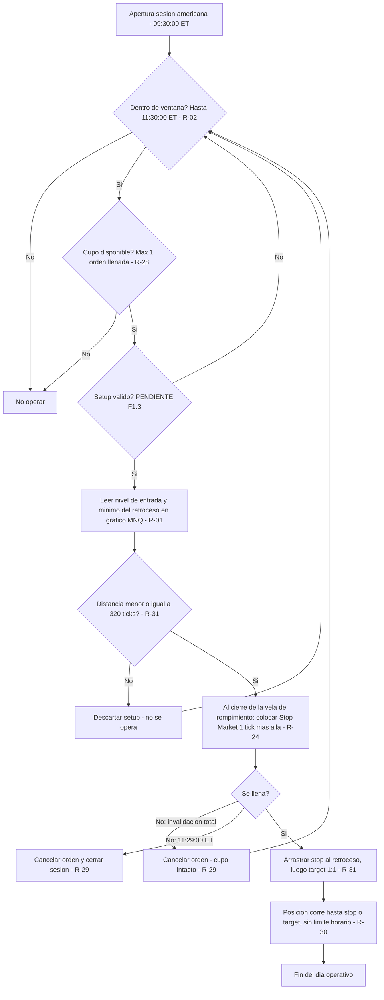
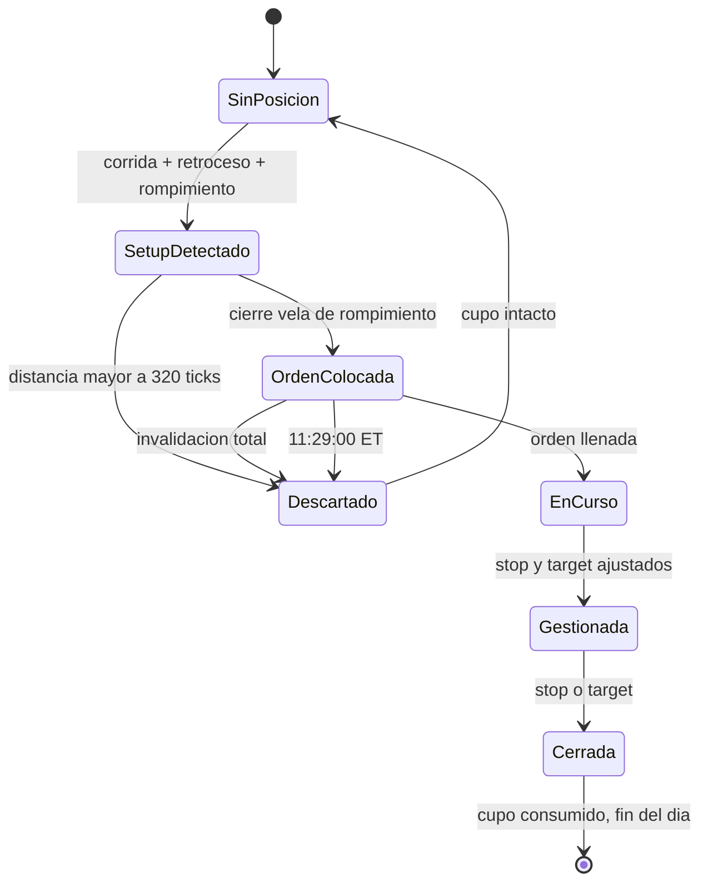

# HISTORIAL DEL PLAN

> Todo lo que es historia del plan: cómo se construyó, qué cambió y cuándo. **Nadie lo lee para operar**: ni el Coach
> ni el portal. Las reglas vigentes están en `reglas/`. Desde el 26/09/2026, cada cambio del plan es además un commit
> `plan: …` (D-028).

---

## La historia de cada regla

*Las marcas de fecha, los estados y las notas de construcción que las reglas llevaban dentro hasta la versión 3.14.*

### R-01

- 🔧 **Simplificada el 06/09/2026.** Antes el plan analizaba y leía volumen en **NQ** y ejecutaba en **MNQ**, con dos gráficos y un desfase de hasta 3 ticks entre ambos. El operador decidió operarlo todo en MNQ: **el NQ sale del plan y ese desfase deja de existir.** El backtesting histórico se hizo con datos de NQ y **no se rehace** — las reglas son las mismas.
- Nota de reglas.json: SIMPLIFICADO 06/09/2026 por decisión del operador: se elimina el NQ del plan. Antes se analizaba y se leia volumen en NQ y se ejecutaba en MNQ, con dos gráficos y un desfase de hasta 3 ticks entre ambos. Ahora todo ocurre en MNQ y ese desfase deja de existir.
- Estado en reglas.json: confirmada · simplificada a MNQ único el 06/09/2026

### R-03

- Estado en reglas.json: confirmada · lectura de volumen movida a MNQ el 06/09/2026

### R-04

- Estado: ✅ Confirmada 24/08/2026

### R-05

- Nota de reglas.json: corrida e impulso son sinonimos; el plan usa solo 'corrida'. NO existe tope de velas: el propio Chaumer (nota de voz 24/08/2026) confirma que la sobreextension no es un parámetro operativo sino un elemento de contextualizacion.

### R-06

- En reglas.json: «corregido 27/08/2026»
- Nota de reglas.json: CORREGIDO 04/09/2026: decia que el stop iba en el extremo del retroceso.
- Estado en reglas.json: confirmada · referencia al stop corregida 04/09/2026

### R-07

- reescrita 26/08/2026
- Subapartado «Vela base de la ventana operativa — **reescrita 26/08/2026**»
- Estado en reglas.json: Confirmada 26/08/2026
- Estado: ✅ Confirmada 2026-08-26 *(v1.13 la hacía depender de la 08:32; corregida por el operador el mismo día)*

### R-08

- Estado en reglas.json: Confirmada 26/08/2026
- Estado: ✅ Confirmada 2026-08-26

### R-09

- Nota de reglas.json: CORREGIDA 26/08/2026: la busqueda de la vela extrema INCLUYE la vela que dispara el retroceso. Una vela puede hacer máximo mayor y mínimo menor a la vez: dispara el retroceso y aun así puede ser la más alta del movimiento. Caso real 10/07/2026 vela 8:36.
- confirmado 01/09/2026
- confirmado 26/08/2026

### R-10

- reescrita 14/09/2026
- Subapartado «Estirar la zona · rompimiento con mecha sin consecución — **reescrita 14/09/2026**»
- Nota de reglas.json: 07/09/2026: el enunciado decia 'pasan 5 velas'. El operador confirmó que la resolucion anticipada de R-14 aplica IGUAL a este caso que al de la zona apéndice, así que el disparador es el plazo RESUELTO, no el plazo VENCIDO. Cierra P-30.
- Nota de reglas.json: Diagrama: 04_Web/public/conceptos/24-estructura-antes.png
- Nota de reglas.json: PRECISADA 14/09/2026: el enunciado no decia QUE BORDE se mueve, solo que 'el borde opuesto no se mueve', y el motor lo resolvia por el lado del rompimiento. Eso estiraba un SOPORTE hacia arriba en el cruce de vuelta. Caso de origen: 14/09/2026, soporte de la vela 9:10 (29062.00-29064.75) traspasado hacia abajo a las 9:18; a las 10:07 el precio vuelve y lo cruza hacia arriba sin consecución, y el motor lo estiraba hasta 29079.75 — metiendolo dentro de la resistencia viva de 9:09 (29071.00-29088.50) y dejando las dos zonas pisandose entre 29071.00 y 29079.75, contra la prohibicion de solapar zonas de tipo distinto (R-19 punto 5). Texto redactado por el operador. Regresión: no cambia julio (-77.75 en 5) ni las tres jornadas de septiembre. Gráficas del portal: 05-sin-confirmar.png (soporte creciendo hacia abajo) y 24-estructura-antes.png (resistencia creciendo hacia arriba) — las dos ya mostraban esto bien; lo que fallaba era la frase.
- Estado en reglas.json: confirmada · disparador precisado 07/09/2026 (cierre de P-30)

### R-11

- reescrita 15/09/2026
- Subapartado «Zona apéndice · rompimiento con cuerpo sin consecución — **reescrita 15/09/2026**»
- Nota de reglas.json: 07/09/2026: el disparador es el plazo RESUELTO, no el plazo VENCIDO — ver R-14.
- Nota de reglas.json: REESCRITA 15/09/2026: sale la frase 'el plazo se resuelve', que no decia que era el plazo, y entran los dos finales escritos completos, calcados de R-10 — son la misma regla y lo único que las separa es donde cierra la vela de rompimiento: con mecha se estira la zona (R-10), con cuerpo nace la apéndice (R-11). Peticion del operador: 'la zona apéndice es basicamente igual que lo que pasa con una zona que se estira... la diferencia es que el rompimiento no es con mecha, sino con cuerpo por fuera. Los casos son los mismos 2'. Sin cambio de mecánica: ni el motor ni ninguna jornada cambian. Diagramas: 02_Assets/diagramas/apendice_caso1_plazo.png y apendice_caso2_estructura.png
- Nota de reglas.json: El portal (04_Web, página de zonas, ancla #apéndice) escribe el disparador solo como '5 velas' y deja el segundo caso suelto al final — ver PROPUESTAS_AL_PLAN.md
- Estado en reglas.json: confirmada 24/08/2026 · disparador precisado 07/09/2026 (cierre de P-30) · reescrita 15/09/2026

### R-12

- Nota de reglas.json: Contraejemplo real anotado por el operador en 02_Assets/invalidos/R-12_invalido_01.png. Desviacion D-06: el curso cierra el marcado tras la primera zona; el operador no pone límite. SECUENCIA DE LA JORNADA (08/09/2026): la apertura deja dos zonas y esas dos son la banda; dentro de esa banda se marca UNA zona como máximo en toda la jornada (R-12/R-17); después no se dibuja nada más dentro; la única forma de que aparezca una zona nueva es superar un extremo con rompimiento y consecución (R-18), y ese traspaso abre banda nueva con turno propio para toda la jornada (R-17). Ver la seccion 'Como se marca una jornada' al principio del capitulo de zonas del plan. No es regla nueva: es R-16 + R-12 + R-17 + R-18 leidas en orden.

### R-13

- Estado en reglas.json: Ampliada 26/08/2026
- Estado: ✅ Ampliada 26/08/2026

### R-14

- ✅ **Confirmado el 07/09/2026: aplica igual a los dos caminos, sin excepción.** Hasta ese día la regla se había precisado solo sobre el caso de la **zona apéndice**, y que valiera también para el **estiramiento** estaba escrito **por simetría** — una extrapolación del auditor, anotada como `P-30` para no darla por buena sin preguntar. El operador lo confirmó con estas palabras: *"Si aplica igual"*. **`P-30` queda cerrado.**
  
  No es un detalle de forma: cambia **cuándo** nace el borde nuevo, y de ahí cuelga dónde va el stop.
- Nota de reglas.json: FUSIONADA 04/09/2026: la antigua R-39 decia exactamente lo mismo que esta regla y se elimino; su definición medible de las tres velas vive ahora aquí.
- Nota de reglas.json: Diagramas: 02_Assets/diagramas/apendice_caso1_plazo.png y apendice_caso2_estructura.png
- Nota de reglas.json: 07/09/2026 CIERRA P-30: quedaba sin confirmar si la resolucion anticipada aplicaba también al ESTIRAMIENTO (rompimiento con mecha) o solo a la zona apéndice (rompimiento con cuerpo). Estaba escrito por simetria, como extrapolacion del auditor. El operador confirmó: 'Si aplica igual'. Gobierna los dos caminos.
- Nota de reglas.json: Diagrama del caso con mecha: 04_Web/public/conceptos/24-estructura-antes.png
- Estado en reglas.json: Confirmada 24/08/2026 · definición medible anadida 01/09/2026 (absorbe la antigua R-39) · alcance confirmado a los dos caminos el 07/09/2026
- confirmado 01/09/2026

### R-15

- confirmado 01/09/2026
- Nota de reglas.json: Única forma de que nazca una zona sin corrida ni retroceso. A diferencia de R-09, aquí el COLOR de la vela decide si es soporte o resistencia. El corte en la apertura no es arbitrario: ese volumen en 1 minuto es raro en premercado y corriente en sesión. Desviacion D-09: Parámetros Chaumer dice 'solo marcamos los extremos'; el operador marca todas, y R-13 fusiona las que se tocan. Verificado con datos el 10/07/2026: escaneando desde 15:00 salen 3 velas sobre umbral; desde 19:00 sale 1, la que el operador marcó. Las 2 extra son la subasta de cierre del efectivo del día anterior.
- Nota de reglas.json: 06/09/2026: retirado el umbral de NQ; queda solo MNQ > 6000. La equivalencia entre ambos no esta verificada — ver P-32.
- Nota de reglas.json: 14/09/2026: el umbral deja de ser un número fijo y pasa a ser parámetro ajustable por decisión del operador — depende de la volatilidad del momento. Caso que lo motiva: el 10/09/2026 la vela más fuerte del premercado hizo 7799 contratos; con >6000 nacian cuatro soportes que desviaban todo el marcado de la manana, y con >8000 el premercado no deja ninguna zona.
- Estado en reglas.json: confirmada · umbral único MNQ desde el 06/09/2026
- Estado: ✅ confirmada · **umbral paramétrico desde el 14/09/2026**
- confirmado 01/09/2026

### R-16

- Nota de reglas.json: SECUENCIA DE LA JORNADA (08/09/2026): la apertura deja dos zonas y esas dos son la banda; dentro de esa banda se marca UNA zona como máximo en toda la jornada (R-12/R-17); después no se dibuja nada más dentro; la única forma de que aparezca una zona nueva es superar un extremo con rompimiento y consecución (R-18), y ese traspaso abre banda nueva con turno propio para toda la jornada (R-17). Ver la seccion 'Como se marca una jornada' al principio del capitulo de zonas del plan. No es regla nueva: es R-16 + R-12 + R-17 + R-18 leidas en orden.
- Estado en reglas.json: Confirmada 26/08/2026
- Estado: ✅ Confirmada 2026-08-26

### R-17

- Nota de reglas.json: Caso real 14/07/2026: banda entre el soporte de la vela 8:36 (29685.00-29693.00) y la resistencia de premercado de las 19:31 (29901.25-29908.25). Mitad en 29797.13. El primer retroceso, el de la vela 8:39, sube a 29798.00 y se pasa por 0.875 puntos (3.5 ticks): no se marca y la banda queda cerrada. De 8:41 a 9:10 no se marca ninguna zona. SECUENCIA DE LA JORNADA (08/09/2026): la apertura deja dos zonas y esas dos son la banda; dentro de esa banda se marca UNA zona como máximo en toda la jornada (R-12/R-17); después no se dibuja nada más dentro; la única forma de que aparezca una zona nueva es superar un extremo con rompimiento y consecución (R-18), y ese traspaso abre banda nueva con turno propio para toda la jornada (R-17). Ver la seccion 'Como se marca una jornada' al principio del capitulo de zonas del plan. No es regla nueva: es R-16 + R-12 + R-17 + R-18 leidas en orden.
- Nota de reglas.json: PRECISADO 18/09/2026 por el operador: 'una zona invalida ya no cuenta como zona, pero acuerdate de la regla de zonas entre zonas... igual cuando esas zonas ya son invalidas, no se marcan más zonas entre ese espacio así las zonas ya no sean validas'. El espacio que queda cerrado es la BANDA ENTERA entre la resistencia y el soporte, no solo el rectangulo de la zona muerta (confirmado sobre gráfico el 18/09/2026). Caso de origen: 18/09/2026, la resistencia 29804.75-29805.75 de la vela 8:54 se marcaba dentro de la banda que ya habia gastado la zona de premercado, invalida desde las 8:50. Efecto medido sobre las 18 sesiones marcadas: se caen 3 zonas (10/07 8:56, 10/09 9:07, 18/09 8:54) y NINGÚN resultado cambia.
- confirmado sobre grafico el 18/09/2026
- Estado en reglas.json: Confirmada 27/08/2026; borde de premercado confirmado 01/09/2026
- Estado: ✅ Confirmada 27/08/2026 · punto 7 (premercado como borde) confirmado 01/09/2026 · **punto 8 precisado 18/09/2026**
- confirmado 01/09/2026
- precisado 18/09/2026

### R-18

- Nota de reglas.json: SECUENCIA DE LA JORNADA (08/09/2026): la apertura deja dos zonas y esas dos son la banda; dentro de esa banda se marca UNA zona como máximo en toda la jornada (R-12/R-17); después no se dibuja nada más dentro; la única forma de que aparezca una zona nueva es superar un extremo con rompimiento y consecución (R-18), y ese traspaso abre banda nueva con turno propio para toda la jornada (R-17). Ver la seccion 'Como se marca una jornada' al principio del capitulo de zonas del plan. No es regla nueva: es R-16 + R-12 + R-17 + R-18 leidas en orden.
- Estado en reglas.json: Confirmada 27/08/2026
- Estado: ✅ Confirmada 27/08/2026

### R-19

- Estado en reglas.json: Confirmadas 26-27/08/2026
- Estado: ✅ Confirmadas 26–27/08/2026

### R-20

- Nota de reglas.json: CORREGIDO 04/09/2026: el enunciado decia "dentro de las 5 velas siguientes", contradiciendo la corrección del 27/08/2026.
- Estado en reglas.json: Ampliada 27/08/2026 · enunciado corregido 04/09/2026
- Estado: ✅ Ampliada 27/08/2026 · enunciado corregido 04/09/2026

### R-21

- Nota de reglas.json: PRECISADO 18/09/2026: la frase 'no cuenta para nada' era demasiado amplia y llevo al auditor a marcar una zona dentro de la franja de una zona ya invalida (18/09/2026, resistencia de la vela 8:54). Lo que pierde una zona invalida es su VALOR como zona; lo que conserva es el SITIO. Ver R-17.
- Estado en reglas.json: Precisada 27/08/2026
- Estado: ✅ Precisada 27/08/2026

### R-22

- Estado en reglas.json: Confirmada 27/08/2026
- Estado: ✅ Confirmada 27/08/2026

### R-25

- Nota de reglas.json: La Continuación es autocontenida: el setup crea la zona que después rompe. Se construye sobre un IRI (Impulso-Retroceso-Impulso): el segundo impulso rompe la zona y su consecución es la entrada. Hasta el 23/09/2026 el setup se llamaba IRI.
- Estado en reglas.json: confirmada · renombrada de IRI a Continuación el 23/09/2026 (solo el nombre, nada operativo)
- Estado: ✅ Confirmada 24/08/2026 · renombrada 23/09/2026

### R-26

- Estado en reglas.json: Confirmada 24/08/2026, plazo anadido 27/08/2026
- Estado: ✅ Confirmada 24/08/2026 · **plazo añadido 27/08/2026**
- añadido 27/08/2026

### R-27

- Estado en reglas.json: Confirmada 27/08/2026
- Estado: ✅ Confirmada 27/08/2026

### R-40

- Subapartado «🧭 Ampliada 21/09/2026 · el bloqueo es del SENTIDO, y el rompimiento directo»
- Nota de reglas.json: CUATRO CASOS QUE LA DEFINEN: 10/09/2026 la apertura sube 49.50 y el retroceso baja 65.75 (se pasa) -> caen la resistencia de 8:32 y el soporte de 8:34; después llega la secuencia completa (corrida 79.75, retroceso 32.25, rompimiento) y su resistencia, ENTERA por encima de la bloqueada, da la entrada del día. 14/09/2026 la apertura baja 43.50 y el retroceso sube 53.25 (se pasa) -> la resistencia de 8:34 no se opera: NO OPERA. 16/07/2026 la apertura sube 71.75 y el retroceso baja 132.25 (se pasa) -> el soporte de 8:36 no se opera; esa sesión estaba VALIDADA con ese corto y el operador la corrigió el 14/09/2026. 11/09/2026 sin zonas en toda la sesión, no llega a plantearse.
- Nota de reglas.json: NÚMERO: se usa R-40 y no R-39 a propósito; el 39 se gasto el 01/09 y se elimino el 04/09.
- Nota de reglas.json: REGRESIÓN: rehace julio — de -91.00 pts en 9 operaciones a -77.75 en 5. Ver GALERIA.md.
- Nota de reglas.json: AMPLIADA 21/09/2026 con el pasó a pasó del operador sobre la jornada del 18/09/2026: (1) la vela de apertura declara el sentido y se espera corrida, retroceso normal y corrida que rompe; (2) si el retroceso se pasa de la corrida se acaban las entradas EN ESE SENTIDO; (3) se espera a que la zona se rompa con consecución — rompimiento directo, no se opera; (4) se espera un IRI nuevo entero más alla y se entra en ese. Respuestas del 19/09: se puede volver a perder; solo afecta al sentido del día. Primera jornada que lo ejercita entero: 21/09/2026 — se pierde a las 8:34, rompimiento directo a las 8:37, se recupera con una orden a las 8:49 que se cancela antes de llenar, se vuelve a perder a las 8:51, segundo rompimiento directo a las 8:52, y se recupera con la entrada de las 8:59. MOTOR: para las zonas nacidas de corrida ya se comportaba así (la 'barrera' por sentido del mapa de fluidez). Para las zonas de premercado coincide porque el motor NUNCA las opera en continuación — que es el agujero todavía abierto de que no anota sus rompimientos; acierta por esa razón, no porque aplique la regla. Regresión: sin cambios en julio (-77,75 en 5) ni en septiembre.
- Estado en reglas.json: confirmada 14/09/2026 · reescrita 14/09/2026 · bloqueo de SENTIDO y rompimiento directo 21/09/2026

### R-41

- Subapartado «🔗 Unificación del 14/09/2026 — de dos conceptos a uno»
- Nota de reglas.json: Palabras del operador el 14/09/2026: 'un punto de control es un retroceso que dice que en ese punto se puede volver a presentar como una zona que el precio lo puedan defender para evitar que lo rompan'. CASO DE ORIGEN, 11/09/2026: Reingreso bajista a las 9:01 sobre la zona de premercado de 8:29, entrada 29440.25, stop 29475.00, objetivo 29405.50. El punto de control de la vela de 8:58, en 29423.00, queda en medio: descartado. El operador tampoco lo tomo. Sin esta regla el día habría dado +34.75 pts. REGRESIÓN: probada sobre las 11 sesiones de julio (umbral 2000 sobre NQ) y sobre el 10/09/2026 — NO cambia ninguna. Julio sigue en -91.00 pts en 9 operaciones, y DOS de esas nueve son reingresos (6 y 13 de julio), así que el filtro se probo donde muerde. Ver 05_Backtesting/test_ciego/DISCREPANCIAS.md del 11/09/2026.
- Nota de reglas.json: UNIFICADO 14/09/2026 por decisión del operador: 'punto de control y punto de referencia es lo mismo, dejemos uno solo: Punto de Referencia'. Se queda el NOMBRE viejo con la MECÁNICA nueva (cualquier retroceso vivo, muere por cierre).

### R-29

- 🔧 **Precisado 04/09/2026.** Las palabras del operador el 27/08 fueron *"llega al mismo punto del retroceso, que sería el mismo punto del stop"* — entonces coincidían. Desde que `R-32` se corrigió pueden **no** coincidir, y **manda el punto del stop**. Así lo aplicó el motor en las 11 sesiones validadas.
- En reglas.json: «corregido 27/08/2026»
- Nota de reglas.json: PRECISADO 04/09/2026: la cancelación se mide contra el stop de R-32, no contra el extremo del retroceso.
- Nota de reglas.json: 23/09/2026: el orden de la vela, confirmado para las zonas el 26/08, se aplicaba también a las ordenes desde el 14/09 como PROPUESTA del auditor sin confirmar. El operador lo confirma sobre la jornada del 23/09: vela azul de 8:36 que baja a 30922,00 (llena el corto en 30925,75) y después sube a 30957,00 (salta el stop en 30954,00). Palabras del operador: 'fue un stop valido, la vela primero bajo, hizo consecución y la misma vela después subio al stop'. Leida al reves, la orden se habría cancelado y el día habría sido otro: diferencia de 75,75 puntos.
- Estado en reglas.json: REESCRITA 27/08/2026 - la redaccion anterior decia lo contrario en los dos puntos · misma vela orden+stop confirmado 23/09/2026
- Estado: ✅ **REESCRITA 27/08/2026.** La redacción anterior decía exactamente lo contrario en los dos puntos (cancelaba por retroceso nuevo y **no** cancelaba por plazo). Corregida sobre caso real: **9 de julio de 2026**, orden puesta en la vela 8:43 que el motor cancelaba en la 8:45 por retroceso nuevo; con la regla correcta sigue viva y **se llena en la 8:46**, dentro del plazo. Cierra y sustituye lo acordado en `P-19`.
- confirmado 23/09/2026

### R-30

- Estado: ✅ Confirmada *(consecuencia en `P-07`)*

### R-31

- En reglas.json: «corregido 27/08/2026»
- Nota de reglas.json: CORREGIDA 24/08/2026. Antes fundia dos números distintos en uno solo: el defecto de la ATM (posterior al llenado) y el máximo de stop (filtro previo al envio). Son cosas distintas y ahora están separadas. Los valores viven en PARÁMETROS.md.
- Nota de reglas.json: CORREGIDO 04/09/2026: decia "distancia entrada <-> extremo del RETROCESO".
- Estado en reglas.json: confirmada · filtro alineado con R-32 el 04/09/2026
- Estado: ✅ Confirmada *(riesgo residual aceptado en `P-09`)*

### R-32

- corregido 27/08/2026
- Subapartado «Dónde va el stop — **corregido 27/08/2026**»
- unificado 14/09/2026
- Nota de reglas.json: CORREGIDO 04/09/2026: este archivo seguia diciendo "el extremo del retroceso", la definición anterior al 27/08/2026. El texto del plan ya tenia la buena; el json no. Caso real 7/07/2026: con la vieja el riesgo daba 71,50 pts y la entrada pasaba; con la correcta da 86,25 y queda DESCARTADA por STOP_MAX.
- Estado en reglas.json: Corregida 27/08/2026 · json alineado 04/09/2026

### R-33

- Nota de reglas.json: Palabras del operador, 24/08/2026: 'no se toca nada, jamas... Repito, jamas se gestiona.' Es la única regla del plan enunciada como prohibicion absoluta y sin excepciones. Convierte cada operación en un experimento limpio: el resultado mide el setup, no la gestión.

### R-34

- Nota de reglas.json: Palabras del operador 26/08/2026: 'ya no marcó más zonas, no hago más análisis, no hago nada más'. Va más alla de R-28 (no más ordenes) y R-33 (no tocar la posición): prohibe seguir ANALIZANDO. Sin esta regla, el operador podría seguir marcando zonas mientras ve acercarse su stop, que es el estado mental donde se rompen los planes.

### R-36

- Estado: ✅ Confirmada 24/08/2026

### R-37

- Estado: ✅ Confirmada 24/08/2026

### R-38

- Estado: ✅ Confirmada 24/08/2026

---

## Del documento maestro (`TRADING_PLAN_CHAUMER.md`, hasta la versión 3.14)

*Su cabecera, el estado de construcción, los anexos de la fase 1 y la tabla de versiones, tal cual.*

## TRADING PLAN — Estrategia Chaumer (MNQ · NinjaTrader 8)

**Versión:** 3.14 — 🏁 fase 1 cerrada · 🔴 **TEST CIEGO EN MARCHA** · 40 reglas
**Última actualización:** 2026-09-26
**Operador:** Christian
**Metodología base:** Alfredo Chaumer (*trader_sociologist*)
**Uso:** personal

---

### Estado de construcción

| Sub-fase | Contenido | Estado |
|---|---|---|
| **F1.0** | Perímetro y contexto operativo | ✅ **Cerrada** — `R-01` a `R-04` confirmadas |
| **F1.1** | Glosario y definiciones operativas | ✅ **CERRADA** — 24 términos definidos · 8 descartados · 4 movidos a contextualización |
| **F1.2** | Lectura de contexto y sesgo direccional | ✅ **CERRADA SIN REGLAS** — ver nota |
| **F1.3** | Identificación del setup | ✅ **CERRADA** — `R-25` Continuación *(antes IRI)* y `R-26` Reingreso confirmadas |
| **F1.4** | Gatillo de entrada | ✅ **CERRADA SIN REGLAS NUEVAS** — ya cubierta por `R-24`, `R-20`, `R-25`, `R-26`, `R-29` |
| **F1.5** | Stop loss y objetivos | ✅ **CERRADA** — `R-32` + `R-31` corregida + `PARAMETROS.md` |
| **F1.12** | Estructura y marcado | ✅ **CERRADA** — el bloque de zonas (`R-09` a `R-22`) · `R-29`, `R-20`, `R-21`, `R-12`, `R-13`, `R-26`, `R-32` corregidas |
| **F1.6** | Gestión de la posición | ✅ **CERRADA** — `R-33`: no se gestiona, nunca |
| **F1.7** | Riesgo y tamaño de posición | 🟠 **CERRADA CON HUECO DECLARADO** — `R-04` · sin regla de parada (`P-21`) |
| **F1.8** | Filtros y prohibiciones | ✅ **CERRADA** — `R-36` FOMC · `R-37` estado del operador |
| **F1.9** | Proceso operativo diario | ✅ **CERRADA** — `R-38` + `CHECKLIST_DIARIA.md` |
| **F1.10** | Galería de casos | ✅ **CERRADA** — 21 casos, incluidos descartes, días sin operar, órdenes canceladas y 11 sesiones completas al tick |
| **F1.11** | Test de operabilidad | 🚨 **NO EJECUTADA — HUECO DECLARADO.** La fase se cierra sin el test ciego, por decisión del operador. Ver `CIERRE_FASE_1.md` y `P-29` |

**Archivos del plan:**

- `CLAUDE.md` (raíz) — **instrucciones para Claude Code en la fase 2**
- `01_Plan\CIERRE_FASE_1.md` — **acta de cierre de la fase 1: qué está probado y qué no**
- `01_Plan\EQUIVALENCIA_NUMERACION.md` — **traducción entre la numeración vieja y la nueva**
- `04_Web\BRIEF_PORTAL.md` — qué tiene que resolver el portal y qué no puede hacer
- `01_Plan\ESTADO.md` — **índice compacto. Punto de arranque de cada sesión**
- `01_Plan\PARAMETROS.md` — **los números que pueden cambiar, en un solo sitio**
- `01_Plan\CHECKLIST_DIARIA.md` — **la secuencia del día, para ejecutar sin decidir**
- `01_Plan\GALERIA.md` — casos reales etiquetados · imágenes en `02_Assets\galeria\`
- `01_Plan\TRADING_PLAN_CHAUMER.md` — este documento
- `01_Plan\reglas.json` — espejo estructurado de las reglas
- `01_Plan\GLOSARIO.md` — términos con definición medible
- `01_Plan\PENDIENTES.md` — reglas sin cerrar y decisiones aplazadas
- `01_Plan\CONTEXTUALIZACION.md` — **elementos que NO son reglas** y no deben serlo
- `01_Plan\subfases\F1.0_Perimetro.md` — bloque completo de F1.0 con notas de auditoría
- `01_Plan\subfases\F1.1_Glosario.md` — bloque de F1.1
- `03_Materia_Prima\registro_sobreextension.csv` — trabajo de campo abierto para cerrar `P-11`

---

### 🔢 Índice de las 40 reglas, por categoría

*El documento va en este mismo orden: las siete categorías, y dentro de cada una las reglas por número.*

| # | Regla | Categoría |
|---|---|---|
| `R-01` | Analiza, marca zonas y ejecuta TODO sobre MNQ | Perímetro operativo |
| `R-02` | Opera unicamente durante los 120 minutos siguientes a la apertura de la sesion | Perímetro operativo |
| `R-03` | Opera con un grafico limpio: velas de 1 minuto y volumen, nada mas | Perímetro operativo |
| `R-04` | Opera siempre 1 contrato MNQ | Perímetro operativo |
| `R-05` | Una corrida (= impulso) es la secuencia de velas que arranca cuando una vela s | Estructura del precio |
| `R-06` | El retroceso es la secuencia de velas que arranca en la vela que mata la corri | Estructura del precio |
| `R-07` | La vela de las 08:31 declara la direccion inicial de la sesion con su propio c | Estructura del precio |
| `R-08` | Vela con maximo mayor y minimo menor sin corrida viva: pasa a ser la nueva vel | Estructura del precio |
| `R-09` | Marca la zona sobre la vela designada, desde el borde de su cuerpo hasta el ex | Zonas · marcado |
| `R-10` | Si el rompimiento fue con mecha y pasan 5 velas sin consecucion, extiende la z | Zonas · marcado |
| `R-11` | Si el rompimiento fue con cuerpo y pasan 5 velas sin consecucion, marca una zo | Zonas · marcado |
| `R-12` | Marca una zona entre dos zonas solo si el movimiento que la genera queda enter | Zonas · marcado |
| `R-13` | Si la zona que ibas a marcar toca una existente, no marques una nueva: estira  | Zonas · marcado |
| `R-14` | El plazo de 5 velas es un TOPE, no una espera obligatoria: si antes el mercado | Zonas · marcado |
| `R-15` | En la ventana de premercado (19:00 hora Colombia del dia anterior hasta la ape | Zonas · marcado |
| `R-16` | La zona de la corrida se marca al aparecer el retroceso; la del retroceso solo | Zonas · marcado |
| `R-17` | Dentro de una banda entre dos zonas se marca como maximo una zona en toda la j | Zonas · marcado |
| `R-18` | Salir de una zona o de una banda es rompimiento mas consecucion, no geometria | Zonas · marcado |
| `R-19` | Seis precisiones de dibujo de zonas | Zonas · marcado |
| `R-20` | Rompimiento es superar el borde de la zona por al menos un tick; consecucion e | Zonas · vigencia |
| `R-21` | Una zona deja de tener efecto cuando ha sido superada en las dos direcciones | Zonas · vigencia |
| `R-22` | La vela que confirma un traspaso no abre a la vez el rompimiento del lado cont | Zonas · vigencia |
| `R-23` | Toma el primer setup valido cuya orden se llene | Setup y entrada |
| `R-24` | Entra siempre con orden stop en reposo colocada al cierre de la vela de rompim | Setup y entrada |
| `R-25` | Setup Continuación: un IRI —corrida, retroceso, zona y rompimiento de esa zona— y su consecución | Setup y entrada |
| `R-26` | Setup Reingreso: tras un rompimiento con consecucion que falla, el precio recu | Setup y entrada |
| `R-27` | La direccion de la vela de las 08:31 marca por donde empieza el dia pero no ob | Setup y entrada |
| `R-40` | Corrida fluida: solo se entra en el rompimiento de la zona de una corrida FLUI | Setup y entrada |
| `R-41` | Punto de referencia: el objetivo de un REINGRESO no puede pasar del nivel de r | Setup y entrada |
| `R-28` | Ejecuta como maximo una operacion por sesion | Riesgo, orden y gestión |
| `R-29` | Manten la orden pendiente hasta que se llene, hasta que se agoten 5 velas sin  | Riesgo, orden y gestión |
| `R-30` | Una operacion abierta se gestiona hasta stop o target, aunque termine la venta | Riesgo, orden y gestión |
| `R-31` | Ejecuta con la ATM K1 al valor de ATM_DEFECTO y ajusta stop y target a mano tr | Riesgo, orden y gestión |
| `R-32` | Ancla la regla en el nivel de entrada, mide el stop hasta su referencia estruc | Riesgo, orden y gestión |
| `R-33` | Una vez ajustados stop y target, NO se gestiona la posicion | Riesgo, orden y gestión |
| `R-34` | Al llenarse la orden termina el ANALISIS del dia, no solo la operativa | Riesgo, orden y gestión |
| `R-35` | No operes en la ventana de +/-5 minutos alrededor de una noticia roja de Forex | Filtros de no-operar |
| `R-36` | En dia de FOMC no se opera Continuación | Filtros de no-operar |
| `R-37` | No se opera estando enfermo o sin encontrarse bien mentalmente | Filtros de no-operar |
| `R-38` | Ejecuta la sesion siguiendo la checklist diaria en orden, y registra TODAS las | Proceso diario |

*Numeración anterior al 06/09/2026: ver `EQUIVALENCIA_NUMERACION.md`.*

---

### 🚨 ADVERTENCIA DE USO — LEER ANTES DE CONSTRUIR NADA SOBRE ESTE PLAN

**Las 12 sub-fases están cerradas: 40 reglas** *(`R-40` y `R-41` salieron del test ciego, los días 10 y 11 de septiembre de 2026)*. El plan está **completo en reglas y contrastado contra 11 sesiones reales al tick**, corregido vela a vela por el operador.

**Pero NO está probado.** El test ciego de `F1.11` —el único que demuestra que un tercero con este documento en la mano llega a las mismas decisiones que el operador— **no se ha ejecutado**. La fase 1 se cierra sin él, por decisión explícita del operador el 01/09/2026.

Lo que eso significa, dicho sin adornos:

| | |
|---|---|
| ✅ **Sí está demostrado** | que las reglas escritas reproducen el marcado del operador en 11 sesiones, y que el motor de auditoría llega a sus mismas entradas, stops y objetivos |
| ❌ **NO está demostrado** | que otra persona, leyendo solo este documento, llegue a lo mismo. Eso es exactamente lo que mide el test ciego |
| ❌ **NO está escrito** | la regla de parada — cuándo se deja de operar en la semana o el mes (`P-21`) |
| ❌ **NO está en el plan** | la capa de contextualización, que es la que decide varios de los días de "hoy no opero" (ver `CONTEXTUALIZACION.md`) |

> 🔴 **Cualquier producto construido sobre este plan —portal web incluido— debe mostrar estos cuatro puntos, no esconderlos.** Un plan mecánico sin test ciego es un plan escrito, no un plan probado.

Detalle completo del cierre y de lo que quedó fuera: **`CIERRE_FASE_1.md`**.

---

---

## 📕 LAS 40 REGLAS, POR CATEGORÍA

*Reorganizado el 06/09/2026. Antes este documento seguía el orden en que se construyó el plan (las sub-fases `F1.x`); ahora sigue el orden de las siete categorías, que es el orden en que las reglas se usan durante el día. **Las notas de construcción, los diagramas y las correcciones del auditor no se perdieron: están íntegras en los anexos, al final.***

---

## 📎 ANEXOS Y NOTAS DE CONSTRUCCIÓN

*Todo lo que no es una regla: cómo se construyó el plan sub-fase por sub-fase, los diagramas, las desviaciones respecto al curso, las correcciones del auditor y los anexos de referencia. Se conserva en el orden original.*

> Los encabezados `F1.x` de aquí abajo **ya no contienen las reglas** — las reglas viven arriba, por categoría. Lo que queda es la narración de cómo se cerró cada sub-fase.

---
### ⬜ F1.2 · Cerrada sin reglas — por qué

**El operador no tiene ninguna regla que decida si opera o no antes de ver un setup** (24/08/2026).

Dos motivos, y los dos son estructurales:

1. **No hay sesgo direccional.** Por `R-23` se opera el **primer setup válido**, largo o corto. La dirección la da el rompimiento, no una lectura previa.
2. **Todo lo que F1.2 habría capturado ya está en `CONTEXTUALIZACION.md`.** Sobreextensión, lateralización, volumen en sesión, alejamiento de la zona, fluidez, longitud del recorrido y tamaño de estructura — los siete salieron a esa capa porque el propio operador dijo que no tienen número.

> ⚠️ **Lo que esto implica.** La decisión de *"hoy no opero"* existe y pesa —en las 4 sesiones grabadas Chaumer no operó 2 días por contexto— pero **queda fuera del plan mecánico, a propósito**. El test ciego de `F1.11` no podrá validarla.

---

## F1.3 · Identificación del setup ✅

### Taxonomía — cerrada 24/08/2026

**Fuente:** el selector de setups del propio NinjaTrader del operador (captura en `02_Assets\`).

| Setup | Dirección | Mecánica |
|---|---|---|
| **Continuación** | alcista / bajista | se construye sobre un IRI fluido |
| **Reingreso** | alcista / bajista | distinta: opera el rompimiento que falló |

**4 entradas en el menú → 2 mecánicas.** El espejo alcista/bajista no se documenta por separado: `R-05`, `R-06` y `R-09` ya establecen que todo se refleja exacto.

**Hasta el 23/09/2026 el menú tenía 6 entradas:** *IRI Apertura* e *IRI Continuación* eran la misma mecánica con dos etiquetas, solo para estadística. El operador quitó la etiqueta Apertura y renombró el setup: *"Vamos a dejar solamente 2 Setups: 1. Continuación (Antes IRI) 2. Reingreso, y las respectivas direcciones (Alcista y Bajista)."* Con eso se cierra `P-20`.

> *Historia:* *"Son la misma mecánica, solo que IRI Apertura se da cuando es la apertura, y el otro IRI ya se da durante la jornada operativa."* — Operador, 24/08/2026

---

## F1.5 · Stop y objetivos ✅

## F1.9 · Proceso operativo diario ✅

## F1.8 · Filtros y prohibiciones ✅

## F1.7 · Riesgo y tamaño de posición 🟠

### 🚨 El hueco declarado de esta sub-fase

**El plan no tiene ninguna regla de parada.** El operador lo confirma el 24/08/2026 y decide dejarlo abierto a propósito, para decidirlo con datos reales.

| Días malos seguidos | Capital restante | Caída | Para recuperar |
|---|---|---|---|
| 4 | $2.360 | −21 % | +27 % |
| 6 | $2.040 | −32 % | +47 % |
| 10 | $1.400 | **−53 %** | **+114 %** |
| 15 | $600 | −80 % | +400 % |

> ⚠️ **Ninguna regla del plan se rompe en esa tabla.** Cada uno de esos días fue un setup válido, con su stop correcto, ejecutado exactamente como está escrito. **El plan permite ese recorrido sin emitir una sola señal de alarma.**
>
> Y con `R-04` (tamaño fijo) más `STOP_MAX` fijo, **el riesgo porcentual crece solo cuando peor vas**: con $1.400 restantes, $160 ya no son el 5 % sino el 11 %.

**Detalle completo, frecuencia esperada y moldes posibles: `P-21` en `PENDIENTES.md`.**

---

## F1.6 · Gestión de la posición ✅

## F1.4 · Gatillo de entrada ✅ — cerrada sin reglas nuevas

El gatillo ya estaba escrito repartido entre reglas anteriores. El operador confirmó el 24/08/2026 que **no hay ningún paso adicional** entre ver el setup y enviar la orden.

| Qué pide F1.4 | Dónde está |
|---|---|
| Tipo de orden | `R-24` — Stop Market |
| Nivel exacto | `R-24` — 1 tick más allá de la vela de rompimiento o de reingreso |
| Momento de colocación | `R-24` — al cierre de esa vela |
| Qué dispara la entrada | `R-20`, `R-25`, `R-26` — la consecución |
| Verificación previa | `R-31`, `R-32` — los tres filtros |
| Cuándo se cancela | `R-29` |

---

### Los dos setups, uno al lado del otro

| | **Continuación** | **Reingreso** |
|---|---|---|
| **Qué opera** | el rompimiento que **funciona** | el rompimiento que **falló** |
| **Dirección** | a favor del rompimiento | **contraria** |
| **Plazo de consecución** | **5 velas** | **ninguno** |
| **Filtro de target** | zona vigente | zona vigente **+ punto de referencia** |
| **Origen de la zona** | la crea el propio setup | preexistente |

---

## F1.0 · Perímetro y contexto operativo ✅

*Bloque completo con notas de auditoría y reglas heredadas sin auditar: `subfases\F1.0_Perimetro.md`*

### Diagrama · Puerta de perímetro

### Diagrama · Ciclo de vida de la operación

---

## F1.1 · Glosario y definiciones operativas 🟡

*Documento vivo: `GLOSARIO.md` · Bloque completo: `subfases\F1.1_Glosario.md`*

### ⚠️ Corrección del auditor · 26/08/2026 — el retroceso de una sola vela

| | |
|---|---|
| **Qué hizo el auditor** | Al reconstruir el 6 de julio marcó el retroceso como **una sola vela** (la 8:36) y dio su mínimo, 29.882,75, como el mínimo del retroceso |
| **Qué decía el plan** | `R-06`, ya escrita y confirmada: *"el mínimo del retroceso es el mínimo MÁS BAJO de todas las velas del retroceso"*, y el retroceso *"termina cuando nace la siguiente corrida"* |
| **Quién lo detectó** | El **operador**, mirando la gráfica |
| **El daño potencial** | 29.882,75 en vez de 29.786,00 → **96,75 puntos de diferencia** en el nivel del stop y, con ratio 1:1, en el target. Y una zona de soporte marcada sobre la vela equivocada |
| **La causa** | El auditor leyó "retroceso" como evento puntual en vez de como **secuencia**. La regla estaba bien escrita; se aplicó mal |
| **Lección** | *Antes de dar un nivel por bueno, releer la regla que lo define. El error más caro no es la regla que falta, es la regla que existe y se aplica mal.* |

## F1.12 · Reglas de estructura y marcado — sesión del 27/08/2026 ✅

*Cinco reglas nuevas, todas confirmadas por el operador sobre casos reales del backtesting
día por día. Cada una nació de una corrección suya a una lectura equivocada del auditor.*

---

### ⚠️ Desviaciones conscientes respecto al curso

Este plan **no es "Chaumer como se enseña"**, es **"Chaumer como lo opera Christian"**. Detalle completo en `PENDIENTES.md`.

| # | El curso dice | Decisión del operador |
|---|---|---|
| **D-01** | Retroceso mínimo 23,60% Fib · máximo 76,40% Fib | **No usa Fibonacci** → descartado |
| **D-03** | El target no debe sobrepasar un punto de control (POC) | **No usa POC** → descartado |
| **D-04** | Zona crítica (1ª vela de la sesión, inicio del impulso, extremos de sesión europea) | **No usa ninguna** → descartada |
| **D-05** | El target no debe sobrepasar el alto o bajo de la sesión | **No lo usa** → descartado |
| **D-06** | Tras marcar una zona entre zonas, no se marcan más (Chaumer en vivo: en toda la sesión) | **Sin límite**, cada una contra su 50 % recalculado |
| **D-07** | Las zonas pierden importancia con el tiempo (escala gradual) | **No envejecen.** Activa o inactiva, binario ✅ *más mecánico que el original* |
| **D-08** | Al superponerse, la zona nueva se recorta y quedan dos zonas | **Se unen en una sola**, estirando la existente |
| **D-09** | Con más de dos velas de +2.000 en premercado, *"solo marcamos los extremos"* | **Se marcan todas.** `R-13` fusiona después las que se tocan |
| **D-10** | Zona de desequilibrio (término del curso) | **No usa el término** → descartado |
| **D-11** | Fractal y manipulación (términos del curso) | **No usa los términos** → descartados |
| **D-12** | Sesión europea (fuente de zonas críticas en el curso) | **No la mira** → descartada |
| **D-13** | **Giro** como tipo de entrada (*"4 velas entre el break a favor y el break en contra, el giro es la 5ª"*) | **No lo opera** → descartado. Solo hay Continuación y Reingreso |

#### 🔴 El bloque de volumen queda cerrado

**Hay una sola regla de volumen en todo el plan — `R-15` — y se apaga en la apertura americana.**

| | |
|---|---|
| Reglas de volumen en premercado | `R-15` |
| Reglas de volumen dentro de la ventana operativa | **ninguna** |
| Alcance real de `R-03` | el indicador está en pantalla toda la sesión, pero **alimenta una única regla, que termina antes de que abra el mercado** |
| Volumen dentro de sesión | **contextualización** → `C-08`, sin número y sin que deba tenerlo |

> **Consecuencia para `F1.3` y `F1.4`:** toda decisión de entrada dentro de la ventana operativa será **estructura de precio pura**. Si al llegar al gatillo aparece una condición que menciona volumen, contradice esto y habrá que resolverlo antes de escribirla.

#### 🚨 Consecuencia: un solo filtro de target

| Filtro de target | Estado |
|---|---|
| **Punto de referencia** — el extremo del retroceso que originó la zona | ✅ **Recuperado 24/08/2026** — solo en Reingreso · `R-26` |
| El target penetra o toca una **zona vigente** | ✅ **Único superviviente** — `R-21`. **Es el "punto de reacción" de Chaumer**, el filtro que él aplica a diario |
| Mín/máx del premercado | ❌ `P-01` |
| Punto de control (POC) | ❌ `D-03` |
| Zona crítica | ❌ `D-04` |
| Alto o bajo de la sesión | ❌ `D-05` |

Ninguna eliminación se apoya en datos. El target es **la mitad del R:R** en una estrategia 1:1. Si aparece el patrón *"llego cerca del target y el precio se da la vuelta"*, esta tabla es el primer sitio donde mirar.

---

### 🔵 Dos categorías, no una

Taxonomía del propio Chaumer (nota de voz, 24/08/2026), adoptada por el plan:

| | Dónde vive | Naturaleza |
|---|---|---|
| **Parámetro operativo** | este documento y `reglas.json` | Criterio fijo y medible. **Ejecutable sin criterio propio** |
| **Elemento de contextualización** | `CONTEXTUALIZACION.md` | Ayuda a decidir. **No tiene número y no debe tenerlo** |

> *"Existen parámetros operativos y existen elementos para contextualizar. […] Me ayudan a tomar decisiones, mas no es un parámetro operativo."*

En la capa de contextualización viven hoy: **sobreextensión** (`C-01`), volumen en movimiento extendido, lateralización, alejamiento de la zona, fluidez, longitud del recorrido y tamaño de la estructura.

**Consecuencia que conviene no olvidar:** el test ciego de `F1.11` **solo puede validar los parámetros**. Si la contextualización decide si se opera o no —y en Chaumer lo hace: no operó 2 de las 4 sesiones grabadas— las divergencias ahí no significarán que el plan esté mal escrito.

---

### 📹 Fuente nueva · vídeos de Chaumer en vivo

`00_Guias\videos chaumer guia\` — 4 historias de Instagram de *trader_sociologist*, 27 minutos narrando el mercado en directo (17–21 agosto 2026). Transcripciones y análisis: `03_Materia_Prima\transcripciones\`.

**Confirman** el umbral de ≥2.000 contratos, `R-21`, `R-10` y `R-11` con las palabras exactas del autor.

**Abren tres pendientes**, uno de ellos grave:

| ID | Qué |
|---|---|
| 🔴 **`P-13`** | **"Punto de reacción"** — término que Chaumer usa en las 4 sesiones y con el que descarta la mayoría de sus entradas. **No está en el plan.** Es el candidato natural a devolver un filtro de target |
| `P-14` | **"Estructura fallida"** — existe una extensión de zona **sin esperar las 5 velas** |
| `P-15` | **Vela sin cuerpo** — `R-09` cubre la vela sin mecha, no la inversa |

**Contexto de realidad:** en esas 4 sesiones Chaumer **no operó 2 días**, tuvo 1 stop y 1 take. Su agosto: 9 operaciones, 4 positivas, 5 negativas, ≈ −2 %. Ritmo real ≈ **2 operaciones por semana**. `R-28` fija un techo de 1 al día; es un techo, no un objetivo.

---

### Contexto de cuenta

| Concepto | Valor | Estado |
|---|---|---|
| Cuenta objetivo del plan | Cuenta propia · **$3.000 USD** | Aún no existe |
| Cuenta en uso a 21/08/2026 | Evaluación de fondeo **Apex $50.000** | Reglas externas sin documentar → `P-03` |
| Contratos | **1 MNQ** | Confirmado (R-31) |
| Riesgo máximo por operación | **`STOP_MAX` = 320 ticks = 80 pts = $160** = 5,3 % sobre $3.000 | Sin auditar → `P-08` |
| Operaciones por día | **1** | Confirmado (R-28) |
| Pérdida máxima diaria implícita | **$120** = 4,0 % | Derivada de R-28 + R-31 |
| Pérdida máxima semanal / regla de corte | — | Sin definir → F1.7 |
| R:R objetivo | **1:1** | A formalizar en F1.5 |

---

### Correcciones aplicadas a `Guia_Sesion_Chaumer_NQ_v4.pdf`

1. **Umbral de volumen.** La guía decía `≥2.000 en MNQ ó ≥6.000 en NQ`. Criterio adoptado: **≥2.000 contratos en el gráfico de NQ** (fuente: `Parámetros Chaumer.pdf`). El número de la guía queda anulado. → `P-06`
2. **Mín/máx de premercado.** Eliminado como filtro de target por decisión del operador. → `P-01`
3. **Stop por defecto de la ATM.** Estaba en **320 ticks = $160**, por encima del tope propio de $120. ****REVERTIDO 26/08/2026.** Se mantiene en **320 ticks = $160 = 80 pts**, que es el tope real del operador. Ver nota de corrección del auditor.**
4. **Tipo de orden.** Sospecha de Buy Limit descartada: el operador usa Stop Market, que es la orden correcta. → R-24

---

### ⚠️ Corrección del auditor · 24/08/2026 — el ATM de 320 ticks

**El 21/08 el auditor hizo cambiar un ajuste que estaba bien.**

| | |
|---|---|
| **Lo que vio** | la ATM del operador con **320 ticks** por defecto |
| **Lo que calculó** | 320 ticks = 80 pts = **$160**, por encima del tope de **$120** de la guía v4 |
| **Lo que recomendó** | bajarla a **240 ticks** — y el operador lo hizo el mismo día |
| **El fallo** | **el $120 no era del operador.** Salió de `Guia_Sesion_Chaumer_NQ_v4.pdf` y el auditor lo trató como si fuera su regla |
| **La realidad** | el tope real del operador es **80 puntos**, y 320 ticks son **exactamente** 80 puntos. El número estaba puesto a propósito |
| **El daño** | con la ATM a 240 (60 pts) y un stop estructural de 70, el mercado podía **sacarlo de una operación todavía viva** antes de mover el stop a mano. Empeoraba justo la ventana de `P-09` |
| **Corregido** | `ATM_DEFECTO` vuelve a **320 ticks** el 24/08/2026 |

**Lección de método, junto a la del 50 %:** antes de corregir un número del operador, comprobar **de dónde sale el número contra el que se compara**. El auditor comparó una cifra real contra una heredada de un documento que el propio operador ya había calificado de *"guía, no reglas fijas"*.

---

#### Nota de versión 1.14

| **1.14** | **2026-08-26** | 🏁 **Sesión del 06/07/2026 cerrada.** El auditor **se saltó un Reingreso válido** y lo detectó el operador: la 8:47 da la consecución del IRI y **en la misma vela** se da la vuelta y actúa como vela de reingreso. `R-26` **ampliada**: una misma vela puede cerrar el rompimiento fallido y abrir el reingreso; no se exige vela posterior. **`G-12`** añadido: primer caso con un **IRI rechazado por `STOP_MAX`** y un **Reingreso operado sobre la misma zona un minuto después** (−58,75 pts = −$117,50). **`R-12` validada por segunda vez** con datos exactos: 2 candidatas bloqueadas. Nuevo **`P-22`** (qué retroceso fija el stop del IRI cuando ha pasado más de uno). Nueva **nota de corrección del auditor**. **33 reglas** |

#### Nota de versión 1.13

| **1.13** | **2026-08-26** | 🏁 **Sesión del 06/07/2026 reconstruida al tick con el operador.** Tres reglas nuevas: **`R-07`** (la 08:31 es vela base — no se compara con la 08:30, pero sí abre la estructura y puede sostener zona), **`R-08`** (vela envolvente sin corrida viva: no declara dirección, la da la siguiente), **`R-16`** (línea provisional durante el retroceso → zona solo al confirmarse; la orden muere cuando el retroceso **aparece**, la zona nace cuando **termina**). **Limpieza de los 240 ticks**: el error revertido del ATM había dejado 17 apariciones de `240` contradiciendo `STOP_MAX = 320 ticks = 80 pts = $160` en 5 archivos y 2 diagramas. Corregidas todas. Nueva **nota de corrección del auditor** (retroceso de una sola vela). **33 reglas** |

### ⚠️ Corrección del auditor · 26/08/2026 — el Reingreso que no vio

| | |
|---|---|
| **Qué hizo el auditor** | Tras descartar la Continuación de la 8:47 por `STOP_MAX`, siguió analizando corridas, retrocesos y zonas hasta la 8:53, y planteó dos preguntas sobre `R-21` y `R-12` |
| **Qué se le pasó** | Que **esa misma vela 8:47** era una **vela de reingreso** perfecta: se dio la vuelta, atravesó la resistencia entera y salió por el borde inferior. `R-26` estaba escrita y confirmada desde el 24/08 |
| **Quién lo detectó** | El **operador**: *"yo creo que dejaste pasar un setup de Reingreso"* |
| **El daño** | El trade **válido y operado del día**. Y por `R-34`, todo el análisis posterior a la 8:48 que el auditor presentó **no existía**: el operador ya habría cerrado NT8 |
| **La causa** | El auditor trató el descarte de la Continuación como *"aquí no hay nada"* en vez de *"aquí no hay ESTE setup"*. Solo había buscado **un** setup por zona |
| **Lección** | *Un setup descartado no vacía la zona. Tras rechazar una Continuación hay que comprobar de inmediato si el rompimiento fallido abre un Reingreso — es la contraria exacta, y llega en las velas siguientes.* Recogido en la checklist |

### Anexo · Horarios de mercado en hora Colombia

Colombia es **UTC−5 fijo**: no aplica horario de verano. Todo lo demás se mueve alrededor.

| Época | Chicago (CT) | Nueva York (ET) |
|---|---|---|
| **Verano EEUU** *(mar–oct)* | = hora Colombia | Colombia **+1** |
| **Invierno EEUU** *(nov–mar)* | Colombia **−1** | = hora Colombia |

#### Futuros CME Globex — NQ / MNQ

| Evento | CT | Col — verano | Col — invierno |
|---|---|---|---|
| Apertura semanal (domingo) | 17:00 | 17:00 dom | 16:00 dom |
| Pausa diaria de mantenimiento | 16:00–17:00 | 16:00–17:00 | 15:00–16:00 |
| Cierre semanal (viernes) | 16:00 | 16:00 | 15:00 |

#### Sesiones de efectivo

| Mercado | Hora local | Col — verano | Col — invierno |
|---|---|---|---|
| Sídney (ASX) | 10:00–16:00 | 19:00–01:00 | 18:00–00:00 |
| **Tokio (TSE)** | 09:00–15:30 JST | **19:00–01:30** | **19:00–01:30** |
| Londres (LSE) | 08:00–16:30 | 02:00–10:30 | 03:00–11:30 |
| Fráncfort (Xetra) | 09:00–17:30 | 02:00–10:30 | 03:00–11:30 |
| NY — premercado acciones | 04:00 ET | 03:00 | 04:00 |
| **NY — apertura efectivo** | 09:30 ET | **08:30** | **09:30** |
| **Ventana operativa `R-02`** | 09:30–11:30 ET | **08:30–10:30** | **09:30–11:30** |
| NY — cierre efectivo | 16:00 ET | 15:00 | 16:00 |

> 📌 **Tokio no se mueve nunca.** Japón no tiene horario de verano y Colombia tampoco: **19:00 Col es fijo las 52 semanas**. Por eso el inicio de la ventana de `R-15` es el único ancla temporal del plan inmune al DST.

> ⚠️ **La semana de descuadre (`P-02`).** Europa cambia el **25 oct 2026**; EEUU el **1 nov 2026**. En esa semana Londres ya está en invierno y Nueva York todavía en verano: Londres abre a las 03:00 Col mientras NY sigue abriendo a las 08:30 Col. Es la única semana del año en que las dos columnas se mezclan.

**Fuentes:** [CME Group — Holiday and Trading Hours](https://www.cmegroup.com/trading-hours.html) · [CME Trading Hours 2026 (CrossTrade)](https://crosstrade.io/blog/cme-trading-hours-2026)

---

### Historial de versiones

| Versión | Fecha | Cambios |
|---|---|---|
| 0.1 | 2026-08-20 | Estructura de carpetas y archivos vacíos |
| 0.2 | 2026-08-21 | Lectura de `00_Guias\`. F1.0 en curso: R-01 a R-24 redactadas |
| 0.3 | 2026-08-21 | **F1.0 cerrada.** R-01 a R-03 confirmadas. ATM corregida de 320 a 240 ticks. Dos diagramas Mermaid. `P-02`, `P-04` y `P-05` cerrados; abiertos `P-01`, `P-03`, `P-06` a `P-10`. Glosario poblado como agenda de F1.1 |
| 0.4 | 2026-08-21 | **F1.1 abierta.** R-05 (corrida) confirmada — primer término del glosario con definición medible. Filtro de las 5 velas eliminado; `P-11` abierto con registro de campo en `03_Materia_Prima\registro_sobreextension.csv` |
| 0.5 | 2026-08-21 | R-06 (retroceso) confirmada. "El mínimo del retroceso" queda definido como el más bajo del conjunto — nivel del que dependen R-29 y R-31. Suelo de $40 de la guía v4 eliminado; `P-12` abierto con el coste cuantificado |
| 0.6 | 2026-08-24 | Leídas las 53 diapositivas de `Parámetros Chaumer.pdf` como imágenes. **Bloque de zonas cerrado**: R-09 a R-11. Hallazgo: existe una **regla única de marcado**. Registradas las desviaciones **D-01** (Fibonacci), **D-02** (5 velas) y **D-03** (POC) |
| 0.7 | 2026-08-24 | Descartadas la **zona crítica** (`D-04`) y el **alto/bajo de sesión** (`D-05`). El plan queda con **un solo filtro de target**: las zonas vigentes. Registrado de forma visible por su impacto sobre el R:R |
| 0.8 | 2026-08-24 | **R-12** (zonas entre zonas) confirmada + `D-06`. Analizados los **4 vídeos de Chaumer en vivo**: confirman 4 reglas y abren `P-13` (punto de reacción), `P-14` (estructura fallida) y `P-15` (vela sin cuerpo) |
| 0.9 | 2026-08-24 | **R-12 reescrita** tras un contraejemplo real del operador: el 50 % se mide sobre el **movimiento**, no sobre el rectángulo. Corregidas dos valoraciones erróneas del auditor. Captura anotada guardada en `02_Assets\invalidos\` |
| 0.10 | 2026-08-24 | Chaumer confirma por nota de voz que **la sobreextensión no es un parámetro operativo**. Sale el tope de velas de `R-05`; se cierran `P-11` y `D-02`; nace la capa **`CONTEXTUALIZACION.md`** con su taxonomía |
| 0.11 | 2026-08-24 | `P-13` cerrado: **"punto de reacción" = zona vigente**, no era un término nuevo. Abre `P-16` (¿las zonas envejecen?) |
| 0.12 | 2026-08-24 | `P-16` cerrado con `D-07`: **las zonas no envejecen**. `R-21` queda binaria — activa o inactiva. Es una desviación que **aumenta** la mecanicidad del plan |
| 0.13 | 2026-08-24 | **R-13** (superposición de zonas) confirmada + `D-08`. Al tocarse, las zonas se unen en vez de recortarse |
| 0.14 | 2026-08-24 | **R-14** confirmada: el plazo de 5 velas es un tope, no una espera. Cerrados `P-14` y `P-15`. **El bloque de zonas queda completo** — marcado, vigencia, extensión, apéndice, zonas entre zonas, superposición y anticipación |
| 0.15 | 2026-08-24 | **R-15** confirmada: la zona de premercado, única que nace del volumen. `P-06` cerrado — corregida la errata de la guía v4, que tenía los umbrales de NQ y MNQ invertidos |
| 0.16 | 2026-08-24 | **`R-15` completada.** Ventana de escaneo: **19:00 Col del día anterior** (apertura de Tokio) → apertura americana. **Se marcan todas** las velas sobre el umbral → `D-09`. Y un vacío no inventariado cerrado: **la regla del volumen se apaga en la apertura americana**. Añadida la tabla de horarios de mercado en hora Colombia. `P-06` totalmente cerrado |
| **0.17** | **2026-08-24** | **Bloque de volumen CERRADO.** Dentro de la ventana operativa el volumen es contextualización, no regla → `C-08`. Salen de la agenda *máximo volumen de sesión*, *volumen climático* y *volumen de parada*: no recibirán número. `R-03` queda con alcance real de premercado. **`D-10`**: "zona de desequilibrio" descartada. Consecuencia inventariada para `F1.3`/`F1.4`: el gatillo será **estructura de precio pura** |
| **0.18** | **2026-08-24** | **`R-35`** (noticia roja: Forex Factory, solo rojas, ±5 min) y término **ESTRUCTURA** definidos. Abiertos `P-17` (orden pendiente ante noticia) y `P-18` (¿todo retroceso genera zona?). Creado **`ESTADO.md`** como índice compacto de arranque |
| **0.19** | **2026-08-24** | **`P-17` y `P-18` cerrados.** Orden pendiente ante noticia roja → **se cancela** (`R-35`). **Estructura** queda inequívoca: retroceso nuevo que genera zona; el único que no la genera es el bloqueado por `R-12`. Documentada la consecuencia encadenada `R-12` → `R-14` → reloj de 5 velas |
| **0.20** | **2026-08-24** | `R-35` completa: tras T+5 se **vuelve a colocar** la orden si el setup vive. **`D-11`**: fractal y manipulación descartados. 🚨 Abierto **`P-19`** — contradicción entre el reloj de `R-29` (hasta 11:29) y el de `R-20` (5 velas) sobre la misma orden pendiente. **Bloquea el cierre de F1.1 y toda F1.4** |
| **0.21** | **2026-08-24** | ⛔ **SUPERADA POR v1.16 — la conclusión de esta entrada era la contraria de la correcta.** 🚨 **`P-19` CERRADO.** Los dos relojes no competían: `R-20` gobierna la **zona**, `R-29` la **orden**. `R-29` gana una tercera causa de cancelación: **retroceso nuevo**. Hallazgo estructural — el retroceso nuevo es el **mismo evento** que dispara `R-14`: marca zona nueva y mata la orden pendiente. Queda un residual para `F1.4` (llenado dentro de una zona extendida por `R-10`) |
| **1.0-F1.1** | **2026-08-24** | 🏁 **F1.1 CERRADA.** Rango y congestión → contextualización (`C-03`). Sesión europea descartada (`D-12`). **21 reglas · 18 términos definidos · 12 desviaciones · 8 elementos del curso fuera del plan.** El vocabulario del método queda traducido a criterios medibles. Siguiente: F1.2 |
| **1.1-F1.2** | **2026-08-24** | **F1.2 cerrada sin reglas.** El operador no tiene criterio previo de "hoy opero / hoy no": la dirección la da el rompimiento (`R-23`) y el resto ya vive en `CONTEXTUALIZACION.md`. Documentado por qué, para que no se reabra. Siguiente: **F1.3 · el setup — 4 tipos de entrada** |
| **1.2-F1.3** | **2026-08-24** | **F1.3 abierta. Taxonomía de setups cerrada** con el selector de NT8 del operador: **2 familias (IRI, Reingreso), 2 mecánicas**. `IRI Apertura` e `IRI Continuación` son la MISMA mecánica — la etiqueta es solo estadística. **`D-13`: el Giro queda fuera del plan.** Corregido el inventario del auditor, que preveía 4 tipos de entrada. Abierto `P-20` (menor, no bloqueante) |
| **1.3-F1.3** | **2026-08-24** | 🏁 **F1.3 CERRADA.** `R-25` (IRI) y `R-26` (Reingreso) confirmadas con diagrama. Nuevo término **PUNTO DE REFERENCIA**, que no es lo mismo que punto de reacción. **La alarma del filtro único de target se corrige: son dos** — el Reingreso añade el punto de referencia. Diferencias clave entre setups: plazo (5 velas vs ninguno) y filtro de target. `C-09` registrado. **23 reglas · 21 términos** |
| **1.4-F1.5** | **2026-08-24** | 🏁 **F1.4 y F1.5 CERRADAS.** Nueva `R-32` (stop y target). **`R-31` corregida**: fundía `ATM_DEFECTO` con `STOP_MAX`, que son cosas distintas. **ATM devuelta a 320 ticks.** Nuevo archivo **`PARAMETROS.md`**: los números que pueden cambiar viven en un solo sitio. `STOP_MAX` = **80 puntos**, confirmado por el operador con su consecuencia de riesgo delante (5,3 % de la cuenta objetivo). Documentado un error del auditor del 21/08. **24 reglas** |
| **1.5-F1.6** | **2026-08-24** | 🏁 **F1.6 CERRADA.** Nueva **`R-33`: no se gestiona, nunca.** Única regla del plan enunciada como prohibición absoluta y sin excepciones. Solo hay dos salidas: stop o target. **25 reglas** |
| **1.6-F1.7** | **2026-08-24** | 🟠 **F1.7 cerrada con hueco declarado.** Nueva `R-04` (1 contrato MNQ, fijo, revisión anual). **`P-21` abierto: el plan NO tiene regla de parada** — decisión consciente del operador de resolverlo con datos reales. Documentada la aritmética del drawdown y el hecho de que el riesgo porcentual crece cuando la cuenta cae. **26 reglas** |
| **1.7-F1.8** | **2026-08-24** | 🏁 **F1.8 CERRADA.** Nuevas `R-36` (día de FOMC: **IRI prohibido, solo Reingreso**, día entero, fuente Forex Factory) y `R-37` (estado del operador, **criterio libre**, la única regla sin condición medible y fuera del test ciego). **28 reglas** |
| **1.8-F1.9** | **2026-08-24** | 🏁 **F1.9 CERRADA.** Nueva `R-38` y nuevo documento **`CHECKLIST_DIARIA.md`**: las 29 reglas ordenadas en la secuencia real del día, en 4 bloques. Confirmado que el journal del operador registra **los días sin operar y su motivo** — el dato que permite cerrar `P-01`, `P-20`, `P-21` y `D-09`. Añadida la lista de campos que cierran cada pendiente. **29 reglas · quedan F1.10 y F1.11** |
| **1.9-F1.10** | **2026-08-24** | 🟡 **F1.10 abierta con 6 casos reales.** 4 IRI (2 alcistas, 2 bajistas) y 2 Reingresos. **Validan `R-20`, `R-25`, `R-26`, `R-32` y `R-21` sobre gráfico real.** `G-02` pasa `STOP_MAX` al **96 %** — el filtro no es teórico. Nuevo término **INVERSIÓN DE PAPEL** (la zona superada cambia de nombre), que es `R-21` dicha con las palabras del operador. Inventariado lo que falta: descartes, pérdidas, zona de premercado y días sin operar |
| **1.10-F1.10** | **2026-08-24** | **Galería a 10 casos.** Añadidos los dos que faltaban: **`G-07`** descarte por `STOP_MAX` (111,75 pts) y **`G-08`** descarte por punto de referencia con un stop de solo 30,50 pts — juntos prueban que **los tres filtros de `R-32` son independientes**. **`G-09`** día sin operar: el motivo mezclaba **lateralidad** (contextualización `C-03`) con **ausencia de setup** (parámetro) — se documenta la distinción y se propone separarlas en el journal. `G-10` era una operación de prueba: su P&L se ignora. **Sigue faltando un caso con pérdida real** |
| **1.11** | **2026-08-26** | 🔧 **`R-09` CORREGIDA con datos exactos.** La búsqueda de la vela extrema **incluye la vela que dispara el retroceso**. Antes decía *"la vela de la corrida"*, y dejaba fuera el caso —frecuente— de una vela con máximo mayor Y mínimo menor a la vez. Caso real 10/07/2026 vela 8:36: la redacción antigua daba una zona de 8,5 pts; la correcta, **29.903,50–29.926,00** (22,5 pts), que es la que marca el operador. También corregida `R-15`: el **sombreado gris** del indicador `Premercado.1` empieza a las **15:00 Col** y es solo visual; el **escaneo de zonas** empieza a las **19:00 Col** (Tokio). Verificado con datos: desde las 15:00 salen 3 velas sobre umbral, desde las 19:00 sale 1 — la del operador |
| **1.12** | **2026-08-26** | 🏁 **Sesión del 10/07/2026 reconstruida al tick, vela a vela, con el operador.** Nueva **`R-34`: al llenarse la orden termina el ANÁLISIS del día**, no solo la operativa — no se marcan más zonas ni se buscan setups; al cerrar, bitácora, pantallazo y cerrar NT8. `R-09` ampliada: **el retroceso también marca zona** (soporte tras corrida alcista, resistencia tras bajista), sujeto a `R-12`. **`R-12` validada con datos exactos**: el 50 % entre bordes internos daba 29.891,125, el retroceso bajó a 29.880,50 → cruza → no se marca, que es lo que hizo el operador. **`G-11`** añadido a la galería: **primer caso con pérdida real** (−53,50 pts = −$107 MNQ). **30 reglas** |
| **1.13** | **2026-08-26** | Correcciones de marcado sobre el 8 de julio, vela por vela: el rectángulo nace en la **vela origen**; se estira **solo hacia el nuevo extremo**; **no se solapan zonas de tipo distinto**; una zona superada **cambia de papel**; el orden intravela decide qué vela sostiene la zona. Recogidas en `R-19` |
| **1.16** | **2026-08-27** | 🏁 **Sesión larga de backtesting: 6, 7, 8, 9, 10 y 13 de julio cerrados con el operador.** Cinco reglas nuevas — **`R-27`** (la vela de apertura no sesga la jornada), **`R-17`** (una sola zona entre zonas por banda y jornada, la del primer retroceso — fuente Alfredo), **`R-18`** (salir de una zona es rompimiento + consecución), **`R-22`** (la vela que confirma no abre el rompimiento contrario) y **`R-19`** (seis precisiones de dibujo). Siete reglas corregidas: **`R-29` reescrita al revés de como estaba** (cancelaba por retroceso nuevo y no por plazo; es exactamente lo contrario, y la caducidad se mira **antes** del llenado); **`R-20`** — el traspaso de una zona **no tiene plazo**, el reloj de 5 velas solo gobierna geometría y orden; **`R-21`** — inválida es inválida, no cuenta para nada; **`R-12`** ampliada por `R-17`; **`R-13`** — estirar es hacia el extremo, no englobar; **`R-26`** — **el reingreso es inmediato o no es**; **`R-32`** — el stop es el extremo alcanzado **desde que nació la zona** hasta el rompimiento. **38 reglas** |
| **1.17** | **2026-09-01** | 🏁 **Sesión del 14/07/2026 cerrada: NO OPERA.** El operador confirma el marcado idéntico al suyo. **`R-17` ampliada con el punto 7: una zona de premercado hace de borde de banda** igual que cualquier otra — referencia cruzada añadida en la fila de `R-15`. Caso real documentado: la banda 8:36 ↔ premercado 19:31 se cierra porque el retroceso de la vela 8:39 se pasa del 50 % por **3½ ticks**, y eso deja **media hora de gráfico sin una sola zona** (8:41 → 9:10). Dos cortos descartados por `STOP_MAX` (157,75 y 84,00 pts). Nuevo **`G-17`** en la galería. **Siguen 38 reglas** |
| **1.18** | **2026-09-01** | 🟢 **Sesión del 15/07/2026 cerrada: primera operación GANADORA del backtesting.** IRI corto, entrada 29.910,25, stop 29.966,50, riesgo 56,25 pts → **TARGET en la vela siguiente al llenado: +56,25 pts = +112,50 USD**. **Sin reglas nuevas ni correcciones** — el día salió entero de las reglas ya escritas, que es la señal que buscábamos. Queda como caso testigo que **una misma vela puede marcar zona por un lado y romper otra por el otro en el mismo minuto** (la vela 8:36 deja la resistencia con su máximo y rompe el soporte con su mínimo), y que la zona se marca ahí, sin esperar a la siguiente. Nuevo **`G-18`**. Cambio de formato pedido por el operador: **la gráfica de backtesting pierde las líneas de entrada, stop y objetivo** — la franja roja/verde ya las dice. **Siguen 38 reglas** |
| **1.19** | **2026-09-01** | 🟢 **Sesión del 16/07/2026 cerrada: segunda ganadora seguida.** IRI corto, entrada 29.395,50, stop 29.471,00, riesgo 75,50 pts → **TARGET: +75,50 pts = +151,00 USD**. **Sin reglas nuevas.** Dos precisiones sobre reglas existentes, ambas confirmadas por el operador: **(1) `STOP_MAX` es una línea dura y no admite margen de seguridad** — 75,50 pts es el 94 % del tope y la operación se toma igual; escrito en `PARAMETROS.md`. **(2) Tras el llenado se aguanta** aunque la operación se ponga muy en contra — la vela 8:41 llegó a 39 pts en contra y no se hizo nada, que es `R-33` aplicada al pie de la letra. Nuevo **`G-19`**. **Siguen 38 reglas** |
| **1.20** | **2026-09-01** | 🔴 **Sesión del 17/07/2026 cerrada: se corta la racha.** IRI corto, entrada 28.434,75, stop 28.512,00, riesgo 77,25 pts (**97 % del tope**) → **STOP: −77,25 pts = −154,50 USD**. **Sin reglas nuevas.** 🔧 **Corrección de marcado confirmada por el operador: `R-34` también gobierna el dibujo — al llenarse la orden termina el análisis y no se marca ninguna zona más.** La gráfica estándar dibujaba zonas nacidas después del llenado (17/07 y 16/07); corregido en `dia.py`: zonas hasta la vela del llenado, velas hasta el resultado. Nuevo **`G-20`**. Registrada la nota de que tres operaciones seguidas llevan el stop pegado al tope (75,50 · 77,25) con 2 ganadas y 1 perdida. **Siguen 38 reglas** |
| **1.21** | **2026-09-01** | 🏁 **Sesión del 20/07/2026 cerrada: primer día que no cambia NI UNA regla.** IRI corto → **TARGET: +54,50 pts = +109,00 USD**. **Primera validación en datos de la cancelación reescrita de `R-29`:** el día generó **tres órdenes** y las dos primeras se cancelaron por la misma causa —el precio vuelve al punto del stop antes de llenar—, con solo cuatro minutos entre una orden larga y una corta. También queda documentado, a petición del operador, que **la zona apéndice no la marca la vela de rompimiento**: la vela la rompe, y lo que crea la zona es el plazo vencido sin consecución (`R-10`/`R-11`); el marcado directo estaba bloqueado por `R-18`. Nuevo **`G-21`**. **Siguen 38 reglas** |
| **2.0** | **2026-09-01** | 🏁 **FASE 1 CERRADA por decisión del operador.** 38 reglas · 12 sub-fases · 11 sesiones reales validadas al tick (6 → 20 de julio de 2026) · 21 casos en la galería. **`F1.10` cerrada.** 🚨 **`F1.11` (test ciego) NO se ejecuta: queda como hueco declarado, junto a la regla de parada (`P-21`) y a toda la capa de contextualización.** Nuevo `P-29` para no perderlo de vista. Nuevos documentos de cierre y traspaso: **`CIERRE_FASE_1.md`**, **`CLAUDE.md`** en la raíz del proyecto y **`04_Web/BRIEF_PORTAL.md`**. **Arranca la fase 2: construcción del portal web en Claude Code.** |
| **2.1** | **2026-09-01** | 🔵 **Regla nueva confirmada ya con la fase 1 cerrada: `R-39`.** El plazo de **5 velas es un TOPE, no una espera obligatoria**: si antes el mercado arma una **estructura completa en sentido contrario** —una vela que no da consecución y sube, una que hace retroceso, y una tercera que no sigue bajando— la geometría se resuelve ahí mismo, y se estira la zona o nace la apéndice sin esperar. La condición que la hace mecánica: **el mínimo de la vela del retroceso debe ser menor que el de la anterior pero NO pasar del extremo de la vela de rompimiento** — si lo pasa, eso es la consecución. Aplica en los dos sentidos. El **20/07 queda como contraejemplo**: subió cuatro velas seguidas sin retroceso, así que no armó estructura y la apéndice nació por plazo. Dos diagramas nuevos en `02_Assets\diagramas\`. **38 reglas** |
| **2.2** | **2026-09-04** | 🔧 **`R-39` ELIMINADA: era un duplicado de `R-14`.** El auditor escribió el 01/09 una regla nueva sin buscar antes, y `R-14` —confirmada el 24/08— ya decía lo mismo con esas palabras: *"el plazo de 5 velas es un tope, no una espera"*. Lo que sí aportaba `R-39` era la **definición medible de las tres velas de la estructura contraria**, que ahora vive dentro de `R-14`. De paso `R-14` gana por fin **sección propia** en este documento: hasta hoy existía solo como una fila de tabla, que es justamente por lo que se pudo duplicar. **Vuelven a ser 38 reglas.** |
| **2.3** | **2026-09-04** | 🔴 **Cinco definiciones superadas, corregidas por fin.** La corrección del stop del 27/08 —*el extremo alcanzado desde que nació la zona*, no solo el del retroceso— se había escrito en el texto de `R-32` pero **nunca se propagó**: seguía la versión vieja en `reglas.json` (`R-32`), en `R-06`, en `R-31` y en `R-29`. **La de `reglas.json` era la peligrosa: es el archivo contra el que se construye el portal.** También corregido el enunciado de `R-20`, que seguía diciendo que la consecución es *"dentro de las 5 velas siguientes"* cuando el 27/08 se confirmó que **la consecución que traspasa una zona no tiene plazo**. En `R-29` se precisa que la cancelación se mide contra **el punto del stop**, no contra el extremo del retroceso: eran el mismo punto cuando el operador lo dijo, ya no siempre lo son, y así lo aplicó el motor en las 11 sesiones. 🟢 **Y se adopta la nueva categorización**: siete grupos, con **Zonas** como una sola categoría de 14 reglas dividida en *marcado* (11) y *vigencia* (3). `reglas.json` gana los campos `categoria_nombre`, `categoria_descripcion`, `categoria_orden` y `subcategoria`, y queda **ordenado por grupo**. **38 reglas.** |
| **3.0** | **2026-09-06** | 🔵 **Dos cambios grandes, ninguna regla nueva.** **(1) Sale el NQ del plan.** Todo se analiza, se marca y se ejecuta en **MNQ**, con **un solo gráfico**: desaparecen el segundo gráfico y el desfase de hasta 3 ticks entre ambos. El umbral de volumen de premercado queda solo en **MNQ > 6.000** — y la equivalencia con el antiguo NQ > 2.000 **no está verificada**, ver `P-32`. El backtesting histórico se hizo con datos de NQ y **no se rehace**, por decisión del operador. **(2) Las 38 reglas se RENUMERAN** para correr seguidas dentro del orden de las siete categorías: antes *Estructura del precio* saltaba de la 11 a la 31. **1.127 referencias cruzadas remapeadas** en 18 archivos, incluidos el historial, el registro cronológico y los nombres de los diagramas. Nuevo **`EQUIVALENCIA_NUMERACION.md`** y nuevo **índice por categoría** en este documento. **No conviven dos numeraciones: toda la documentación usa la nueva.** |
| **3.1** | **2026-09-06** | 📕 **El documento se reorganiza por categorías.** Hasta hoy seguía el orden en que se construyó el plan —las sub-fases `F1.x`—, así que para leer las cuatro reglas de perímetro había que saltar entre cinco sitios. Ahora el cuerpo del documento son **las siete categorías en su orden de uso durante el día**, y dentro de cada una las reglas por número; **Zonas** va partida en *marcado* y *vigencia*. **Todo el material de construcción se conserva íntegro** —narrativa de cada sub-fase, diagramas, desviaciones y correcciones del auditor— movido a **`📎 ANEXOS Y NOTAS DE CONSTRUCCIÓN`**, al final. **Siete reglas que hasta hoy vivían solo como fila de tabla ganan sección propia** (`R-12`, `R-13`, `R-15`, `R-20`, `R-21`, `R-34`, `R-35`), generadas desde `reglas.json`: ese hueco fue exactamente el que permitió el duplicado de la v2.2. **Ninguna regla cambia. Siguen 38.** |
| **3.2** | **2026-09-07** | ✅ **`P-30` cerrado: la resolución anticipada del plazo aplica igual en los DOS caminos.** Quedaba sin confirmar si la regla del tope —una estructura completa al contrario resuelve la geometría antes de la quinta vela— valía también para el **rompimiento con mecha**, que estira la zona, o solo para el de **cuerpo**, que hace nacer la apéndice. Estaba escrito por simetría, como extrapolación del auditor. **El operador confirmó que aplica igual.** Corregidos los disparadores de `R-10` y `R-11` en `reglas.json` y en el documento: el gatillo es el plazo **resuelto**, no el plazo **vencido**. Nueva lámina del portal `24-estructura-antes.png` con el caso del estiramiento, y `P-31` —el motor no implementa la resolución anticipada— ampliado a los dos caminos. **Ninguna regla nueva. Siguen 38.** |
| **3.3** | **2026-09-08** | 🔑 **La secuencia del marcado, escrita por fin de principio a fin.** Al preparar el backtesting de un año el auditor dibujó mal un caso y el operador lo corrigió: en el sitio donde el auditor veía un *estiramiento*, **no se dibuja nada**. De ahí salió lo que faltaba, y no era una regla: era **el recorrido**. La jornada abre con dos zonas que forman **la banda del día**; dentro se marca **una sola zona en toda la jornada** —la del primer retroceso, y solo si respeta la mitad—; después **no se dibuja nada más ahí dentro**; y la **única** forma de abrir terreno nuevo es **traspasar un extremo con rompimiento y consecución**, lo que forma **una banda nueva con su propio turno**. Las cuatro reglas ya lo decían por separado (`R-16`, `R-12`, `R-17`, `R-18`); **en ningún sitio estaba el recorrido completo**, y ése era el hueco. Nueva sección al frente del bloque de zonas. ✅ Cierra `P-25`. 🔴 Nuevo `P-33`: **hay que comprobar que el motor implementa esta secuencia antes del backtesting de un año.** **Ninguna regla nueva ni modificada. Siguen 38.** |
| **3.4** | **2026-09-14** | 🔴 **Arranca el TEST CIEGO** — cierra el primer hueco declarado del cierre de fase 1. Primera jornada marcada a ciegas: **jueves 10/09/2026**, resultado acordado con el operador: largo, entrada 29.145,75 a las 8:40, stop 29.105,25, riesgo 40,50 → **TARGET en 8:41, +40,50 pts**. Dos cambios en el plan, los dos salidos del día: **(1) `UMBRAL_VOL` pasa a ser parámetro ajustable** y sube a **> 8.000 en MNQ** — abre **`P-37`**, que es el criterio medible de cuándo se cambia; **(2) regla nueva `R-40`** — no se entra en el rompimiento de una zona cuyo retroceso fue mayor que la corrida que la creó; traducción medible de *"no es fluida"* y *"está lateral"*. Queda pendiente repasar las 11 sesiones de julio con `R-40` puesta. **39 reglas** |
| **3.5** | **2026-09-14** | 🟡 **Segunda jornada del test ciego: viernes 11/09/2026 — NO OPERA, y coincide con el operador.** El día se resuelve entero en la primera vela: el mercado abre dentro del tramo que deja el premercado (suelo 29.317,00 · techo 29.443,00 · medio 29.380,00) y el primer movimiento lo cruza, con lo que ese tramo queda cerrado y **en toda la sesión no se marca ni una zona** — 26 candidatas, 26 descartadas. Regla nueva **`R-41`** salida de ahí: el **punto de control**, que es el nivel de referencia de un retroceso vivo y **tapa el objetivo de un reingreso**. Es la traducción de por qué el operador no tomó el reingreso de las 9:01 (objetivo 29.405,50 contra punto de control 29.423,00). Primera cosa del plan que **se rompe por cierre y no por mecha**. Regresión hecha: no cambia ninguna de las 11 sesiones de julio ni el 10/09. Quedan abiertos dos asuntos del reingreso sobre zona de premercado — ver `PENDIENTES.md`. **40 reglas** |
| **3.6** | **2026-09-14** | 🔗 **Punto de control y punto de referencia se unifican en uno solo: `PUNTO DE REFERENCIA`.** Decisión del operador — los dos eran el extremo de un retroceso y los dos tapaban el objetivo del reingreso. Se queda el nombre viejo con la mecánica nueva: vale **cualquier** retroceso vivo que quede entre la entrada y el objetivo, y **muere cuando una vela cierra más allá**. Cierra `P-36` y cierra también `P-35`, porque al no exigir que la zona venga de un retroceso, **una zona de premercado ya puede dar reingreso**. Probado: no cambia julio (−91,00 en 9), ni el 10/09, ni el 11/09. Actualizados además `GALERIA.md` (casos **G-22** y **G-23**) y `CHECKLIST_DIARIA.md`. **40 reglas** |
| **3.7** | **2026-09-14** | 🔴 **`R-40` reescrita entera: nace el término CORRIDA FLUIDA.** La primera redacción emparejaba cada corrida con el movimiento que venía *después*; la buena la empareja con **el retroceso que viene justo después de ella**, sin solapar parejas. Y se añaden las dos formas de fallar —el retroceso se pasa, o la corrida siguiente no es capaz de romper— con una sola recuperación: esperar otro IRI que deje una zona nueva **entera** más allá de la bloqueada. Tercera jornada del test ciego, **lunes 14/09/2026: NO OPERA**. 🔴 **Y obliga a corregir una sesión ya validada: el 16/07/2026 deja de tener operación.** Julio pasa de **−91,00 pts en 9** a **−77,75 en 5**. Nuevo caso **`G-24`** y resultados de julio actualizados en `GALERIA.md`. **40 reglas** |
| **3.8** | **2026-09-14** | ✅ **`P-37` cerrado: el umbral de volumen queda paramétrico y sin criterio medible, a propósito.** Palabras del operador: *"dejemos que quede paramétrico, hoy lo vamos a dejar de 8.000"*. Lo fija él, como `R-37`. Se escribe al lado la única condición que sí es medible y que lo hace seguro: **el umbral no se cambia con la sesión empezada**, y cada cambio se anota con su fecha. 🔢 Corregido de paso un choque de numeración: ese pendiente se había abierto como `P-33`, número ya ocupado desde el 08/09; **es `P-37`**. 📁 La carpeta `test_ciego\claude\` pasa a llamarse **`test_ciego\Back_claude\`** y se actualizan todas las referencias. **40 reglas** |
| **3.8** | **2026-09-14** | 📝 **`R-10` reescrita: ahora dice QUÉ BORDE se estira.** *"Si es una resistencia se estira solo por arriba; si es un soporte, solo por abajo"* — texto del operador. El enunciado viejo solo decía que el borde opuesto no se movía, y el motor lo resolvía por el lado del rompimiento: eso **estiraba un soporte hacia arriba** en el cruce de vuelta y dejaba dos zonas de tipo distinto pisándose, contra `R-19`. Detectado en la jornada del 14/09 (soporte de 9:10 metido dentro de la resistencia de 9:09). Se quita además la palabra *"plazo"* del texto: ahora los dos finales —cinco velas, o estructura contraria completa— están escritos uno debajo del otro. ✅ No cambia julio ni septiembre. **40 reglas** |
| **3.9** | **2026-09-15** | 📝 **`R-11` reescrita: la zona apéndice queda calcada de `R-10`.** Sale la frase *"si el plazo se resuelve"* —la misma que se había quitado de la regla de estirar el día anterior por no decir qué es el plazo— y entran los **dos finales escritos completos**: cinco velas, o estructura completa al contrario, lo que llegue primero. Palabras del operador: *"la zona apéndice es básicamente igual que lo que pasa con una zona que se estira... la diferencia es que el rompimiento no es con mecha, sino con cuerpo por fuera. Los casos son los mismos 2"*. Queda escrito en el plan que **lo único que separa las dos reglas es dónde cierra la vela de rompimiento**. Sección propia para `R-11`, que hasta hoy vivía **solo como fila de tabla**. ✅ Cambio de redacción: no se mueve el motor ni ninguna jornada. Anotada en `PROPUESTAS_AL_PLAN.md` la corrección del portal, que escribe el disparador solo como *"5 velas"*. **40 reglas** |
| **3.10** | **2026-09-19** | 🧭 **La banda gastada no se reabre — y ahora el motor lo aplica.** `R-17` ya decía en su punto 5 que *"la banda no se vuelve a abrir aunque se mueran las zonas que la formaron"*, pero el motor contaba el turno **solo sobre las zonas activas** y solo cuando evaluaba una candidata con vecinas vivas a los dos lados; y la frase de `R-21` —*"inválida es inválida, no cuenta para NADA"*— empujaba en sentido contrario. Detectado por el operador en la jornada del **18/09**: el auditor marcó una resistencia dentro de la franja de la zona de premercado, inválida desde las 8:50. Se añade el **punto 8** a `R-17` —el turno se cuenta sobre **todas** las zonas, activas e inválidas, y sobre las marcadas antes de que la banda existiera— y se precisa `R-21`: **deja de valer como zona; no deja de ocupar el sitio.** Confirmado además el alcance: se cierra **la banda entera**, no solo el rectángulo de la zona muerta. ✅ Regresión: se caen **3 zonas** en 18 sesiones (10/07, 10/09, 18/09) y **ningún resultado cambia**. **40 reglas** |
| **3.11** | **2026-09-21** | 🧭 **`R-40` ampliada: el bloqueo es del SENTIDO, y nace el término ROMPIMIENTO DIRECTO.** Paso a paso del operador sobre la jornada del 18/09: cuando el retroceso se pasa de la corrida **se acaban las entradas en el sentido del día** —no solo en esa zona—; el rompimiento que llega después **no se opera nunca** (rompimiento directo); y se vuelve a entrar solo cuando el mercado arma un **IRI nuevo entero más allá**. Alcanza también a las zonas de premercado, que no tienen corrida detrás. Se puede volver a perder, y solo afecta al sentido del día. Primera jornada que lo ejercita entero: **21/09** —se pierde y se recupera dos veces—. Sin cambios en el motor para las zonas de corrida; para las de premercado acierta porque nunca las opera, no porque aplique la regla. ✅ Regresión sin cambios. **40 reglas** |
| **3.12** | **2026-09-23** | 🏷️ **El setup IRI pasa a llamarse CONTINUACIÓN.** Decisión del operador (22/09, confirmada el 23/09): *"Vamos a dejar solamente 2 Setups: 1. Continuación (Antes IRI) 2. Reingreso, y las respectivas direcciones (Alcista y Bajista)."* **Solo cambia el nombre, nada operativo**: `R-25` conserva su número y sus condiciones. **IRI** queda como nombre de **la estructura** —corrida que deja zona, retroceso, corrida que la rompe—; la Continuación es un IRI fluido más su consecución. **Quedan cuatro nombres:** Continuación alcista · Continuación bajista · Reingreso alcista · Reingreso bajista. **Desaparece la etiqueta «Apertura»** → se cierra `P-20`. En las operaciones la dirección se escribe **alcista / bajista**, no largo / corto. Las citas y las entradas anteriores de este registro **se quedan con el nombre de entonces**. Tocados: `R-25`, `R-26`, `R-31`, `R-32`, `R-36`, `R-40`, `R-41` (solo texto), glosario, checklist, galería, pendientes y estado. **40 reglas** |
| **3.13** | **2026-09-23** | 🕯️ **Confirmado el orden de la vela también para las órdenes.** Cuando una misma vela toca el nivel de la orden y el stop: azul, primero el mínimo; blanca, primero el máximo. Si llega antes a la orden se llena —y el stop puede saltar en esa misma vela—; si llega antes al stop, se cancela. El motor ya lo aplicaba desde el 14/09 como **propuesta del auditor sin confirmar**; la jornada del **23/09** es la primera en que decide el resultado (−28,25 frente a +47,50 leída al revés) y el operador la da por buena. Añadido a `R-29`. Sin cambios en el motor ni en la regresión. **40 reglas** |
| **3.14** | **2026-09-26** | 🔧 **Correcciones sin cambio de metodología** (fase 1 de la reestructuración de las reglas, D-028, con el sí del operador). En la checklist: el stop de la Continuación dice ya **el extremo alcanzado desde que nació la zona hasta la vela de rompimiento**, como `R-32` desde el 27/08 (la tabla «Medir» seguía con la definición vieja); la nota de los filtros deja de contarlos; «IRI descartado» pasa a «Continuación descartada»; sale el campo de registro de `P-20`, cerrado el 23/09. En contextualización, los segundos `C-08` y `C-09` pasan a `C-11` y `C-12` (había dos de cada). En pendientes, la copia abierta de `P-22` se marca cerrada. En el estado, el umbral vigente, los casos de la galería y los elementos de contextualización. **Ninguna regla cambia.** | **40 reglas** |

---

## Lo que salió del texto de las reglas al reestructurarlas (26/09/2026)

*Plan 3.14 → siete archivos de grupo (`reglas/`). Aquí queda, copiado tal cual, lo que no pasó a la regla nueva: marcas de historia, cifras de la regresión, notas de construcción, y frases del documento maestro o de `reglas.json` que se reescribieron o se fundieron con otras. Lo que se retiró por viejo lleva su motivo. La comparación la hace `scripts/plan/comparar-migracion.py`.*

### R-01

- *(documento maestro)* - **Acción:** leer el máximo (long) o mínimo (short) real de la vela en MNQ y aplicarle el desplazamiento de 1 tick.
- *(reglas.json)* Mantener UN grafico de 1 minuto de MNQ.
- *(documento maestro)* - **Cómo se verifica en NT8:** **un** gráfico de 1 min de MNQ.

### R-02

- *(documento maestro)* - **Cómo se verifica en NT8:** el gráfico está en **hora Colombia (UTC−5 fijo)**.
- *(reglas.json)* America/Bogota (UTC-5 fijo) - decision P-02 opcion B

### R-03

- *(documento maestro)* - **Acción:** ninguna herramienta adicional sin revisar este plan.

### R-04

- *(reglas.json)* Cualquier cambio de tamano solo puede decidirse en la revision anual.

### R-05

- *(documento maestro)* - **Cómo se verifica en NT8:** a ojo sobre el gráfico de 1 min de MNQ, comparando extremos de velas consecutivas.
- *(reglas.json)* Identificar inicio y fin de la corrida antes de evaluar el retroceso.

### R-06

- Retirado del texto de la regla el 26/09/2026 (reestructuración, F2b), por viejo: «**Usado por:** `R-29` (invalidación total) · `R-31` (nivel del stop y filtro de 320 ticks)». Desde el 27/08/2026 el stop no se mide desde el retroceso (`R-32`).
- Retirado el 26/09/2026: en `reglas.json`, «Tamaño máximo: 240 ticks entre entrada y nivel de referencia (R-31)» — valor viejo; el documento maestro decía 320 ticks, que es `STOP_MAX`. Queda «≤ `STOP_MAX`». **A confirmar por el operador.**
- Retirado el 26/09/2026, por cerrado: la sección «🛑 Filtro subjetivo vivo (R-05)» — *El filtro de la guía v4 "más de 5 velas → sobreextendido" queda eliminado. El tope provisional de 10 velas no filtra nada (la corrida más larga observada es de 8). Hoy la sobreextensión se decide a ojo. Es el único juicio subjetivo que queda dentro del plan → `P-11`, en medición.* `P-11` se cerró el 24/08/2026: la sobreextensión es contextualización (`C-01`).
- Nota de `reglas.json` retirada: «Anula el suelo del rango $40-$120 de la guía v4; solo sobrevive el techo. Ver P-12.» (lo dice el «Por qué»).

- *(documento maestro)* El filtro de la guía v4 *"más de 5 velas → sobreextendido"* queda **eliminado**.
- *(documento maestro)* El tope provisional de 10 velas **no filtra nada** (la corrida más larga observada es de 8).
- *(documento maestro)* Es el **único juicio subjetivo que queda dentro del plan** → `P-11`, en medición.
- *(reglas.json)* Localizar el nivel de referencia del retroceso.
- *(documento maestro)* - **Usado por:** `R-29` (invalidación total)
- *(reglas.json)* Anula el suelo del rango $40-$120 de la guia v4;

### R-07

- Del documento maestro, retirado por repetido: «⏳ `P-23`: no está cubierto el caso de que la 08:31 cierre exactamente en su apertura» (es la fila «Pendiente»).

- *(documento maestro)* - **⏳ `P-23`:** no está cubierto el caso de que la 08:31 cierre **exactamente** en su apertura.

### R-09

- *(documento maestro)* *Contenido medible completo en `GLOSARIO.md` y `subfases\F1.1_Glosario.md`.*
- *(documento maestro)* Queda **una** zona, con su historial intacto.

### R-10

- *(documento maestro)* Eso se puede acabar de dos maneras, y vale **la que llegue primero**:
- *(documento maestro)* **Una ·** pasan **cinco velas** desde la siguiente a la del rompimiento, y la consecución no ha llegado.
- *(documento maestro)* **Qué cambió y por qué.** El enunciado viejo decía *"extiende la zona hasta la punta de esa mecha
- *(documento maestro)* el borde opuesto no se mueve"*, sin decir **cuál** borde se mueve.
- *(documento maestro)* El motor lo resolvía por el lado del rompimiento, y eso estiraba un soporte **hacia arriba** cuando el precio volvía a cruzarlo.
- *(documento maestro)* A las 10:07 el precio vuelve y lo cruza hacia arriba sin consecución, y el enunciado viejo lo estiraba hasta 29.079,75 — metiéndolo dentro de la resistencia viva de 9:09 (29.071,00 – 29.088,50) y dejando las dos zonas **pisándose** entre 29.071,00 y 29.079,75, contra la prohibición de solapar zonas de tipo distinto.
- *(documento maestro)* > 🖼️ **Las gráficas del portal ya estaban bien.** `05-sin-confirmar.png` muestra un soporte creciendo hacia abajo y `24-estructura-antes.png` una resistencia creciendo hacia arriba, de 29.082,00 a 29.096,00.
- *(documento maestro)* precisada 07/09/2026 (el final llega con lo que ocurra primero)
- *(documento maestro)* **reescrita 14/09/2026 (qué borde se mueve)**
- *(reglas.json)* pasan CINCO velas desde la siguiente a la del rompimiento, y la consecucion no ha llegado
- *(documento maestro)* Lo que fallaba era la frase, no el dibujo.

### R-11

- *(documento maestro)* Eso se puede acabar de dos maneras, y vale **la que llegue primero**:
- *(documento maestro)* **Una ·** pasan **cinco velas** desde la siguiente a la del rompimiento, y la consecución no ha llegado.
- *(documento maestro)* Ahora los dos finales están escritos completos, uno debajo del otro, igual que en la otra regla.
- *(documento maestro)* **reescrita 15/09/2026 (fuera la palabra "plazo")**
- *(reglas.json)* pasan CINCO velas desde la siguiente a la del rompimiento, y la consecucion no ha llegado
- *(documento maestro)* **Qué cambió y por qué.** El enunciado viejo decía *"si el plazo se resuelve sin consecución"* — la misma frase que se había sacado de `R-10` el día anterior por no decir **qué es el plazo**.

### R-12

- *(documento maestro)* - **Acción:** Mirar el recorrido del precio, no la caja.
- *(reglas.json)* Mirar el recorrido del precio, no la caja.
- *(documento maestro)* > 📌 **Sección creada el 06/09/2026** a partir de `reglas.json`.
- *(documento maestro)* Hasta hoy esta regla vivía **solo como una fila de tabla** — exactamente el hueco que permitió que en septiembre se escribiera una regla duplicada sin que nadie la viera.

### R-13

- *(documento maestro)* Estirar la existente hasta englobar la candidata.
- *(reglas.json)* Estirar la existente hasta englobar la candidata.
- *(documento maestro)* > 📌 **Sección creada el 06/09/2026** a partir de `reglas.json`.
- *(documento maestro)* Hasta hoy esta regla vivía **solo como una fila de tabla** — exactamente el hueco que permitió que en septiembre se escribiera una regla duplicada sin que nadie la viera.

### R-14

- *(documento maestro)* El 01/09 el auditor, sin buscarla, escribió una regla nueva —`R-39`— que decía exactamente lo mismo.
- *(documento maestro)* - **Categoría:** marcado de zonas — **amplía `R-10` y `R-11`**
- *(documento maestro)* definición medible añadida y fusión el 01–04/09/2026
- *(reglas.json)* rompimiento con cuerpo hace nacer la ZONA APENDICE (R-11).
- *(reglas.json)* esperar a las 5 velas y aplicar R-10 o R-11
- *(documento maestro)* > 🔧 **Fusionada el 04/09/2026.** Esta regla se confirmó el 24/08/2026 pero vivía solo como una fila en la tabla de `F1.1`.

### R-15

- *(documento maestro)* **Valor actual: > 8.000 contratos en MNQ, desde el 14/09/2026.** Anteriores: > 6.000 en MNQ (06/09 → 14/09/2026)
- *(documento maestro)* el indicador Premercado.1 sombrea de 15:00 Col del dia anterior a 08:30 Col.
- *(documento maestro)* > **Lo que lo motivó**, primera jornada del test ciego (10/09/2026): la vela más fuerte de todo el premercado hizo **7.799** contratos, y todas las que pasaban de 6.000 eran la misma cosa — la reacción al dato de precios al productor de las 7:30.
- *(documento maestro)* Con el umbral en 6.000 nacían cuatro soportes seguidos, y uno de ellos, el de 29.120,25–29.127,75, **tapaba la resistencia que deja la vela de 8:32** por la prohibición de solapar zonas de tipo distinto (`R-19`, punto 5).
- *(documento maestro)* > **`P-37`, cerrado el 14/09/2026:** el operador decidió que **no habrá criterio medible** — *"dejemos que quede paramétrico"*.
- *(documento maestro)* 🔴 **La condición que lo hace seguro, y ésa sí es medible: el umbral NUNCA se cambia con la sesión empezada**, y cada cambio se anota con su fecha en `PARAMETROS.md`.
- *(reglas.json)* Marcar la zona en premercado y tratarla despues como una zona normal.
- *(reglas.json)* Valor actual: 8000 contratos en MNQ, desde el 14/09/2026.
- *(reglas.json)* Anteriores: >6000 en MNQ del 06/09 al 14/09/2026;
- *(reglas.json)* PENDIENTE P-37: no esta definido con que criterio medible se cambia ni cada cuanto se revisa;
- *(reglas.json)* hasta entonces lo fija el operador y se anota con su fecha.
- *(reglas.json)* el indicador Premercado.1 sombrea de 15:00 Col del dia anterior a 08:30 Col.
- *(documento maestro)* 13h30 en verano EEUU (~810 velas);
- *(documento maestro)* 14h30 en invierno EEUU (~870 velas) |
- *(documento maestro)* Todo el marcado de la mañana se desviaba de ahí.
- *(documento maestro)* > 📌 **Sección creada el 06/09/2026** a partir de `reglas.json`.
- *(documento maestro)* Hasta hoy esta regla vivía **solo como una fila de tabla** — exactamente el hueco que permitió que en septiembre se escribiera una regla duplicada sin que nadie la viera.
- *(reglas.json)* 13h30 en verano EEUU (~810 velas);
- *(reglas.json)* 14h30 en invierno EEUU (~870 velas)
- *(reglas.json)* >2000 en NQ hasta el 06/09/2026.

### R-17

- *(documento maestro)* - **Categoría:** marcado de zonas — **amplía `R-12`**
- *(documento maestro)* - **Efecto medido:** en el 8 de julio el día pasa de 13 zonas a 11.
- *(documento maestro)* - **Efecto medido sobre las 18 sesiones marcadas:** se caen **3 zonas** — el soporte de 8:56 del 10/07, el de 9:07 del 10/09 y la resistencia de 8:54 del 18/09.
- *(documento maestro)* Las dos primeras ni se dibujan, porque nacen después del llenado de su jornada.
- *(reglas.json)* si respeta el 50 por ciento se marca;
- *(reglas.json)* Se mira sobre TODAS las zonas, activas e invalidas.

### R-20

- *(documento maestro)* 5 velas contadas desde la vela siguiente a la de rompimiento |
- *(reglas.json)* 5 velas contadas desde la vela siguiente a la de rompimiento
- *(documento maestro)* > 📌 **Sección creada el 06/09/2026** a partir de `reglas.json`.
- *(documento maestro)* Hasta hoy esta regla vivía **solo como una fila de tabla** — exactamente el hueco que permitió que en septiembre se escribiera una regla duplicada sin que nadie la viera.

### R-21

- *(documento maestro)* se conserva con tonalidad muy tenue, solo como recuerdo visual |
- *(documento maestro)* dejarla dibujada en tono minimo.
- *(reglas.json)* dejarla dibujada en tono minimo.
- *(reglas.json)* se conserva con tonalidad muy tenue, solo como recuerdo visual
- *(reglas.json)* PERO SIGUE OCUPANDO SU SITIO: la banda que ya gasto su zona no se reabre porque la zona se invalide (R-17, precisado 18/09/2026).
- *(documento maestro)* > 📌 **Sección creada el 06/09/2026** a partir de `reglas.json`.
- *(documento maestro)* Hasta hoy esta regla vivía **solo como una fila de tabla** — exactamente el hueco que permitió que en septiembre se escribiera una regla duplicada sin que nadie la viera.

### R-23

- *(documento maestro)* Prohibido comparar con setups posteriores o esperar uno mejor.
- *(documento maestro)* - **Acción:** ejecutar el primer setup válido;
- *(documento maestro)* tras el llenado, ignorar el resto de la sesión.
- *(reglas.json)* Ejecutar el primer setup valido.
- *(reglas.json)* Una vez llenada la orden, ignorar el resto de la sesion.
- *(reglas.json)* cronologico (primero en cumplir todas las condiciones necesarias)

### R-24

- *(documento maestro)* Short → **Sell Stop Market** por debajo.
- *(reglas.json)* No perseguir el precio a mano.
- *(reglas.json)* maximo de la vela de rompimiento + 1 tick, leido en MNQ
- *(reglas.json)* minimo de la vela de rompimiento - 1 tick, leido en MNQ

### R-25

- *(documento maestro)* > Hasta el 23/09/2026 este setup se llamaba **IRI**.
- *(reglas.json)* La etiqueta Apertura desaparece (decision del operador 23/09/2026;

### R-27

- *(documento maestro)* El operador pidió dejarlo documentado para validarlo en la fase de contexto.

### R-29

- *(documento maestro)* blanca, primero el máximo**—, el mismo que ya valía para las zonas.
- *(documento maestro)* - **Acción:** cancelar la orden y descartar el setup.

### R-30

- *(reglas.json)* No ejecutar ninguna accion por hora.

### R-31

- *(documento maestro)* Configuración de ejecución (ATM `K1`) — **corregida 24/08/2026**
- *(documento maestro)* - **Filtro previo al envío:** el stop estructural debe ser **≤ `STOP_MAX` = 80 puntos**.
- *(documento maestro)* > ⚠️ **Esta regla estaba mal planteada y se corrigió el 24/08/2026.** Fundía en un solo número dos cosas distintas:
- *(reglas.json)* Tras el llenado arrastrar stop y luego target.
- *(documento maestro)* Ver la nota de corrección al final del documento.

### R-33

- *(documento maestro)* ❌ `R-31` fija 1 contrato: no hay nada que partir |
- *(reglas.json)* R-31 fija 1 contrato: no hay nada que partir

### R-34

- *(documento maestro)* Terminada la operacion, registrar y cerrar la plataforma.
- *(reglas.json)* Terminada la operacion, registrar y cerrar la plataforma.
- *(documento maestro)* > 📌 **Sección creada el 06/09/2026** a partir de `reglas.json`.
- *(documento maestro)* Hasta hoy esta regla vivía **solo como una fila de tabla** — exactamente el hueco que permitió que en septiembre se escribiera una regla duplicada sin que nadie la viera.

### R-35

- *(documento maestro)* > 📌 **Sección creada el 06/09/2026** a partir de `reglas.json`.
- *(documento maestro)* Hasta hoy esta regla vivía **solo como una fila de tabla** — exactamente el hueco que permitió que en septiembre se escribiera una regla duplicada sin que nadie la viera.

### R-38

- *(documento maestro)* - **Documento:** `01_Plan\CHECKLIST_DIARIA.md`
- *(reglas.json)* Rellenar el journal al cierre de la sesion.

### R-40

- *(documento maestro)* Lo que hace de verdad, medido, es **operar casi la mitad de días**.
- *(documento maestro)* > 📌 **Por qué `R-40` y no `R-39`.** El número 39 se gastó el 01/09/2026 con una regla duplicada que se eliminó el 04/09.
- *(documento maestro)* > ⚙️ **El motor.** Para las zonas nacidas de corrida ya se comportaba así: el mapa de fluidez guarda una *barrera* por sentido, y toda zona nueva en ese sentido tiene que quedar entera más allá.
- *(documento maestro)* Para las zonas de **premercado** coincide porque el motor **nunca** las opera en continuación — que es el agujero todavía abierto de que no anota sus rompimientos.
- *(documento maestro)* **ampliada 21/09/2026: bloqueo de sentido y rompimiento directo**
- *(reglas.json)* Desde ahi el mercado alterna corrida en ese sentido / retroceso en contra.
- *(reglas.json)* dos pasos explicitados 21/09/2026
- *(reglas.json)* las zonas de PREMERCADO (R-15) no tienen corrida que las haya creado, asi que la comprobacion de 'si su corrida fue limpia' no se les puede aplicar.
- *(reglas.json)* el bloqueo afecta SOLO al sentido que declaro la vela de apertura.
- *(documento maestro)* Quedan intactos el 6, el 10, el 13 y el 15.
- *(documento maestro)* > ⚠️ **El total mejora poco y de casualidad.** La regla quita dos perdedoras grandes pero también **las dos ganadoras más grandes de julio**.
- *(documento maestro)* Es una decisión de frecuencia, no una mejora demostrada — cinco operaciones no demuestran nada.
- *(documento maestro)* Reutilizarlo confundiría el historial.
- *(documento maestro)* **Acierta por esa razón, no porque aplique la regla.** Cuando se tape ese agujero, habrá que meterlas en el bloqueo explícitamente.

### R-41

- *(documento maestro)* Hasta el 14/09/2026 el plan tenía **dos** filtros que hacían lo mismo:
- *(documento maestro)* **Decisión del operador:** *"punto de control y punto de referencia es lo mismo, podemos unificar esos conceptos, dejemos uno solo: Punto de Referencia."* Se queda el **nombre viejo** con la **mecánica nueva**.
- *(documento maestro)* **Lo que cierra de paso:** ya no hace falta que la zona venga de un retroceso, así que **una zona de premercado también puede dar reingreso** — el hueco que había quedado abierto el 11/09.
- *(documento maestro)* > ✅ **Probado antes de unificar:** no cambia ninguna de las 11 sesiones de julio (**−91,00 pts en 9 operaciones**), ni el 10/09, ni el 11/09.
- *(documento maestro)* > ✅ **Regresión hecha antes de escribir la regla.** Probada sobre las 11 sesiones de julio (umbral 2.000 sobre NQ) y sobre el 10/09/2026: **no cambia ninguna**.
- *(documento maestro)* Y no es un test vacío — **dos de esas nueve son reingresos** (6 y 13 de julio), así que el filtro se probó justo donde muerde.
- *(reglas.json)* 14/09/2026: absorbe el filtro propio del reingreso que vivia en R-26.
- *(reglas.json)* Probado: NO cambia ninguna de las 11 sesiones de julio (-91.00 en 9 operaciones) ni el 10/09 ni el 11/09
- *(reglas.json)* El operador decidio que son lo mismo.

### (entrada de zonas)

- *(documento maestro)* > 📌 **Escrito el 08/09/2026, dictado por el operador.** No es una regla nueva: es la **secuencia** que forman `R-16`, `R-12`, `R-17` y `R-18` cuando se leen juntas y en orden.
- *(documento maestro)* Ése fue el hueco: el auditor se perdió intentando reconstruirlo, y el motor de auditoría puede estar marcando de más.

### Lo que se retiró por contradecir la regla vigente (26/09/2026)

Al juntar el documento maestro y `reglas.json` en una sola fuente aparecieron frases que decían **lo contrario** de
la regla vigente: restos de versiones anteriores que ninguna corrección había alcanzado. Se dejó la versión vigente
y se apunta aquí. Las marcadas **a confirmar** esperan el visto bueno del operador.

| Regla | Lo que decía | Por qué se retiró |
|---|---|---|
| `R-06` | «Tamaño máximo: 240 ticks entre entrada y nivel de referencia (R-31)» (`reglas.json`) | valor viejo (60 pts). Queda «≤ `STOP_MAX`», como decía el documento maestro. **A confirmar** |
| `R-06` | «Usado por: `R-29` (invalidación total) · `R-31` (nivel del stop y filtro de 320 ticks)» | desde el 27/08/2026 el stop no se mide desde el retroceso (`R-32`) |
| `R-13` | «Estirar la existente hasta englobar la candidata» (acción en `reglas.json`) | desde el 26/08/2026 se estira solo hacia el nuevo extremo: **no se engloba** |
| `R-26` | «Filtro propio — punto de referencia: el extremo del retroceso que originó la zona» (documento maestro) | definición anterior a la unificación del 14/09/2026 (`R-41`): vale cualquier retroceso vivo, y muere por cierre |
| `R-29` | «El retroceso nuevo es el mismo evento que dispara R-14: marca zona nueva Y mata la orden pendiente» (nota de `reglas.json`) | lo contrario de la regla desde el 27/08/2026: un retroceso nuevo **no** cancela la orden |
| `R-31` | «Continuación → distancia entrada ↔ extremo del retroceso» (documento maestro) | definición del stop anterior al 27/08/2026; `reglas.json` ya tenía la buena |
| `R-31` | «Si supera 240 ticks, no operar» (acción en `reglas.json`) | tope viejo (60 pts); el vigente es `STOP_MAX`. **A confirmar** |
| `R-35` | «Sujeto a P-19 (conflicto con el reloj de 5 velas de R-20)» | `P-19` se cerró el 27/08/2026 |
| `R-38` | «Ordena las 28 reglas anteriores» | cuenta vieja |
| `R-41` | «es un filtro ADICIONAL. No sustituye al de zonas vigentes ni al del punto de referencia de R-26: los tres tienen que pasar» (`reglas.json`) | desde la unificación son **dos** filtros: zonas vigentes y punto de referencia |
| zonas | la tabla resumen del bloque de zonas, dentro de `R-09`, con «Umbral MNQ > 6.000» y el plazo escrito como «cinco velas» | repetía nueve reglas con datos viejos; lo que solo estaba ahí pasó a su regla (`R-12`: exactamente en el 50 % sí marca; `R-20`: primero se estira o nace la apéndice y luego se confirma el traspaso; `R-21`: las zonas no envejecen) |

