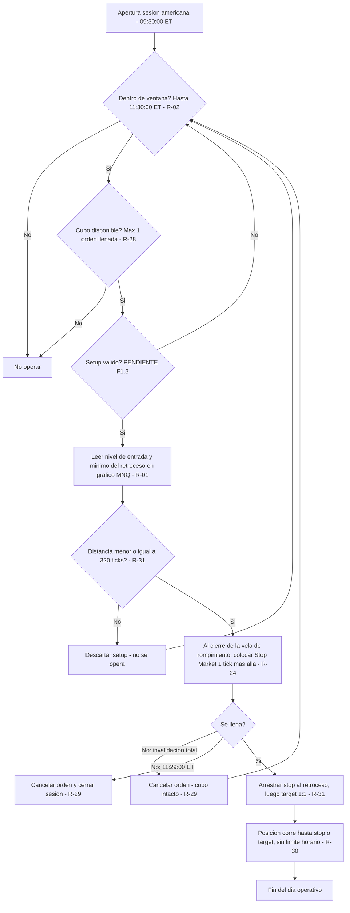
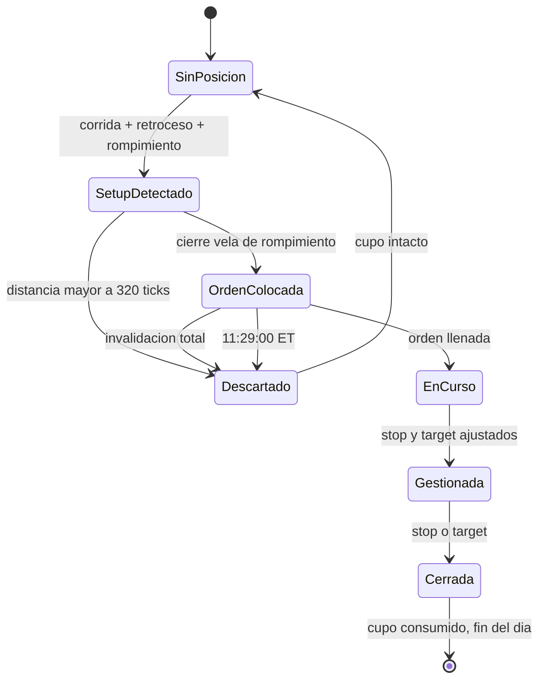

# TRADING PLAN — Estrategia Chaumer (MNQ · NinjaTrader 8)

**Versión:** 3.13 — 🏁 fase 1 cerrada · 🔴 **TEST CIEGO EN MARCHA** · 40 reglas
**Última actualización:** 2026-09-23
**Operador:** Christian
**Metodología base:** Alfredo Chaumer (*trader_sociologist*)
**Uso:** personal

---

## Estado de construcción

| Sub-fase | Contenido | Estado |
|---|---|---|
| **F1.0** | Perímetro y contexto operativo | ✅ **Cerrada** — `R-01` a `R-04` confirmadas |
| **F1.1** | Glosario y definiciones operativas | ✅ **CERRADA** — 24 términos definidos · 8 descartados · 4 movidos a contextualización |
| **F1.2** | Lectura de contexto y sesgo direccional | ✅ **CERRADA SIN REGLAS** — ver nota |
| **F1.3** | Identificación del setup | ✅ **CERRADA** — `R-25` Continuación *(antes IRI)* y `R-26` Reingreso confirmadas |
| **F1.4** | Gatillo de entrada | ✅ **CERRADA SIN REGLAS NUEVAS** — ya cubierta por `R-24`, `R-20`, `R-25`, `R-26`, `R-29` |
| **F1.5** | Stop loss y objetivos | ✅ **CERRADA** — `R-32` + `R-31` corregida + `PARAMETROS.md` |
| **F1.12** | Estructura y marcado | ✅ **CERRADA** — el bloque de zonas (`R-09` a `R-22`) · `R-29`, `R-20`, `R-21`, `R-12`, `R-13`, `R-26`, `R-32` corregidas |
| **F1.6** | Gestión de la posición | ✅ **CERRADA** — `R-33`: no se gestiona, nunca |
| **F1.7** | Riesgo y tamaño de posición | 🟠 **CERRADA CON HUECO DECLARADO** — `R-04` · sin regla de parada (`P-21`) |
| **F1.8** | Filtros y prohibiciones | ✅ **CERRADA** — `R-36` FOMC · `R-37` estado del operador |
| **F1.9** | Proceso operativo diario | ✅ **CERRADA** — `R-38` + `CHECKLIST_DIARIA.md` |
| **F1.10** | Galería de casos | ✅ **CERRADA** — 21 casos, incluidos descartes, días sin operar, órdenes canceladas y 11 sesiones completas al tick |
| **F1.11** | Test de operabilidad | 🚨 **NO EJECUTADA — HUECO DECLARADO.** La fase se cierra sin el test ciego, por decisión del operador. Ver `CIERRE_FASE_1.md` y `P-29` |

**Archivos del plan:**

- `CLAUDE.md` (raíz) — **instrucciones para Claude Code en la fase 2**
- `01_Plan\CIERRE_FASE_1.md` — **acta de cierre de la fase 1: qué está probado y qué no**
- `01_Plan\EQUIVALENCIA_NUMERACION.md` — **traducción entre la numeración vieja y la nueva**
- `04_Web\BRIEF_PORTAL.md` — qué tiene que resolver el portal y qué no puede hacer
- `01_Plan\ESTADO.md` — **índice compacto. Punto de arranque de cada sesión**
- `01_Plan\PARAMETROS.md` — **los números que pueden cambiar, en un solo sitio**
- `01_Plan\CHECKLIST_DIARIA.md` — **la secuencia del día, para ejecutar sin decidir**
- `01_Plan\GALERIA.md` — casos reales etiquetados · imágenes en `02_Assets\galeria\`
- `01_Plan\TRADING_PLAN_CHAUMER.md` — este documento
- `01_Plan\reglas.json` — espejo estructurado de las reglas
- `01_Plan\GLOSARIO.md` — términos con definición medible
- `01_Plan\PENDIENTES.md` — reglas sin cerrar y decisiones aplazadas
- `01_Plan\CONTEXTUALIZACION.md` — **elementos que NO son reglas** y no deben serlo
- `01_Plan\subfases\F1.0_Perimetro.md` — bloque completo de F1.0 con notas de auditoría
- `01_Plan\subfases\F1.1_Glosario.md` — bloque de F1.1
- `03_Materia_Prima\registro_sobreextension.csv` — trabajo de campo abierto para cerrar `P-11`

---

## 🔢 Índice de las 40 reglas, por categoría

*El documento va en este mismo orden: las siete categorías, y dentro de cada una las reglas por número.*

| # | Regla | Categoría |
|---|---|---|
| `R-01` | Analiza, marca zonas y ejecuta TODO sobre MNQ | Perímetro operativo |
| `R-02` | Opera unicamente durante los 120 minutos siguientes a la apertura de la sesion | Perímetro operativo |
| `R-03` | Opera con un grafico limpio: velas de 1 minuto y volumen, nada mas | Perímetro operativo |
| `R-04` | Opera siempre 1 contrato MNQ | Perímetro operativo |
| `R-05` | Una corrida (= impulso) es la secuencia de velas que arranca cuando una vela s | Estructura del precio |
| `R-06` | El retroceso es la secuencia de velas que arranca en la vela que mata la corri | Estructura del precio |
| `R-07` | La vela de las 08:31 declara la direccion inicial de la sesion con su propio c | Estructura del precio |
| `R-08` | Vela con maximo mayor y minimo menor sin corrida viva: pasa a ser la nueva vel | Estructura del precio |
| `R-09` | Marca la zona sobre la vela designada, desde el borde de su cuerpo hasta el ex | Zonas · marcado |
| `R-10` | Si el rompimiento fue con mecha y pasan 5 velas sin consecucion, extiende la z | Zonas · marcado |
| `R-11` | Si el rompimiento fue con cuerpo y pasan 5 velas sin consecucion, marca una zo | Zonas · marcado |
| `R-12` | Marca una zona entre dos zonas solo si el movimiento que la genera queda enter | Zonas · marcado |
| `R-13` | Si la zona que ibas a marcar toca una existente, no marques una nueva: estira  | Zonas · marcado |
| `R-14` | El plazo de 5 velas es un TOPE, no una espera obligatoria: si antes el mercado | Zonas · marcado |
| `R-15` | En la ventana de premercado (19:00 hora Colombia del dia anterior hasta la ape | Zonas · marcado |
| `R-16` | La zona de la corrida se marca al aparecer el retroceso; la del retroceso solo | Zonas · marcado |
| `R-17` | Dentro de una banda entre dos zonas se marca como maximo una zona en toda la j | Zonas · marcado |
| `R-18` | Salir de una zona o de una banda es rompimiento mas consecucion, no geometria | Zonas · marcado |
| `R-19` | Seis precisiones de dibujo de zonas | Zonas · marcado |
| `R-20` | Rompimiento es superar el borde de la zona por al menos un tick; consecucion e | Zonas · vigencia |
| `R-21` | Una zona deja de tener efecto cuando ha sido superada en las dos direcciones | Zonas · vigencia |
| `R-22` | La vela que confirma un traspaso no abre a la vez el rompimiento del lado cont | Zonas · vigencia |
| `R-23` | Toma el primer setup valido cuya orden se llene | Setup y entrada |
| `R-24` | Entra siempre con orden stop en reposo colocada al cierre de la vela de rompim | Setup y entrada |
| `R-25` | Setup Continuación: un IRI —corrida, retroceso, zona y rompimiento de esa zona— y su consecución | Setup y entrada |
| `R-26` | Setup Reingreso: tras un rompimiento con consecucion que falla, el precio recu | Setup y entrada |
| `R-27` | La direccion de la vela de las 08:31 marca por donde empieza el dia pero no ob | Setup y entrada |
| `R-40` | Corrida fluida: solo se entra en el rompimiento de la zona de una corrida FLUI | Setup y entrada |
| `R-41` | Punto de referencia: el objetivo de un REINGRESO no puede pasar del nivel de r | Setup y entrada |
| `R-28` | Ejecuta como maximo una operacion por sesion | Riesgo, orden y gestión |
| `R-29` | Manten la orden pendiente hasta que se llene, hasta que se agoten 5 velas sin  | Riesgo, orden y gestión |
| `R-30` | Una operacion abierta se gestiona hasta stop o target, aunque termine la venta | Riesgo, orden y gestión |
| `R-31` | Ejecuta con la ATM K1 al valor de ATM_DEFECTO y ajusta stop y target a mano tr | Riesgo, orden y gestión |
| `R-32` | Ancla la regla en el nivel de entrada, mide el stop hasta su referencia estruc | Riesgo, orden y gestión |
| `R-33` | Una vez ajustados stop y target, NO se gestiona la posicion | Riesgo, orden y gestión |
| `R-34` | Al llenarse la orden termina el ANALISIS del dia, no solo la operativa | Riesgo, orden y gestión |
| `R-35` | No operes en la ventana de +/-5 minutos alrededor de una noticia roja de Forex | Filtros de no-operar |
| `R-36` | En dia de FOMC no se opera Continuación | Filtros de no-operar |
| `R-37` | No se opera estando enfermo o sin encontrarse bien mentalmente | Filtros de no-operar |
| `R-38` | Ejecuta la sesion siguiendo la checklist diaria en orden, y registra TODAS las | Proceso diario |

*Numeración anterior al 06/09/2026: ver `EQUIVALENCIA_NUMERACION.md`.*

---

## 🚨 ADVERTENCIA DE USO — LEER ANTES DE CONSTRUIR NADA SOBRE ESTE PLAN

**Las 12 sub-fases están cerradas: 40 reglas** *(`R-40` y `R-41` salieron del test ciego, los días 10 y 11 de septiembre de 2026)*. El plan está **completo en reglas y contrastado contra 11 sesiones reales al tick**, corregido vela a vela por el operador.

**Pero NO está probado.** El test ciego de `F1.11` —el único que demuestra que un tercero con este documento en la mano llega a las mismas decisiones que el operador— **no se ha ejecutado**. La fase 1 se cierra sin él, por decisión explícita del operador el 01/09/2026.

Lo que eso significa, dicho sin adornos:

| | |
|---|---|
| ✅ **Sí está demostrado** | que las reglas escritas reproducen el marcado del operador en 11 sesiones, y que el motor de auditoría llega a sus mismas entradas, stops y objetivos |
| ❌ **NO está demostrado** | que otra persona, leyendo solo este documento, llegue a lo mismo. Eso es exactamente lo que mide el test ciego |
| ❌ **NO está escrito** | la regla de parada — cuándo se deja de operar en la semana o el mes (`P-21`) |
| ❌ **NO está en el plan** | la capa de contextualización, que es la que decide varios de los días de "hoy no opero" (ver `CONTEXTUALIZACION.md`) |

> 🔴 **Cualquier producto construido sobre este plan —portal web incluido— debe mostrar estos cuatro puntos, no esconderlos.** Un plan mecánico sin test ciego es un plan escrito, no un plan probado.

Detalle completo del cierre y de lo que quedó fuera: **`CIERRE_FASE_1.md`**.

---

---

# 📕 LAS 40 REGLAS, POR CATEGORÍA

*Reorganizado el 06/09/2026. Antes este documento seguía el orden en que se construyó el plan (las sub-fases `F1.x`); ahora sigue el orden de las siete categorías, que es el orden en que las reglas se usan durante el día. **Las notas de construcción, los diagramas y las correcciones del auditor no se perdieron: están íntegras en los anexos, al final.***

---

# 1 · PERÍMETRO OPERATIVO

*qué, cuándo y con qué · 4 reglas*
## R-01 · Instrumento, gráfico y timeframe

- **Categoría:** perímetro operativo
- **Enunciado:** Analiza, marca zonas y ejecuta **todo sobre MNQ**. Un solo gráfico.
- **Condición medible:** **MNQ** ($2,00/pt · tick 0,25 pts = $0,50). Timeframe único: **velas japonesas de 1 minuto**.
- **Cómo se verifica en NT8:** **un** gráfico de 1 min de MNQ. Sobre él se marcan las zonas, se lee el volumen, se leen los niveles de trigger, stop y target, y se envía la orden.
- **Acción:** leer el máximo (long) o mínimo (short) real de la vela en MNQ y aplicarle el desplazamiento de 1 tick.

> 🔧 **Simplificada el 06/09/2026.** Antes el plan analizaba y leía volumen en **NQ** y ejecutaba en **MNQ**, con dos gráficos y un desfase de hasta 3 ticks entre ambos. El operador decidió operarlo todo en MNQ: **el NQ sale del plan y ese desfase deja de existir.** El backtesting histórico se hizo con datos de NQ y **no se rehace** — las reglas son las mismas.
- **Excepciones:** ninguna
- **Estado:** ✅ Confirmada

## R-02 · Ventana operativa

- **Categoría:** contexto
- **Enunciado:** Opera únicamente durante los 120 minutos siguientes a la apertura de la sesión americana.
- **Condición medible:** Inicio **09:30:00 ET** · Fin **11:30:00 ET**. Fuera de esa ventana no se coloca ninguna orden.
- **Cómo se verifica en NT8:** el gráfico está en **hora Colombia (UTC−5 fijo)**. Ventana en pantalla: **08:30–10:30** en horario de verano NY · **09:30–11:30** en horario de invierno NY. **Próximo cambio: 1 de noviembre de 2026.** El ancla es la apertura americana, nunca el reloj.
- **Acción:** no colocar órdenes fuera de la ventana.
- **Excepciones:** ninguna
- **Estado:** ✅ Confirmada

## R-03 · Plantilla de gráfico

- **Categoría:** contexto
- **Enunciado:** Opera con un gráfico limpio: velas de 1 minuto y volumen, nada más.
- **Condición medible:** único indicador: **Volume Up Down** (NT8) sobre el gráfico de **MNQ**. Sin medias, osciladores, VWAP ni perfil de volumen. El umbral de premercado se lee sobre esa barra en la vela de 1 min de MNQ.
- **Acción:** ninguna herramienta adicional sin revisar este plan.
- **Excepciones:** ninguna
- **Estado:** ✅ Confirmada

---

## R-04 · Tamaño de posición

- **Categoría:** riesgo
- **Enunciado:** Opera siempre **1 contrato MNQ**. El tamaño no cambia por capital, racha ni convicción.
- **Condición medible:** `CONTRATOS` = **1**. No sube aunque la cuenta crezca; no baja aunque la cuenta caiga.
- **Revisión:** **anual**. Es el único momento en que se evalúa cambiar el número de contratos.
- **Estado:** ✅ Confirmada 24/08/2026

# 2 · ESTRUCTURA DEL PRECIO

*el vocabulario · 4 reglas*
## R-05 · Corrida (= impulso)

- **Categoría:** contexto · glosario
- **Enunciado:** Una corrida es la secuencia de velas que arranca cuando una vela supera el extremo de la anterior y termina en la primera vela que retrocede al menos 1 tick contra ella.
- **Condición medible — ALCISTA:**
  - **Nace:** `máximo[n] > máximo[n−1]`. La forman la vela `n−1` (**origen**) y la vela `n`.
  - **Tamaño mínimo:** **2 velas**. **Tamaño máximo:** **ninguno** — la sobreextensión no es un parámetro operativo (`CONTEXTUALIZACION.md`, `C-01`).
  - **Vive mientras:** `mínimo[n] ≥ mínimo[n−1]`. El **color de la vela es irrelevante**.
  - **No se exige** que cada vela haga máximos más altos. Una **vela interior no corta**.
  - **Empate:** `mínimo[n] = mínimo[n−1]` → **no corta**.
  - **Muere:** `mínimo[n] ≤ mínimo[n−1] − 0,25 pts (1 tick)`. Esa vela es ya **la primera del retroceso**.
- **Condición medible — BAJISTA (espejo):** nace con `mínimo[n] < mínimo[n−1]` · vive mientras `máximo[n] ≤ máximo[n−1]` · muere con `máximo[n] ≥ máximo[n−1] + 0,25 pts`.
- **Cómo se verifica en NT8:** a ojo sobre el gráfico de 1 min de MNQ, comparando extremos de velas consecutivas. Sin indicadores.
- **Excepciones:** ninguna
- **Terminología:** "corrida" e "impulso" son sinónimos. **El plan usa solo "corrida"**.
- **Diagrama:** `../02_Assets/diagramas/R-05_corrida.png`
- **Estado:** ✅ Confirmada

> **Nace mirando máximos, muere mirando mínimos.** Dos criterios distintos, intencionadamente.

### Casos frontera resueltos

| Caso | Resolución |
|---|---|
| Vela roja dentro de corrida alcista | **No corta** — el color es irrelevante |
| Vela interior (máximo más bajo + mínimo más alto) | **No corta** — todavía no hay retroceso |
| Mínimos exactamente idénticos | **No corta** — hace falta ≥1 tick por debajo |

## R-06 · Retroceso

- **Categoría:** contexto · glosario
- **Enunciado:** El retroceso es la secuencia de velas que arranca en la vela que mata la corrida y termina cuando nace la siguiente corrida.
- **Condición medible — tras corrida ALCISTA:**
  - **Empieza:** primera vela con `mínimo[n] ≤ mínimo[n−1] − 0,25 pts`. **Termina:** primera vela con `máximo[n] > máximo[n−1]`.
  - **🎯 "El mínimo del retroceso" = el mínimo MÁS BAJO de todas las velas del retroceso.** No el de la primera, no el de la última.
  - **Nº de velas:** irrelevante. **Tamaño mínimo:** ninguno ⚠️ `P-12`. **Tamaño máximo:** `≤ 320 ticks` (`R-31`).
  - **Color irrelevante:** una vela verde dentro del retroceso no lo termina si no hace máximo más alto.
- **Condición medible — tras corrida BAJISTA (espejo):** empieza con `máximo[n] ≥ máximo[n−1] + 0,25 pts` · termina con `mínimo[n] < mínimo[n−1]` · nivel de referencia = **máximo más alto**.
- **Usado por:** `R-29` (invalidación total) · `R-31` (nivel del stop y filtro de 320 ticks)
- **Excepciones:** ninguna
- **Diagrama:** `../02_Assets/diagramas/R-06_retroceso.png`
- **Estado:** ✅ Confirmada

> **El suelo de $40 de la guía v4 desaparece.** Solo sobrevive el techo. Coste cuantificado en `P-12`: con R:R 1:1, un retroceso de 5 pts exige **57,5 %** de aciertos para no perder; uno de 60 pts, **50,6 %**.

---

### 🛑 Filtro subjetivo vivo (R-05)

El filtro de la guía v4 *"más de 5 velas → sobreextendido"* queda **eliminado**. El tope provisional de 10 velas **no filtra nada** (la corrida más larga observada es de 8). Hoy la sobreextensión se decide **a ojo**. Es el **único juicio subjetivo que queda dentro del plan** → `P-11`, en medición.

---

## R-07 · Vela base de la ventana operativa — **reescrita 26/08/2026**

- **Categoría:** estructura · precede a `R-05`
- **Enunciado:** La primera vela de la ventana operativa (**08:31** hora Colombia) **declara la dirección inicial de la sesión con su propio cuerpo**. Cierre por encima de su apertura → el mercado **inicia alcista**. Cierre por debajo → **inicia bajista**.
- **Condición medible:**
  - La vela de las **08:30 y anteriores son premercado**. **No sirven como `n−1`** para `R-05` ni para `R-06`, ni para nada.
  - **La dirección NO la declara la 08:32.** La declara la propia **08:31** por la posición de su cierre respecto de su apertura.
  - **Es la vela origen.** La corrida se mide desde su **mínimo** si es alcista, desde su **máximo** si es bajista.
  - Desde la **08:32** en adelante manda `R-05` con normalidad, comparando **siempre contra la vela inmediatamente anterior**.
  - **Puede sostener zona** como cualquier otra vela.
- **Casos reales:** 06/07, 07/07 y 10/07 de 2026 — las tres sesiones abren con la 08:31 alcista, y las zonas ya validadas por el operador salen idénticas con esta redacción.
- **⏳ `P-23`:** no está cubierto el caso de que la 08:31 cierre **exactamente** en su apertura.
- **Excepciones:** ninguna
- **Estado:** ✅ Confirmada 2026-08-26 *(v1.13 la hacía depender de la 08:32; corregida por el operador el mismo día)*

> ⚠️ **Consecuencia sobre `R-08`.** `R-08` se escribió para *"cuando no hay corrida viva"*. Con `R-07` así, en la apertura **siempre hay corrida viva desde la 08:31**, y a partir de ahí el mercado está siempre o en corrida o en retroceso. **El supuesto de `R-08` puede no ocurrir nunca** → `P-24`, pendiente de resolver con el operador antes de tocar `R-08`.

## R-08 · Vela envolvente sin corrida viva

- **Categoría:** estructura · complementa `R-05`
- **Enunciado:** Una **vela envolvente** es la que hace **máximo mayor Y mínimo menor** que la anterior. Cuando aparece **sin corrida viva**, no declara dirección: pasa a ser la nueva vela origen y la dirección la da la vela siguiente.
- **Condición medible:**
  - Sin corrida viva, si `máximo[n] > máximo[n−1]` **y** `mínimo[n] < mínimo[n−1]` → la vela `n` es el **nuevo origen**. Se evalúa `n+1` contra `n`.
  - Si `n+1` **también** es envolvente, se repite: `n+1` pasa a origen y decide `n+2`. Sin límite de repeticiones.
  - La corrida se mide desde el extremo de la **última** vela origen.
- **NO aplica con corrida viva.** Ahí manda `R-05`: mínimo menor **mata** la corrida, sea envolvente o no. Caso real: la vela 8:36 del 10/07/2026 era envolvente y no generó ninguna duda.
- **Frecuencia medida** (39 sesiones, ventana operativa): **763 velas envolventes**, de las cuales **384 caen dentro de corrida viva** (`R-05` ya resuelve) y **379 caen donde nacería la corrida** — ~10 por sesión. Son estas últimas las que `R-08` resuelve.
- **Excepciones:** ninguna
- **Estado:** ✅ Confirmada 2026-08-26

# 3 · ZONAS

*todo lo que tiene que ver con una zona · 14 reglas*

---

## 🔑 CÓMO SE MARCA UNA JORNADA — la secuencia, de principio a fin

> 📌 **Escrito el 08/09/2026, dictado por el operador.** No es una regla nueva: es la **secuencia** que forman `R-16`, `R-12`, `R-17` y `R-18` cuando se leen juntas y en orden. Estaban las cuatro escritas por separado, y **en ningún sitio estaba dicho el recorrido completo**. Ése fue el hueco: el auditor se perdió intentando reconstruirlo, y el motor de auditoría puede estar marcando de más.

**1 · La jornada abre con dos zonas, y ésas son la banda.**
La primera corrida deja su zona. El retroceso que la mata deja la otra. Entre las dos queda **la banda del día**.

**2 · Dentro de esa banda se marca UNA zona como máximo, en toda la jornada.**
La del **primer retroceso** que aparezca dentro, y **solo si su movimiento no cruza la mitad** de la banda *(`R-12`)*. Si la cruza, **no se marca ninguna** — y la banda queda cerrada igual, para el resto del día *(`R-17`)*.

**3 · Después de eso, dentro de esa banda no se dibuja NADA más.**
Ni aunque aparezcan corridas nuevas, ni aunque sus zonas candidatas toquen a las de los bordes. **Una zona viva ocupa su franja de precio**, y mientras esté ahí no nace nada por debajo ni por encima de ella dentro de la banda.

**4 · La ÚNICA forma de que aparezca una zona nueva es superar un extremo.**
Que el precio **traspase** la resistencia de arriba o el soporte de abajo — **rompimiento + consecución**, no basta con asomarse *(`R-18`)*. Ahí se abre terreno nuevo.

**5 · Y ese traspaso forma una banda nueva, con su propio turno.**
La zona nueva de fuera y la que se acaba de superar forman **otra banda**, y esa banda **estrena su propia regla de una-sola-zona**, también para el resto del día.

> 🔴 **Lo que esto NO es.** Esto no habla del **estiramiento** ni de la **zona apéndice**. Esos dos son otra cosa: nacen de un **rompimiento sin consecución** cuando el plazo se resuelve — con mecha la zona se estira *(`R-10`)*, con cuerpo nace la apéndice *(`R-11`)*. No se confundan con el marcado de una corrida nueva.

> 💡 **Por qué el gráfico no se llena de rectángulos.** No es por un tope de zonas ni por un criterio de limpieza: es porque **el precio tiene que ganarse el terreno**. Mientras siga dentro de la misma banda, el marcado está cerrado.

---

**── MARCADO — dónde se dibuja una zona ──**
## R-09 a R-11 · El bloque de zonas

*Contenido medible completo en `GLOSARIO.md` y `subfases\F1.1_Glosario.md`.*

> ### 🔑 REGLA ÚNICA DE MARCADO
> **Una zona es siempre la mecha de una vela: desde el borde del cuerpo hasta el extremo de la mecha.**
> Lo único que cambia es **qué vela se designa** y **qué mecha**.

| Regla | Qué fija | Estado |
|---|---|---|
| **R-09 · Zona** | Vela designada = la de máximo más alto (o mínimo más bajo) de la corrida. Se marca **al aparecer el retroceso**. Color irrelevante. Sin mecha → línea. Se extiende a la derecha | ✅ |
| **R-20 · Rompimiento y consecución** | Rompimiento = **≥1 tick** más allá del borde, cierre irrelevante — **la mecha basta**. **Con cuerpo** = el cierre queda fuera; **con mecha** = no. Consecución = **≥1 tick** más allá del extremo de la vela de rompimiento. 🔴 **El plazo de 5 velas gobierna SOLO la geometría de la zona** (`R-10`/`R-11`) **y la vida de la orden** (`R-29`). **El traspaso de la zona NO tiene plazo:** el rompimiento queda pendiente indefinidamente y, cuando llegue la consecución —aunque sea 25 velas después— la zona queda traspasada en ese sentido. Las dos cosas ocurren sobre el **mismo** rompimiento: primero nace la apéndice o se estira, y más tarde el traspaso se confirma igual *(27/08/2026)* | ✅ |
| **R-21 · Vigencia** | **Dos estados, sin grises.** **Activa** = cuenta para la operativa. **Inactiva** = traspasada en ambas direcciones **con su consecución cada una**: 🔴 **no cuenta para nada COMO ZONA** — ni bloquea el target, ni sirve para entrar, ni cuenta para medir el 50 %. 🔵 **Pero sigue ocupando su sitio:** la banda que ya gastó su zona no se reabre porque la zona muera *(`R-17` punto 8, 18/09/2026)*. **Deja de valer como zona; no deja de ocupar el sitio.** Se conserva en tono tenue. **Las zonas no envejecen** (`D-07`) | ✅ |
| **R-10 · Extensión** | Rompimiento **con mecha** —el cierre se queda dentro— sin consecución, y se acaba con **lo que llegue primero**: cinco velas, o una **estructura completa al contrario**. La zona original **crece** hasta la punta de esa mecha: resistencia solo por arriba, soporte solo por abajo. Queda **una** zona | ✅ |
| **R-11 · Zona apéndice** | Rompimiento **con cuerpo** —el cierre queda fuera— sin consecución, y se acaba con **lo que llegue primero**: cinco velas, o una **estructura completa al contrario**. Nace una **zona nueva** del **borde del cuerpo** a la **punta de la mecha** de la vela de rompimiento. La original no se toca. Quedan **dos** zonas | ✅ |
| **R-15 · Zona de premercado** | Única zona que nace **del volumen**, sin corrida ni retroceso. Ventana: **19:00 Col del día anterior** (apertura de Tokio) → **apertura americana**. Umbral **MNQ > 6.000** *(único desde el 06/09/2026; equivalencia con el antiguo NQ > 2.000 sin verificar — `P-32`)*; se marcan **todas** las velas que lo superen. Vela **alcista → resistencia**, **bajista → soporte**. **La regla se apaga al abrir el mercado americano.** Después se comporta como cualquier zona — y eso incluye **hacer de borde de banda** para `R-17` *(confirmado 01/09/2026)* | ✅ |
| **R-14 · Nueva estructura** | El plazo de 5 velas es un **tope, no una espera**. Si antes se arma una **estructura completa al contrario**, se marca zona ya. Si no, a las 5 velas → `R-10` o `R-11`. **Definición medible de las tres velas en su sección propia, más abajo** | ✅ |
| **R-13 · Superposición** | Si la zona candidata **toca** una existente **del mismo tipo** —el contacto de bordes cuenta— **no se crea zona nueva: se estira la existente**. 🔴 **Se estira SOLO hacia el nuevo extremo; el otro borde no se mueve** — no se engloba *(26/08/2026)*. Queda **una** zona, con su historial intacto. 🔴 **No se solapan zonas de tipo distinto** mientras una esté vigente: una zona viva **ocupa** su franja de precio *(26/08/2026)* | ✅ |
| **R-12 · Zonas entre zonas** | 🔴 **UNA SOLA zona por banda y por jornada, y es la del PRIMER RETROCESO** *(Alfredo, 27/08/2026 — ver `R-17`)*. Con una zona arriba y otra abajo, se marca una intermedia **solo si el MOVIMIENTO que la genera no cruza el 50 %** — *quedar exactamente EN el 50 % sí marca; hace falta superarlo por **≥1 tick** para anularla (confirmado 26/08/2026)* — se mira el recorrido del precio, **no el rectángulo**. El 50 % va entre **bordes internos**, recalculado contra las vecinas. Sin límite de cantidad. Es una **prohibición con excepción rara** | ✅ |

> **La consecución al alza ES la entrada de `R-24`.** El mismo motor sirve para matar una zona y para entrar al mercado.

**Diagramas:** `../02_Assets/diagramas/R-09_zona.png` · `R-20_vigencia.png` · `R-10_extension_apendice.png`

---

---

### 📝 R-10 · Estirar la zona · rompimiento con mecha sin consecución — **reescrita 14/09/2026**

El precio rompe una zona **con mecha** —el cierre se queda dentro— y la consecución no llega. Eso se puede acabar de dos maneras, y vale **la que llegue primero**:

**Una ·** pasan **cinco velas** desde la siguiente a la del rompimiento, y la consecución no ha llegado.

**Otra ·** antes de esas cinco velas, el mercado arma una **estructura completa en sentido contrario**: una vela que no da la consecución y se va en contra, otra que hace retroceso, y una tercera que no sigue ese retroceso y vuelve en el sentido de la primera. **La zona se estira en esa tercera vela**, sin esperar más.

En cualquiera de los dos casos, la zona se extiende hasta la punta de la mecha que la rompió. **Si es una resistencia se estira solo por arriba; si es un soporte, solo por abajo.** El otro borde no se mueve. Sigue habiendo **una sola zona**, más grande, y conserva su historial.

> 🔴 **Un soporte nunca se estira hacia arriba, ni una resistencia hacia abajo.** Si el precio cruza la zona por el lado contrario, **no hay nada que estirar**: ese cruce no la toca, solo la mata cuando llegue su consecución.

**Qué cambió y por qué.** El enunciado viejo decía *"extiende la zona hasta la punta de esa mecha · el borde opuesto no se mueve"*, sin decir **cuál** borde se mueve. El motor lo resolvía por el lado del rompimiento, y eso estiraba un soporte **hacia arriba** cuando el precio volvía a cruzarlo.

**Caso de origen, 14/09/2026.** El soporte de la vela de 9:10 (29.062,00 – 29.064,75) queda traspasado hacia abajo a las 9:18. A las 10:07 el precio vuelve y lo cruza hacia arriba sin consecución, y el enunciado viejo lo estiraba hasta 29.079,75 — metiéndolo dentro de la resistencia viva de 9:09 (29.071,00 – 29.088,50) y dejando las dos zonas **pisándose** entre 29.071,00 y 29.079,75, contra la prohibición de solapar zonas de tipo distinto.

> 🖼️ **Las gráficas del portal ya estaban bien.** `05-sin-confirmar.png` muestra un soporte creciendo hacia abajo y `24-estructura-antes.png` una resistencia creciendo hacia arriba, de 29.082,00 a 29.096,00. Lo que fallaba era la frase, no el dibujo.

> ✅ **Regresión:** no cambia julio (−77,75 pts en 5 operaciones) ni ninguna de las tres jornadas de septiembre.

**Texto redactado por el operador · Estado:** ✅ confirmada 24/08/2026 · precisada 07/09/2026 (el final llega con lo que ocurra primero) · **reescrita 14/09/2026 (qué borde se mueve)**

### 📝 R-11 · Zona apéndice · rompimiento con cuerpo sin consecución — **reescrita 15/09/2026**

El precio rompe una zona **con cuerpo** —el cierre queda fuera— y la consecución no llega. Eso se puede acabar de dos maneras, y vale **la que llegue primero**:

**Una ·** pasan **cinco velas** desde la siguiente a la del rompimiento, y la consecución no ha llegado.

**Otra ·** antes de esas cinco velas, el mercado arma una **estructura completa en sentido contrario**: una vela que no da la consecución y se va en contra, otra que hace retroceso, y una tercera que no sigue ese retroceso y vuelve en el sentido de la primera. **La apéndice nace en esa tercera vela**, sin esperar más.

En cualquiera de los dos casos **la zona original no se toca** y nace una **segunda zona** sobre la mecha de la vela de rompimiento: un borde es el **borde del cuerpo** de esa vela, el otro es la **punta de su mecha**. Quedan **dos zonas**, la original y su apéndice.

La apéndice se dibuja **desde la vela de rompimiento**, su vela origen, aunque no quede marcada hasta ese momento. Es del **mismo gris** que cualquier otra zona.

> 🔑 **La apéndice no nace por acción del precio sobre ella** — es el rastro de un rompimiento que se quedó sin terminar.

**Es la misma regla que `R-10`, con un solo cambio.** Las dos arrancan igual —rompimiento sin consecución— y las dos se acaban con los mismos dos finales. Lo único que las separa es **dónde cierra la vela de rompimiento**: si el cierre se queda dentro, la zona **se estira** y sigue siendo una; si el cierre queda fuera, la original queda intacta y **nace la apéndice**. Por eso el texto es calcado.

**Qué cambió y por qué.** El enunciado viejo decía *"si el plazo se resuelve sin consecución"* — la misma frase que se había sacado de `R-10` el día anterior por no decir **qué es el plazo**. Ahora los dos finales están escritos completos, uno debajo del otro, igual que en la otra regla. **Palabras del operador:** *"la zona apéndice es básicamente igual que lo que pasa con una zona que se estira cuando hay rompimiento sin consecución. La diferencia es que en este caso el rompimiento no es con mecha, sino con cuerpo por fuera. Los casos son los mismos 2"*.

> ✅ **No cambia nada mecánico.** Es redacción: ni el motor ni ninguna jornada del backtesting se mueven. Julio sigue en −77,75 pts en 5 operaciones y las tres jornadas de septiembre siguen igual.

> 📌 **Siguen pendientes las dos reglas de entrada asociadas**, anotadas desde F1.3 y nunca confirmadas: *"la zona apéndice alta solo sirve para largo"* y *"no se puede entrar entre zonas apéndices"*. Hoy **el motor no las aplica**.

**Diagramas:** `../02_Assets/diagramas/apendice_caso1_plazo.png` *(cinco velas)* y `../02_Assets/diagramas/apendice_caso2_estructura.png` *(estructura contraria)*

**Estado:** ✅ confirmada 24/08/2026 · disparador precisado 07/09/2026 · **reescrita 15/09/2026 (fuera la palabra "plazo")**

---

## R-12 · Zonas entre zonas — la regla del 50 %

- **Categoría:** Zonas · marcado
- **Enunciado:** Marca una zona entre dos zonas solo si el movimiento que la genera queda entero dentro de la mitad en la que empezo.
- **Condición medible:**

| Variable | Valor |
|---|---|
| `cuando_aplica` | existe zona por arriba y zona por abajo |
| `referencia_del_50` | punto medio entre borde interno de la zona superior y borde interno de la inferior |
| `que_se_mide` | el recorrido del precio (el movimiento), NO el rectangulo de la zona |
| `criterio` | el movimiento no cruza el 50% en ningun punto |
| `si_el_movimiento_cruza_el_50` | no se marca zona aunque el rectangulo quede entero a un lado |
| `numero_maximo_de_zonas_intermedias` | sin limite |
| `recalculo_del_50` | contra la zona mas cercana por arriba y la mas cercana por abajo en ese momento |
| `frecuencia_real` | baja - el operador: 'pasa poco, pero si pasa' |

- **Acción:** Mirar el recorrido del precio, no la caja. Si el movimiento cruzo el 50%, no marcar.
- **Nota:** Contraejemplo real anotado por el operador en 02_Assets/invalidos/R-12_invalido_01.png. Desviacion D-06: el curso cierra el marcado tras la primera zona; el operador no pone limite.
- **Estado:** ✅ confirmada

> 📌 **Sección creada el 06/09/2026** a partir de `reglas.json`. Hasta hoy esta regla vivía **solo como una fila de tabla** — exactamente el hueco que permitió que en septiembre se escribiera una regla duplicada sin que nadie la viera.

---
## R-13 · Superposición de zonas — se estira, no se duplica

- **Categoría:** Zonas · marcado
- **Enunciado:** Si la zona que ibas a marcar toca una existente, no marques una nueva: estira la existente.
- **Condición medible:**

| Variable | Valor |
|---|---|
| `disparador` | la zona candidata toca en cualquier punto una zona ya marcada; el contacto de bordes cuenta |
| `crear_zona_nueva` | prohibido |
| `accion` | extender la zona existente hasta el extremo mas lejano de la candidata |
| `numero_de_zonas_resultante` | 1 |
| `historial_de_vigencia` | la zona extendida conserva su historial de rompimientos y consecuciones (R-21) |
| `candidata_dentro_de_la_existente` | sin cambios; no hay nada que extender |
| `estirar_hacia_el_extremo` | se estira SOLO hacia el nuevo extremo; el otro borde no se mueve. No se engloba |
| `no_solapar_tipos_distintos` | no se solapan zonas de tipo distinto mientras una este vigente: una zona viva ocupa su franja de precio |

- **Acción:** No crear zona nueva. Estirar la existente hasta englobar la candidata.
- **Nota:** Desviacion D-08: el curso recorta la zona nueva y deja dos zonas; el operador une en una sola.
- **Estado:** ✅ Ampliada 26/08/2026

> 📌 **Sección creada el 06/09/2026** a partir de `reglas.json`. Hasta hoy esta regla vivía **solo como una fila de tabla** — exactamente el hueco que permitió que en septiembre se escribiera una regla duplicada sin que nadie la viera.

---
## R-14 · El plazo de 5 velas es un TOPE, no una espera obligatoria

> 🔧 **Fusionada el 04/09/2026.** Esta regla se confirmó el 24/08/2026 pero vivía solo como una fila en la tabla de `F1.1`. El 01/09 el auditor, sin buscarla, escribió una regla nueva —`R-39`— que decía exactamente lo mismo. **Se eliminó `R-39` y su definición medible vive aquí.** El plan vuelve a **38 reglas**.

- **Categoría:** marcado de zonas — **amplía `R-10` y `R-11`**
- **Enunciado:** Si antes de que se cumpla el plazo el mercado **arma una estructura completa en sentido contrario al rompimiento**, la geometría se resuelve **en ese momento**: no se espera a la quinta vela.
- **Por qué:** el plazo existe para decidir cuándo un rompimiento sin consecución deja de estar en el aire. Si el mercado ya armó estructura al otro lado, eso ya está decidido y no hay nada que esperar.

### Qué cuenta como "estructura completa al contrario" — tres velas

Tomando como ejemplo un **soporte roto hacia abajo** (al revés para una resistencia rota hacia arriba):

| Vela | Qué tiene que hacer | Condición medible |
|---|---|---|
| **1ª** | **no da la consecución y sube** | su mínimo **no pasa** del extremo de la vela de rompimiento |
| **2ª** | **hace retroceso** | su mínimo es **MENOR** que el de la vela anterior **y NO pasa** del extremo de la vela de rompimiento |
| **3ª** | **no sigue bajando: vuelve a subir** | aquí queda armada la estructura → **aquí se marca la zona** |

> 🔴 **La condición de la segunda vela es la que hace mecánica la regla.** Si su mínimo pasara del extremo de la vela de rompimiento, eso **ya no es un retroceso: es la consecución**, y entonces no hay apéndice ni estiramiento — la zona queda traspasada.

### Qué se marca

Exactamente lo mismo que al vencer el plazo — **solo cambia el momento**:

| Rompimiento | Resultado |
|---|---|
| con **mecha** | la zona original **se estira** hasta esa mecha *(`R-10`)* |
| con **cuerpo** | nace la **zona apéndice**, del cuerpo de la vela de rompimiento hasta el final de su mecha *(`R-11`)* |

> ✅ **Confirmado el 07/09/2026: aplica igual a los dos caminos, sin excepción.** Hasta ese día la regla se había precisado solo sobre el caso de la **zona apéndice**, y que valiera también para el **estiramiento** estaba escrito **por simetría** — una extrapolación del auditor, anotada como `P-30` para no darla por buena sin preguntar. El operador lo confirmó con estas palabras: *"Si aplica igual"*. **`P-30` queda cerrado.**
>
> No es un detalle de forma: cambia **cuándo** nace el borde nuevo, y de ahí cuelga dónde va el stop.

- **Dibujo:** la apéndice es **del mismo gris que cualquier otra zona** y se dibuja **desde la vela de rompimiento**, que es su vela origen — aunque **no esté marcada** hasta el momento en que la estructura queda armada *(`R-19`, precisión 3)*.
- **Simetría:** aplica igual hacia arriba. Resistencia rota **con cuerpo hacia arriba** + estructura **bajista** completa antes del plazo → la apéndice nace ahí mismo *(confirmado 01/09/2026)*.
- **Caso real 20/07/2026 — el contraejemplo que la delimita:** la vela 8:40 rompe el soporte de la 8:37 con cuerpo. Después el precio sube **cuatro velas seguidas** (8:42, 8:43, 8:44, 8:45) **sin hacer retroceso en el medio**, así que **nunca llega a armar la estructura contraria**. La apéndice nace por plazo vencido, en la **8:45**. Subir no basta: hace falta la estructura completa.
- **Diagramas:** `../02_Assets/diagramas/apendice_caso1_plazo.png` y `../02_Assets/diagramas/apendice_caso2_estructura.png` *(rompimiento con cuerpo)* · `../04_Web/public/conceptos/24-estructura-antes.png` *(rompimiento con mecha — el caso del estiramiento)*
- **Consecuencia abierta:** el motor de auditoría todavía resuelve el plazo **solo por vencimiento** y no detecta la estructura contraria — ahora en **los dos caminos**. Ver `P-31`.
- **Estado:** ✅ Confirmada 24/08/2026 · definición medible añadida y fusión el 01–04/09/2026 · **alcance confirmado a los dos caminos el 07/09/2026**

---

## R-15 · Zona de premercado — la única que nace del volumen

- **Categoría:** Zonas · marcado
- **Enunciado:** En la ventana de premercado (19:00 hora Colombia del dia anterior hasta la apertura americana), marca zona sobre TODA vela cuyo volumen supere el umbral. Fuera de esa ventana la regla no aplica.
- **Condición medible:**

| Variable | Valor |
|---|---|
| `ventana_inicio` | ESCANEO desde las 19:00 hora Colombia (09:00 JST, apertura de Tokio). Fijo todo el ano. NO confundir con el sombreado gris del indicador Premercado.1, que empieza a las 15:00 Col del dia anterior y es SOLO VISUAL |
| `ventana_fin` | apertura del mercado americano (inicio de R-02): 08:30 Col en verano EEUU, 09:30 Col en invierno EEUU |
| `duracion_ventana` | 13h30 en verano EEUU (~810 velas); 14h30 en invierno EEUU (~870 velas) |
| `umbral_volumen` | **`UMBRAL_VOL`, parámetro AJUSTABLE que vive en `PARAMETROS.md`** — no es un número fijo del método. **Valor actual: > 8.000 contratos en MNQ, desde el 14/09/2026.** Anteriores: > 6.000 en MNQ (06/09 → 14/09/2026) · > 2.000 en NQ (hasta 06/09/2026). Lo fija el operador, sin criterio medible y a propósito (`P-37`). **No se cambia con la sesión empezada.** ATENCIÓN: la equivalencia entre umbrales **no está verificada** con datos, y las 11 sesiones validadas se marcaron con el umbral de NQ sobre datos de NQ — ver `P-32` |
| `indicador` | Volume Up Down (R-03) |
| `cuantas_se_marcan` | TODAS las velas que superen el umbral, sin seleccionar. No se marca solo el extremo del grupo |
| `vela_alcista` | RESISTENCIA sobre la mecha superior |
| `vela_bajista` | SOPORTE sobre la mecha inferior |
| `limites` | del borde del cuerpo al extremo de la mecha, igual que R-09 |
| `comportamiento_posterior` | identico al de cualquier zona: R-21, R-10, R-11, R-12, R-13 y R-14 aplican sin excepcion. Tambien hace de BORDE DE BANDA para R-17 (confirmado 01/09/2026) |
| `sombreado_visual` | el indicador Premercado.1 sombrea de 15:00 Col del dia anterior a 08:30 Col. Es marca visual, NO define donde se buscan zonas |

- **Acción:** Marcar la zona en premercado y tratarla despues como una zona normal.
- **Excepciones:** Tras la apertura del mercado americano la regla del volumen se APAGA: dentro de sesion solo se marcan zonas por estructura (R-09), sin importar el volumen de la vela.
- **Nota:** Unica forma de que nazca una zona sin corrida ni retroceso. A diferencia de R-09, aqui el COLOR de la vela decide si es soporte o resistencia. El corte en la apertura no es arbitrario: ese volumen en 1 minuto es raro en premercado y corriente en sesion. Desviacion D-09: Parametros Chaumer dice 'solo marcamos los extremos'; el operador marca todas, y R-13 fusiona las que se tocan. Verificado con datos el 10/07/2026: escaneando desde 15:00 salen 3 velas sobre umbral; desde 19:00 sale 1, la que el operador marco. Las 2 extra son la subasta de cierre del efectivo del dia anterior. | 06/09/2026: retirado el umbral de NQ; queda solo MNQ > 6000. La equivalencia entre ambos no esta verificada — ver P-32.
- **Estado:** ✅ confirmada · **umbral paramétrico desde el 14/09/2026**

> 🔵 **El umbral dejó de ser un número del método el 14/09/2026.** Decisión del operador, con sus palabras: *"vamos a dejar en reglas que el umbral del volumen del premercado va a ser paramétrico, porque eso depende de la volatilidad del momento"*. El valor vive en `PARAMETROS.md` y la regla cita el nombre, no la cifra.
>
> **Lo que lo motivó**, primera jornada del test ciego (10/09/2026): la vela más fuerte de todo el premercado hizo **7.799** contratos, y todas las que pasaban de 6.000 eran la misma cosa — la reacción al dato de precios al productor de las 7:30. Con el umbral en 6.000 nacían cuatro soportes seguidos, y uno de ellos, el de 29.120,25–29.127,75, **tapaba la resistencia que deja la vela de 8:32** por la prohibición de solapar zonas de tipo distinto (`R-19`, punto 5). Todo el marcado de la mañana se desviaba de ahí. Con el umbral en 8.000 el premercado no deja ninguna zona y el día se lee limpio.
>
> 🔴 **Por qué el umbral no es un ajuste fino, es un interruptor.** En esa misma jornada, 6.000 y 8.000 dan dos días distintos — un corto que pierde 37,50 puntos contra un largo que gana 40,50.
>
> **`P-37`, cerrado el 14/09/2026:** el operador decidió que **no habrá criterio medible** — *"dejemos que quede paramétrico"*. Lo fija él, igual que `R-37` es criterio libre. 🔴 **La condición que lo hace seguro, y ésa sí es medible: el umbral NUNCA se cambia con la sesión empezada**, y cada cambio se anota con su fecha en `PARAMETROS.md`. Sin esa línea, el umbral se podría mover *después* de ver el día, y eso convertiría el backtesting en ajuste a posteriori.

> 📌 **Sección creada el 06/09/2026** a partir de `reglas.json`. Hasta hoy esta regla vivía **solo como una fila de tabla** — exactamente el hueco que permitió que en septiembre se escribiera una regla duplicada sin que nadie la viera.

---
## R-16 · Cuándo se dibuja cada zona

- **Categoría:** zonas · amplía `R-09` y `R-14`
- **Enunciado:** Las dos zonas que genera una estructura **no se dibujan en el mismo momento**. La zona de la corrida se marca al aparecer el retroceso. La zona del retroceso solo se dibuja cuando el retroceso queda **confirmado**; hasta entonces se marca una **línea provisional** de nivel.
- **Condición medible — tras corrida ALCISTA:**

| | Cuándo | Qué se dibuja |
|---|---|---|
| **Zona de la corrida** (RESISTENCIA) | En la **primera vela del retroceso**, en vivo | **Zona** completa y ya definitiva (`R-09`, `R-14`) |
| **Zona del retroceso** (SOPORTE) | Mientras el retroceso sigue vivo | **Línea provisional** en el mínimo más bajo alcanzado hasta ese momento. Se **baja** con cada vela que hunda más el mínimo |
| | Al aparecer una vela con **máximo mayor** → retroceso confirmado | La línea se convierte en **zona** sobre la vela del mínimo más bajo, aplicando `R-09` |

- **Espejo BAJISTA:** la corrida marca SOPORTE en vivo; el retroceso lleva línea provisional en el **máximo más alto** hasta que una vela hace **mínimo menor**.
- **La línea provisional no opera.** No es zona: no admite rompimiento, ni consecución, ni reingreso. Solo señala el nivel.
- **Sigue sujeta a `R-12`.** Al confirmarse, si el movimiento cruzó el 50 % entre bordes internos, la línea **no llega a ser zona** y se borra. Fue exactamente lo que pasó el 10/07/2026.
- **🔑 Consecuencia sobre `R-14`.** Un retroceso nuevo **marca la zona de la corrida** (`R-14`) en su **primera vela, al aparecer**; pero **su propia zona no existe hasta que termina**. ⚠️ **Corregido 27/08/2026:** un retroceso nuevo **NO mata la orden pendiente**. Ver `R-29` reescrita.
- **Caso real:** 6 de julio de 2026 → línea provisional en 29.882,75 (8:36), baja a 29.786,00 (8:37), y en la 8:40 se confirma y se dibuja el soporte **29.786,00 – 29.827,50**.
- **Excepciones:** ninguna
- **Estado:** ✅ Confirmada 2026-08-26

---

## R-17 · Una sola zona entre zonas, por banda y por jornada

- **Categoría:** marcado de zonas — **amplía `R-12`**
- **Enunciado:** Dentro de una banda entre dos zonas se marca **como máximo una** zona en toda la jornada, y el turno es **del primer retroceso** que aparezca dentro.
- **Condición medible:**

| # | Paso |
|---|---|
| 1 | La **banda** va del borde interno de la zona de abajo al borde interno de la de arriba |
| 2 | El **primer retroceso** que aparezca dentro de esa banda la resuelve |
| 3 | Si respeta el 50 % (`R-12`) **se marca**; si no lo respeta **no se marca** |
| 4 | **En los dos casos la banda queda cerrada** para el resto de la jornada operativa |
| 5 | La banda **no se vuelve a abrir** aunque se mueran las zonas que la formaron |
| 6 | Solo se marcan zonas que **salgan fuera** de esa banda — y salir fuera es `R-18`, no geometría |
| 7 | Una **zona de premercado** (`R-15`) cuenta como **borde de banda** igual que cualquier otra *(confirmado 01/09/2026)* |
| 8 | 🔴 **Una zona inválida sigue ocupando su sitio.** El turno se cuenta sobre **todas** las zonas —activas e inválidas— y también sobre las que se marcaron **antes de que la banda existiera**. Deja de valer como zona; **no deja de ocupar el sitio** *(precisado 18/09/2026)* |

- **Fuente:** Alfredo Chaumer, vía el operador, 27/08/2026. El punto 7 lo confirma el operador el 01/09/2026 sobre el 14/07/2026.
- **Caso real 8/07/2026:** banda entre el techo del soporte de la vela 8:36 (29.303,50) y el piso de la resistencia de la vela 8:42 (29.374,25); mitad en 29.338,88. El primer retroceso dentro es el de la vela 8:43, que baja a 29.329,75 → no cumple → no se marca y la banda se cierra. Más tarde, el retroceso de la vela 9:09 **sí** cumpliría el 50 %, pero **ya no se marca**: la banda se gastó a las 8:45.
- **Efecto medido:** en el 8 de julio el día pasa de 13 zonas a 11.
- **Caso real 14/07/2026 — la banda con borde de premercado:** el soporte de la vela 8:36 (29.685,00–29.693,00) por abajo y la resistencia de premercado de la vela de las 19:31 (29.901,25–29.908,25) por arriba forman una banda de 208,25 puntos con mitad en **29.797,13**. El primer retroceso dentro es el de la vela **8:39**, que sube a **29.798,00** — se pasa de la mitad por **0,875 puntos (3½ ticks)** → no se marca y la banda queda cerrada. Consecuencia: entre las 8:41 y las 9:10 no se marca **nada**. El operador confirma el marcado idéntico.
- **Caso real 18/09/2026 — el punto 8, y por qué hizo falta escribirlo.** La zona de premercado (29.796,75 – 29.808,75) queda **inválida a las 8:50**. A las 8:54 el auditor marcó una resistencia de 29.804,75 – 29.805,75 justo encima de ella, dentro de la banda que va del soporte de la vela 8:52 (techo 29.791,75) al piso de la apéndice (29.840,75). **El punto 5 ya lo prohibía**, pero el motor no lo veía: contaba el turno solo con las zonas **activas** y solo cuando evaluaba una candidata con vecinas vivas a los dos lados. Palabras del operador: *"una zona inválida ya no cuenta como zona, pero acuérdate de la regla de zonas entre zonas… igual cuando esas zonas ya son inválidas, no se marcan más zonas entre ese espacio"*. Y sobre el alcance, preguntado con gráfico delante: **se cierra la banda entera**, no solo el rectángulo de la zona muerta.
- **Efecto medido sobre las 18 sesiones marcadas:** se caen **3 zonas** — el soporte de 8:56 del 10/07, el de 9:07 del 10/09 y la resistencia de 8:54 del 18/09. **Ningún resultado cambia:** julio sigue en −77,75 pts en 5 operaciones y septiembre no se mueve. Las dos primeras ni se dibujan, porque nacen después del llenado de su jornada.
- **Estado:** ✅ Confirmada 27/08/2026 · punto 7 (premercado como borde) confirmado 01/09/2026 · **punto 8 precisado 18/09/2026**

---

## R-18 · Salir de una zona es rompimiento + consecución

- **Categoría:** marcado de zonas
- **Enunciado:** El mercado no está "fuera" de una zona ni de una banda por geometría, sino cuando ha **roto** la zona del borde **y ha conseguido la consecución**.
- **Condición medible:** **no se marca ninguna zona al otro lado de una zona viva cuyo rompimiento esté todavía esperando su consecución.** Lo que decide es el **extremo del movimiento**, no el rectángulo de la zona candidata: si el extremo pasa el borde de esa zona, no se marca — aunque el rectángulo de la zona nueva se solape con el de la vieja.
- **Palabras del operador (27/08/2026):** *"Salir fuera de la banda es que el mercado haga rompimiento + consecución. Ahí está fuera de la banda, fuera de la zona."*
- **Casos reales 8/07/2026:**
  - La vela **9:13** no marca nada: solo rompe el soporte de la vela 8:39, y la consecución llega en la **9:16**. El soporte nace entonces sobre la vela 9:16, en 29.235,25–29.252,50.
  - La vela **9:44** no marca nada: rompe el soporte de la vela 9:16 y la consecución llega en la **9:47**.
- **Caso real 7/07/2026:** la vela **8:52** rompe la zona apéndice de la vela 8:39 y la **8:54** hace la consecución dentro del plazo — rompimiento exitoso, así que en la 8:53 **no se marca soporte** pese a que hubo retroceso.
- **Estado:** ✅ Confirmada 27/08/2026

---

## R-19 · Cómo se dibuja una zona — seis precisiones

- **Categoría:** marcado de zonas
- **Enunciado:** Seis detalles de dibujo que el operador corrigió al auditor sobre casos reales del 8 de julio.

| # | Precisión | Caso que la fija |
|---|---|---|
| 1 | **El rompimiento se lee por la MECHA, no por el cierre.** Basta pasar 1 tick del borde | 8/07 vela 8:37: cierra dentro de la zona, pero su mínimo baja de 29.277,50 → rompe |
| 2 | Una zona **no queda invalidada por el rompimiento solo**: hace falta la vela de consecución | ver `R-20` |
| 3 | El **rectángulo se dibuja desde la vela origen**, no desde la vela que confirma | 8/07: la resistencia de la vela 8:33 arranca en la 8:33, no en la 8:36 |
| 4 | Se estira **solo hacia el nuevo extremo**; el otro borde no se mueve | ver `R-13` |
| 5 | **No se solapan zonas de tipo distinto** mientras una esté vigente. Una resistencia superada **cambia de papel a soporte** y sigue ocupando su franja | 8/07 vela 8:43: no se puede dibujar soporte donde ya vive la zona de la 8:37 |
| 6 | Cuando una vela hace máximo mayor **y** mínimo menor, **el orden de lo que hace por dentro decide** qué vela sostiene la zona | 8/07 vela 8:36 (primero baja) vs 10/07 vela 8:36 (primero sube) |

- **Estado:** ✅ Confirmadas 26–27/08/2026

---

**── VIGENCIA — cuándo una zona vale y cuándo muere ──**
## R-20 · Rompimiento y consecución

- **Categoría:** Zonas · vigencia
- **Enunciado:** Rompimiento es superar el borde de la zona por al menos un tick; consecucion es superar por un tick el extremo de la vela de rompimiento. La consecucion que TRASPASA una zona no tiene plazo.
- **Condición medible:**

| Variable | Valor |
|---|---|
| `rompimiento` | 1 tick mas alla del borde de la zona |
| `cierre_de_la_vela_de_rompimiento` | irrelevante para que haya rompimiento |
| `rompimiento_con_cuerpo` | el cierre queda mas alla del borde traspasado |
| `rompimiento_con_mecha` | el cierre NO queda mas alla del borde traspasado |
| `consecucion_al_alza` | maximo de la vela de rompimiento + 1 tick |
| `consecucion_a_la_baja` | minimo de la vela de rompimiento - 1 tick |
| `plazo_de_consecucion` | 5 velas contadas desde la vela siguiente a la de rompimiento |
| `plazo_del_traspaso` | el traspaso de la zona NO tiene plazo: el rompimiento queda pendiente indefinidamente y la consecucion lo confirma cuando llegue. El plazo de 5 velas solo gobierna la geometria (R-10/R-11) y la vida de la orden (R-29) |
| `plazo_de_la_consecucion` | NINGUNO para el traspaso de la zona: puede llegar muchas velas despues (caso real 13/07/2026, 25 velas). El plazo de 5 velas gobierna la GEOMETRIA de la zona (R-10, R-11, R-14) y la VIDA DE LA ORDEN (R-29), no el traspaso |

- **Acción:** La consecucion al alza es la entrada de R-24. El mismo motor sirve para matar una zona y para entrar.
- **Nota:**  | CORREGIDO 04/09/2026: el enunciado decia "dentro de las 5 velas siguientes", contradiciendo la correccion del 27/08/2026.
- **Estado:** ✅ Ampliada 27/08/2026 · enunciado corregido 04/09/2026

> 📌 **Sección creada el 06/09/2026** a partir de `reglas.json`. Hasta hoy esta regla vivía **solo como una fila de tabla** — exactamente el hueco que permitió que en septiembre se escribiera una regla duplicada sin que nadie la viera.

---
## R-21 · Vigencia e invalidación de una zona

- **Categoría:** Zonas · vigencia
- **Enunciado:** Una zona deja de tener efecto cuando ha sido superada en las dos direcciones.
- **Condición medible:**

| Variable | Valor |
|---|---|
| `superada_en_una_direccion` | rompimiento Y consecucion en ese sentido |
| `solo_rompimiento_sin_consecucion` | la zona sigue vigente |
| `zona_invalida` | superada en las dos direcciones |
| `efecto_de_zona_invalida` | ninguno: no bloquea el target ni sirve para entrar |
| `tratamiento_visual_zona_invalida` | se conserva con tonalidad muy tenue, solo como recuerdo visual |
| `invalida_es_invalida` | una zona traspasada en ambos sentidos no cuenta para nada: ni bloquea el target, ni sirve para entrar, ni cuenta para medir el 50 por ciento entre zonas |

- **Acción:** Retirar del calculo de filtros toda zona superada en ambas direcciones; dejarla dibujada en tono minimo.
- **Estado:** ✅ Precisada 27/08/2026

> 📌 **Sección creada el 06/09/2026** a partir de `reglas.json`. Hasta hoy esta regla vivía **solo como una fila de tabla** — exactamente el hueco que permitió que en septiembre se escribiera una regla duplicada sin que nadie la viera.

---
## R-22 · La vela que confirma un traspaso no abre el rompimiento contrario

- **Categoría:** vigencia de zonas
- **Enunciado:** La vela que da la consecución de un traspaso **no cuenta a la vez** como rompimiento del lado contrario. El rompimiento contrario se busca **a partir de la vela siguiente**.
- **Por qué:** si no, la propia mecha de la vela de consecución —que suele ser grande y tocar los dos lados— dispara el rompimiento contrario y las fechas de invalidación se adelantan sin motivo.
- **Caso real 13/07/2026:** el soporte de la vela 8:43 recibe su consecución bajista en la vela 8:52. Esa misma vela tiene un máximo de 29.573,50, por encima del techo de la zona. Con la regla, el rompimiento alcista se busca desde la 8:53 y aparece en la **8:58**, con consecución en la **8:59** → la zona queda inválida a las 8:59, que es lo que lee el operador.
- **Estado:** ✅ Confirmada 27/08/2026

---

# 4 · SETUP Y ENTRADA

*cuándo se opera · 7 reglas*
## R-23 · Selección de setup

- **Categoría:** setup
- **Enunciado:** Toma el primer setup válido cuya orden se llene.
- **Condición medible:** orden **cronológico**. El primero que cumpla todas las condiciones necesarias se opera. Prohibido comparar con setups posteriores o esperar uno mejor.
- **Acción:** ejecutar el primer setup válido; tras el llenado, ignorar el resto de la sesión.
- **Excepciones:** un setup cuya orden caduque sin llenarse (R-29) no consume el cupo ni bloquea los siguientes.
- **Estado:** ✅ Confirmada

## R-24 · Tipo de orden y momento de colocación

- **Categoría:** entrada
- **Enunciado:** Entra siempre con orden stop en reposo colocada al cierre de la vela de rompimiento.
- **Condición medible:** Long → **Buy Stop Market** por encima del precio. Short → **Sell Stop Market** por debajo. Nivel = máximo/mínimo de la **vela de rompimiento** ± **1 tick (0,25 pts)**, leído en el gráfico de **MNQ**. Momento = **al cierre de la vela de rompimiento**.
- **Cómo se verifica en NT8:** Chart Trader del gráfico de MNQ, tipo `Stop Market`.
- **Acción:** colocar la orden y esperar. **No se persigue el precio a mano.** Orden a mercado y orden límite: prohibidas.
- **Excepciones:** ninguna
- **Estado:** ✅ Confirmada

## R-25 · Setup Continuación

> Hasta el 23/09/2026 este setup se llamaba **IRI**. Cambió el nombre, nada operativo. Ahora **IRI** *(Impulso–Retroceso–Impulso)* es **la estructura**: una corrida deja su zona, el precio retrocede y la corrida siguiente rompe esa zona. **La Continuación es un IRI fluido (`R-40`) más su consecución**, que es la entrada.

- **Categoría:** setup
- **Enunciado:** Un IRI —corrida, retroceso, zona y rompimiento de esa zona— y su consecución. La consecución es la entrada.
- **Direcciones:** **Continuación alcista** (compra) · **Continuación bajista** (venta).
- **Condición medible:**

| # | Paso | Regla |
|---|---|---|
| 1 | **Corrida** | `R-05` |
| 2 | **Retroceso** | `R-06` |
| 3 | Se marca la **zona** en la vela extrema de la corrida. Alcista → RESISTENCIA · Bajista → SOPORTE | `R-09` |
| 4 | **Rompimiento** de esa zona por **≥1 tick**, en el sentido de la corrida | `R-20` |
| 5 | **Consecución** ≥1 tick más allá del extremo de la vela de rompimiento ← **ENTRADA** | `R-20` + `R-24` |

- **Plazo:** **5 velas** desde la siguiente a la de rompimiento. Lo habitual es la 1ª o la 2ª (`C-09`).
- **Zona requerida:** **sí** — y la genera el propio impulso del paso 1. **No existe Continuación sin zona.**
- **Filtro de target:** solo **zona vigente** (`R-21`). El punto de referencia **no** aplica a la Continuación.
- **Acción:** Stop Market al cierre de la vela de rompimiento, en el nivel de consecución (`R-24`). Bajista: espejo exacto.
- **Excepciones:** si a la 6ª vela no hubo consecución, la **entrada** queda invalidada. El destino de la **zona** lo deciden `R-10`/`R-11`.
- **Estado:** ✅ Confirmada 24/08/2026 · renombrada 23/09/2026

> 🔑 **La Continuación es autocontenida:** el propio setup crea la zona que después rompe.

---

## R-26 · Setup Reingreso

- **Categoría:** setup
- **Enunciado:** Tras un rompimiento con consecución que falla, el precio recupera la zona entera y se opera en sentido contrario.
- **Condición medible:**

| # | Paso |
|---|---|
| 1 | Sobre una zona hay **rompimiento + consecución** (`R-20`) |
| 2 | 🔴 **La consecución falla EN EL ACTO** — ver el plazo, abajo |
| 3 | El precio **atraviesa la zona entera y SOBREPASA el borde contrario** → **vela de reingreso**. Alcista: supera el **borde superior** del soporte. Bajista: supera el **borde inferior** de la resistencia. **No basta con tocar la zona.** Esta vela hace de vela de rompimiento |
| 4 | **Consecución** ≥1 tick más allá de la vela de reingreso ← **ENTRADA** |
| 5 | 🔴 El **target debe caber dentro del punto de referencia** |

- **🔴 PLAZO — EL REINGRESO ES INMEDIATO O NO ES.** *(añadido 27/08/2026)* La ventana de reingreso se abre con la vela de consecución y **se cierra en cuanto el precio supera el extremo de esa vela de consecución**. Si el precio sigue de largo en el sentido del rompimiento, aunque sea un tick, **el rompimiento quedó bueno y ya no hay reingreso posible sobre esa zona** — por mucho que el precio vuelva a pasar por ella más tarde.
  - **Caso que SÍ es reingreso — 6/07/2026:** zona `R` 29.926,50–29.939,25. Rompe la vela 8:46; la 8:47 da la consecución subiendo a 29.967,25 y **esa misma vela** se desploma a 29.908,75, otra vez bajo la zona. → reingreso válido (`G-12`).
  - **Caso que NO lo es — 13/07/2026:** zona `R` 29.652,25–29.666,75. Rompe la vela 9:25 (máx 29.677,25), consecución la vela 9:27 (máx 29.681,00) y el precio **sigue subiendo** hasta 29.724,00. Lo que hace la vela 9:41, catorce velas después, **no es un reingreso**.
- **🔑 La misma vela puede cerrar el rompimiento fallido y abrir el reingreso.** Si la vela que da la **consecución** del rompimiento se da la vuelta dentro del mismo minuto, atraviesa la zona entera y sale por el borde contrario, **esa misma vela es a la vez consecución y vela de reingreso**. **No se exige una vela posterior.** Confirmado 26/08/2026 sobre caso real: la vela de las **8:47 del 06/07/2026** (`G-12`).
- **Dirección:** contraria al rompimiento fallido.
- **Filtro propio — punto de referencia:** el **extremo del retroceso que originó la zona**. Reingreso alcista → el target debe quedar **por debajo** de ese máximo; bajista → **por encima** de ese mínimo. Si no cabe, **el reingreso es inválido y no se opera**.
- **Acción:** Stop Market al cierre de la vela de reingreso, en el nivel de consecución. **Verificar el punto de referencia antes de enviar.**
- **Estado:** ✅ Confirmada 24/08/2026 · **plazo añadido 27/08/2026**
- **Diagrama:** `02_Assets\diagramas\R-26_reingreso.png`

> 🔑 **Es la contraria de la Continuación:** la Continuación opera el rompimiento que **funciona**; el Reingreso, el que **falló**.

---

## R-27 · La vela de apertura no sesga la jornada

- **Categoría:** contexto operativo
- **Enunciado:** La dirección de la vela de las 08:31 marca por dónde empieza el día, pero **no obliga a operar en ese sentido durante toda la sesión**.
- **Condición medible:** se buscan entradas de continuación **en los dos sentidos**. Cada tramo, suba o baje, deja su zona al terminar, y esa zona sirve para entrar **a favor de ese tramo**. Una zona nacida al final de una subida se opera larga cuando se rompe hacia arriba; una nacida al final de una bajada, corta cuando se rompe hacia abajo.
- **Palabras del operador (27/08/2026):** *"la dirección de la vela de apertura no quiere decir que toda la jornada va a ser en esa dirección, solo da el mayor grado de favorabilidad a un trade IRI en la apertura, pero no quiere decir que se sesgue y no pueda operar un trade IRI en dirección contraria."*
- **Caso real 9/07/2026:** la vela 8:31 es bajista, pero el mercado sube 190 puntos desde la 8:33. Con el sesgo puesto el día no daba nada; sin sesgo aparece el largo del rompimiento de la vela 8:43, que el operador **sí tomó**.
- **🟠 Pendiente para contextualización:** cuánto pesa esa *"mayor favorabilidad"* del sentido de la apertura. El operador pidió dejarlo documentado para validarlo en la fase de contexto.
- **Estado:** ✅ Confirmada 27/08/2026

---

## R-40 · Corrida fluida — solo se opera el rompimiento de una corrida limpia

- **Categoría:** Setup y entrada
- **Enunciado:** **Solo se entra en el rompimiento de la zona de una corrida FLUIDA.** Una corrida es fluida cuando la secuencia sale bien **tres veces seguidas**: la corrida deja su zona · el retroceso no se pasa · y la corrida siguiente rompe esa zona.

### Cómo se emparejan corrida y retroceso

La vela de apertura declara el sentido. Desde ahí el mercado va alternando: una corrida en ese sentido, su retroceso en contra, otra corrida, otro retroceso. **Cada corrida se empareja con el retroceso que viene justo después de ella, y las parejas no se solapan.** Tras una pareja rota, la cuenta vuelve a empezar con la corrida siguiente.

### Las tres condiciones

| | Condición |
|---|---|
| **1** | la **corrida** deja su zona al terminar (`R-09`) |
| **2** | el **retroceso no se pasa**: mide menos que su corrida. Empate cuenta como que no se pasa |
| **3** | la **corrida siguiente rompe** esa zona |

Cumplidas las tres, ese rompimiento es la entrada — el cuarto paso de la Continuación (`R-25`).

Los dos primeros se miden sobre el zigzag: la corrida, de su punto de arranque a su extremo; el retroceso, de ese mismo extremo a su nivel de referencia (`R-06`).

### Las dos formas de fallar

**A · El retroceso se pasa.** Mide más que su corrida. Entonces caen **las dos zonas** de esa pareja: la de la corrida **y la que deja el propio retroceso pasado**.

> *"Cuando el retroceso fue mayor que la corrida bajista, se genera zona de resistencia, y no se debería ingresar en un rompimiento directo"* — operador, 14/09/2026.

**B · La corrida siguiente no rompe.** Llega a la zona, no es capaz de pasarla y se devuelve.

> *"Como no fue capaz de romper, el mercado va a estar lateral"* — operador, 14/09/2026.

### Cómo se recupera

En los dos casos: **se espera a otro IRI que deje una zona nueva entera más allá de la bloqueada** — por encima si se busca largo, por debajo si se busca corto. No basta con que la entrada la supere: **la zona nueva entera** tiene que quedar fuera. Ese IRI nuevo **se juzga desde cero** con estas mismas tres condiciones.

> 🔑 **La zona bloqueada no se muere.** Sigue vigente: se dibuja, tapa objetivos, hace de borde de banda y se rompe e invalida como cualquier otra. Lo único que se descarta es **entrar en su rompimiento**.

> 🔴 **No es un filtro de riesgo disfrazado.** Es independiente de `STOP_MAX`: una entrada puede caber de sobra en el tope y quedar fuera igual. Y solo afecta a las **continuaciones**; el Reingreso no se toca.

### Los cuatro casos que la definieron

**10/09/2026 — falla y se recupera.** La apertura sube 49,50 y el retroceso baja **65,75**: se pasa. Caen la resistencia de 8:32 y el soporte de 8:34. Después llega la secuencia entera —corrida de 79,75, retroceso de solo 32,25, y rompimiento— y su resistencia (29.125,75 – 29.137,50) queda **entera por encima** de la bloqueada (29.118,00 – 29.123,50). Ésa da la entrada del día: largo en 29.145,75, **+40,50 pts**.

**14/09/2026 — falla y no se recupera.** La apertura baja 43,50 y el retroceso sube **53,25**: se pasa. La resistencia de 8:34 no se opera, y en toda la sesión no aparece otro IRI por encima de ella. **NO OPERA.**

**16/07/2026 — la sesión que hubo que corregir.** La apertura sube 71,75 y el retroceso baja **132,25**: se pasa. El corto de 8:40 era el rompimiento directo del soporte que dejó ese retroceso. 🔴 **Esa sesión estaba validada con ese corto (+75,50 pts) desde el 01/09/2026.** El operador la revisó el 14/09 y la dio por mal marcada: *"efectivamente está mal esa entrada, porque no fue un IRI bajista fluido; primero empezó alcista, y luego fue bajista. Esa primera entrada fue arriesgada, se debe esperar que genere otro IRI bajista."*

**11/09/2026** no llega a plantearse: la sesión entera se quedó sin marcar una sola zona.

### Lo que le hizo al backtesting

| | Antes | Después |
|---|---|---|
| Julio, 11 sesiones | **−91,00 pts en 9 operaciones** | **−77,75 pts en 5 operaciones** |

Se caen el **7**, el **9**, el **16** y el **20** de julio; el **17** cambia de operación. Quedan intactos el 6, el 10, el 13 y el 15.

> ⚠️ **El total mejora poco y de casualidad.** La regla quita dos perdedoras grandes pero también **las dos ganadoras más grandes de julio**. Lo que hace de verdad, medido, es **operar casi la mitad de días**. Es una decisión de frecuencia, no una mejora demostrada — cinco operaciones no demuestran nada.

> 📌 **Por qué `R-40` y no `R-39`.** El número 39 se gastó el 01/09/2026 con una regla duplicada que se eliminó el 04/09. Reutilizarlo confundiría el historial.

### 🧭 Ampliada 21/09/2026 · el bloqueo es del SENTIDO, y el rompimiento directo

> **Rompimiento directo · cuándo se acaban las entradas en un sentido y cuándo vuelven**
>
> **El sentido del día lo declara la vela de apertura.** Si cierra por debajo de donde abrió, el día es bajista y se buscan cortos. Si cierra por encima, alcista y largos.
>
> **Lo que se espera:** corrida en ese sentido, retroceso normal, y la corrida siguiente rompiendo la zona que dejó el retroceso. Eso es un movimiento fluido, y ahí se entra.
>
> **La fluidez se pierde de dos maneras, y basta una:** el **retroceso se pasa de la corrida** que viene justo antes, o la **corrida siguiente no es capaz de romper** la zona y se devuelve.
>
> **El bloqueo no es de esa zona: es del sentido.** Desde ese momento **no se opera ningún rompimiento en el sentido del día**, sea cual sea la zona — incluidas las **zonas de premercado**, que no tienen corrida detrás y a las que por eso no se les puede mirar si su corrida fue limpia. El bloqueo las alcanza igual.
>
> **El rompimiento directo.** Con el sentido bloqueado, el mercado acabará rompiendo la zona. **Ese rompimiento no se opera nunca.** Por parámetros cumple, pero el mercado está lateral y por contexto pierde probabilidad.
>
> **Cómo vuelven las entradas**, en este orden: **primero**, que la zona quede **rota con su consecución** — el rompimiento directo; **después**, que el mercado arme un **IRI nuevo entero más allá**: una corrida que deje su zona, un retroceso que la confirme, y el rompimiento de esa zona con su consecución. La zona nueva tiene que quedar **entera más allá** de la bloqueada. **Se entra en ese rompimiento, no antes.**
>
> **Se puede volver a perder.** El desbloqueo no vale para toda la jornada: cada movimiento se juzga por separado. Si el IRI siguiente tampoco es fluido, se vuelve a bloquear y hay que esperar otro.
>
> **Solo el sentido del día.** El bloqueo no toca el sentido contrario.

**Por qué el segundo paso arrastra al primero.** Si el rompimiento fue con mecha y la consecución no llegó, `R-10` estira la zona hasta la punta de esa mecha. Para que el IRI nuevo quede entero más allá, el precio tiene que pasar de esa punta — y eso **es** la consecución. Se dejan escritos los dos porque así lo explica el operador.

**Caso de origen · 18/09/2026.** Abre bajista. La vela de **8:32** deja un retroceso de 38,00 contra una corrida de 29,00 → se acaban los cortos. Las velas de **8:49 y 8:50** rompen la zona de premercado con consecución → **rompimiento directo, no se opera**. La corrida de 8:52 deja el soporte 29.781,50 – 29.791,75, entero por debajo del terreno bloqueado; la de 8:55 lo rompe → **entrada en la de 8:56**, +31,00 pts. Palabras del operador: *"ya no hay fluidez bajista, por lo tanto ya no pienso en cortos; espero que se rompa la zona de soporte, que haga otro IRI, y ahí sí entro"*.

**Primera jornada que lo ejercita entero · 21/09/2026.** Abre alcista. Se pierde a las **8:34** (retroceso de 44,25 contra corrida de 38,75) · rompimiento directo a las **8:37** · se recupera con un largo a las 8:49 que **se cancela antes de llenar** · se **vuelve a perder** a las **8:51** (20,00 contra 16,25) · segundo rompimiento directo a las **8:52** · se recupera con la entrada de las **8:59**, +23,75 pts.

> ⚙️ **El motor.** Para las zonas nacidas de corrida ya se comportaba así: el mapa de fluidez guarda una *barrera* por sentido, y toda zona nueva en ese sentido tiene que quedar entera más allá. Para las zonas de **premercado** coincide porque el motor **nunca** las opera en continuación — que es el agujero todavía abierto de que no anota sus rompimientos. **Acierta por esa razón, no porque aplique la regla.** Cuando se tape ese agujero, habrá que meterlas en el bloqueo explícitamente.
>
> ✅ **Regresión:** sin cambios. Julio −77,75 en 5 · septiembre igual.

- **Origen:** test ciego — jornadas del 10, 11 y 14 de septiembre de 2026, y la revisión del 16/07. Ver `05_Backtesting\test_ciego\DISCREPANCIAS.md`
- **Estado:** ✅ Confirmada 14/09/2026 *(reescrita ese mismo día: la primera redacción emparejaba mal la corrida con el retroceso)* · **ampliada 21/09/2026: bloqueo de sentido y rompimiento directo**

---

## R-41 · Punto de referencia — el objetivo del reingreso no lo pasa

- **Categoría:** Setup y entrada
- **Enunciado:** **El objetivo de un reingreso no puede pasar del nivel de referencia de un retroceso anterior que siga vivo.** Solo aplica al reingreso.
- **Condición medible:**

| Variable | Valor |
|---|---|
| `que_es_un_punto_de_referencia` | el **nivel de referencia de un retroceso** (`R-06`): el mínimo más bajo si el retroceso baja, el máximo más alto si sube |
| `cuantos_hay` | **todos** los retrocesos dejan uno, se dibujen o no |
| `cual_manda` | el punto de referencia **vivo más cercano a la entrada** que quede **entre la entrada y el objetivo**. Los de fuera de ese tramo no estorban. **Ya no se limita al retroceso que originó la zona: vale cualquiera** |
| `criterio_de_descarte` | si el objetivo **pasa** de ese nivel, el reingreso no se opera. Si cae **justo encima**, se opera |
| `cuando_se_rompe` | cuando una vela **CIERRA** más allá del nivel. El pinchazo de mecha **no** lo rompe |
| `efecto_de_estar_roto` | deja de contar; no estorba ningún objetivo a partir de ahí |
| `alcance` | **solo reingresos (`R-26`)**. Las continuaciones (`R-25`) no lo miran |
| `relacion_con_los_otros_filtros` | va junto al de **zonas vigentes**. Los dos tienen que pasar |

- **Acción:** al evaluar un reingreso, mirar si entre la entrada y el objetivo queda vivo el nivel de referencia de algún retroceso anterior. Si el objetivo lo pasa, no se opera.

### 🔗 Unificación del 14/09/2026 — de dos conceptos a uno

Hasta el 14/09/2026 el plan tenía **dos** filtros que hacían lo mismo:

| | Antes | Ahora |
|---|---|---|
| **Punto de referencia** (`R-26`) | el extremo del retroceso que originó **esa** zona · no caducaba nunca | ⬇️ |
| **Punto de control** (`R-41`) | el extremo de **cualquier** retroceso vivo · muere por cierre | ⬇️ |
| **Unificado** | | **el nivel de referencia de cualquier retroceso vivo · muere cuando una vela cierra más allá** |

**Decisión del operador:** *"punto de control y punto de referencia es lo mismo, podemos unificar esos conceptos, dejemos uno solo: Punto de Referencia."* Se queda el **nombre viejo** con la **mecánica nueva**.

Las dos frases que lo justifican son suyas, con tres semanas de diferencia y el mismo razonamiento: *"pueden defender ese nivel y el trade le quita probabilidad, por lo tanto para un reingreso debe tener camino libre para el target"* (24/08/2026) y *"se puede volver a presentar como una zona que el precio lo puedan defender para evitar que lo rompan"* (14/09/2026).

**Lo que cierra de paso:** ya no hace falta que la zona venga de un retroceso, así que **una zona de premercado también puede dar reingreso** — el hueco que había quedado abierto el 11/09.

> ✅ **Probado antes de unificar:** no cambia ninguna de las 11 sesiones de julio (**−91,00 pts en 9 operaciones**), ni el 10/09, ni el 11/09.

### 🔴 Ojo: aquí el rompimiento se lee por el CIERRE

Es la única cosa del plan que **no** se rompe por la mecha. Una zona se rompe con que la mecha la pase por un tick (`R-19`, punto 1); un punto de control **necesita que una vela cierre más allá**. Confirmado por el operador el 14/09/2026. Si algún día esto se olvida, el filtro deja de funcionar: casi todos los puntos de control acaban pinchados por una mecha en algún momento.

### Por qué existe

**Palabras del operador, 14/09/2026:** *"Un punto de control es un retroceso que dice que en ese punto se puede volver a presentar como una zona que el precio lo puedan defender para evitar que lo rompan."*

No es un nivel nuevo que haya que buscar: **es un vértice del zigzag de corridas y retrocesos que el plan ya dibuja**. Lo único que añade esta regla es que ese vértice, además de estar ahí, **tapa el objetivo de un reingreso**.

### Dibujo

No se dibujan todos — el gráfico se llenaría. Se dibuja **solo cuando aparece un reingreso**, para comprobar si el objetivo está libre. Palabras del operador: *"la idea es tener el gráfico lo más limpio posible"*.

| | |
|---|---|
| Vivo | flecha punteada, **naranja oscuro `#FF9A3C`**, contraste bajo, extendida hacia la derecha |
| Roto | contraste más leve y **se corta una vela después** de la que lo rompió |

### Caso de origen · viernes 11/09/2026

Reingreso bajista a las **9:01** sobre la zona de premercado de 8:29: entrada **29.440,25**, stop **29.475,00**, objetivo **29.405,50**, riesgo 34,75. El punto de control de la vela de **8:58**, en **29.423,00**, queda en medio — y el objetivo lo pasa. **Descartado.** El operador tampoco lo tomó. Sin esta regla el día habría dado +34,75 pts; con ella, la jornada es **NO OPERA**.

> ✅ **Regresión hecha antes de escribir la regla.** Probada sobre las 11 sesiones de julio (umbral 2.000 sobre NQ) y sobre el 10/09/2026: **no cambia ninguna**. Julio sigue en **−91,00 pts en 9 operaciones**. Y no es un test vacío — **dos de esas nueve son reingresos** (6 y 13 de julio), así que el filtro se probó justo donde muerde.

- **Origen:** test ciego del 14/09/2026 sobre la jornada del 11/09 — ver `05_Backtesting\test_ciego\DISCREPANCIAS.md`
- **Estado:** ✅ Confirmada 14/09/2026

---

# 5 · RIESGO, ORDEN Y GESTIÓN

*cuánto y hasta dónde · 7 reglas*
## R-28 · Máximo de operaciones por sesión

- **Categoría:** riesgo
- **Enunciado:** Ejecuta como máximo una operación por sesión.
- **Condición medible:** órdenes **llenadas** por sesión ≤ **1**. Una orden colocada y no llenada **no** consume el cupo. El cupo se consume al llenarse, sea target o stop.
- **Acción:** tras la primera orden llenada, no colocar ninguna orden más ese día, aunque aparezcan setups válidos.
- **Excepciones:** ninguna
- **Estado:** ✅ Confirmada

## R-29 · Caducidad de la orden pendiente

- **Categoría:** entrada
- **Enunciado:** Mantén la orden pendiente hasta que se llene, hasta que se agote el plazo de consecución, hasta que el precio vuelva al punto del stop, o hasta el fin de la ventana.
- **Condición medible:** cancelar al ocurrir **lo primero** de: **(1)** **pasan 5 velas desde el rompimiento sin que llegue la consecución** — es decir, sin que el precio alcance el nivel de la orden; **(2)** **el precio vuelve al punto del stop** — el stop tal como lo define `R-32`: el extremo alcanzado **desde que nació la zona**; **(3)** **11:29:00 ET**.

> 🔧 **Precisado 04/09/2026.** Las palabras del operador el 27/08 fueron *"llega al mismo punto del retroceso, que sería el mismo punto del stop"* — entonces coincidían. Desde que `R-32` se corrigió pueden **no** coincidir, y **manda el punto del stop**. Así lo aplicó el motor en las 11 sesiones validadas.
- **🕯️ Cuando una misma vela toca el nivel de la orden y el stop** *(confirmado 23/09/2026)*: se aplica el orden de la vela —**azul, primero el mínimo; blanca, primero el máximo**—, el mismo que ya valía para las zonas. **Si llega antes al nivel de la orden, se llena**, y el stop puede saltar en esa misma vela. **Si llega antes al stop, la orden se cancela** sin llenarse. Caso de origen: 23/09/2026, vela azul de 8:36 — baja a 30.922,00 y llena el corto en 30.925,75, después sube a 30.957,00 y salta el stop en 30.954,00. Palabras del operador: *"fue un stop válido, la vela primero bajó, hizo consecución y la misma vela después subió al stop"*. Leída al revés, la orden se habría cancelado y el día habría sido otro: **75,75 puntos** de diferencia.
- **NO cancela:** ⚠️ **la aparición de un retroceso nuevo.** Un retroceso nuevo deja la orden intacta.
- **🔑 La caducidad se comprueba ANTES del llenado.** Pasado el plazo la orden ya no existe y no puede llenarse, aunque el precio toque el nivel en esa misma vela.
- **Acción:** cancelar la orden y descartar el setup. **El cupo de R-28 no se consume.** Se puede esperar un nuevo setup sin límite de tiempo dentro de la ventana de R-02.
- **Excepciones:** ninguna
- **Estado:** ✅ **REESCRITA 27/08/2026.** La redacción anterior decía exactamente lo contrario en los dos puntos (cancelaba por retroceso nuevo y **no** cancelaba por plazo). Corregida sobre caso real: **9 de julio de 2026**, orden puesta en la vela 8:43 que el motor cancelaba en la 8:45 por retroceso nuevo; con la regla correcta sigue viva y **se llena en la 8:46**, dentro del plazo. Cierra y sustituye lo acordado en `P-19`.

## R-30 · Fin de ventana con posición abierta

- **Categoría:** gestión
- **Enunciado:** Una operación abierta se gestiona hasta stop o target, aunque termine la ventana operativa.
- **Condición medible:** el fin de ventana (11:30:00 ET) **prohíbe abrir**, no obliga a cerrar. No existe cierre por tiempo.
- **Acción:** ninguna acción por hora. Solo stop o target cierran la posición.
- **Excepciones:** ninguna
- **Estado:** ✅ Confirmada *(consecuencia en `P-07`)*

## R-31 · Configuración de ejecución (ATM `K1`) — **corregida 24/08/2026**

- **Categoría:** gestión
- **Enunciado:** Ejecuta con la ATM `K1` al valor de `ATM_DEFECTO` y ajusta stop y target a mano tras el llenado, en ese orden.
- **Condición medible:** ATM **`K1`** · **1 contrato MNQ** · Auto Breakeven **OFF** · Auto Trail **OFF** · defecto **`ATM_DEFECTO` = 320 ticks**.
- **Filtro previo al envío:** el stop estructural debe ser **≤ `STOP_MAX` = 80 puntos**. Continuación → distancia entrada ↔ extremo del **retroceso**. Reingreso → distancia entrada ↔ extremo de la **corrida fallida**. Si lo supera **aunque sea por 1 tick, no se opera**.
- **Tras el llenado:** 1º el stop a su referencia estructural · 2º el target a 1:1 (`R-32`).
- **Acción:** una vez ajustados, stop y target **no se vuelven a mover**.
- **Estado:** ✅ Confirmada *(riesgo residual aceptado en `P-09`)*

> ⚠️ **Esta regla estaba mal planteada y se corrigió el 24/08/2026.** Fundía en un solo número dos cosas distintas:
>
> | | Qué es | Cuándo actúa |
> |---|---|---|
> | **`ATM_DEFECTO`** | stop provisional hasta el ajuste manual | **después** del llenado |
> | **`STOP_MAX`** | filtro de entrada | **antes** de enviar |
>
> 🔑 **`ATM_DEFECTO` = `STOP_MAX` a propósito.** Con la ATM a 240 ticks (60 pts) y un stop estructural de 70, el mercado podía sacar al operador de una operación todavía viva antes de que moviera el stop a mano. Ver la nota de corrección al final del documento.

## R-32 · Stop y target

- **Categoría:** gestión
- **Enunciado:** Ancla la regla en el nivel de entrada, mide el stop hasta su referencia estructural y pon el target a esa misma distancia.
- **Condición medible:**

| Paso | |
|---|---|
| **1** | La regla se ancla en el **nivel de entrada** (la consecución) |
| **2** | Se mide el stop hasta su referencia estructural |
| **3** | El target recorre **esa misma distancia** al otro lado — `RATIO_TARGET` = **1:1** |

### Dónde va el stop — **corregido 27/08/2026**

| Setup | Alcista (compra) | Bajista (venta) |
|---|---|---|
| **Continuación** | punto **más bajo alcanzado desde que nació la zona hasta el rompimiento** | punto **más alto alcanzado desde que nació la zona hasta el rompimiento** |
| **Reingreso** | punto **más bajo de la corrida fallida** | punto **más alto de la corrida fallida** |

> 🔴 **No es solo el extremo del retroceso que originó la zona.** Cuenta **todo** lo que el precio haya hecho mientras la zona estuvo viva, hasta la vela de rompimiento. Si la zona aguanta muchas velas y el precio se aleja más que en su retroceso original, el stop se va con él.
> **Caso real 7/07/2026:** el soporte de la vela 9:27 se rompe con la vela 9:36. El retroceso que lo originó (9:28–9:30) tenía su techo en 29.313,00 — ese era el stop con la redacción vieja. Pero la vela 9:32 subió hasta **29.327,75**. Con la regla correcta el riesgo pasa de 71,50 a **86,25 pts** y **la entrada queda descartada por `STOP_MAX`**.

> **Geometría:** el stop del Reingreso mide contra la corrida que rompió la zona y falló — al **otro lado** de la zona. Incluye el ancho de la zona entera, así que **tiende a ser mayor** que el de una Continuación. El filtro `STOP_MAX` muerde más en Reingreso.

### Los tres filtros que pueden anular la operación

| # | Comprobación | Aplica a |
|---|---|---|
| 1 | stop estructural ≤ **`STOP_MAX`** (80 pts) | ambos |
| 2 | el target 1:1 **libre de zonas vigentes** (`R-21`) | ambos |
| 3 | el target 1:1 cabe dentro del **punto de referencia** (`R-26`) | solo Reingreso |

- **Acción:** si **cualquiera** de los tres falla, **la entrada queda invalidada y no se opera**.

> 🔴 **El target NUNCA se acorta para que quepa.** Palabras del operador: *"siempre el target debe estar libre de zonas o debe siempre tener espacio de recorrido sin nada en contra"*. No existe media entrada ni ratio reducido.

- **Estado:** ✅ Confirmada 24/08/2026

---

## R-33 · No se gestiona

- **Categoría:** gestión
- **Enunciado:** Una vez ajustados stop y target, **no se gestiona la posición. Nunca.**

> *"Después de una entrada, y después de ajustar stop y target a sus respectivos niveles, no se toca nada, jamás. Se deja que el mercado haga lo suyo y defina su respectivo resultado. Repito, jamás se gestiona."*
> — Operador, 24/08/2026

### Lo que queda prohibido, sin excepción

| | |
|---|---|
| Mover el **stop** | ❌ en cualquier dirección |
| Mover el **target** | ❌ en cualquier dirección |
| **Breakeven** manual | ❌ |
| **Cerrar a mano** | ❌ también si el precio no se mueve o va en contra |
| **Cierre parcial** | ❌ `R-31` fija 1 contrato: no hay nada que partir |
| **Añadir** contratos | ❌ |
| **Cerrar por hora** | ❌ no existe · `R-30` |

**Solo hay dos salidas: stop o target.** No hay una tercera.

- **Excepciones:** **ninguna.**
- **Estado:** ✅ Confirmada 24/08/2026

> 🔑 **Es la única regla del plan enunciada como prohibición absoluta.** Y tiene un efecto que va más allá de la disciplina: convierte cada operación en un **experimento limpio**. Cuando en `F1.10` se midan los resultados, medirán el setup — no la gestión. Sin esta regla, un plan mecánico no sería medible.

---

## R-34 · Al llenarse la orden termina el análisis del día

- **Categoría:** Riesgo, orden y gestión
- **Enunciado:** Al llenarse la orden termina el ANALISIS del dia, no solo la operativa.
- **Condición medible:**

| Variable | Valor |
|---|---|
| `al_llenarse` | se ajustan stop y target (R-31) y se cierra el analisis |
| `marcar_zonas_nuevas` | PROHIBIDO despues del llenado |
| `buscar_setups` | PROHIBIDO despues del llenado |
| `al_cerrar_la_operacion` | bitacora, observaciones, pantallazo, y CERRAR NinjaTrader |

- **Acción:** Solo esperar el resultado. Terminada la operacion, registrar y cerrar la plataforma.
- **Nota:** Palabras del operador 26/08/2026: 'ya no marco mas zonas, no hago mas analisis, no hago nada mas'. Va mas alla de R-28 (no mas ordenes) y R-33 (no tocar la posicion): prohibe seguir ANALIZANDO. Sin esta regla, el operador podria seguir marcando zonas mientras ve acercarse su stop, que es el estado mental donde se rompen los planes.
- **Estado:** ✅ confirmada

> 📌 **Sección creada el 06/09/2026** a partir de `reglas.json`. Hasta hoy esta regla vivía **solo como una fila de tabla** — exactamente el hueco que permitió que en septiembre se escribiera una regla duplicada sin que nadie la viera.

---

# 6 · FILTROS DE NO-OPERAR

*los días que no · 3 reglas*
## R-35 · Noticia roja — ventana de ±5 minutos

- **Categoría:** Filtros de no-operar
- **Enunciado:** No operes en la ventana de +/-5 minutos alrededor de una noticia roja de Forex Factory.
- **Condición medible:**

| Variable | Valor |
|---|---|
| `fuente` | Forex Factory (unica fuente). Investing / 3 toros NO se usa |
| `nivel` | solo impacto ROJO. Naranja y amarillo no bloquean |
| `bloqueo_previo` | 5 minutos antes de la hora publicada |
| `bloqueo_posterior` | 5 minutos despues de la hora publicada |
| `ventana_total` | 11 minutos (T-5 a T+5, ambos inclusive) |
| `orden_pendiente` | se cancela al entrar la ventana T-5. No consume el cupo de R-28 (R-29) |
| `reentrada_tras_T+5` | si el setup sigue vivo se vuelve a colocar la orden. Sujeto a P-19 (conflicto con el reloj de 5 velas de R-20) |

- **Acción:** No colocar orden dentro de la ventana. Si ya hay orden pendiente sin llenar, se CANCELA al entrar T-5. Pasado T+5, si el setup sigue vivo, se vuelve a colocar la orden.
- **Nota:** Nivel rojo definido por el icono de Forex Factory, no por criterio propio. Fuente unica: evita el conflicto de dos calendarios que no siempre coinciden.
- **Estado:** ✅ confirmada

> 📌 **Sección creada el 06/09/2026** a partir de `reglas.json`. Hasta hoy esta regla vivía **solo como una fila de tabla** — exactamente el hueco que permitió que en septiembre se escribiera una regla duplicada sin que nadie la viera.

---
## R-36 · Día de FOMC

- **Categoría:** filtro
- **Enunciado:** En día de FOMC **no se opera Continuación. Solo se permite Reingreso.**

| | |
|---|---|
| **Qué es un día de FOMC** | cualquier día en que **Forex Factory** marque en **rojo** un evento de la Fed — decisión de tipos, actas o discursos de Powell |
| **Fuente** | Forex Factory, **la misma única fuente de `R-35`** |
| **Alcance** | el **día entero**, no solo la hora del anuncio |
| **Continuación** (`R-25`) | ❌ **prohibida** |
| **Reingreso** (`R-26`) | ✅ **permitido**, con todas sus condiciones normales |

- **Acción:** ese día solo se busca Reingreso. **Una Continuación válida se deja pasar aunque cumpla todo.**
- **Estado:** ✅ Confirmada 24/08/2026

> 🔑 **Convive con `R-35` sin conflicto.** Un evento rojo de la Fed dispara las dos: el veto de Continuación durante todo el día **y** el bloqueo de ±5 minutos. Misma fuente única, así que no hay dos calendarios que puedan discrepar.
>
> **La lógica del filtro:** el operador descarta el setup que **persigue continuación** y conserva el que **opera rompimientos fallidos** — justo el comportamiento que domina un mercado a la espera de la Fed.

---

## R-37 · Estado del operador

- **Categoría:** filtro
- **Enunciado:** **No se opera estando enfermo o sin encontrarse bien mentalmente.**
- **Criterio:** **libre.** Juicio del operador, sin condición medible. Decisión consciente del 24/08/2026.
- **Acción:** no abrir operativa ese día.
- **Estado:** ✅ Confirmada 24/08/2026

> ⚠️ **Es la única regla del plan sin criterio medible**, y la única que **un tercero no puede verificar**. Queda **fuera del alcance del test ciego de `F1.11`**: ninguna captura podrá decir si se aplicó bien o mal.
>
> El operador la mantiene como criterio libre a propósito, y está registrado que lo es — no es un olvido ni un `PENDIENTE` disfrazado.

---

# 7 · PROCESO DIARIO

*checklist y bitácora · 1 reglas*
## R-38 · Checklist diaria y registro

- **Categoría:** proceso
- **Enunciado:** Ejecuta la sesión siguiendo la checklist diaria **en orden**, y registra **todas** las sesiones, incluidas aquellas en que no se operó.
- **Documento:** `01_Plan\CHECKLIST_DIARIA.md`

| Bloque | Cuándo | Contiene |
|---|---|---|
| **A** | **antes de abrir NT8** | `R-37` estado · `R-36` FOMC · `R-35` noticias |
| **B** | premercado, desde 19:00 Col | `R-03` · `R-15` · `R-09` · `R-12` · `R-13` |
| **C** | ventana operativa | `R-23` · `R-25`/`R-26` · `R-32` filtros · `R-24` envío · `R-29` cancelación |
| **D** | tras el llenado | `R-31` ajuste · `R-33` no tocar · `R-28` cupo |

- **Registro automático** (indicador NT8): entrada · salida · niveles · hora · resultado.
- **Registro manual:** setup · imagen · errores · observaciones · **y el motivo los días en que no se operó**.
- **Estado:** ✅ Confirmada 24/08/2026

> 🔑 **`R-38` no añade criterio operativo.** Ordena las 28 reglas anteriores en la secuencia real del día, para que la sesión se ejecute leyendo de arriba abajo sin decidir nada.

> 🔑 **El bloque A se contesta antes de abrir la plataforma.** Con el gráfico delante, `R-37` ya no es la misma pregunta.

> 📓 **Lo que hace valioso este journal es que registra los días SIN operar y el porqué.** Casi ninguno lo hace, y es exactamente el dato que necesitan `P-01`, `P-20`, `P-21` y `D-09`. Sin él, esos cuatro pendientes no se cierran nunca.

---

---

# 📎 ANEXOS Y NOTAS DE CONSTRUCCIÓN

*Todo lo que no es una regla: cómo se construyó el plan sub-fase por sub-fase, los diagramas, las desviaciones respecto al curso, las correcciones del auditor y los anexos de referencia. Se conserva en el orden original.*

> Los encabezados `F1.x` de aquí abajo **ya no contienen las reglas** — las reglas viven arriba, por categoría. Lo que queda es la narración de cómo se cerró cada sub-fase.

---
## ⬜ F1.2 · Cerrada sin reglas — por qué

**El operador no tiene ninguna regla que decida si opera o no antes de ver un setup** (24/08/2026).

Dos motivos, y los dos son estructurales:

1. **No hay sesgo direccional.** Por `R-23` se opera el **primer setup válido**, largo o corto. La dirección la da el rompimiento, no una lectura previa.
2. **Todo lo que F1.2 habría capturado ya está en `CONTEXTUALIZACION.md`.** Sobreextensión, lateralización, volumen en sesión, alejamiento de la zona, fluidez, longitud del recorrido y tamaño de estructura — los siete salieron a esa capa porque el propio operador dijo que no tienen número.

> ⚠️ **Lo que esto implica.** La decisión de *"hoy no opero"* existe y pesa —en las 4 sesiones grabadas Chaumer no operó 2 días por contexto— pero **queda fuera del plan mecánico, a propósito**. El test ciego de `F1.11` no podrá validarla.

---

# F1.3 · Identificación del setup ✅

## Taxonomía — cerrada 24/08/2026

**Fuente:** el selector de setups del propio NinjaTrader del operador (captura en `02_Assets\`).

| Setup | Dirección | Mecánica |
|---|---|---|
| **Continuación** | alcista / bajista | se construye sobre un IRI fluido |
| **Reingreso** | alcista / bajista | distinta: opera el rompimiento que falló |

**4 entradas en el menú → 2 mecánicas.** El espejo alcista/bajista no se documenta por separado: `R-05`, `R-06` y `R-09` ya establecen que todo se refleja exacto.

**Hasta el 23/09/2026 el menú tenía 6 entradas:** *IRI Apertura* e *IRI Continuación* eran la misma mecánica con dos etiquetas, solo para estadística. El operador quitó la etiqueta Apertura y renombró el setup: *"Vamos a dejar solamente 2 Setups: 1. Continuación (Antes IRI) 2. Reingreso, y las respectivas direcciones (Alcista y Bajista)."* Con eso se cierra `P-20`.

> *Historia:* *"Son la misma mecánica, solo que IRI Apertura se da cuando es la apertura, y el otro IRI ya se da durante la jornada operativa."* — Operador, 24/08/2026

---

# F1.5 · Stop y objetivos ✅

# F1.9 · Proceso operativo diario ✅

# F1.8 · Filtros y prohibiciones ✅

# F1.7 · Riesgo y tamaño de posición 🟠

## 🚨 El hueco declarado de esta sub-fase

**El plan no tiene ninguna regla de parada.** El operador lo confirma el 24/08/2026 y decide dejarlo abierto a propósito, para decidirlo con datos reales.

| Días malos seguidos | Capital restante | Caída | Para recuperar |
|---|---|---|---|
| 4 | $2.360 | −21 % | +27 % |
| 6 | $2.040 | −32 % | +47 % |
| 10 | $1.400 | **−53 %** | **+114 %** |
| 15 | $600 | −80 % | +400 % |

> ⚠️ **Ninguna regla del plan se rompe en esa tabla.** Cada uno de esos días fue un setup válido, con su stop correcto, ejecutado exactamente como está escrito. **El plan permite ese recorrido sin emitir una sola señal de alarma.**
>
> Y con `R-04` (tamaño fijo) más `STOP_MAX` fijo, **el riesgo porcentual crece solo cuando peor vas**: con $1.400 restantes, $160 ya no son el 5 % sino el 11 %.

**Detalle completo, frecuencia esperada y moldes posibles: `P-21` en `PENDIENTES.md`.**

---

# F1.6 · Gestión de la posición ✅

# F1.4 · Gatillo de entrada ✅ — cerrada sin reglas nuevas

El gatillo ya estaba escrito repartido entre reglas anteriores. El operador confirmó el 24/08/2026 que **no hay ningún paso adicional** entre ver el setup y enviar la orden.

| Qué pide F1.4 | Dónde está |
|---|---|
| Tipo de orden | `R-24` — Stop Market |
| Nivel exacto | `R-24` — 1 tick más allá de la vela de rompimiento o de reingreso |
| Momento de colocación | `R-24` — al cierre de esa vela |
| Qué dispara la entrada | `R-20`, `R-25`, `R-26` — la consecución |
| Verificación previa | `R-31`, `R-32` — los tres filtros |
| Cuándo se cancela | `R-29` |

---

## Los dos setups, uno al lado del otro

| | **Continuación** | **Reingreso** |
|---|---|---|
| **Qué opera** | el rompimiento que **funciona** | el rompimiento que **falló** |
| **Dirección** | a favor del rompimiento | **contraria** |
| **Plazo de consecución** | **5 velas** | **ninguno** |
| **Filtro de target** | zona vigente | zona vigente **+ punto de referencia** |
| **Origen de la zona** | la crea el propio setup | preexistente |

---

# F1.0 · Perímetro y contexto operativo ✅

*Bloque completo con notas de auditoría y reglas heredadas sin auditar: `subfases\F1.0_Perimetro.md`*

## Diagrama · Puerta de perímetro

## Diagrama · Ciclo de vida de la operación

---

# F1.1 · Glosario y definiciones operativas 🟡

*Documento vivo: `GLOSARIO.md` · Bloque completo: `subfases\F1.1_Glosario.md`*

## ⚠️ Corrección del auditor · 26/08/2026 — el retroceso de una sola vela

| | |
|---|---|
| **Qué hizo el auditor** | Al reconstruir el 6 de julio marcó el retroceso como **una sola vela** (la 8:36) y dio su mínimo, 29.882,75, como el mínimo del retroceso |
| **Qué decía el plan** | `R-06`, ya escrita y confirmada: *"el mínimo del retroceso es el mínimo MÁS BAJO de todas las velas del retroceso"*, y el retroceso *"termina cuando nace la siguiente corrida"* |
| **Quién lo detectó** | El **operador**, mirando la gráfica |
| **El daño potencial** | 29.882,75 en vez de 29.786,00 → **96,75 puntos de diferencia** en el nivel del stop y, con ratio 1:1, en el target. Y una zona de soporte marcada sobre la vela equivocada |
| **La causa** | El auditor leyó "retroceso" como evento puntual en vez de como **secuencia**. La regla estaba bien escrita; se aplicó mal |
| **Lección** | *Antes de dar un nivel por bueno, releer la regla que lo define. El error más caro no es la regla que falta, es la regla que existe y se aplica mal.* |

# F1.12 · Reglas de estructura y marcado — sesión del 27/08/2026 ✅

*Cinco reglas nuevas, todas confirmadas por el operador sobre casos reales del backtesting
día por día. Cada una nació de una corrección suya a una lectura equivocada del auditor.*

---

## ⚠️ Desviaciones conscientes respecto al curso

Este plan **no es "Chaumer como se enseña"**, es **"Chaumer como lo opera Christian"**. Detalle completo en `PENDIENTES.md`.

| # | El curso dice | Decisión del operador |
|---|---|---|
| **D-01** | Retroceso mínimo 23,60% Fib · máximo 76,40% Fib | **No usa Fibonacci** → descartado |
| **D-03** | El target no debe sobrepasar un punto de control (POC) | **No usa POC** → descartado |
| **D-04** | Zona crítica (1ª vela de la sesión, inicio del impulso, extremos de sesión europea) | **No usa ninguna** → descartada |
| **D-05** | El target no debe sobrepasar el alto o bajo de la sesión | **No lo usa** → descartado |
| **D-06** | Tras marcar una zona entre zonas, no se marcan más (Chaumer en vivo: en toda la sesión) | **Sin límite**, cada una contra su 50 % recalculado |
| **D-07** | Las zonas pierden importancia con el tiempo (escala gradual) | **No envejecen.** Activa o inactiva, binario ✅ *más mecánico que el original* |
| **D-08** | Al superponerse, la zona nueva se recorta y quedan dos zonas | **Se unen en una sola**, estirando la existente |
| **D-09** | Con más de dos velas de +2.000 en premercado, *"solo marcamos los extremos"* | **Se marcan todas.** `R-13` fusiona después las que se tocan |
| **D-10** | Zona de desequilibrio (término del curso) | **No usa el término** → descartado |
| **D-11** | Fractal y manipulación (términos del curso) | **No usa los términos** → descartados |
| **D-12** | Sesión europea (fuente de zonas críticas en el curso) | **No la mira** → descartada |
| **D-13** | **Giro** como tipo de entrada (*"4 velas entre el break a favor y el break en contra, el giro es la 5ª"*) | **No lo opera** → descartado. Solo hay Continuación y Reingreso |

### 🔴 El bloque de volumen queda cerrado

**Hay una sola regla de volumen en todo el plan — `R-15` — y se apaga en la apertura americana.**

| | |
|---|---|
| Reglas de volumen en premercado | `R-15` |
| Reglas de volumen dentro de la ventana operativa | **ninguna** |
| Alcance real de `R-03` | el indicador está en pantalla toda la sesión, pero **alimenta una única regla, que termina antes de que abra el mercado** |
| Volumen dentro de sesión | **contextualización** → `C-08`, sin número y sin que deba tenerlo |

> **Consecuencia para `F1.3` y `F1.4`:** toda decisión de entrada dentro de la ventana operativa será **estructura de precio pura**. Si al llegar al gatillo aparece una condición que menciona volumen, contradice esto y habrá que resolverlo antes de escribirla.

### 🚨 Consecuencia: un solo filtro de target

| Filtro de target | Estado |
|---|---|
| **Punto de referencia** — el extremo del retroceso que originó la zona | ✅ **Recuperado 24/08/2026** — solo en Reingreso · `R-26` |
| El target penetra o toca una **zona vigente** | ✅ **Único superviviente** — `R-21`. **Es el "punto de reacción" de Chaumer**, el filtro que él aplica a diario |
| Mín/máx del premercado | ❌ `P-01` |
| Punto de control (POC) | ❌ `D-03` |
| Zona crítica | ❌ `D-04` |
| Alto o bajo de la sesión | ❌ `D-05` |

Ninguna eliminación se apoya en datos. El target es **la mitad del R:R** en una estrategia 1:1. Si aparece el patrón *"llego cerca del target y el precio se da la vuelta"*, esta tabla es el primer sitio donde mirar.

---

## 🔵 Dos categorías, no una

Taxonomía del propio Chaumer (nota de voz, 24/08/2026), adoptada por el plan:

| | Dónde vive | Naturaleza |
|---|---|---|
| **Parámetro operativo** | este documento y `reglas.json` | Criterio fijo y medible. **Ejecutable sin criterio propio** |
| **Elemento de contextualización** | `CONTEXTUALIZACION.md` | Ayuda a decidir. **No tiene número y no debe tenerlo** |

> *"Existen parámetros operativos y existen elementos para contextualizar. […] Me ayudan a tomar decisiones, mas no es un parámetro operativo."*

En la capa de contextualización viven hoy: **sobreextensión** (`C-01`), volumen en movimiento extendido, lateralización, alejamiento de la zona, fluidez, longitud del recorrido y tamaño de la estructura.

**Consecuencia que conviene no olvidar:** el test ciego de `F1.11` **solo puede validar los parámetros**. Si la contextualización decide si se opera o no —y en Chaumer lo hace: no operó 2 de las 4 sesiones grabadas— las divergencias ahí no significarán que el plan esté mal escrito.

---

## 📹 Fuente nueva · vídeos de Chaumer en vivo

`00_Guias\videos chaumer guia\` — 4 historias de Instagram de *trader_sociologist*, 27 minutos narrando el mercado en directo (17–21 agosto 2026). Transcripciones y análisis: `03_Materia_Prima\transcripciones\`.

**Confirman** el umbral de ≥2.000 contratos, `R-21`, `R-10` y `R-11` con las palabras exactas del autor.

**Abren tres pendientes**, uno de ellos grave:

| ID | Qué |
|---|---|
| 🔴 **`P-13`** | **"Punto de reacción"** — término que Chaumer usa en las 4 sesiones y con el que descarta la mayoría de sus entradas. **No está en el plan.** Es el candidato natural a devolver un filtro de target |
| `P-14` | **"Estructura fallida"** — existe una extensión de zona **sin esperar las 5 velas** |
| `P-15` | **Vela sin cuerpo** — `R-09` cubre la vela sin mecha, no la inversa |

**Contexto de realidad:** en esas 4 sesiones Chaumer **no operó 2 días**, tuvo 1 stop y 1 take. Su agosto: 9 operaciones, 4 positivas, 5 negativas, ≈ −2 %. Ritmo real ≈ **2 operaciones por semana**. `R-28` fija un techo de 1 al día; es un techo, no un objetivo.

---

## Contexto de cuenta

| Concepto | Valor | Estado |
|---|---|---|
| Cuenta objetivo del plan | Cuenta propia · **$3.000 USD** | Aún no existe |
| Cuenta en uso a 21/08/2026 | Evaluación de fondeo **Apex $50.000** | Reglas externas sin documentar → `P-03` |
| Contratos | **1 MNQ** | Confirmado (R-31) |
| Riesgo máximo por operación | **`STOP_MAX` = 320 ticks = 80 pts = $160** = 5,3 % sobre $3.000 | Sin auditar → `P-08` |
| Operaciones por día | **1** | Confirmado (R-28) |
| Pérdida máxima diaria implícita | **$120** = 4,0 % | Derivada de R-28 + R-31 |
| Pérdida máxima semanal / regla de corte | — | Sin definir → F1.7 |
| R:R objetivo | **1:1** | A formalizar en F1.5 |

---

## Correcciones aplicadas a `Guia_Sesion_Chaumer_NQ_v4.pdf`

1. **Umbral de volumen.** La guía decía `≥2.000 en MNQ ó ≥6.000 en NQ`. Criterio adoptado: **≥2.000 contratos en el gráfico de NQ** (fuente: `Parámetros Chaumer.pdf`). El número de la guía queda anulado. → `P-06`
2. **Mín/máx de premercado.** Eliminado como filtro de target por decisión del operador. → `P-01`
3. **Stop por defecto de la ATM.** Estaba en **320 ticks = $160**, por encima del tope propio de $120. ****REVERTIDO 26/08/2026.** Se mantiene en **320 ticks = $160 = 80 pts**, que es el tope real del operador. Ver nota de corrección del auditor.**
4. **Tipo de orden.** Sospecha de Buy Limit descartada: el operador usa Stop Market, que es la orden correcta. → R-24

---

## ⚠️ Corrección del auditor · 24/08/2026 — el ATM de 320 ticks

**El 21/08 el auditor hizo cambiar un ajuste que estaba bien.**

| | |
|---|---|
| **Lo que vio** | la ATM del operador con **320 ticks** por defecto |
| **Lo que calculó** | 320 ticks = 80 pts = **$160**, por encima del tope de **$120** de la guía v4 |
| **Lo que recomendó** | bajarla a **240 ticks** — y el operador lo hizo el mismo día |
| **El fallo** | **el $120 no era del operador.** Salió de `Guia_Sesion_Chaumer_NQ_v4.pdf` y el auditor lo trató como si fuera su regla |
| **La realidad** | el tope real del operador es **80 puntos**, y 320 ticks son **exactamente** 80 puntos. El número estaba puesto a propósito |
| **El daño** | con la ATM a 240 (60 pts) y un stop estructural de 70, el mercado podía **sacarlo de una operación todavía viva** antes de mover el stop a mano. Empeoraba justo la ventana de `P-09` |
| **Corregido** | `ATM_DEFECTO` vuelve a **320 ticks** el 24/08/2026 |

**Lección de método, junto a la del 50 %:** antes de corregir un número del operador, comprobar **de dónde sale el número contra el que se compara**. El auditor comparó una cifra real contra una heredada de un documento que el propio operador ya había calificado de *"guía, no reglas fijas"*.

---

### Nota de versión 1.14

| **1.14** | **2026-08-26** | 🏁 **Sesión del 06/07/2026 cerrada.** El auditor **se saltó un Reingreso válido** y lo detectó el operador: la 8:47 da la consecución del IRI y **en la misma vela** se da la vuelta y actúa como vela de reingreso. `R-26` **ampliada**: una misma vela puede cerrar el rompimiento fallido y abrir el reingreso; no se exige vela posterior. **`G-12`** añadido: primer caso con un **IRI rechazado por `STOP_MAX`** y un **Reingreso operado sobre la misma zona un minuto después** (−58,75 pts = −$117,50). **`R-12` validada por segunda vez** con datos exactos: 2 candidatas bloqueadas. Nuevo **`P-22`** (qué retroceso fija el stop del IRI cuando ha pasado más de uno). Nueva **nota de corrección del auditor**. **33 reglas** |

### Nota de versión 1.13

| **1.13** | **2026-08-26** | 🏁 **Sesión del 06/07/2026 reconstruida al tick con el operador.** Tres reglas nuevas: **`R-07`** (la 08:31 es vela base — no se compara con la 08:30, pero sí abre la estructura y puede sostener zona), **`R-08`** (vela envolvente sin corrida viva: no declara dirección, la da la siguiente), **`R-16`** (línea provisional durante el retroceso → zona solo al confirmarse; la orden muere cuando el retroceso **aparece**, la zona nace cuando **termina**). **Limpieza de los 240 ticks**: el error revertido del ATM había dejado 17 apariciones de `240` contradiciendo `STOP_MAX = 320 ticks = 80 pts = $160` en 5 archivos y 2 diagramas. Corregidas todas. Nueva **nota de corrección del auditor** (retroceso de una sola vela). **33 reglas** |

## ⚠️ Corrección del auditor · 26/08/2026 — el Reingreso que no vio

| | |
|---|---|
| **Qué hizo el auditor** | Tras descartar la Continuación de la 8:47 por `STOP_MAX`, siguió analizando corridas, retrocesos y zonas hasta la 8:53, y planteó dos preguntas sobre `R-21` y `R-12` |
| **Qué se le pasó** | Que **esa misma vela 8:47** era una **vela de reingreso** perfecta: se dio la vuelta, atravesó la resistencia entera y salió por el borde inferior. `R-26` estaba escrita y confirmada desde el 24/08 |
| **Quién lo detectó** | El **operador**: *"yo creo que dejaste pasar un setup de Reingreso"* |
| **El daño** | El trade **válido y operado del día**. Y por `R-34`, todo el análisis posterior a la 8:48 que el auditor presentó **no existía**: el operador ya habría cerrado NT8 |
| **La causa** | El auditor trató el descarte de la Continuación como *"aquí no hay nada"* en vez de *"aquí no hay ESTE setup"*. Solo había buscado **un** setup por zona |
| **Lección** | *Un setup descartado no vacía la zona. Tras rechazar una Continuación hay que comprobar de inmediato si el rompimiento fallido abre un Reingreso — es la contraria exacta, y llega en las velas siguientes.* Recogido en la checklist |

## Anexo · Horarios de mercado en hora Colombia

Colombia es **UTC−5 fijo**: no aplica horario de verano. Todo lo demás se mueve alrededor.

| Época | Chicago (CT) | Nueva York (ET) |
|---|---|---|
| **Verano EEUU** *(mar–oct)* | = hora Colombia | Colombia **+1** |
| **Invierno EEUU** *(nov–mar)* | Colombia **−1** | = hora Colombia |

### Futuros CME Globex — NQ / MNQ

| Evento | CT | Col — verano | Col — invierno |
|---|---|---|---|
| Apertura semanal (domingo) | 17:00 | 17:00 dom | 16:00 dom |
| Pausa diaria de mantenimiento | 16:00–17:00 | 16:00–17:00 | 15:00–16:00 |
| Cierre semanal (viernes) | 16:00 | 16:00 | 15:00 |

### Sesiones de efectivo

| Mercado | Hora local | Col — verano | Col — invierno |
|---|---|---|---|
| Sídney (ASX) | 10:00–16:00 | 19:00–01:00 | 18:00–00:00 |
| **Tokio (TSE)** | 09:00–15:30 JST | **19:00–01:30** | **19:00–01:30** |
| Londres (LSE) | 08:00–16:30 | 02:00–10:30 | 03:00–11:30 |
| Fráncfort (Xetra) | 09:00–17:30 | 02:00–10:30 | 03:00–11:30 |
| NY — premercado acciones | 04:00 ET | 03:00 | 04:00 |
| **NY — apertura efectivo** | 09:30 ET | **08:30** | **09:30** |
| **Ventana operativa `R-02`** | 09:30–11:30 ET | **08:30–10:30** | **09:30–11:30** |
| NY — cierre efectivo | 16:00 ET | 15:00 | 16:00 |

> 📌 **Tokio no se mueve nunca.** Japón no tiene horario de verano y Colombia tampoco: **19:00 Col es fijo las 52 semanas**. Por eso el inicio de la ventana de `R-15` es el único ancla temporal del plan inmune al DST.

> ⚠️ **La semana de descuadre (`P-02`).** Europa cambia el **25 oct 2026**; EEUU el **1 nov 2026**. En esa semana Londres ya está en invierno y Nueva York todavía en verano: Londres abre a las 03:00 Col mientras NY sigue abriendo a las 08:30 Col. Es la única semana del año en que las dos columnas se mezclan.

**Fuentes:** [CME Group — Holiday and Trading Hours](https://www.cmegroup.com/trading-hours.html) · [CME Trading Hours 2026 (CrossTrade)](https://crosstrade.io/blog/cme-trading-hours-2026)

---

## Historial de versiones

| Versión | Fecha | Cambios |
|---|---|---|
| 0.1 | 2026-08-20 | Estructura de carpetas y archivos vacíos |
| 0.2 | 2026-08-21 | Lectura de `00_Guias\`. F1.0 en curso: R-01 a R-24 redactadas |
| 0.3 | 2026-08-21 | **F1.0 cerrada.** R-01 a R-03 confirmadas. ATM corregida de 320 a 240 ticks. Dos diagramas Mermaid. `P-02`, `P-04` y `P-05` cerrados; abiertos `P-01`, `P-03`, `P-06` a `P-10`. Glosario poblado como agenda de F1.1 |
| 0.4 | 2026-08-21 | **F1.1 abierta.** R-05 (corrida) confirmada — primer término del glosario con definición medible. Filtro de las 5 velas eliminado; `P-11` abierto con registro de campo en `03_Materia_Prima\registro_sobreextension.csv` |
| 0.5 | 2026-08-21 | R-06 (retroceso) confirmada. "El mínimo del retroceso" queda definido como el más bajo del conjunto — nivel del que dependen R-29 y R-31. Suelo de $40 de la guía v4 eliminado; `P-12` abierto con el coste cuantificado |
| 0.6 | 2026-08-24 | Leídas las 53 diapositivas de `Parámetros Chaumer.pdf` como imágenes. **Bloque de zonas cerrado**: R-09 a R-11. Hallazgo: existe una **regla única de marcado**. Registradas las desviaciones **D-01** (Fibonacci), **D-02** (5 velas) y **D-03** (POC) |
| 0.7 | 2026-08-24 | Descartadas la **zona crítica** (`D-04`) y el **alto/bajo de sesión** (`D-05`). El plan queda con **un solo filtro de target**: las zonas vigentes. Registrado de forma visible por su impacto sobre el R:R |
| 0.8 | 2026-08-24 | **R-12** (zonas entre zonas) confirmada + `D-06`. Analizados los **4 vídeos de Chaumer en vivo**: confirman 4 reglas y abren `P-13` (punto de reacción), `P-14` (estructura fallida) y `P-15` (vela sin cuerpo) |
| 0.9 | 2026-08-24 | **R-12 reescrita** tras un contraejemplo real del operador: el 50 % se mide sobre el **movimiento**, no sobre el rectángulo. Corregidas dos valoraciones erróneas del auditor. Captura anotada guardada en `02_Assets\invalidos\` |
| 0.10 | 2026-08-24 | Chaumer confirma por nota de voz que **la sobreextensión no es un parámetro operativo**. Sale el tope de velas de `R-05`; se cierran `P-11` y `D-02`; nace la capa **`CONTEXTUALIZACION.md`** con su taxonomía |
| 0.11 | 2026-08-24 | `P-13` cerrado: **"punto de reacción" = zona vigente**, no era un término nuevo. Abre `P-16` (¿las zonas envejecen?) |
| 0.12 | 2026-08-24 | `P-16` cerrado con `D-07`: **las zonas no envejecen**. `R-21` queda binaria — activa o inactiva. Es una desviación que **aumenta** la mecanicidad del plan |
| 0.13 | 2026-08-24 | **R-13** (superposición de zonas) confirmada + `D-08`. Al tocarse, las zonas se unen en vez de recortarse |
| 0.14 | 2026-08-24 | **R-14** confirmada: el plazo de 5 velas es un tope, no una espera. Cerrados `P-14` y `P-15`. **El bloque de zonas queda completo** — marcado, vigencia, extensión, apéndice, zonas entre zonas, superposición y anticipación |
| 0.15 | 2026-08-24 | **R-15** confirmada: la zona de premercado, única que nace del volumen. `P-06` cerrado — corregida la errata de la guía v4, que tenía los umbrales de NQ y MNQ invertidos |
| 0.16 | 2026-08-24 | **`R-15` completada.** Ventana de escaneo: **19:00 Col del día anterior** (apertura de Tokio) → apertura americana. **Se marcan todas** las velas sobre el umbral → `D-09`. Y un vacío no inventariado cerrado: **la regla del volumen se apaga en la apertura americana**. Añadida la tabla de horarios de mercado en hora Colombia. `P-06` totalmente cerrado |
| **0.17** | **2026-08-24** | **Bloque de volumen CERRADO.** Dentro de la ventana operativa el volumen es contextualización, no regla → `C-08`. Salen de la agenda *máximo volumen de sesión*, *volumen climático* y *volumen de parada*: no recibirán número. `R-03` queda con alcance real de premercado. **`D-10`**: "zona de desequilibrio" descartada. Consecuencia inventariada para `F1.3`/`F1.4`: el gatillo será **estructura de precio pura** |
| **0.18** | **2026-08-24** | **`R-35`** (noticia roja: Forex Factory, solo rojas, ±5 min) y término **ESTRUCTURA** definidos. Abiertos `P-17` (orden pendiente ante noticia) y `P-18` (¿todo retroceso genera zona?). Creado **`ESTADO.md`** como índice compacto de arranque |
| **0.19** | **2026-08-24** | **`P-17` y `P-18` cerrados.** Orden pendiente ante noticia roja → **se cancela** (`R-35`). **Estructura** queda inequívoca: retroceso nuevo que genera zona; el único que no la genera es el bloqueado por `R-12`. Documentada la consecuencia encadenada `R-12` → `R-14` → reloj de 5 velas |
| **0.20** | **2026-08-24** | `R-35` completa: tras T+5 se **vuelve a colocar** la orden si el setup vive. **`D-11`**: fractal y manipulación descartados. 🚨 Abierto **`P-19`** — contradicción entre el reloj de `R-29` (hasta 11:29) y el de `R-20` (5 velas) sobre la misma orden pendiente. **Bloquea el cierre de F1.1 y toda F1.4** |
| **0.21** | **2026-08-24** | ⛔ **SUPERADA POR v1.16 — la conclusión de esta entrada era la contraria de la correcta.** 🚨 **`P-19` CERRADO.** Los dos relojes no competían: `R-20` gobierna la **zona**, `R-29` la **orden**. `R-29` gana una tercera causa de cancelación: **retroceso nuevo**. Hallazgo estructural — el retroceso nuevo es el **mismo evento** que dispara `R-14`: marca zona nueva y mata la orden pendiente. Queda un residual para `F1.4` (llenado dentro de una zona extendida por `R-10`) |
| **1.0-F1.1** | **2026-08-24** | 🏁 **F1.1 CERRADA.** Rango y congestión → contextualización (`C-03`). Sesión europea descartada (`D-12`). **21 reglas · 18 términos definidos · 12 desviaciones · 8 elementos del curso fuera del plan.** El vocabulario del método queda traducido a criterios medibles. Siguiente: F1.2 |
| **1.1-F1.2** | **2026-08-24** | **F1.2 cerrada sin reglas.** El operador no tiene criterio previo de "hoy opero / hoy no": la dirección la da el rompimiento (`R-23`) y el resto ya vive en `CONTEXTUALIZACION.md`. Documentado por qué, para que no se reabra. Siguiente: **F1.3 · el setup — 4 tipos de entrada** |
| **1.2-F1.3** | **2026-08-24** | **F1.3 abierta. Taxonomía de setups cerrada** con el selector de NT8 del operador: **2 familias (IRI, Reingreso), 2 mecánicas**. `IRI Apertura` e `IRI Continuación` son la MISMA mecánica — la etiqueta es solo estadística. **`D-13`: el Giro queda fuera del plan.** Corregido el inventario del auditor, que preveía 4 tipos de entrada. Abierto `P-20` (menor, no bloqueante) |
| **1.3-F1.3** | **2026-08-24** | 🏁 **F1.3 CERRADA.** `R-25` (IRI) y `R-26` (Reingreso) confirmadas con diagrama. Nuevo término **PUNTO DE REFERENCIA**, que no es lo mismo que punto de reacción. **La alarma del filtro único de target se corrige: son dos** — el Reingreso añade el punto de referencia. Diferencias clave entre setups: plazo (5 velas vs ninguno) y filtro de target. `C-09` registrado. **23 reglas · 21 términos** |
| **1.4-F1.5** | **2026-08-24** | 🏁 **F1.4 y F1.5 CERRADAS.** Nueva `R-32` (stop y target). **`R-31` corregida**: fundía `ATM_DEFECTO` con `STOP_MAX`, que son cosas distintas. **ATM devuelta a 320 ticks.** Nuevo archivo **`PARAMETROS.md`**: los números que pueden cambiar viven en un solo sitio. `STOP_MAX` = **80 puntos**, confirmado por el operador con su consecuencia de riesgo delante (5,3 % de la cuenta objetivo). Documentado un error del auditor del 21/08. **24 reglas** |
| **1.5-F1.6** | **2026-08-24** | 🏁 **F1.6 CERRADA.** Nueva **`R-33`: no se gestiona, nunca.** Única regla del plan enunciada como prohibición absoluta y sin excepciones. Solo hay dos salidas: stop o target. **25 reglas** |
| **1.6-F1.7** | **2026-08-24** | 🟠 **F1.7 cerrada con hueco declarado.** Nueva `R-04` (1 contrato MNQ, fijo, revisión anual). **`P-21` abierto: el plan NO tiene regla de parada** — decisión consciente del operador de resolverlo con datos reales. Documentada la aritmética del drawdown y el hecho de que el riesgo porcentual crece cuando la cuenta cae. **26 reglas** |
| **1.7-F1.8** | **2026-08-24** | 🏁 **F1.8 CERRADA.** Nuevas `R-36` (día de FOMC: **IRI prohibido, solo Reingreso**, día entero, fuente Forex Factory) y `R-37` (estado del operador, **criterio libre**, la única regla sin condición medible y fuera del test ciego). **28 reglas** |
| **1.8-F1.9** | **2026-08-24** | 🏁 **F1.9 CERRADA.** Nueva `R-38` y nuevo documento **`CHECKLIST_DIARIA.md`**: las 29 reglas ordenadas en la secuencia real del día, en 4 bloques. Confirmado que el journal del operador registra **los días sin operar y su motivo** — el dato que permite cerrar `P-01`, `P-20`, `P-21` y `D-09`. Añadida la lista de campos que cierran cada pendiente. **29 reglas · quedan F1.10 y F1.11** |
| **1.9-F1.10** | **2026-08-24** | 🟡 **F1.10 abierta con 6 casos reales.** 4 IRI (2 alcistas, 2 bajistas) y 2 Reingresos. **Validan `R-20`, `R-25`, `R-26`, `R-32` y `R-21` sobre gráfico real.** `G-02` pasa `STOP_MAX` al **96 %** — el filtro no es teórico. Nuevo término **INVERSIÓN DE PAPEL** (la zona superada cambia de nombre), que es `R-21` dicha con las palabras del operador. Inventariado lo que falta: descartes, pérdidas, zona de premercado y días sin operar |
| **1.10-F1.10** | **2026-08-24** | **Galería a 10 casos.** Añadidos los dos que faltaban: **`G-07`** descarte por `STOP_MAX` (111,75 pts) y **`G-08`** descarte por punto de referencia con un stop de solo 30,50 pts — juntos prueban que **los tres filtros de `R-32` son independientes**. **`G-09`** día sin operar: el motivo mezclaba **lateralidad** (contextualización `C-03`) con **ausencia de setup** (parámetro) — se documenta la distinción y se propone separarlas en el journal. `G-10` era una operación de prueba: su P&L se ignora. **Sigue faltando un caso con pérdida real** |
| **1.11** | **2026-08-26** | 🔧 **`R-09` CORREGIDA con datos exactos.** La búsqueda de la vela extrema **incluye la vela que dispara el retroceso**. Antes decía *"la vela de la corrida"*, y dejaba fuera el caso —frecuente— de una vela con máximo mayor Y mínimo menor a la vez. Caso real 10/07/2026 vela 8:36: la redacción antigua daba una zona de 8,5 pts; la correcta, **29.903,50–29.926,00** (22,5 pts), que es la que marca el operador. También corregida `R-15`: el **sombreado gris** del indicador `Premercado.1` empieza a las **15:00 Col** y es solo visual; el **escaneo de zonas** empieza a las **19:00 Col** (Tokio). Verificado con datos: desde las 15:00 salen 3 velas sobre umbral, desde las 19:00 sale 1 — la del operador |
| **1.12** | **2026-08-26** | 🏁 **Sesión del 10/07/2026 reconstruida al tick, vela a vela, con el operador.** Nueva **`R-34`: al llenarse la orden termina el ANÁLISIS del día**, no solo la operativa — no se marcan más zonas ni se buscan setups; al cerrar, bitácora, pantallazo y cerrar NT8. `R-09` ampliada: **el retroceso también marca zona** (soporte tras corrida alcista, resistencia tras bajista), sujeto a `R-12`. **`R-12` validada con datos exactos**: el 50 % entre bordes internos daba 29.891,125, el retroceso bajó a 29.880,50 → cruza → no se marca, que es lo que hizo el operador. **`G-11`** añadido a la galería: **primer caso con pérdida real** (−53,50 pts = −$107 MNQ). **30 reglas** |
| **1.13** | **2026-08-26** | Correcciones de marcado sobre el 8 de julio, vela por vela: el rectángulo nace en la **vela origen**; se estira **solo hacia el nuevo extremo**; **no se solapan zonas de tipo distinto**; una zona superada **cambia de papel**; el orden intravela decide qué vela sostiene la zona. Recogidas en `R-19` |
| **1.16** | **2026-08-27** | 🏁 **Sesión larga de backtesting: 6, 7, 8, 9, 10 y 13 de julio cerrados con el operador.** Cinco reglas nuevas — **`R-27`** (la vela de apertura no sesga la jornada), **`R-17`** (una sola zona entre zonas por banda y jornada, la del primer retroceso — fuente Alfredo), **`R-18`** (salir de una zona es rompimiento + consecución), **`R-22`** (la vela que confirma no abre el rompimiento contrario) y **`R-19`** (seis precisiones de dibujo). Siete reglas corregidas: **`R-29` reescrita al revés de como estaba** (cancelaba por retroceso nuevo y no por plazo; es exactamente lo contrario, y la caducidad se mira **antes** del llenado); **`R-20`** — el traspaso de una zona **no tiene plazo**, el reloj de 5 velas solo gobierna geometría y orden; **`R-21`** — inválida es inválida, no cuenta para nada; **`R-12`** ampliada por `R-17`; **`R-13`** — estirar es hacia el extremo, no englobar; **`R-26`** — **el reingreso es inmediato o no es**; **`R-32`** — el stop es el extremo alcanzado **desde que nació la zona** hasta el rompimiento. **38 reglas** |
| **1.17** | **2026-09-01** | 🏁 **Sesión del 14/07/2026 cerrada: NO OPERA.** El operador confirma el marcado idéntico al suyo. **`R-17` ampliada con el punto 7: una zona de premercado hace de borde de banda** igual que cualquier otra — referencia cruzada añadida en la fila de `R-15`. Caso real documentado: la banda 8:36 ↔ premercado 19:31 se cierra porque el retroceso de la vela 8:39 se pasa del 50 % por **3½ ticks**, y eso deja **media hora de gráfico sin una sola zona** (8:41 → 9:10). Dos cortos descartados por `STOP_MAX` (157,75 y 84,00 pts). Nuevo **`G-17`** en la galería. **Siguen 38 reglas** |
| **1.18** | **2026-09-01** | 🟢 **Sesión del 15/07/2026 cerrada: primera operación GANADORA del backtesting.** IRI corto, entrada 29.910,25, stop 29.966,50, riesgo 56,25 pts → **TARGET en la vela siguiente al llenado: +56,25 pts = +112,50 USD**. **Sin reglas nuevas ni correcciones** — el día salió entero de las reglas ya escritas, que es la señal que buscábamos. Queda como caso testigo que **una misma vela puede marcar zona por un lado y romper otra por el otro en el mismo minuto** (la vela 8:36 deja la resistencia con su máximo y rompe el soporte con su mínimo), y que la zona se marca ahí, sin esperar a la siguiente. Nuevo **`G-18`**. Cambio de formato pedido por el operador: **la gráfica de backtesting pierde las líneas de entrada, stop y objetivo** — la franja roja/verde ya las dice. **Siguen 38 reglas** |
| **1.19** | **2026-09-01** | 🟢 **Sesión del 16/07/2026 cerrada: segunda ganadora seguida.** IRI corto, entrada 29.395,50, stop 29.471,00, riesgo 75,50 pts → **TARGET: +75,50 pts = +151,00 USD**. **Sin reglas nuevas.** Dos precisiones sobre reglas existentes, ambas confirmadas por el operador: **(1) `STOP_MAX` es una línea dura y no admite margen de seguridad** — 75,50 pts es el 94 % del tope y la operación se toma igual; escrito en `PARAMETROS.md`. **(2) Tras el llenado se aguanta** aunque la operación se ponga muy en contra — la vela 8:41 llegó a 39 pts en contra y no se hizo nada, que es `R-33` aplicada al pie de la letra. Nuevo **`G-19`**. **Siguen 38 reglas** |
| **1.20** | **2026-09-01** | 🔴 **Sesión del 17/07/2026 cerrada: se corta la racha.** IRI corto, entrada 28.434,75, stop 28.512,00, riesgo 77,25 pts (**97 % del tope**) → **STOP: −77,25 pts = −154,50 USD**. **Sin reglas nuevas.** 🔧 **Corrección de marcado confirmada por el operador: `R-34` también gobierna el dibujo — al llenarse la orden termina el análisis y no se marca ninguna zona más.** La gráfica estándar dibujaba zonas nacidas después del llenado (17/07 y 16/07); corregido en `dia.py`: zonas hasta la vela del llenado, velas hasta el resultado. Nuevo **`G-20`**. Registrada la nota de que tres operaciones seguidas llevan el stop pegado al tope (75,50 · 77,25) con 2 ganadas y 1 perdida. **Siguen 38 reglas** |
| **1.21** | **2026-09-01** | 🏁 **Sesión del 20/07/2026 cerrada: primer día que no cambia NI UNA regla.** IRI corto → **TARGET: +54,50 pts = +109,00 USD**. **Primera validación en datos de la cancelación reescrita de `R-29`:** el día generó **tres órdenes** y las dos primeras se cancelaron por la misma causa —el precio vuelve al punto del stop antes de llenar—, con solo cuatro minutos entre una orden larga y una corta. También queda documentado, a petición del operador, que **la zona apéndice no la marca la vela de rompimiento**: la vela la rompe, y lo que crea la zona es el plazo vencido sin consecución (`R-10`/`R-11`); el marcado directo estaba bloqueado por `R-18`. Nuevo **`G-21`**. **Siguen 38 reglas** |
| **2.0** | **2026-09-01** | 🏁 **FASE 1 CERRADA por decisión del operador.** 38 reglas · 12 sub-fases · 11 sesiones reales validadas al tick (6 → 20 de julio de 2026) · 21 casos en la galería. **`F1.10` cerrada.** 🚨 **`F1.11` (test ciego) NO se ejecuta: queda como hueco declarado, junto a la regla de parada (`P-21`) y a toda la capa de contextualización.** Nuevo `P-29` para no perderlo de vista. Nuevos documentos de cierre y traspaso: **`CIERRE_FASE_1.md`**, **`CLAUDE.md`** en la raíz del proyecto y **`04_Web/BRIEF_PORTAL.md`**. **Arranca la fase 2: construcción del portal web en Claude Code.** |
| **2.1** | **2026-09-01** | 🔵 **Regla nueva confirmada ya con la fase 1 cerrada: `R-39`.** El plazo de **5 velas es un TOPE, no una espera obligatoria**: si antes el mercado arma una **estructura completa en sentido contrario** —una vela que no da consecución y sube, una que hace retroceso, y una tercera que no sigue bajando— la geometría se resuelve ahí mismo, y se estira la zona o nace la apéndice sin esperar. La condición que la hace mecánica: **el mínimo de la vela del retroceso debe ser menor que el de la anterior pero NO pasar del extremo de la vela de rompimiento** — si lo pasa, eso es la consecución. Aplica en los dos sentidos. El **20/07 queda como contraejemplo**: subió cuatro velas seguidas sin retroceso, así que no armó estructura y la apéndice nació por plazo. Dos diagramas nuevos en `02_Assets\diagramas\`. **38 reglas** |
| **2.2** | **2026-09-04** | 🔧 **`R-39` ELIMINADA: era un duplicado de `R-14`.** El auditor escribió el 01/09 una regla nueva sin buscar antes, y `R-14` —confirmada el 24/08— ya decía lo mismo con esas palabras: *"el plazo de 5 velas es un tope, no una espera"*. Lo que sí aportaba `R-39` era la **definición medible de las tres velas de la estructura contraria**, que ahora vive dentro de `R-14`. De paso `R-14` gana por fin **sección propia** en este documento: hasta hoy existía solo como una fila de tabla, que es justamente por lo que se pudo duplicar. **Vuelven a ser 38 reglas.** |
| **2.3** | **2026-09-04** | 🔴 **Cinco definiciones superadas, corregidas por fin.** La corrección del stop del 27/08 —*el extremo alcanzado desde que nació la zona*, no solo el del retroceso— se había escrito en el texto de `R-32` pero **nunca se propagó**: seguía la versión vieja en `reglas.json` (`R-32`), en `R-06`, en `R-31` y en `R-29`. **La de `reglas.json` era la peligrosa: es el archivo contra el que se construye el portal.** También corregido el enunciado de `R-20`, que seguía diciendo que la consecución es *"dentro de las 5 velas siguientes"* cuando el 27/08 se confirmó que **la consecución que traspasa una zona no tiene plazo**. En `R-29` se precisa que la cancelación se mide contra **el punto del stop**, no contra el extremo del retroceso: eran el mismo punto cuando el operador lo dijo, ya no siempre lo son, y así lo aplicó el motor en las 11 sesiones. 🟢 **Y se adopta la nueva categorización**: siete grupos, con **Zonas** como una sola categoría de 14 reglas dividida en *marcado* (11) y *vigencia* (3). `reglas.json` gana los campos `categoria_nombre`, `categoria_descripcion`, `categoria_orden` y `subcategoria`, y queda **ordenado por grupo**. **38 reglas.** |
| **3.0** | **2026-09-06** | 🔵 **Dos cambios grandes, ninguna regla nueva.** **(1) Sale el NQ del plan.** Todo se analiza, se marca y se ejecuta en **MNQ**, con **un solo gráfico**: desaparecen el segundo gráfico y el desfase de hasta 3 ticks entre ambos. El umbral de volumen de premercado queda solo en **MNQ > 6.000** — y la equivalencia con el antiguo NQ > 2.000 **no está verificada**, ver `P-32`. El backtesting histórico se hizo con datos de NQ y **no se rehace**, por decisión del operador. **(2) Las 38 reglas se RENUMERAN** para correr seguidas dentro del orden de las siete categorías: antes *Estructura del precio* saltaba de la 11 a la 31. **1.127 referencias cruzadas remapeadas** en 18 archivos, incluidos el historial, el registro cronológico y los nombres de los diagramas. Nuevo **`EQUIVALENCIA_NUMERACION.md`** y nuevo **índice por categoría** en este documento. **No conviven dos numeraciones: toda la documentación usa la nueva.** |
| **3.1** | **2026-09-06** | 📕 **El documento se reorganiza por categorías.** Hasta hoy seguía el orden en que se construyó el plan —las sub-fases `F1.x`—, así que para leer las cuatro reglas de perímetro había que saltar entre cinco sitios. Ahora el cuerpo del documento son **las siete categorías en su orden de uso durante el día**, y dentro de cada una las reglas por número; **Zonas** va partida en *marcado* y *vigencia*. **Todo el material de construcción se conserva íntegro** —narrativa de cada sub-fase, diagramas, desviaciones y correcciones del auditor— movido a **`📎 ANEXOS Y NOTAS DE CONSTRUCCIÓN`**, al final. **Siete reglas que hasta hoy vivían solo como fila de tabla ganan sección propia** (`R-12`, `R-13`, `R-15`, `R-20`, `R-21`, `R-34`, `R-35`), generadas desde `reglas.json`: ese hueco fue exactamente el que permitió el duplicado de la v2.2. **Ninguna regla cambia. Siguen 38.** |
| **3.2** | **2026-09-07** | ✅ **`P-30` cerrado: la resolución anticipada del plazo aplica igual en los DOS caminos.** Quedaba sin confirmar si la regla del tope —una estructura completa al contrario resuelve la geometría antes de la quinta vela— valía también para el **rompimiento con mecha**, que estira la zona, o solo para el de **cuerpo**, que hace nacer la apéndice. Estaba escrito por simetría, como extrapolación del auditor. **El operador confirmó que aplica igual.** Corregidos los disparadores de `R-10` y `R-11` en `reglas.json` y en el documento: el gatillo es el plazo **resuelto**, no el plazo **vencido**. Nueva lámina del portal `24-estructura-antes.png` con el caso del estiramiento, y `P-31` —el motor no implementa la resolución anticipada— ampliado a los dos caminos. **Ninguna regla nueva. Siguen 38.** |
| **3.3** | **2026-09-08** | 🔑 **La secuencia del marcado, escrita por fin de principio a fin.** Al preparar el backtesting de un año el auditor dibujó mal un caso y el operador lo corrigió: en el sitio donde el auditor veía un *estiramiento*, **no se dibuja nada**. De ahí salió lo que faltaba, y no era una regla: era **el recorrido**. La jornada abre con dos zonas que forman **la banda del día**; dentro se marca **una sola zona en toda la jornada** —la del primer retroceso, y solo si respeta la mitad—; después **no se dibuja nada más ahí dentro**; y la **única** forma de abrir terreno nuevo es **traspasar un extremo con rompimiento y consecución**, lo que forma **una banda nueva con su propio turno**. Las cuatro reglas ya lo decían por separado (`R-16`, `R-12`, `R-17`, `R-18`); **en ningún sitio estaba el recorrido completo**, y ése era el hueco. Nueva sección al frente del bloque de zonas. ✅ Cierra `P-25`. 🔴 Nuevo `P-33`: **hay que comprobar que el motor implementa esta secuencia antes del backtesting de un año.** **Ninguna regla nueva ni modificada. Siguen 38.** |
| **3.4** | **2026-09-14** | 🔴 **Arranca el TEST CIEGO** — cierra el primer hueco declarado del cierre de fase 1. Primera jornada marcada a ciegas: **jueves 10/09/2026**, resultado acordado con el operador: largo, entrada 29.145,75 a las 8:40, stop 29.105,25, riesgo 40,50 → **TARGET en 8:41, +40,50 pts**. Dos cambios en el plan, los dos salidos del día: **(1) `UMBRAL_VOL` pasa a ser parámetro ajustable** y sube a **> 8.000 en MNQ** — abre **`P-37`**, que es el criterio medible de cuándo se cambia; **(2) regla nueva `R-40`** — no se entra en el rompimiento de una zona cuyo retroceso fue mayor que la corrida que la creó; traducción medible de *"no es fluida"* y *"está lateral"*. Queda pendiente repasar las 11 sesiones de julio con `R-40` puesta. **39 reglas** |
| **3.5** | **2026-09-14** | 🟡 **Segunda jornada del test ciego: viernes 11/09/2026 — NO OPERA, y coincide con el operador.** El día se resuelve entero en la primera vela: el mercado abre dentro del tramo que deja el premercado (suelo 29.317,00 · techo 29.443,00 · medio 29.380,00) y el primer movimiento lo cruza, con lo que ese tramo queda cerrado y **en toda la sesión no se marca ni una zona** — 26 candidatas, 26 descartadas. Regla nueva **`R-41`** salida de ahí: el **punto de control**, que es el nivel de referencia de un retroceso vivo y **tapa el objetivo de un reingreso**. Es la traducción de por qué el operador no tomó el reingreso de las 9:01 (objetivo 29.405,50 contra punto de control 29.423,00). Primera cosa del plan que **se rompe por cierre y no por mecha**. Regresión hecha: no cambia ninguna de las 11 sesiones de julio ni el 10/09. Quedan abiertos dos asuntos del reingreso sobre zona de premercado — ver `PENDIENTES.md`. **40 reglas** |
| **3.6** | **2026-09-14** | 🔗 **Punto de control y punto de referencia se unifican en uno solo: `PUNTO DE REFERENCIA`.** Decisión del operador — los dos eran el extremo de un retroceso y los dos tapaban el objetivo del reingreso. Se queda el nombre viejo con la mecánica nueva: vale **cualquier** retroceso vivo que quede entre la entrada y el objetivo, y **muere cuando una vela cierra más allá**. Cierra `P-36` y cierra también `P-35`, porque al no exigir que la zona venga de un retroceso, **una zona de premercado ya puede dar reingreso**. Probado: no cambia julio (−91,00 en 9), ni el 10/09, ni el 11/09. Actualizados además `GALERIA.md` (casos **G-22** y **G-23**) y `CHECKLIST_DIARIA.md`. **40 reglas** |
| **3.7** | **2026-09-14** | 🔴 **`R-40` reescrita entera: nace el término CORRIDA FLUIDA.** La primera redacción emparejaba cada corrida con el movimiento que venía *después*; la buena la empareja con **el retroceso que viene justo después de ella**, sin solapar parejas. Y se añaden las dos formas de fallar —el retroceso se pasa, o la corrida siguiente no es capaz de romper— con una sola recuperación: esperar otro IRI que deje una zona nueva **entera** más allá de la bloqueada. Tercera jornada del test ciego, **lunes 14/09/2026: NO OPERA**. 🔴 **Y obliga a corregir una sesión ya validada: el 16/07/2026 deja de tener operación.** Julio pasa de **−91,00 pts en 9** a **−77,75 en 5**. Nuevo caso **`G-24`** y resultados de julio actualizados en `GALERIA.md`. **40 reglas** |
| **3.8** | **2026-09-14** | ✅ **`P-37` cerrado: el umbral de volumen queda paramétrico y sin criterio medible, a propósito.** Palabras del operador: *"dejemos que quede paramétrico, hoy lo vamos a dejar de 8.000"*. Lo fija él, como `R-37`. Se escribe al lado la única condición que sí es medible y que lo hace seguro: **el umbral no se cambia con la sesión empezada**, y cada cambio se anota con su fecha. 🔢 Corregido de paso un choque de numeración: ese pendiente se había abierto como `P-33`, número ya ocupado desde el 08/09; **es `P-37`**. 📁 La carpeta `test_ciego\claude\` pasa a llamarse **`test_ciego\Back_claude\`** y se actualizan todas las referencias. **40 reglas** |
| **3.8** | **2026-09-14** | 📝 **`R-10` reescrita: ahora dice QUÉ BORDE se estira.** *"Si es una resistencia se estira solo por arriba; si es un soporte, solo por abajo"* — texto del operador. El enunciado viejo solo decía que el borde opuesto no se movía, y el motor lo resolvía por el lado del rompimiento: eso **estiraba un soporte hacia arriba** en el cruce de vuelta y dejaba dos zonas de tipo distinto pisándose, contra `R-19`. Detectado en la jornada del 14/09 (soporte de 9:10 metido dentro de la resistencia de 9:09). Se quita además la palabra *"plazo"* del texto: ahora los dos finales —cinco velas, o estructura contraria completa— están escritos uno debajo del otro. ✅ No cambia julio ni septiembre. **40 reglas** |
| **3.9** | **2026-09-15** | 📝 **`R-11` reescrita: la zona apéndice queda calcada de `R-10`.** Sale la frase *"si el plazo se resuelve"* —la misma que se había quitado de la regla de estirar el día anterior por no decir qué es el plazo— y entran los **dos finales escritos completos**: cinco velas, o estructura completa al contrario, lo que llegue primero. Palabras del operador: *"la zona apéndice es básicamente igual que lo que pasa con una zona que se estira... la diferencia es que el rompimiento no es con mecha, sino con cuerpo por fuera. Los casos son los mismos 2"*. Queda escrito en el plan que **lo único que separa las dos reglas es dónde cierra la vela de rompimiento**. Sección propia para `R-11`, que hasta hoy vivía **solo como fila de tabla**. ✅ Cambio de redacción: no se mueve el motor ni ninguna jornada. Anotada en `PROPUESTAS_AL_PLAN.md` la corrección del portal, que escribe el disparador solo como *"5 velas"*. **40 reglas** |
| **3.10** | **2026-09-19** | 🧭 **La banda gastada no se reabre — y ahora el motor lo aplica.** `R-17` ya decía en su punto 5 que *"la banda no se vuelve a abrir aunque se mueran las zonas que la formaron"*, pero el motor contaba el turno **solo sobre las zonas activas** y solo cuando evaluaba una candidata con vecinas vivas a los dos lados; y la frase de `R-21` —*"inválida es inválida, no cuenta para NADA"*— empujaba en sentido contrario. Detectado por el operador en la jornada del **18/09**: el auditor marcó una resistencia dentro de la franja de la zona de premercado, inválida desde las 8:50. Se añade el **punto 8** a `R-17` —el turno se cuenta sobre **todas** las zonas, activas e inválidas, y sobre las marcadas antes de que la banda existiera— y se precisa `R-21`: **deja de valer como zona; no deja de ocupar el sitio.** Confirmado además el alcance: se cierra **la banda entera**, no solo el rectángulo de la zona muerta. ✅ Regresión: se caen **3 zonas** en 18 sesiones (10/07, 10/09, 18/09) y **ningún resultado cambia**. **40 reglas** |
| **3.11** | **2026-09-21** | 🧭 **`R-40` ampliada: el bloqueo es del SENTIDO, y nace el término ROMPIMIENTO DIRECTO.** Paso a paso del operador sobre la jornada del 18/09: cuando el retroceso se pasa de la corrida **se acaban las entradas en el sentido del día** —no solo en esa zona—; el rompimiento que llega después **no se opera nunca** (rompimiento directo); y se vuelve a entrar solo cuando el mercado arma un **IRI nuevo entero más allá**. Alcanza también a las zonas de premercado, que no tienen corrida detrás. Se puede volver a perder, y solo afecta al sentido del día. Primera jornada que lo ejercita entero: **21/09** —se pierde y se recupera dos veces—. Sin cambios en el motor para las zonas de corrida; para las de premercado acierta porque nunca las opera, no porque aplique la regla. ✅ Regresión sin cambios. **40 reglas** |
| **3.12** | **2026-09-23** | 🏷️ **El setup IRI pasa a llamarse CONTINUACIÓN.** Decisión del operador (22/09, confirmada el 23/09): *"Vamos a dejar solamente 2 Setups: 1. Continuación (Antes IRI) 2. Reingreso, y las respectivas direcciones (Alcista y Bajista)."* **Solo cambia el nombre, nada operativo**: `R-25` conserva su número y sus condiciones. **IRI** queda como nombre de **la estructura** —corrida que deja zona, retroceso, corrida que la rompe—; la Continuación es un IRI fluido más su consecución. **Quedan cuatro nombres:** Continuación alcista · Continuación bajista · Reingreso alcista · Reingreso bajista. **Desaparece la etiqueta «Apertura»** → se cierra `P-20`. En las operaciones la dirección se escribe **alcista / bajista**, no largo / corto. Las citas y las entradas anteriores de este registro **se quedan con el nombre de entonces**. Tocados: `R-25`, `R-26`, `R-31`, `R-32`, `R-36`, `R-40`, `R-41` (solo texto), glosario, checklist, galería, pendientes y estado. **40 reglas** |
| **3.13** | **2026-09-23** | 🕯️ **Confirmado el orden de la vela también para las órdenes.** Cuando una misma vela toca el nivel de la orden y el stop: azul, primero el mínimo; blanca, primero el máximo. Si llega antes a la orden se llena —y el stop puede saltar en esa misma vela—; si llega antes al stop, se cancela. El motor ya lo aplicaba desde el 14/09 como **propuesta del auditor sin confirmar**; la jornada del **23/09** es la primera en que decide el resultado (−28,25 frente a +47,50 leída al revés) y el operador la da por buena. Añadido a `R-29`. Sin cambios en el motor ni en la regresión. **40 reglas** |
