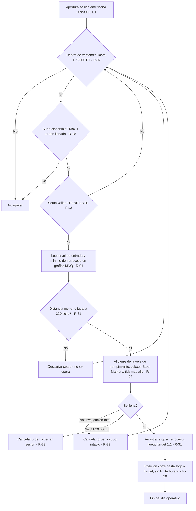
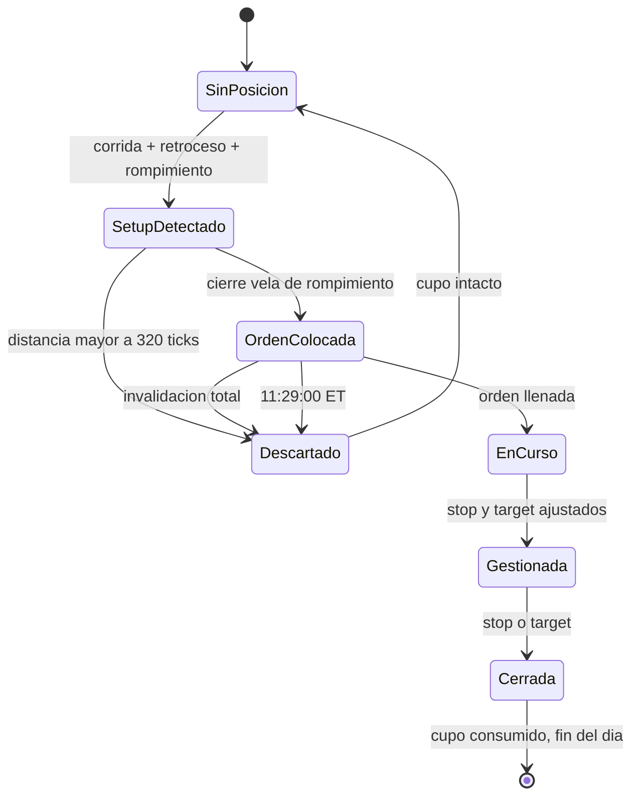

# F1.0 — Perímetro y contexto operativo

> **Sub-fase:** F1.0
> **Estado:** ✅ **CERRADA** — 2026-08-21
> **Reglas:** R-01 a R-03, todas confirmadas por el operador
> **Fuentes autorizadas:** `00_Guias\Parámetros Chaumer.pdf`, `00_Guias\Guia_Sesion_Chaumer_NQ_v4.pdf`

> 📎 **ARCHIVO DE CONSTRUCCIÓN.** Este documento recoge cómo se trabajó la sub-fase F1.0 en agosto de 2026. **No es la fuente de verdad.** Las reglas vigentes están en `..\reglas.json` y en `..\TRADING_PLAN_CHAUMER.md`.
> 🔢 **Numeración:** aquí conviven referencias de la numeración anterior al 06/09/2026. Tradúcelas con `..\EQUIVALENCIA_NUMERACION.md`.
> ⚠️ **El NQ salió del plan el 06/09/2026.** Todo lo que este archivo dice sobre analizar en NQ, sobre dos gráficos y sobre el desfase entre instrumentos es **historia, no regla**.

---

## Nota sobre las fuentes

El 21/08/2026 el operador autorizó el uso de `00_Guias\` como material fuente. Clasificación:

| Archivo | Naturaleza | Uso en el plan |
|---|---|---|
| `Parámetros Chaumer.pdf` (53 slides) | Apuntes del curso: preoperatoria, zonas, apéndices, reingresos, rangos, volumen | Fuente metodológica primaria |
| `Guia_Sesion_Chaumer_NQ_v4.pdf` | Guía operativa propia del operador (mayo 2026) con registro de 6 errores reales | Versión ejecutable previa. **Contiene errores corregidos en este plan** |
| `Mantra_de_las_25_Reglas.pdf` (Zalesky) | Disciplina intradía | Psicología. No aporta reglas mecánicas |
| `Mandamientos.png` | Decálogo psicológico | Psicología. No aporta reglas mecánicas |

**Correcciones aplicadas a la guía v4 en esta sub-fase:**

1. **Umbral de volumen.** La guía v4 indicaba `≥2.000 en MNQ ó ≥6.000 en NQ`. `Parámetros Chaumer` indica `≥2.000 en NQ ≈ 3.200 en MNQ`. Incompatibles en factor ≈3x. **Criterio adoptado: ≥2.000 contratos leídos en el gráfico de NQ.** El número de la guía v4 queda anulado. → `P-06`, se formaliza en F1.1.
2. **Mín/máx de premercado.** La guía v4 lo usaba como filtro de target (filtro #5, origen: Error 2 del 27/04). **Eliminado** por decisión del operador. → `P-01`.
3. **Tipo de orden.** Se sospechó un error de ejecución (Buy Limit por encima del precio, que en NT8 se llena al instante). **Descartado:** el operador usa Buy/Sell Stop Market, que es la orden correcta. → `P-04` cerrado.
4. **Stop por defecto de la ATM.** Estaba en **320 ticks = $160**, por encima del tope propio de $120. ****REVERTIDO 26/08/2026.** Se mantiene en **320 ticks = $160 = 80 pts**, que es el tope real del operador. Ver nota de corrección del auditor.** → `P-09`.

---

## R-01 · Instrumento, gráficos y timeframe

- **Categoría:** perímetro operativo
- **Enunciado vigente (06/09/2026):** analiza, marca zonas y ejecuta **todo sobre MNQ**. **Un solo gráfico.**
- **Condición medible:**
  - Instrumento de análisis y de ejecución: **MNQ** — Micro E-mini Nasdaq-100. $2,00/punto. Tick = 0,25 pts = $0,50.
  - Número de gráficos: **1** — MNQ, velas de 1 minuto.
  - Timeframe único: **velas japonesas de 1 minuto**. Ningún otro timeframe toma decisiones.
- **Acción:** marcar zonas, leer volumen, leer el máximo/mínimo de la vela y enviar la orden, todo sobre ese mismo gráfico.
- **Excepciones:** ninguna
- **Estado:** ✅ **Confirmada**

> 🕰️ **Cómo era antes del 06/09/2026, y por qué se cambió.** El plan original tenía **dos gráficos**: se analizaba, se marcaba y se leía el volumen en **NQ**, y se ejecutaba en **MNQ**, con un desfase observado entre ambos de **0 a 3 ticks**. El gatillo es de 1 tick, así que ese desfase podía llegar a ser tres veces el gatillo y hasta invertir la validez de un setup — de ahí la regla de que el nivel de entrada **no se traducía**, sino que se leía directamente sobre MNQ.
>
> El 06/09/2026 el operador decidió llevarlo todo a MNQ: **el segundo gráfico desaparece y el desfase deja de existir**. Lo único que arrastra esa decisión es el umbral de volumen del premercado, que pasó de leerse en NQ (> 2.000) a leerse en MNQ (> 6.000) **sin que la equivalencia esté verificada con datos** → `P-32`.
>
> El **backtesting histórico sigue hecho con datos de NQ** y no se rehace, por decisión explícita del operador. Los puntos son los mismos en los dos instrumentos; lo que cambia es el valor del punto.

---

## R-02 · Ventana operativa

- **Categoría:** contexto
- **Enunciado:** Opera únicamente durante los 120 minutos siguientes a la apertura de la sesión americana.
- **Condición medible:**
  - Inicio = apertura de la primera vela de 1 minuto de la sesión americana = **09:30:00 ET**
  - Fin = **11:30:00 ET**
  - Fuera de esa ventana no se coloca ninguna orden.
- **Cómo se verifica en NT8:** ⚠️ **el gráfico está configurado en hora de Colombia (UTC−5, fijo todo el año)** por decisión del operador (`P-02`, opción B). Nueva York alterna EDT/EST, por lo que el número en pantalla cambia dos veces al año:

  | Periodo | Ventana en pantalla (hora Colombia) |
  |---|---|
  | **Horario de verano NY (EDT)** — 2º dom. marzo → 1er dom. noviembre | **08:30 – 10:30** |
  | **Horario de invierno NY (EST)** — 1er dom. noviembre → 2º dom. marzo | **09:30 – 11:30** |

  **Próximo cambio: domingo 1 de noviembre de 2026.** A partir del lunes 2 de noviembre la ventana en pantalla pasa a **09:30–11:30**.

  **El ancla es la apertura americana, nunca el número del reloj.** Si en pantalla aparece una vela antes de la apertura americana, no se opera aunque el reloj marque 08:30.
- **Acción:** no colocar órdenes antes del inicio ni después del fin de ventana.
- **Excepciones:** ninguna
- **Ejemplo válido:** `../02_Assets/validos/R-02_valido_01.png` *(pendiente de captura)*
- **Estado:** ✅ **Confirmada**

> **Riesgo aceptado.** El operador prefiere mantener hora Colombia porque manejar dos husos en vivo le genera confusión. La contrapartida es que el cambio de horario debe entrar en el checklist de pre-sesión (F1.9) como verificación fija: *"¿la primera vela de la sesión americana es la que estoy viendo?"*

---

## R-28 · Máximo de operaciones por sesión

- **Categoría:** riesgo
- **Enunciado:** Ejecuta como máximo una operación por sesión.
- **Condición medible:** número de **órdenes llenadas** por sesión ≤ **1**.
  - Una orden colocada y **no llenada** NO consume el cupo.
  - El cupo se consume en el instante del llenado, con independencia del resultado (target o stop).
- **Acción:** tras la primera orden llenada, no se coloca ninguna orden más en esa sesión, aunque aparezcan setups válidos.
- **Excepciones:** ninguna
- **Estado:** ✅ **Confirmada**

> **Efecto colateral positivo.** Esta regla elimina de raíz los Errores 1 y 5 registrados en la guía v4 (descartar un setup válido y entrar después en un setup inferior o sobreextendido).

---

## R-29 · Caducidad de la orden pendiente

- **Categoría:** entrada
- **Enunciado:** Mantén la orden pendiente hasta que se llene, hasta que el setup se invalide, o hasta el fin de la ventana.
- **Condición medible:** la orden se cancela cuando ocurra **lo primero** de:
  1. **Invalidación total** — el precio supera el mínimo (en long) o el máximo (en short) del retroceso original.
  2. **11:29:00 ET** — minuto 119 de la ventana operativa.
- **Cómo se verifica en NT8:** nivel de invalidación marcado y precio leído sobre el gráfico de **MNQ** *(hasta el 06/09/2026 se marcaba en NQ y se leía en MNQ)*.
- **Acción:** cancelar la orden. El setup queda descartado. **El cupo de R-28 no se consume.** Se puede esperar un nuevo setup sin límite de tiempo dentro de la ventana de R-02.
- **Excepciones:** ninguna
- **Contraejemplo:** `../02_Assets/invalidos/R-29_invalido_01.png` *(pendiente de captura)*
- **Estado:** ✅ **Confirmada**

> **Nota.** El plazo de **5 velas** citado en la guía v4 corresponde a la consecución tras el rompimiento (gestión de zona), **no** a la caducidad de la orden. Se trata en F1.3.
>
> El operador afirmó que la orden siempre se llena. La guía v4 registra el caso contrario (Error 3, 04/05/2026). Con R-24 —orden stop en reposo colocada al cierre de la vela de rompimiento— ese escenario deja de depender de la velocidad de reacción.

---

## R-23 · Selección de setup

- **Categoría:** setup
- **Enunciado:** Toma el primer setup válido cuya orden se llene.
- **Condición medible:** orden **cronológico**. El primer setup de la sesión que cumpla la totalidad de las condiciones necesarias se opera. No se compara con setups posteriores. No se descarta un setup válido esperando uno mejor.
- **Acción:** ejecutar el primer setup válido; una vez llenada la orden, ignorar el resto de la sesión (R-28).
- **Excepciones:** un setup válido cuya orden caduque sin llenarse (R-29) no consume el cupo ni bloquea los siguientes.
- **Estado:** ✅ **Confirmada**

---

## R-30 · Fin de ventana con posición abierta

- **Categoría:** gestión
- **Enunciado:** Una operación abierta se gestiona hasta stop o target, aunque termine la ventana operativa.
- **Condición medible:** el fin de ventana (11:30:00 ET) **prohíbe abrir**, no obliga a cerrar. Una posición abierta antes de las 11:30:00 ET corre hasta tocar stop o target, sin límite horario.
- **Acción:** ninguna acción por hora. Solo stop o target cierran la posición.
- **Excepciones:** ninguna
- **Estado:** ✅ **Confirmada** *(consecuencia registrada en `P-07`)*

---

## R-24 · Tipo de orden y momento de colocación

- **Categoría:** entrada
- **Enunciado:** Entra siempre con orden stop en reposo colocada al cierre de la vela de rompimiento.
- **Condición medible:**
  - **Long** → **Buy Stop Market** por encima del precio actual.
  - **Short** → **Sell Stop Market** por debajo del precio actual.
  - **Nivel** = máximo (long) o mínimo (short) de la **vela de rompimiento**, ± **1 tick (0,25 pts)**, leído en el **gráfico de MNQ**.
  - **Momento de colocación** = **al cierre de la vela de rompimiento**. No antes, no después.
- **Cómo se verifica en NT8:** Chart Trader del gráfico de **MNQ**, tipo de orden `Stop Market`.
- **Acción:** colocar la orden y esperar. **No se persigue el precio a mano.** No se usa orden a mercado ni orden límite en ningún caso.
- **Excepciones:** ninguna
- **Ejemplo válido:** `../02_Assets/validos/R-24_valido_01.png` *(pendiente de captura)*
- **Contraejemplo:** `../02_Assets/invalidos/R-24_invalido_01.png` *(pendiente de captura)*
- **Estado:** ✅ **Confirmada**

> **Nota técnica.** En NT8 un **Buy Limit** colocado por encima del precio actual es marketable y se ejecuta al instante — no queda en reposo. La orden que espera a que el precio suba hasta el nivel es **Buy Stop**. El operador usa la correcta. Se verificó explícitamente en la sesión del 21/08/2026.

---

## R-31 · Configuración de ejecución (ATM `K1`)

- **Categoría:** gestión
- **Enunciado:** Ejecuta con la ATM `K1` a 320 ticks por defecto y ajusta stop y target a mano tras el llenado, en ese orden.
- **Condición medible:**
  - ATM Strategy: **`K1`**, siempre activa.
  - Cantidad: **1 contrato MNQ**.
  - Auto Breakeven: **desactivado**. Auto Trail: **desactivado**.
  - Valores por defecto: **320 ticks** de stop y **320 ticks** de target = **80 puntos** = **$160** = tope de riesgo por operación.
  - **Verificación previa al envío de la orden:** distancia estructural (nivel de entrada ↔ mínimo/máximo del retroceso) **≤ 320 ticks**. Si es mayor, **el setup no se opera**.
  - **Tras el llenado, en este orden:** 1º arrastrar el **stop** al mínimo (long) o máximo (short) del retroceso · 2º arrastrar el **target** a la misma distancia desde la entrada (**1:1**).
- **Acción:** una vez ajustados, stop y target **no se vuelven a mover**. La operación termina en uno de los dos.
- **Excepciones:** ninguna
- **Ejemplo válido:** `../02_Assets/validos/R-31_valido_01.png` *(pendiente de captura)*
- **Estado:** ✅ **Confirmada**

> **Riesgo residual aceptado por el operador (`P-09`).** Entre el llenado y el ajuste manual existe una ventana en la que el stop está a 320 ticks ($160). Está acotado al tope de riesgo, nunca por encima, pero el ajuste depende de la mano del operador en el momento de mayor tensión del trade.
>
> **Señal de alarma a vigilar:** si en el registro de operaciones aparecen stops de exactamente **$120** en setups cuyo stop estructural era menor, esa ventana está costando dinero y hay que reabrir este punto.
>
> **Alternativa descartada:** fijar los ticks exactos en la ATM antes de enviar la orden (el dato es calculable al cierre de la vela de rompimiento). El operador prefiere el ajuste manual posterior.

---

## R-03 · Plantilla de gráfico

- **Categoría:** contexto
- **Enunciado:** Opera con un gráfico limpio: velas de 1 minuto y volumen, nada más.
- **Condición medible:** único indicador en pantalla: **Volume Up Down** (NT8), sobre el gráfico de **MNQ** *(era NQ hasta el 06/09/2026)*. Sin medias móviles, sin osciladores, sin VWAP, sin perfil de volumen, sin herramientas automáticas.
- **Cómo se verifica en NT8:** el umbral se lee sobre la barra de Volume Up Down de la vela de 1 minuto de **MNQ** *(era ≥2.000 en NQ hasta el 06/09/2026; ahora >6.000 en MNQ)*.
- **Acción:** ninguna herramienta adicional puede añadirse al gráfico sin pasar por una revisión de este plan.
- **Excepciones:** ninguna
- **Ejemplo válido:** `../02_Assets/validos/R-03_valido_01.png` *(pendiente de captura)*
- **Estado:** ✅ **Confirmada**

---

## Diagrama · Puerta de perímetro

---

## Ciclo de vida de la operación

---

## Reglas heredadas de la guía v4 aún NO auditadas

Estas aparecen en `Guia_Sesion_Chaumer_NQ_v4.pdf` y quedan **fuera** de F1.0. No se han confirmado ni descartado.

| Contenido | Sub-fase destino |
|---|---|
| Definición de corrida, retroceso, zona, rompimiento, consecución, reingreso, zona apéndice, estructura, fluidez | F1.1 |
| Marcado de volúmenes ≥2.000 NQ, dirección de la zona según vela alcista/bajista | F1.1 / F1.2 |
| Zona crítica de la primera vela de la apertura | F1.2 |
| Día Fed / FOMC / Powell → solo reingresos, sin entrada tendencial | F1.8 |
| Noticias rojas Forex Factory / 3 toros Investing → no entrar 5 min antes | F1.8 |
| Mecánica de entrada en 7 pasos | F1.3 / F1.4 |
| Escenarios 1/2/3 de gestión de zona tras el rompimiento, plazo de 5 velas | F1.3 |
| Invalidación total y regla de marcado (rompimiento + consecución + nuevo retroceso) | F1.3 |
| Filtros de no-entrada (impulso >5 velas, target sobre zona vigente, máximo volumen de sesión) | F1.8 |
| Target 1:1 · rango de retroceso $40–$120 | F1.5 |
| Lectura de volumen en impulso y retroceso | F1.1 / F1.2 |
| Regla de oro: dos escenarios antes de entrar | F1.8 |
| Parada operativa de fin de año (24 dic → 1 ene) | F1.8 |

---

## Cierre

F1.0 queda **cerrada** con 9 reglas confirmadas y 8 pendientes registrados (`P-01`, `P-03`, `P-06`, `P-07`, `P-08`, `P-09`, `P-10`). Ninguno bloquea el avance a F1.1.

Lo que este bloque define: **dónde**, **cuándo**, **con qué**, **cuántas veces** y **con qué orden** se opera.
Lo que NO define y sigue viviendo en la cabeza del operador: **qué** es un setup.
